> 思维导图地址：http://naotu.baidu.com/file/05b598c15d84ddc4668ba3c3a1522e15?token=15c48cb27ff619e0

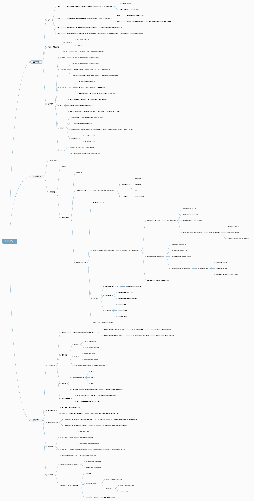


# 一、消息队列概述
## 1、消息队列的应用场景
### ①剥离弱相关
相关性弱的操作剥离出来，可以缩短响应时间，尽快返回响应结果。<br/>

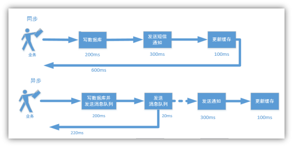


### ②解耦
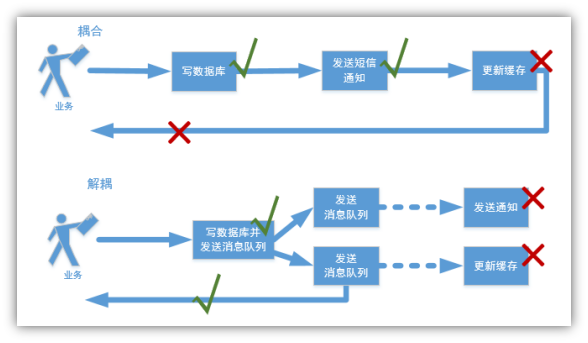


### ③削峰限流
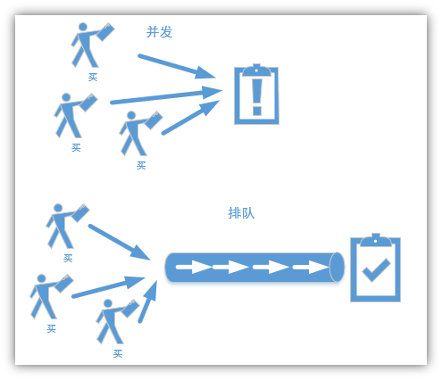
- 削峰：本来超过服务器承受能力的并发量，经过消息队列之后，在实际处理时就在承受能力范围内了。
- 填谷：消息队列对高并发量起到了缓冲的作用。把高峰期的访问压力均衡到了低谷期。


### ④异步
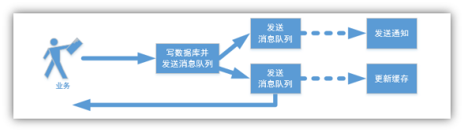

### ⑤说明
绝大部分常规强相关业务还是通过Feign正常调用不变。


## 2、消息队列底层协议
### ①AMQP
AMQP的完整表述是：**A**dvanced **M**essage **Q**ueuing **P**rotocol。它包含**服务端服务**和**网络层协议**两个部分。
- 服务端服务：通过AMQ Model（高级消息队列协议模型）来定义一个消息队列应该具备哪些能力、对外提供什么样的服务。AMQ Model定义了broker服务中用于路由和存储消息的组件，以及组件之间的协作规则。
- 网络层协议：通过这个协议，客户端就能和AMQ Model服务端通信。

PS：什么叫网络层协议？就是在七层网络模型中处于网络层的协议。<br/>


### ②JMS
JMS的完整表述是：**J**ava **M**essage **S**ervice——Java消息服务。所以严格来说JMS并不是一种协议，而是一系列API接口。


### ③AMQP和JMS的区别
|AMQP|JMS|
|---|---|
|通过协议统一数据交互格式|通过统一接口来统一消息操作|
|AMQP只是协议，不规定实现方式，因此是跨语言的|JMS限定了只能使用Java语言|
|AMQP消息模式更加丰富|JMS规定了两种消息模式|


## 3、消息队列产品
市场上常见的消息队列产品如下：
- ActiveMQ：基于JMS
- ZeroMQ：基于C语言开发
- Rabbitmq：基于AMQP协议，erlang语言开发，稳定性好
- RocketMQ：基于JMS，阿里巴巴产品
- Kafka：类似MQ的产品；分布式消息系统，高吞吐量

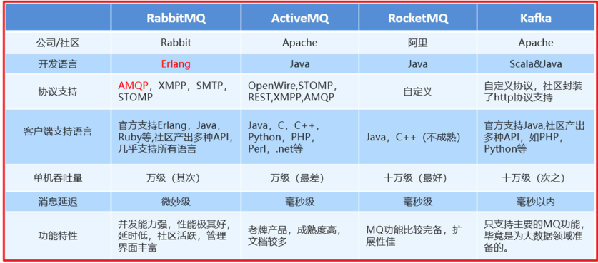

## 4、RabbitMQ简介
### ①基本信息
RabbitMQ是一款基于AMQP、由erlang语言开发的消息队列产品，2007年Rabbit技术公司发布了它的1.0版本。<br/>
官网地址：[Messaging that just works — RabbitMQ](https://www.rabbitmq.com/)<br/>
RabbitMQ定义了六种工作模式，后面我们会逐一介绍。<br/>


### ②核心组件
RabbitMQ基础架构图如下：<br/>

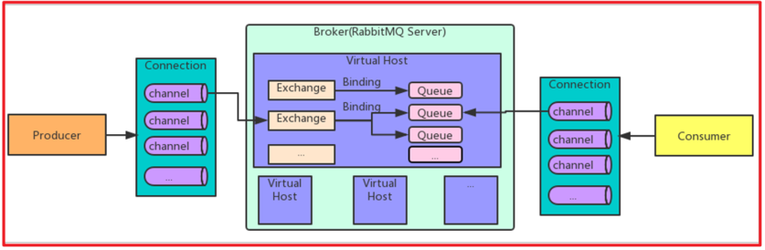

|组件名称|功能简介|
|---|---|
|Producer|消息的发送端，也可以称为消息的生产者|
|Consumer|消息的接收端，也可以称为消息的消费者|
|Connection|消息发送端或消息消费端到消息队列主体服务器之间的TCP连接|
|Channel|建立TCP连接需要三次握手，反复确认。<br/>所以如果每一次访问RabbitMQ服务器都建立一个Connection开销会极大，效率低下。<br/>所以Channel就是在一个已经建立的Connection中建立的逻辑连接。<br/>如果应用程序支持多线程，那么每个线程创建一个单独的Channel进行通讯。<br/>每个Channel都有自己的id，Channel之间是完全隔离的。|
|Broker|就是RabbitMQ的主体服务器本身，负责接收和分发消息|
|Virtual Host|每一个Virtual Host就是一个虚拟分组，<br/>用户在自己的Virtual Host中使用RabbitMQ组件|
|Exchange|交换机，是消息达到Broker的第一站。<br/>根据分发规则匹配routing key，分发消息到Queue中去。<br/>常用的类型有：direct（point-to-point）、 topic（publish-subscribe）、fanout（multicast）|
|Queue|队列，是消息的容器。消息放在这里等待被消费端取走。|
|Binding|Exchange和Queue之间的虚拟连接，Binding中可以包含routing key。<br/>Binding信息被保存在Exchange的查询表中作为消息的分发依据|


### ③运转流程

#### [1]生产者发送消息
1. 生产者创建连接（Connection），开启一个信道（Channel），连接到RabbitMQ Broker；
2. 声明队列并设置属性；如是否排它，是否持久化，是否自动删除；
3. 将路由键与队列绑定起来；
4. 发送消息至RabbitMQ Broker；
5. 关闭信道；
6. 如果生产者程序整个停止了，JVM进程退出了，则关闭连接；

#### [2]消费者接收消息
1. 消费者创建连接（Connection），开启一个信道（Channel），连接到RabbitMQ Broker
2. 在初始化操作中设置相应的回调函数
3. 向Broker请求消费响应队列中的消息
4. 等待Broker投递响应队列中的消息，消费者接收消息；
5. 确认（ack，自动确认）接收到的消息；
6. RabbitMQ从队列中删除相应已经被确认的消息；
7. 关闭信道；
8. 如果消费者程序整个停止了，JVM进程退出了，则关闭连接；


# 二、RabbitMQ安装
## 1、erlang语言环境
erlang语言环境的安装版本必须和RabbitMQ的安装版本匹配。<br/>
官方文档：https://www.rabbitmq.com/which-erlang.html<br/>
版本对应关系局部截图如下：<br/>

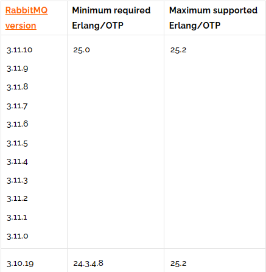

## 2、上传安装包
- erlang-21.3.8.9-1.el7.x86_64.rpm
- rabbitmq-server-3.8.1-1.el7.noarch.rpm
- socat-1.7.3.2-1.el6.lux.x86_64.rpm

## 3、执行安装
**注意**：一定要在安装RabbitMQ之前安装socat！
```bash
cd /opt
rpm -ivh erlang-21.3.8.9-1.el7.x86_64.rpm
rpm -ivh socat-1.7.3.2-1.el6.lux.x86_64.rpm
rpm -ivh rabbitmq-server-3.8.1-1.el7.noarch.rpm
```

安装后，RabbitMQ可执行程序的默认路径：
```bash
/usr/lib/rabbitmq/lib/rabbitmq_server-3.8.1/sbin
```

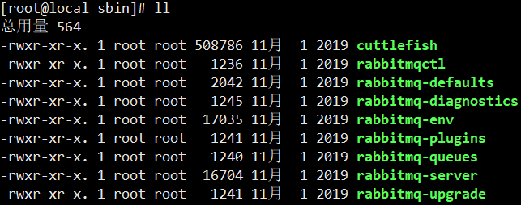

## 4、相关配置
### ①启用管理插件
```bash
cd /usr/lib/rabbitmq/lib/rabbitmq_server-3.8.1/sbin
rabbitmq-plugins enable rabbitmq_management
```


### ②启动服务
```bash
systemctl start rabbitmq-server.service
systemctl enable rabbitmq-server.service
```

### ③查看进程
```bash
ps -ef | grep rabbitmq | grep -v grep
```


## 5、测试
### ①打开管理界面
RabbitMQ管理界面访问地址：http://192.168.200.100:15672
- 默认账号：guest
- 默认密码：guest

默认不允许远程登录：<br/>


### ②新增管理员账号
```bash
# 进入 RabbitMQ 可执行程序所在目录
cd /usr/lib/rabbitmq/lib/rabbitmq_server-3.8.1/sbin

# 添加管理员账号密码
rabbitmqctl add_user admin admin

# 分配账号角色
rabbitmqctl set_user_tags admin administrator

# 修改密码
rabbitmqctl change_password admin 123456

# 查看用户列表
rabbitmqctl list_users
```

### ③使用新账号登录
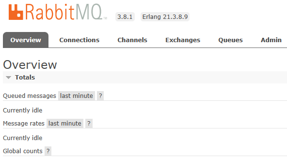

### ④端口号
|端口号|作用|
|---|---|
|5672|用客户端连接RabbitMQ服务器时使用这个端口|
|15672|RabbitMQ管理界面端口|
|25672|RabbitMQ集群端口|


## 6、配置Virtual Host
### ①创建
Virtual Host名称都以“/”开头：<br/>

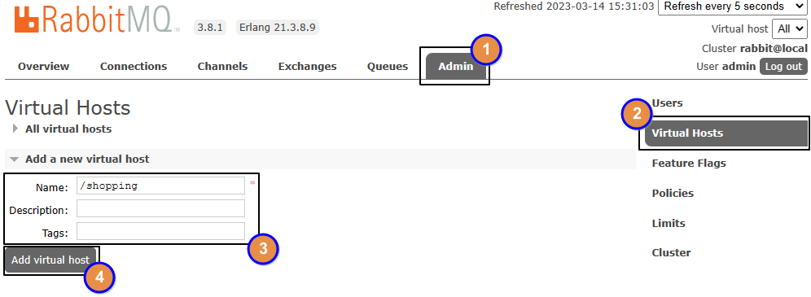

### ②设置权限
#### [1]第一步
如果有需要，可以创建新用户：<br/>

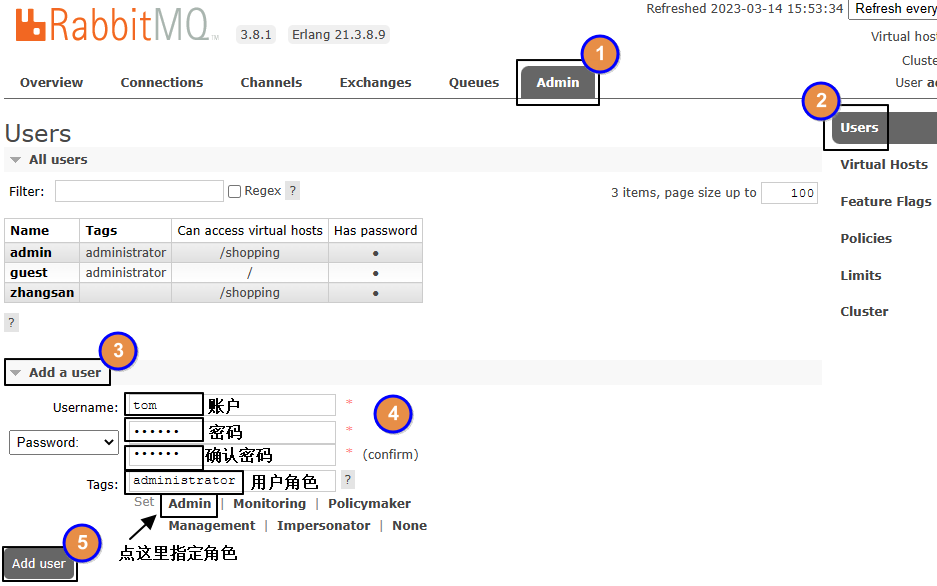

#### [2]第二步
选择Virtual Host：<br/>

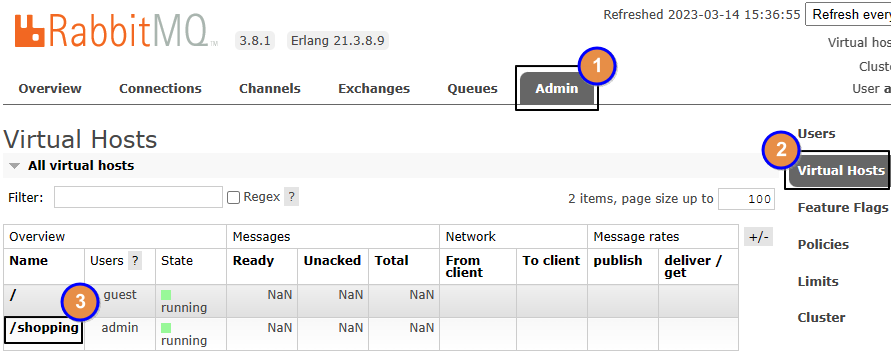

#### [3]第三步
给指定用户分配权限：<br/>

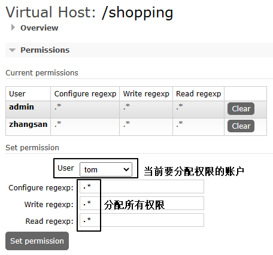

#### [4]第四步
设置权限后，在Current permissions列表中可以看到新添加的用户：<br/>

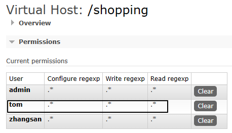

# 三、HelloWorld
## 1、搭建环境
### ①创建Java工程
#### [1]消息发送端
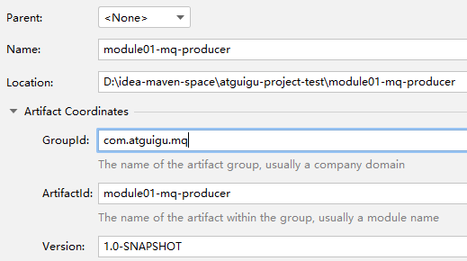

#### [2]消息接收端
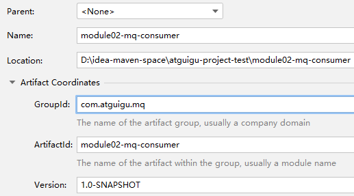

### ②添加依赖
两个Maven工程添加相同依赖如下：
```xml
<dependencies>
    <dependency>
        <groupId>com.rabbitmq</groupId>
        <artifactId>amqp-client</artifactId>
        <version>5.6.0</version>
    </dependency>
</dependencies>
```

## 2、发送消息
### ①粘贴代码
```java
package com.atguigu.rabbitmq.simple;  
  
import com.rabbitmq.client.Channel;  
import com.rabbitmq.client.Connection;  
import com.rabbitmq.client.ConnectionFactory;  
  
public class Producer {  
  
    public static void main(String[] args) throws Exception {  
  
        // 创建连接工厂  
        ConnectionFactory connectionFactory = new ConnectionFactory();  
  
        // 设置主机地址  
        connectionFactory.setHost("192.168.200.100");  
  
        // 设置连接端口号：默认为 5672        connectionFactory.setPort(5672);  
  
        // 虚拟主机名称：默认为 /        connectionFactory.setVirtualHost("/");  
  
        // 设置连接用户名；默认为guest  
        connectionFactory.setUsername("admin");  
  
        // 设置连接密码；默认为guest  
        connectionFactory.setPassword("123456");  
  
        // 创建连接  
        Connection connection = connectionFactory.newConnection();  
  
        // 创建频道  
        Channel channel = connection.createChannel();  
  
        // 声明（创建）队列  
        // queue      参数1：队列名称  
        // durable    参数2：是否定义持久化队列，当 MQ 重启之后还在  
        // exclusive  参数3：是否独占本次连接。若独占，只能有一个消费者监听这个队列且 Connection 关闭时删除这个队列  
        // autoDelete 参数4：是否在不使用的时候自动删除队列，也就是在没有Consumer时自动删除  
        // arguments  参数5：队列其它参数  
        channel.queueDeclare("simple_queue", true, false, false, null);  
  
        // 要发送的信息  
        String message = "你好；小兔子！";  
  
        // 参数1：交换机名称,如果没有指定则使用默认Default Exchange  
        // 参数2：路由key,简单模式可以传递队列名称  
        // 参数3：配置信息  
        // 参数4：消息内容  
        channel.basicPublish("", "simple_queue", null, message.getBytes());  
  
        System.out.println("已发送消息：" + message);  
  
        // 关闭资源  
        channel.close();  
        connection.close();  
  
    }  
  
}
```

### ②执行代码
要确保执行代码时RabbitMQ服务器是运行的。执行之后，登录RabbitMQ管理界面，查看是否新增了我们指定的队列和消息。
#### [1]查看队列信息
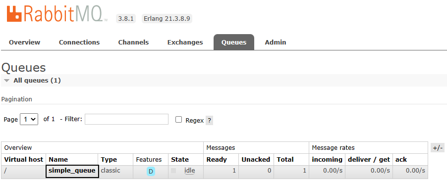

#### [2]查看消息
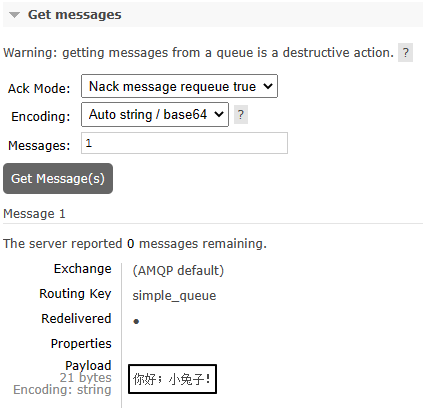


## 3、接收消息
### ①粘贴代码
```java
package com.atguigu.rabbitmq.simple;  
  
import com.rabbitmq.client.*;  
  
import java.io.IOException;  
  
public class Consumer {  
  
    public static void main(String[] args) throws Exception {  
  
        // 1.创建连接工厂  
        ConnectionFactory factory = new ConnectionFactory();  
  
        // 2. 设置参数  
        factory.setHost("192.168.200.100");  
        factory.setPort(5672);  
        factory.setVirtualHost("/");  
        factory.setUsername("admin");  
        factory.setPassword("123456");  
  
        // 3. 创建连接 Connection        
        Connection connection = factory.newConnection();  
  
        // 4. 创建Channel  
        Channel channel = connection.createChannel();  
  
        // 5. 创建队列  
        // 如果没有一个名字叫simple_queue的队列，则会创建该队列，如果有则不会创建  
        // 参数1. queue：队列名称  
        // 参数2. durable：是否持久化。如果持久化，则当MQ重启之后还在  
        // 参数3. exclusive：是否独占。  
        // 参数4. autoDelete：是否自动删除。当没有Consumer时，自动删除掉  
        // 参数5. arguments：其它参数。  
        channel.queueDeclare("simple_queue",true,false,false,null);  
  
        // 接收消息  
        DefaultConsumer consumer = new DefaultConsumer(channel){  
  
            // 回调方法,当收到消息后，会自动执行该方法  
            // 参数1. consumerTag：标识  
            // 参数2. envelope：获取一些信息，交换机，路由key...  
            // 参数3. properties：配置信息  
            // 参数4. body：数据  
            @Override  
            public void handleDelivery(String consumerTag, Envelope envelope, AMQP.BasicProperties properties, byte[] body) throws IOException {  
  
                System.out.println("consumerTag："+consumerTag);  
                System.out.println("Exchange："+envelope.getExchange());  
                System.out.println("RoutingKey："+envelope.getRoutingKey());  
                System.out.println("properties："+properties);  
                System.out.println("body："+new String(body));  
  
            }  
  
        };  
  
        // 参数1. queue：队列名称  
        // 参数2. autoAck：是否自动确认，类似咱们发短信，发送成功会收到一个确认消息  
        // 参数3. callback：回调对象  
        // 消费者类似一个监听程序，主要是用来监听消息  
        channel.basicConsume("simple_queue",true,consumer);  
  
    }  
  
}
```

### ②执行代码，查看消息
在RabbitMQ的管理界面再次点击Get Message(s)：<br/>


# 四、RabbitMQ的五种工作模式
RabbitMQ一共提供了六种工作模式，但是RPC模式本质上是同步调用，不是典型的消息队列工作方式，所以不予讨论。

## 1、工作队列模式
### ①概述
英文单词：Work Queues<br/>
本质上我们刚刚写的HelloWorld程序就是这种模式，只是简化到了最简单的情况：生产者只有一个，发送一个消息，消费者也只有一个，消息也只能被这个消费者消费，也称为简单模式。<br/>
现在我们还原一下常规情况：生产者发送多个消息，由多个消费者来竞争，谁抢到算谁的。<br/>

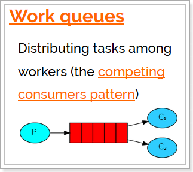

### ②生产者代码
#### [1]封装工具类
```java
package com.atguigu.rabbitmq.util;  
  
import com.rabbitmq.client.Connection;  
import com.rabbitmq.client.ConnectionFactory;  
  
public class ConnectionUtil {  
  
    public static final String HOST_ADDRESS = "192.168.200.100";  
  
    public static Connection getConnection() throws Exception {  
  
        // 定义连接工厂  
        ConnectionFactory factory = new ConnectionFactory();  
  
        // 设置服务地址  
        factory.setHost(HOST_ADDRESS);  
  
        // 端口  
        factory.setPort(5672);  
  
        //设置账号信息，用户名、密码、vhost  
        factory.setVirtualHost("/");  
        factory.setUsername("admin");  
        factory.setPassword("123456");  
  
        // 通过工程获取连接  
        Connection connection = factory.newConnection();  
  
        return connection;  
    }  
  
  
  
    public static void main(String[] args) throws Exception {  
  
        Connection con = ConnectionUtil.getConnection();  
  
        System.out.println(con);  
  
        // amqp://admin@192.168.137.118:5672/  
  
        con.close();  
  
    }  
  
}
```

#### [2]编写代码
```java
package com.atguigu.rabbitmq.work;  
  
import com.atguigu.rabbitmq.util.ConnectionUtil;  
import com.rabbitmq.client.Channel;  
import com.rabbitmq.client.Connection;  
  
public class Producer {  
  
    public static final String QUEUE_NAME = "work_queue";  
  
    public static void main(String[] args) throws Exception {  
  
        Connection connection = ConnectionUtil.getConnection();  
  
        Channel channel = connection.createChannel();  
  
        channel.queueDeclare(QUEUE_NAME,true,false,false,null);  
  
        for (int i = 1; i <= 10; i++) {  
  
            String body = i+"hello rabbitmq~~~";  
  
            channel.basicPublish("",QUEUE_NAME,null,body.getBytes());  
  
        }  
  
        channel.close();  
  
        connection.close();  
  
    }  
  
}
```

#### [3]发送消息
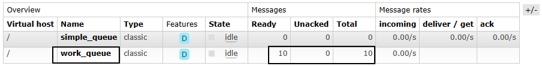

### ③消费者代码
创建Consumer1和Consumer2。Consumer2只是类名和打印提示不同，代码完全一样。
```java
package com.atguigu.rabbitmq.work;  
  
import com.atguigu.rabbitmq.util.ConnectionUtil;  
import com.rabbitmq.client.*;  
  
import java.io.IOException;  
  
public class Consumer1 {  
  
    static final String QUEUE_NAME = "work_queue";  
  
    public static void main(String[] args) throws Exception {  
  
        Connection connection = ConnectionUtil.getConnection();  
  
        Channel channel = connection.createChannel();  
  
        channel.queueDeclare(QUEUE_NAME,true,false,false,null);  
  
        Consumer consumer = new DefaultConsumer(channel){  
  
            @Override  
            public void handleDelivery(String consumerTag, Envelope envelope, AMQP.BasicProperties properties, byte[] body) throws IOException {  
  
                System.out.println("Consumer1 body："+new String(body));  
  
            }  
  
        };  
  
        channel.basicConsume(QUEUE_NAME,true,consumer);  
  
    }  
  
}
```

**注意**：运行的时候先启动两个消费端程序，然后再启动生产者端程序。<br/>
如果已经运行过生产者程序，则手动把work_queue队列删掉。<br/>

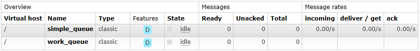

最终两个消费端程序竞争结果如下：<br/>

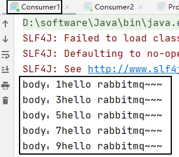

<br/>

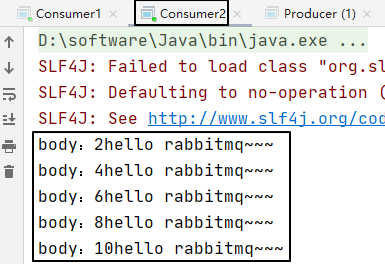

### ④结论
- 一个队列被多个消费者监听，则各消费者之间对同一个消息是**竞争**的关系。
- Work Queues工作模式适用于任务较重或任务较多的情况，多消费者分摊任务可以提高消息处理的效率。

## 2、发布/订阅模式
### ①引入新角色：交换机
在工作队列（Work Queues）模式中，只有三个角色：
- P：生产者，也就是要发送消息的程序
- C：消费者，消息的接收者，会一直等待消息到来
- Queue：消息队列

而在订阅模型中，多了一个Exchange角色，而且执行过程有所不同：<br/>

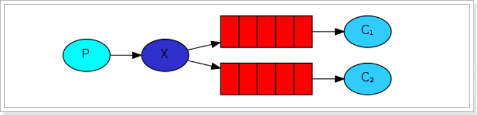

- P：生产者，也就是要发送消息的程序。但不再发送到队列中，而是发给X（交换机）
- C：消费者，消息的接收者，会一直等待消息到来
- Queue：消息队列
- Exchange：交换机，图中的X。
	- 一方面，接收生产者发送的消息。
	- 另一方面，知道如何处理消息。到底如何操作，取决于Exchange的类型。
		- 递交给某个特定队列
		- 递交给所有队列
		- 将消息丢弃
		- ……
	- Exchange有以下3种常见类型：
		- Fanout：广播，将消息交给所有绑定到交换机的队列
		- Direct：定向，把消息交给符合指定routing key的队列
		- Topic：通配符，把消息交给符合routing pattern（路由模式）的队列
	- **注意**：Exchange（交换机）只负责转发消息，不具备存储消息的能力，因此如果没有任何队列与Exchange绑定，或者没有符合路由规则的队列，那么消息会丢失！

### ②模式说明
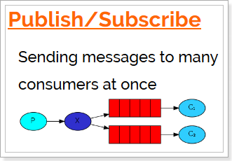

- 生产者不再直接把消息发到队列，而是先发送到交换机
- 交换机和队列之间直接进行绑定
- 只要消息发送到某个交换机，那么绑定这个交换机的队列就都能接收到消息

### ③生产者代码
```java
package com.atguigu.rabbitmq.fanout;  
  
import com.atguigu.rabbitmq.util.ConnectionUtil;  
import com.rabbitmq.client.BuiltinExchangeType;  
import com.rabbitmq.client.Channel;  
import com.rabbitmq.client.Connection;  
import com.rabbitmq.client.ConnectionFactory;  
  
public class Producer {  
  
    public static void main(String[] args) throws Exception {  
  
      // 1、获取连接  
        Connection connection = ConnectionUtil.getConnection();  
  
      // 2、创建频道  
        Channel channel = connection.createChannel();  
  
        // 参数1. exchange：交换机名称  
        // 参数2. type：交换机类型  
        //     DIRECT("direct")：定向  
        //     FANOUT("fanout")：扇形（广播），发送消息到每一个与之绑定队列。  
        //     TOPIC("topic")：通配符的方式  
        //     HEADERS("headers")：参数匹配  
        // 参数3. durable：是否持久化  
        // 参数4. autoDelete：自动删除  
        // 参数5. internal：内部使用。一般false  
        // 参数6. arguments：其它参数  
        String exchangeName = "test_fanout";  
  
        // 3、创建交换机  
        channel.exchangeDeclare(exchangeName, BuiltinExchangeType.FANOUT,true,false,false,null);  
  
        // 4、创建队列  
        String queue1Name = "test_fanout_queue1";  
        String queue2Name = "test_fanout_queue2";  
  
        channel.queueDeclare(queue1Name,true,false,false,null);  
        channel.queueDeclare(queue2Name,true,false,false,null);  
  
        // 5、绑定队列和交换机  
      // 参数1. queue：队列名称  
      // 参数2. exchange：交换机名称  
      // 参数3. routingKey：路由键，绑定规则  
      //     如果交换机的类型为fanout，routingKey设置为""  
        channel.queueBind(queue1Name,exchangeName,"");  
        channel.queueBind(queue2Name,exchangeName,"");  
  
        String body = "日志信息：张三调用了findAll方法...日志级别：info...";  
  
        // 6、发送消息  
        channel.basicPublish(exchangeName,"",null,body.getBytes());  
  
        // 7、释放资源  
        channel.close();  
        connection.close();  
  
    }  
  
}
```


### ④消费者代码
#### [1]消费者 1
```java
package com.atguigu.rabbitmq.fanout;  
  
import com.atguigu.rabbitmq.util.ConnectionUtil;  
import com.rabbitmq.client.*;  
import java.io.IOException;  
  
public class Consumer1 {  
  
    public static void main(String[] args) throws Exception {  
  
        Connection connection = ConnectionUtil.getConnection();  
  
        Channel channel = connection.createChannel();  
  
        String queue1Name = "test_fanout_queue1";  
  
        channel.queueDeclare(queue1Name,true,false,false,null);  
  
        Consumer consumer = new DefaultConsumer(channel){  
  
            @Override  
            public void handleDelivery(String consumerTag, Envelope envelope, AMQP.BasicProperties properties, byte[] body) throws IOException {  
  
                System.out.println("body："+new String(body));  
                System.out.println("队列 1 消费者 1 将日志信息打印到控制台.....");  
  
            }  
  
        };  
  
        channel.basicConsume(queue1Name,true,consumer);  
  
    }  
  
}
```

#### [2]消费者 2
```java
package com.atguigu.rabbitmq.fanout;  
  
import com.atguigu.rabbitmq.util.ConnectionUtil;  
import com.rabbitmq.client.*;  
import java.io.IOException;  
  
public class Consumer2 {  
  
    public static void main(String[] args) throws Exception {  
  
        Connection connection = ConnectionUtil.getConnection();  
  
        Channel channel = connection.createChannel();  
  
        String queue2Name = "test_fanout_queue2";  
  
        channel.queueDeclare(queue2Name,true,false,false,null);  
  
        Consumer consumer = new DefaultConsumer(channel){  
  
            @Override  
            public void handleDelivery(String consumerTag, Envelope envelope, AMQP.BasicProperties properties, byte[] body) throws IOException {  
  
                System.out.println("body："+new String(body));  
                System.out.println("队列 2 消费者 2 将日志信息打印到控制台.....");  
  
            }  
  
        };  
  
        channel.basicConsume(queue2Name,true,consumer);  
  
    }  
  
}
```

### ⑤运行结果
还是先启动消费者，然后再运行生产者程序发送消息<br/>

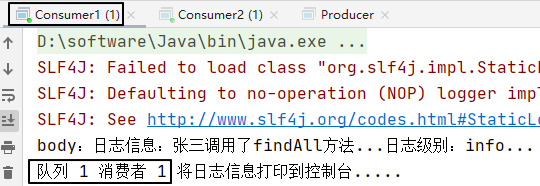

<br/>

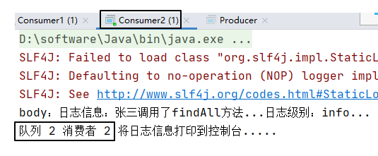

### ⑥小结
交换机和队列的绑定关系如下图：<br/>

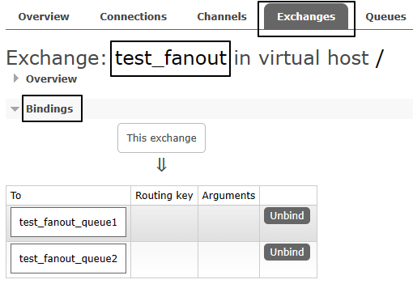

交换机需要与队列进行绑定，绑定之后；一个消息可以被多个消费者都收到。<br/>

**发布订阅模式与工作队列模式的区别：**
- 工作队列模式不用定义交换机，而发布/订阅模式需要定义交换机。
- 发布/订阅模式的生产方是面向交换机发送消息，工作队列模式的生产方是面向队列发送消息(底层使用默认交换机)。
- 发布/订阅模式需要设置队列和交换机的绑定，工作队列模式不需要设置，实际上工作队列模式会将队列绑 定到默认的交换机 。

## 3、路由模式
### ①模式说明
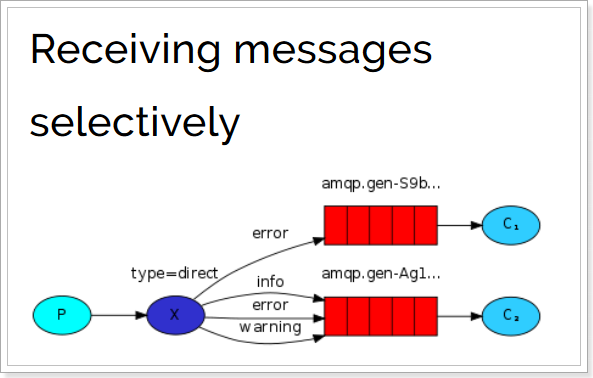
- 交换机和队列通过路由键进行绑定
- 生产者发送消息时不仅要指定交换机，还要指定路由键
- 交换机接收到消息会发送到路由键绑定的队列

### ②生产者代码
在编码上与 Publish/Subscribe发布与订阅模式 的区别是交换机的类型为：Direct，还有队列绑定交换机的时候需要指定routing key。
```java
package com.atguigu.rabbitmq.routing;  
  
import com.atguigu.rabbitmq.util.ConnectionUtil;  
import com.rabbitmq.client.BuiltinExchangeType;  
import com.rabbitmq.client.Channel;  
import com.rabbitmq.client.Connection;  
import com.rabbitmq.client.ConnectionFactory;  
  
public class Producer {  
  
    public static void main(String[] args) throws Exception {  
  
      Connection connection = ConnectionUtil.getConnection();  
  
      Channel channel = connection.createChannel();  
  
      String exchangeName = "test_direct";  
  
      // 创建交换机  
      channel.exchangeDeclare(exchangeName,BuiltinExchangeType.DIRECT,true,false,false,null);  
  
      // 创建队列  
      String queue1Name = "test_direct_queue1";  
      String queue2Name = "test_direct_queue2";  
  
      // 声明（创建）队列  
      channel.queueDeclare(queue1Name,true,false,false,null);  
      channel.queueDeclare(queue2Name,true,false,false,null);  
  
      // 队列绑定交换机  
      // 队列1绑定error  
      channel.queueBind(queue1Name,exchangeName,"error");  
  
      // 队列2绑定info error warning  
      channel.queueBind(queue2Name,exchangeName,"info");  
      channel.queueBind(queue2Name,exchangeName,"error");  
      channel.queueBind(queue2Name,exchangeName,"warning");  
  
        String message = "日志信息：张三调用了delete方法.错误了,日志级别warning";  
  
        // 发送消息  
        channel.basicPublish(exchangeName,"warning",null,message.getBytes());  
        System.out.println(message);  
  
      // 释放资源  
        channel.close();  
        connection.close();  
  
    }  
  
}
```


### ③消费者代码
#### [1]消费者 1
```java
package com.atguigu.rabbitmq.routing;  
  
import com.atguigu.rabbitmq.util.ConnectionUtil;  
import com.rabbitmq.client.*;  
import java.io.IOException;  
  
public class Consumer1 {  
  
    public static void main(String[] args) throws Exception {  
  
        Connection connection = ConnectionUtil.getConnection();  
  
        Channel channel = connection.createChannel();  
  
        String queue1Name = "test_direct_queue1";  
  
        channel.queueDeclare(queue1Name,true,false,false,null);  
  
        Consumer consumer = new DefaultConsumer(channel){  
  
            @Override  
            public void handleDelivery(String consumerTag, Envelope envelope, AMQP.BasicProperties properties, byte[] body) throws IOException {  
  
                System.out.println("body："+new String(body));  
                System.out.println("Consumer1 将日志信息打印到控制台.....");  
  
            }  
  
        };  
  
        channel.basicConsume(queue1Name,true,consumer);  
  
    }  
  
}
```

#### [2]消费者 2
```java
package com.atguigu.rabbitmq.routing;  
  
import com.atguigu.rabbitmq.util.ConnectionUtil;  
import com.rabbitmq.client.*;  
import java.io.IOException;  
  
public class Consumer2 {  
  
    public static void main(String[] args) throws Exception {  
  
        Connection connection = ConnectionUtil.getConnection();  
  
        Channel channel = connection.createChannel();  
  
        String queue2Name = "test_direct_queue2";  
  
        channel.queueDeclare(queue2Name,true,false,false,null);  
  
        Consumer consumer = new DefaultConsumer(channel){  
  
            @Override  
            public void handleDelivery(String consumerTag, Envelope envelope, AMQP.BasicProperties properties, byte[] body) throws IOException {  
  
                System.out.println("body："+new String(body));  
                System.out.println("Consumer2 将日志信息存储到数据库.....");  
  
            }  
  
        };  
  
        channel.basicConsume(queue2Name,true,consumer);  
  
    }  
  
}
```

### ④运行结果
#### [1]绑定关系


#### [2]消费消息
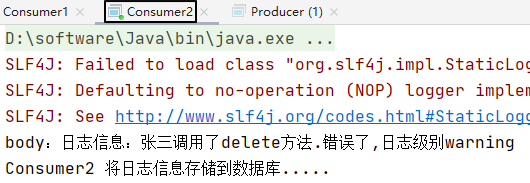

## 4、通配符模式
### ①模式说明
<p>Topic类型与Direct相比，都是可以根据RoutingKey把消息路由到不同的队列。只不过Topic类型Exchange可以让队列在绑定Routing key的时候**使用通配符**！</p>

<p>Routingkey一般都是有一个或多个单词组成，多个单词之间以“.”分割，例如：item.insert</p>

通配符规则：
- \#：匹配零个或多个词
- \*：匹配一个词

举例：
- item.\#：能够匹配item.insert.abc 或者 item.insert
- item.\*：只能匹配item.insert

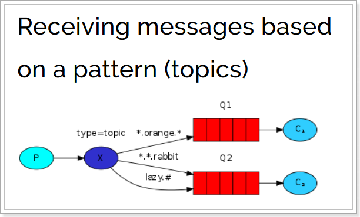

<br/>

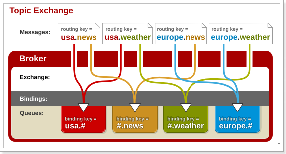

### ②生产者代码
```java
package com.atguigu.rabbitmq.topic;  
  
import com.atguigu.rabbitmq.util.ConnectionUtil;  
import com.rabbitmq.client.BuiltinExchangeType;  
import com.rabbitmq.client.Channel;  
import com.rabbitmq.client.Connection;  
import com.rabbitmq.client.ConnectionFactory;  
  
public class Producer {  
  
    public static void main(String[] args) throws Exception {  
  
        Connection connection = ConnectionUtil.getConnection();  
  
        Channel channel = connection.createChannel();  
  
        String exchangeName = "test_topic";  
  
        channel.exchangeDeclare(exchangeName, BuiltinExchangeType.TOPIC,true,false,false,null);  
  
        String queue1Name = "test_topic_queue1";  
        String queue2Name = "test_topic_queue2";  
  
        channel.queueDeclare(queue1Name,true,false,false,null);  
        channel.queueDeclare(queue2Name,true,false,false,null);  
  
        // 绑定队列和交换机  
      // 参数1. queue：队列名称  
      // 参数2. exchange：交换机名称  
      // 参数3. routingKey：路由键,绑定规则  
      //      如果交换机的类型为fanout ,routingKey设置为""  
        // routing key 常用格式：系统的名称.日志的级别。  
        // 需求： 所有error级别的日志存入数据库,所有order系统的日志存入数据库  
        channel.queueBind(queue1Name,exchangeName,"#.error");  
        channel.queueBind(queue1Name,exchangeName,"order.*");  
        channel.queueBind(queue2Name,exchangeName,"*.*");  
  
        // 分别发送消息到队列：order.info、goods.info、goods.error  
        String body = "[所在系统：order][日志级别：info][日志内容：订单生成，保存成功]";  
        channel.basicPublish(exchangeName,"order.info",null,body.getBytes());  
  
        body = "[所在系统：goods][日志级别：info][日志内容：商品发布成功]";  
        channel.basicPublish(exchangeName,"goods.info",null,body.getBytes());  
  
        body = "[所在系统：goods][日志级别：error][日志内容：商品发布失败]";  
        channel.basicPublish(exchangeName,"goods.error",null,body.getBytes());  
  
        channel.close();  
        connection.close();  
  
    }  
  
}
```


### ③消费者代码
#### [1]消费者 1
消费者 1 监听队列 1
```java
package com.atguigu.rabbitmq.topic;  
  
import com.atguigu.rabbitmq.util.ConnectionUtil;  
import com.rabbitmq.client.*;  
import java.io.IOException;  
  
public class Consumer1 {  
  
    public static void main(String[] args) throws Exception {  
  
        Connection connection = ConnectionUtil.getConnection();  
  
        Channel channel = connection.createChannel();  
  
        String QUEUE_NAME = "test_topic_queue1";  
  
        channel.queueDeclare(QUEUE_NAME,true,false,false,null);  
  
        Consumer consumer = new DefaultConsumer(channel){  
  
            @Override  
            public void handleDelivery(String consumerTag, Envelope envelope, AMQP.BasicProperties properties, byte[] body) throws IOException {  
  
                System.out.println("body："+new String(body));  
  
            }  
  
        };  
  
        channel.basicConsume(QUEUE_NAME,true,consumer);  
  
    }  
  
}
```

#### [2]消费者 2
消费者 2 监听队列 2
```java
package com.atguigu.rabbitmq.topic;  
  
import com.atguigu.rabbitmq.util.ConnectionUtil;  
import com.rabbitmq.client.*;  
import java.io.IOException;  
  
public class Consumer2 {  
  
    public static void main(String[] args) throws Exception {  
  
        Connection connection = ConnectionUtil.getConnection();  
  
        Channel channel = connection.createChannel();  
  
        String QUEUE_NAME = "test_topic_queue2";  
  
        channel.queueDeclare(QUEUE_NAME,true,false,false,null);  
  
        Consumer consumer = new DefaultConsumer(channel){  
  
            @Override  
            public void handleDelivery(String consumerTag, Envelope envelope, AMQP.BasicProperties properties, byte[] body) throws IOException {  
  
                System.out.println("body："+new String(body));  
  
            }  
  
        };  
  
        channel.basicConsume(QUEUE_NAME,true,consumer);  
  
    }  
  
}
```

### ③运行效果
<p>队列1：</p>

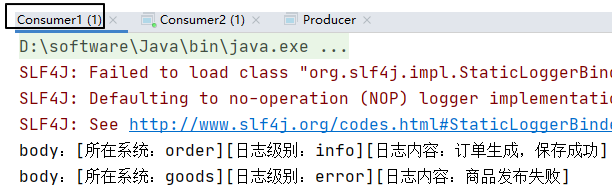

<p>队列2：</p>

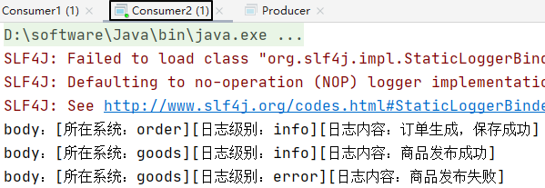

## 5、模式小结
### ①简单模式
一个生产者、一个消费者，不需要设置交换机（使用默认的交换机）<br/>

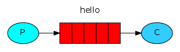

### ②工作队列模式 Work Queue
一个生产者、多个消费者（竞争关系），不需要设置交换机（使用默认的交换机）<br/>

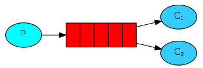

### ③发布订阅模式 Publish/subscribe
需要设置类型为fanout的交换机，并且交换机和队列进行绑定，当发送消息到交换机后，交换机会将消息发送到绑定的队列<br/>

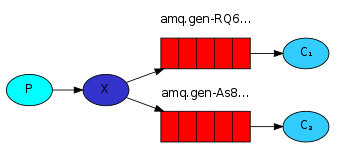

### ④路由模式 Routing
需要设置类型为direct的交换机，交换机和队列进行绑定，并且指定routing key，当发送消息到交换机后，交换机会根据routing key将消息发送到对应的队列<br/>

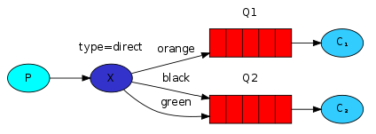

### ⑤通配符模式 Topic
需要设置类型为topic的交换机，交换机和队列进行绑定，并且指定通配符方式的routing key，当发送消息到交换机后，交换机会根据routing key将消息发送到对应的队列<br/>

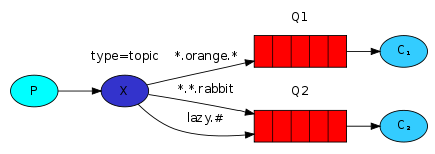

# 五、RabbitMQ整合Spring
## 1、创建生产者工程
### ①创建工程
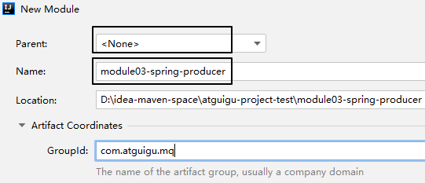

### ②引入依赖
```xml
    <dependencies>
        <dependency>
            <groupId>org.springframework</groupId>
            <artifactId>spring-context</artifactId>
            <version>5.1.7.RELEASE</version>
        </dependency>

        <dependency>
            <groupId>org.springframework.amqp</groupId>
            <artifactId>spring-rabbit</artifactId>
            <version>2.1.8.RELEASE</version>
        </dependency>

        <dependency>
            <groupId>junit</groupId>
            <artifactId>junit</artifactId>
            <version>4.12</version>
        </dependency>

        <dependency>
            <groupId>org.springframework</groupId>
            <artifactId>spring-test</artifactId>
            <version>5.1.7.RELEASE</version>
        </dependency>

    </dependencies>
```

### ③配置RabbitMQ连接信息
文件名：rabbitmq.properties
```properties
rabbitmq.host=192.168.200.100
rabbitmq.port=5672
rabbitmq.username=admin
rabbitmq.password=123456
rabbitmq.virtual-host=/
```

### ④Spring配置文件
#### [1]创建Spring配置文件
文件名：spring-rabbit-mq.xml

#### [2]基本思路
- 第一部分：先和RabbitMQ连上
- 第二部分：配置rabbitTemplate方便使用
- 第三部分：根据功能需求配置交换机、队列，如果有需要则进行绑定

#### [3]基础设施
```xml
<!-- 加载外部属性文件 -->  
<context:property-placeholder location="classpath:rabbitmq.properties"/>  
  
<!-- 定义 RabbitMQ connectionFactory：RabbitMQ 连接的工厂对象 -->  
<rabbit:connection-factory  
        id="connectionFactory"  
        host="${rabbitmq.host}"  
        port="${rabbitmq.port}"  
        username="${rabbitmq.username}"  
        password="${rabbitmq.password}"  
        virtual-host="${rabbitmq.virtual-host}"/>  
  
<!-- 底层创建 RabbitAdmin 对象，管理交换机、队列、绑定 -->  
<rabbit:admin connection-factory="connectionFactory"/>  
  
<!-- 定义 rabbitTemplate 对象操作可以在代码中方便发送消息 -->  
<rabbit:template  
        id="rabbitTemplate"  
        connection-factory="connectionFactory"/>
```

#### [3]工作队列模式
```xml
<!-- ~~~~~工作队列：消息直接发送到队列~~~~~ -->  
<!-- 定义持久化队列，不存在则自动创建；  
    不绑定到交换机则绑定到默认交换机    默认交换机类型为direct，名字为：""  
    路由键为队列的名称  
-->  
<rabbit:queue id="spring_queue" name="spring_queue" auto-declare="true"/>
```

#### [4]广播模式
```xml
<!-- ~~~~~广播：所有队列都能收到消息~~~~~ -->  
<!-- 定义广播交换机中的第一个持久化队列，不存在则自动创建 -->  
<rabbit:queue  
        id="spring_fanout_queue_1"  
        name="spring_fanout_queue_1"  
        auto-declare="true"/>  
  
<!-- 定义广播交换机中的第二个持久化队列，不存在则自动创建 -->  
<rabbit:queue  
        id="spring_fanout_queue_2"  
        name="spring_fanout_queue_2"  
        auto-declare="true"/>  
  
<!-- 定义广播类型交换机，并绑定上述两个队列 -->  
<rabbit:fanout-exchange  
        id="spring_fanout_exchange"  
        name="spring_fanout_exchange"  
        auto-declare="true">  
  
    <rabbit:bindings>  
        <rabbit:binding queue="spring_fanout_queue_1"/>  
        <rabbit:binding queue="spring_fanout_queue_2"/>  
    </rabbit:bindings>  
  
</rabbit:fanout-exchange>
```

#### [5]通配符模式
```xml
<!-- ~~~~~通配符：*匹配一个单词，#匹配多个单词~~~~~ -->  
<!-- 定义广播交换机中的持久化队列,不存在则自动创建 -->  
<rabbit:queue  
        id="spring_topic_queue_star"  
        name="spring_topic_queue_star"  
        auto-declare="true"/>  
  
<!-- 定义广播交换机中的持久化队列,不存在则自动创建 -->  
<rabbit:queue  
        id="spring_topic_queue_well"  
        name="spring_topic_queue_well"  
        auto-declare="true"/>  
  
<!-- 定义广播交换机中的持久化队列，不存在则自动创建 -->  
<rabbit:queue  
        id="spring_topic_queue_well2"  
        name="spring_topic_queue_well2"  
        auto-declare="true"/>  
  
<rabbit:topic-exchange  
        id="spring_topic_exchange"  
        name="spring_topic_exchange"  
        auto-declare="true">  
  
    <rabbit:bindings>  
        <rabbit:binding pattern="atguigu.*" queue="spring_topic_queue_star"/>  
        <rabbit:binding pattern="atguigu.#" queue="spring_topic_queue_well"/>  
        <rabbit:binding pattern="guigu.#" queue="spring_topic_queue_well2"/>  
    </rabbit:bindings>  
  
</rabbit:topic-exchange>
```

### ⑤junit测试代码
#### [1]Spring整合junit
```java
package com.atguigu.mq.test;  
  
import org.junit.runner.RunWith;  
import org.springframework.amqp.rabbit.core.RabbitTemplate;  
import org.springframework.beans.factory.annotation.Autowired;  
import org.springframework.test.context.ContextConfiguration;  
import org.springframework.test.context.junit4.SpringJUnit4ClassRunner;  
  
@RunWith(SpringJUnit4ClassRunner.class)  
@ContextConfiguration(locations = "classpath:spring-rabbit-mq.xml")  
public class RabbitMQProducerTest {  
      
    @Autowired  
    private RabbitTemplate rabbitTemplate;  
      
}
```

#### [2]工作队列模式
```java
@Test
public void queueTest(){

	// 路由键与队列同名
	rabbitTemplate.convertAndSend("spring_queue", "只发到队列spring_queue的消息。");

}
```

#### [3]广播模式
```java
@Test  
public void fanoutTest(){  
    /*  
     * 参数1：交换机名称  
     * 参数2：路由键名（广播设置为空）  
     * 参数3：发送的消息内容  
     */    rabbitTemplate.convertAndSend(  
            "spring_fanout_exchange",  
            "",  
            "发送到spring_fanout_exchange交换机的广播消息");  
}
```

#### [4]通配符模式
```java
/**  
 * 通配符  
 * 交换机类型为 topic  
 * 匹配路由键的通配符,*表示一个单词,#表示多个单词  
 * 绑定到该交换机的匹配队列能够收到对应消息  
 */  
@Test  
public void topicTest(){  
  
    /**  
     * 参数1：交换机名称  
     * 参数2：路由键名  
     * 参数3：发送的消息内容  
     */  
    rabbitTemplate.convertAndSend(  
            "spring_topic_exchange",  
            "atguigu.bj",  
            "发送到spring_topic_exchange交换机atguigu.bj的消息");  
  
    rabbitTemplate.convertAndSend(  
            "spring_topic_exchange",  
            "atguigu.bj.1",  
            "发送到spring_topic_exchange交换机atguigu.bj.1的消息");  
  
    rabbitTemplate.convertAndSend(  
            "spring_topic_exchange",  
            "atguigu.bj.2",  
            "发送到spring_topic_exchange交换机atguigu.bj.2的消息");  
  
    rabbitTemplate.convertAndSend(  
            "spring_topic_exchange",  
            "guigu.cn",  
            "发送到spring_topic_exchange交换机guigu.cn的消息");  
  
}
```

## 2、创建消费者工程
### ①创建工程
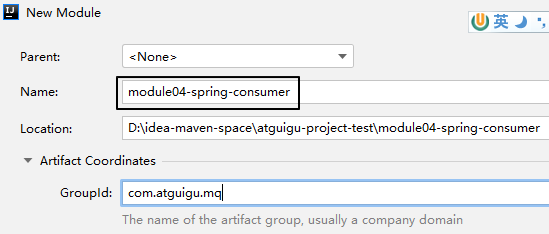

### ②引入依赖
和生产者工程一样。

### ③配置RabbitMQ连接信息
把生产者工程的rabbitmq.properties文件复制过来。

### ④Spring配置文件
```xml
<!--加载配置文件-->  
<context:property-placeholder location="classpath:rabbitmq.properties"/>  
  
<!-- 定义rabbitmq connectionFactory -->  
<rabbit:connection-factory  
        id="connectionFactory"  
        host="${rabbitmq.host}"  
        port="${rabbitmq.port}"  
        username="${rabbitmq.username}"  
        password="${rabbitmq.password}"  
        virtual-host="${rabbitmq.virtual-host}"/>
```

### ⑤消息监听器
创建监听器来监听指定的队列，这样才能接收到生产者发送过来的消息。
#### [1]Java代码
##### <1>队列监听器
```java
package com.atguigu.rabbitmq.listener;  
  
import org.springframework.amqp.core.Message;  
import org.springframework.amqp.core.MessageListener;  
  
public class SpringQueueListener implements MessageListener {  
  
    public void onMessage(Message message) {  
  
        try {  
  
            String msg = new String(message.getBody(), "utf-8");  
  
            System.out.printf("接收路由名称为：%s,路由键为：%s,队列名为：%s的消息：%s \n",  
                    message.getMessageProperties().getReceivedExchange(),  
                    message.getMessageProperties().getReceivedRoutingKey(),  
                    message.getMessageProperties().getConsumerQueue(),  
                    msg);  
  
        } catch (Exception e) {  
            e.printStackTrace();  
        }  
    }  
}
```

##### <2>广播监听器
一共创建两个：FanoutListener1和FanoutListener2，只是类名和打印提示不同，其它代码一样。
```java
package com.atguigu.rabbitmq.listener;  
  
import org.springframework.amqp.core.Message;  
import org.springframework.amqp.core.MessageListener;  
  
public class FanoutListener1 implements MessageListener {  
  
    public void onMessage(Message message) {  
  
        try {  
            String msg = new String(message.getBody(), "utf-8");  
            System.out.printf("广播监听器1：接收路由名称为：%s,路由键为：%s,队列名为：%s的消息：%s \n",  
            message.getMessageProperties().getReceivedExchange(),  
            message.getMessageProperties().getReceivedRoutingKey(),  
            message.getMessageProperties().getConsumerQueue(),  
            msg);  
        } catch (Exception e) {  
            e.printStackTrace();  
        }  
    }  
}
```

##### <3>星号通配符监听器
```java
package com.atguigu.rabbitmq.listener;  
  
import org.springframework.amqp.core.Message;  
import org.springframework.amqp.core.MessageListener;  
  
public class TopicListenerStar implements MessageListener {  
  
    public void onMessage(Message message) {  
  
        try {  
  
            String msg = new String(message.getBody(), "utf-8");  
  
            System.out.printf("通配符*监听器：接收路由名称为：%s,路由键为：%s,队列名为：%s的消息：%s \n",  
                    message.getMessageProperties().getReceivedExchange(),  
                    message.getMessageProperties().getReceivedRoutingKey(),  
                    message.getMessageProperties().getConsumerQueue(),  
                    msg);  
  
        } catch (Exception e) {  
            e.printStackTrace();  
        }  
    }  
}
```

##### <4>井号通配符监听器
一共创建两个：TopicListenerWell_1和TopicListenerWell_2，只是类名和打印提示不同，其它代码一样。
```java
package com.atguigu.rabbitmq.listener;  
  
import org.springframework.amqp.core.Message;  
import org.springframework.amqp.core.MessageListener;  
  
public class TopicListenerWell_1 implements MessageListener {  
  
    public void onMessage(Message message) {  
  
        try {  
  
            String msg = new String(message.getBody(), "utf-8");  
  
            System.out.printf("通配符#监听器 1：接收路由名称为：%s,路由键为：%s,队列名为：%s的消息：%s \n",  
            message.getMessageProperties().getReceivedExchange(),  
            message.getMessageProperties().getReceivedRoutingKey(),  
            message.getMessageProperties().getConsumerQueue(),  
            msg);  
  
        } catch (Exception e) {  
            e.printStackTrace();  
        }  
    }  
}
```

#### [2]Spring配置
```xml
<bean id="springQueueListener" class="com.atguigu.rabbitmq.listener.SpringQueueListener"/>  
<bean id="fanoutListener1" class="com.atguigu.rabbitmq.listener.FanoutListener1"/>  
<bean id="fanoutListener2" class="com.atguigu.rabbitmq.listener.FanoutListener2"/>  
<bean id="topicListenerStar" class="com.atguigu.rabbitmq.listener.TopicListenerStar"/>  
<bean id="topicListenerWell" class="com.atguigu.rabbitmq.listener.TopicListenerWell_1"/>  
<bean id="topicListenerWell2" class="com.atguigu.rabbitmq.listener.TopicListenerWell_2"/>  
  
<rabbit:listener-container connection-factory="connectionFactory" auto-declare="true">  
    <rabbit:listener ref="springQueueListener" queue-names="spring_queue"/>  
    <rabbit:listener ref="fanoutListener1" queue-names="spring_fanout_queue_1"/>  
    <rabbit:listener ref="fanoutListener2" queue-names="spring_fanout_queue_2"/>  
    <rabbit:listener ref="topicListenerStar" queue-names="spring_topic_queue_star"/>  
    <rabbit:listener ref="topicListenerWell" queue-names="spring_topic_queue_well"/>  
    <rabbit:listener ref="topicListenerWell2" queue-names="spring_topic_queue_well2"/>  
</rabbit:listener-container>
```

### ⑥让消费者程序一直运行
```java
@RunWith(SpringJUnit4ClassRunner.class)  
@ContextConfiguration(locations = "classpath:spring-rabbit-mq.xml")  
public class RabbitMQConsumerTest {  
      
    @Test  
    public void test() {  
        while (true) {}  
    }  
      
}
```

# 六、RabbitMQ整合SpringBoot
## 1、生产者工程
### ①创建module

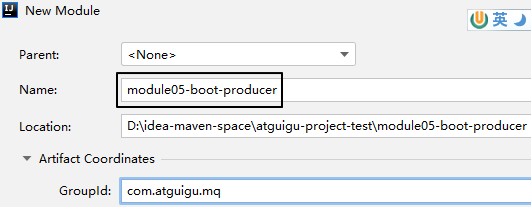

### ②配置POM
```xml
<parent>
    <groupId>org.springframework.boot</groupId>
    <artifactId>spring-boot-starter-parent</artifactId>
    <version>2.3.6.RELEASE</version>
</parent>

<dependencies>
    <dependency>
        <groupId>org.springframework.boot</groupId>
        <artifactId>spring-boot-starter-amqp</artifactId>
    </dependency>
    <dependency>
        <groupId>org.springframework.boot</groupId>
        <artifactId>spring-boot-starter-test</artifactId>
    </dependency>
</dependencies>
```

### ③YAML
```yaml
spring: 
  rabbitmq: 
    host: 192.168.200.100
    port: 5672 
    username: admin 
    password: 123456 
    virtual-host: /
```

### ④主启动类
```java
package com.atguigu.mq;  
  
import org.springframework.boot.SpringApplication;  
import org.springframework.boot.autoconfigure.SpringBootApplication;  
  
@SpringBootApplication
public class RabbitMQProducerMainType {

    public static void main(String[] args) {
        SpringApplication.run(RabbitMQProducerMainType.class, args);  
    }

}
```

### ⑤测试程序
```java
package com.atguigu.mq.test;
  
import org.junit.jupiter.api.Test;
import org.springframework.amqp.rabbit.core.RabbitTemplate;
import org.springframework.beans.factory.annotation.Autowired;
import org.springframework.boot.test.context.SpringBootTest;

@SpringBootTest  
public class RabbitMQTest {  
  
    public static final String EXCHANGE_DIRECT = "exchange.direct.order";  
    public static final String ROUTING_KEY = "order";
  
    @Autowired  
    private RabbitTemplate rabbitTemplate;
  
    @Test  
    public void testSendMessage() {  
        rabbitTemplate.convertAndSend(  
                EXCHANGE_DIRECT,   
                ROUTING_KEY,   
                "Hello atguigu");  
    }  
  
}
```

## 2、消费者工程
### ①创建module
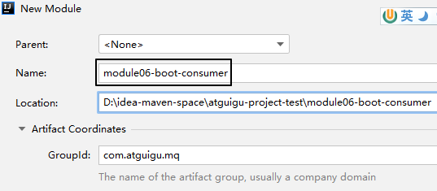

### ②配置POM
和生产者工程一样，但增加一个starter-web
```xml
<dependency>  
    <groupId>org.springframework.boot</groupId>  
    <artifactId>spring-boot-starter-web</artifactId>  
</dependency>
```

### ③YAML
和生产者工程一样

### ④主启动类
仿照生产者工程的主启动类，改一下类名即可

### ⑤监听器
```java
package com.atguigu.mq.listener;  
  
import com.rabbitmq.client.Channel;  
import org.springframework.amqp.core.Message;  
import org.springframework.amqp.rabbit.annotation.Exchange;  
import org.springframework.amqp.rabbit.annotation.Queue;  
import org.springframework.amqp.rabbit.annotation.QueueBinding;  
import org.springframework.amqp.rabbit.annotation.RabbitListener;  
import org.springframework.stereotype.Component;  
  
@Component  
public class MyMessageListener {  
  
    public static final String EXCHANGE_DIRECT = "exchange.direct.order";  
    public static final String ROUTING_KEY = "order";  
    public static final String QUEUE_NAME  = "queue.order";  
  
    @RabbitListener(bindings = @QueueBinding(  
            value = @Queue(value = QUEUE_NAME, durable = "true"),  
            exchange = @Exchange(value = EXCHANGE_DIRECT),  
            key = {ROUTING_KEY}  
    ))  
    public void processMessage(String dateString,  
                               Message message,  
                               Channel channel) {  
        System.out.println(dateString);  
    }  
  
}
```

## 3、小结
- SpringBoot提供了快速整合RabbitMQ的方式
- 基本信息在yml中配置,队列交互机以及绑定关系在配置类中使用Bean的方式配置
- 生产端直接注入RabbitTemplate完成消息发送
- 消费端直接使用@RabbitListener完成消息接收


# 七、RabbitMQ消息可靠性投递
## 1、提出问题
在实际业务中，我们需要确保消费端接收到消息。

## 2、解决思路
### ①组件设定
把交换机和队列设置为：不自动删除、持久化（保存到硬盘上）
- autoDelete：false
- durable：true

### ②发送端确认
- 确认消息是否发送到了交换机上
- 确认消息是否发送到了队列上

### ③消费端手动确认
消费端本来都是自动确认的，只要消费端接收到消息，就自动返回ACK确认，告诉消息队列消息已经被消费。消息队列就会删除这个消息。<br/>
但是如果消费端执行业务代码时抛出异常，那么没有完成既定的业务功能，但是消息又被消费了，不会再重发，导致业务数据处理不正确。<br/>
所以手动确认更加保险：
- 业务处理成功：手动返回ACK信息，表示消息成功消费
- 业务处理失败：手动返回NACK信息，表示消息消费失败。此时有两种后续操作供选择：
	- 把消息重新放回消息队列，RabbitMQ会重新投递这条消息，那么消费端将重新消费这条消息——从而让业务代码再执行一遍
	- 不把消息放回消息队列，返回reject信息表示拒绝，那么这条消息的处理就到此为止

## 3、操作演示
### ①生产者工程
#### [1]创建module
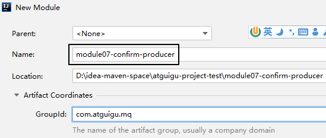

#### [2]搭建环境
参考整合SpringBoot时使用的环境
- 引入依赖
- 主启动类
- YAML配置：需要增加额外配置
```yaml
spring:  
  rabbitmq:  
    host: 192.168.200.100  
    port: 5672  
    username: admin  
    password: 123456  
    publisher-confirm-type: CORRELATED # 交换机的确认  
    publisher-returns: true # 队列的确认  
    listener:  
      simple:  
        acknowledge-mode: manual #默认情况下消息消费者是自动确认消息的，如果要手动确认消息则需要修改确认模式为manual  
        prefetch: 1 # 消费者每次从队列获取的消息数量。此属性当不设置时为：轮询分发，设置为1为：公平分发
```

#### [3]创建配置类
```java
package com.atguigu.mq.config;  
  
import org.springframework.amqp.core.Message;  
import org.springframework.amqp.rabbit.connection.CorrelationData;  
import org.springframework.amqp.rabbit.core.RabbitTemplate;  
import org.springframework.beans.factory.annotation.Autowired;  
import org.springframework.stereotype.Component;  
  
import javax.annotation.PostConstruct;  
  
/**  
 * @author: 封捷  
 * @create-date: 2022/9/7 23:34  
 * @Description 消息发送确认  
 * ConfirmCallback  只确认消息是否正确到达 Exchange 中  
 * ReturnCallback   消息没有正确到达队列时触发回调，如果正确到达队列不执行  
 *      1. 如果消息没有到 exchange,则confirm回调，ack=false  
 *      2. 如果消息到达 exchange,则confirm回调，ack=true  
 *      3. exchange到 queue 成功,则不回调 returnedMessage()  
 *      4. exchange到 queue 失败,则回调 returnedMessage()  
 */@Component  
public class MQProducerAckConfig  
        implements RabbitTemplate.ConfirmCallback,  
        RabbitTemplate.ReturnCallback {  
  
    @Autowired  
    private RabbitTemplate rabbitTemplate;  
  
    // 修饰一个非静态的 void()方法,在服务器加载Servlet的时候运行，并且只会被服务器执行一次。具体是在构造器之后执行，init()方法之前执行。  
    @PostConstruct  
    public void init() {  
        rabbitTemplate.setConfirmCallback(this);            //指定 ConfirmCallback        rabbitTemplate.setReturnCallback(this);             //指定 ReturnCallback    }  
  
    // 回调方法：无论是否发送到交换机都会被回调  
    // ack：true 表示发送到了交换机；false 表示未发送到交换机  
    @Override  
    public void confirm(CorrelationData correlationData, boolean ack, String cause) {  
        if (ack) {  
            System.out.println("消息发送成功：" + correlationData);  
        } else {  
            System.out.println("消息发送失败：" + cause + " 数据：" + correlationData);  
        }  
    }  
  
    // 判断消息是否发送到了队列，如果发送到了队列，则不会调用这个方法；没有发送到队列则调用这个方法  
    @Override  
    public void returnedMessage(Message message, int replyCode, String replyText, String exchange, String routingKey) {  
        // 反序列化对象输出  
        System.out.println("消息主体: " + new String(message.getBody()));  
        System.out.println("应答码: " + replyCode);  
        System.out.println("描述：" + replyText);  
        System.out.println("消息使用的交换器 exchange : " + exchange);  
        System.out.println("消息使用的路由键 routing : " + routingKey);  
    }  
  
}
```

#### [4]发送消息
```java
package com.atguigu.mq.test;
  
import org.junit.jupiter.api.Test;
import org.springframework.amqp.rabbit.core.RabbitTemplate;
import org.springframework.beans.factory.annotation.Autowired;
import org.springframework.boot.test.context.SpringBootTest;

@SpringBootTest  
public class RabbitMQTest {  
  
    public static final String EXCHANGE_DIRECT = "exchange.direct.order";  
    public static final String ROUTING_KEY = "order";
  
    @Autowired  
    private RabbitTemplate rabbitTemplate;
  
    @Test  
    public void testSendMessage() {  
        rabbitTemplate.convertAndSend(  
                EXCHANGE_DIRECT,   
                ROUTING_KEY,   
                "Hello atguigu");  
    }  
  
}
```

### ②消费端工程
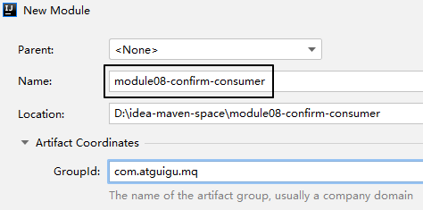

<br/>

参考整合SpringBoot时使用的环境
- 引入依赖
- 主启动类
- YAML配置：和生产者工程用一样的（复制过来）

<br/>

监听器代码如下：
```java
package com.atguigu.mq.listener;  
  
import com.rabbitmq.client.Channel;  
import org.springframework.amqp.core.Message;  
import org.springframework.amqp.rabbit.annotation.Exchange;  
import org.springframework.amqp.rabbit.annotation.Queue;  
import org.springframework.amqp.rabbit.annotation.QueueBinding;  
import org.springframework.amqp.rabbit.annotation.RabbitListener;  
import org.springframework.stereotype.Component;  
  
import java.io.IOException;  
  
@Component  
public class MyMessageListener {  
  
    public static final String EXCHANGE_DIRECT = "exchange.direct.order";  
    public static final String ROUTING_KEY = "order";  
    public static final String QUEUE_NAME  = "queue.order";  
  
    @RabbitListener(bindings = @QueueBinding(  
            value = @Queue(value = QUEUE_NAME, durable = "true", autoDelete = "false"),  
            exchange = @Exchange(value = EXCHANGE_DIRECT, durable = "true", autoDelete = "false"),  
            key = {ROUTING_KEY}  
    ))  
    public void processMessage(String dateString,  
                               Message message,  
                               Channel channel) throws IOException {  
        try {  
            System.out.println(dateString);  
  
            channel.basicAck(message.getMessageProperties().getDeliveryTag(), false);  
        } catch (Exception e) {  
            e.printStackTrace();  
  
            Boolean redelivered = message.getMessageProperties().getRedelivered();  
  
            if (!redelivered) {  
                channel.basicNack(message.getMessageProperties().getDeliveryTag(), false, true);  
            } else {  
                channel.basicReject(message.getMessageProperties().getDeliveryTag(), false);  
            }  
        }  
    }  
  
}
```


# 八、消费端限流
## 1、需求
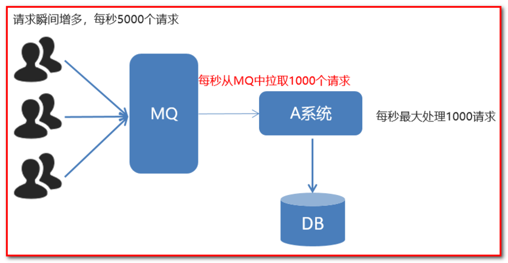

## 2、参数
### ①参数名称和位置
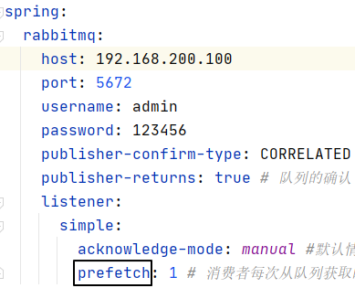

### ②效果对比
#### [1]未设置

<p>Ready表示队列中已经接收到了消息，等待消费端取走。</p>
<p>现在Ready为0，Unacked为96，表示消费端已经把消息全部取走了，只是96个消息尚未返回ACK确认。</p>


#### [2]设置为 1 之后
<p>大家看到：此时Ready数值不是0了，表示消息没有被一次性全部取走。</p>
<p>prefetch参数设置成多少，就表示一次性从消息队列取回多少条消息。</p>


# 九、消息超时时间
## 1、概述
<p>给消息设定一个过期时间，超过这个时间没有被取走的消息就会被删除。</p>
我们可以从两个层面来给消息设定过期时间：
- 队列层面：在队列层面设定消息的过期时间，并不是队列的过期时间。意思是这个队列中的消息全部使用同一个过期时间。
- 消息本身：给具体的某个消息设定过期时间
如果两个层面都做了设置，那么哪个时间短，哪个生效。

## 2、队列层面设置
层次结构：@RabbitListener注解 -> @QueueBinding注解 -> value 属性 -> @Queue注解 -> arguments属性 -> @Argument注解
```java
@RabbitListener(bindings = @QueueBinding(  
        value = @Queue(value = QUEUE_NAME, durable = "true", autoDelete = "false", arguments = @Argument(name = "x-message-ttl", value = "10000", type = "java.lang.Integer")),  
        exchange = @Exchange(value = EXCHANGE_DIRECT, durable = "true", autoDelete = "false"),  
        key = {ROUTING_KEY}  
))
```

## 3、消息本身设置
**注意**：此时是在**生产者**端设置。<br/>
导包：org.springframework.amqp.core.MessagePostProcessor<br/>

```java
@Test  
public void testSendMessage() {  
  
    // 1、创建消息后置处理器对象  
    MessagePostProcessor messagePostProcessor = (Message message) -> {  
  
        // 设定 TTL 时间，以毫秒为单位
        message.getMessageProperties().setExpiration("5000");  
  
        return message;  
    };  
  
    // 2、发送消息  
    rabbitTemplate.convertAndSend(    
            EXCHANGE_DIRECT,     
            ROUTING_KEY,     
            "Hello atguigu", messagePostProcessor);    
}
```

# 十、死信队列
## 1、概述
DLX：Dead Letter Exchange死信交换机。当一个消息无法被消费，它就变成了死信。死信产生的原因大致有下面三种：
- **溢出**：队列中消息数量到达限制。比如队列最大只能存储10条消息，而生产者发了11条消息，根据先进先出，最先发的消息会进入死信队列。
- **拒绝**：消费者拒接消息，basicNack/basicReject，并且不把消息重新放入原目标队列，requeue=false
- **超时**：消息到达超时时间未被消费

而死信的处理方式大致有下面三种：
- **丢弃**：对不重要的消息直接丢弃，不做处理
- **入库**：把死信写入数据库，日后处理
- **监听**：消息变成死信后进入死信队列，我们专门设置消费端监听死信队列，做后续处理。
通常会采用第三种。

## 2、测试产生死信的三种情况

### ①测试相关准备
- 正常交换机：exchange_normal221126
- 正常队列：queue_normal221126
- 正常路由键：routing_key_normal221126
- 死信交换机：exchange_dead_letter221126
- 死信队列：queue_dead_letter221126
- 死信路由键：routing_key_dead_letter221126
```java
public static final String EXCHANGE_NORMAL = "exchange_normal221126";  
public static final String EXCHANGE_DEAD_LETTER = "exchange_dead_letter221126";  
  
public static final String ROUTING_KEY_NORMAL = "routing_key_normal221126";  
public static final String ROUTING_KEY_DEAD_LETTER = "routing_key_dead_letter221126";  
  
public static final String QUEUE_NORMAL = "queue_normal221126";  
public static final String QUEUE_DEAD_LETTER = "queue_dead_letter221126";
```

### ②消费端拒收消息
#### [1]发送消息的代码
```java
@Test  
public void testSendMessageButReject() {  
    rabbitTemplate  
            .convertAndSend(  
                    EXCHANGE_NORMAL,  
                    ROUTING_KEY_NORMAL,  
                    "测试死信情况1：消息被拒绝");  
}
```

#### [2]接收消息的代码
```java
@RabbitListener(bindings = @QueueBinding(  
    value = @Queue(  
            value = QUEUE_NORMAL,  
            durable = "true",  
            autoDelete = "false",  
  
            // 在参数中进行设定：把死信转入死信队列  
            arguments = {  
                @Argument(name = "x-dead-letter-exchange", value = EXCHANGE_DEAD_LETTER),  
                @Argument(name = "x-dead-letter-routing-key", value = ROUTING_KEY_DEAD_LETTER)}),  
    exchange = @Exchange(value = EXCHANGE_NORMAL, durable = "true", autoDelete = "false"),  
    key = {ROUTING_KEY_NORMAL}  
))  
public void processMessageNormal(Message message, Channel channel) throws IOException {  
    // 监听正常队列，但是拒绝消息  
    System.out.println("★[normal]消息接收到，但我拒绝。");  
    channel.basicReject(message.getMessageProperties().getDeliveryTag(), false);  
}
```

```java
@RabbitListener(bindings = @QueueBinding(  
        value = @Queue(value = QUEUE_DEAD_LETTER, durable = "true", autoDelete = "false"),  
        exchange = @Exchange(value = EXCHANGE_DEAD_LETTER, durable = "true", autoDelete = "false"),  
        key = {ROUTING_KEY_DEAD_LETTER}  
))  
public void processMessageDead(String dataString, Message message, Channel channel) throws IOException {  
    // 监听死信队列  
    System.out.println("★[dead letter]dataString = " + dataString);  
    System.out.println("★[dead letter]我是死信监听方法，我接收到了死信消息");  
    channel.basicAck(message.getMessageProperties().getDeliveryTag(), false);  
}
```

#### [3]执行结果
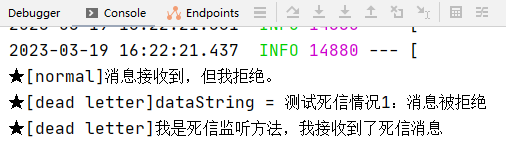

### ③消息数量超过队列容纳极限
#### [1]发送消息的代码
```java
@Test  
public void testSendMultiMessage() {  
    for (int i = 0; i < 20; i++) {  
        rabbitTemplate.convertAndSend(  
                EXCHANGE_NORMAL,  
                ROUTING_KEY_NORMAL,  
                "测试死信情况2：消息数量超过队列的最大容量" + i);  
    }  
}
```

#### [2]接收消息的代码
在上一个例子的基础上，正常队列监听方法做两点修改：
- 增加一个参数设定队列容量
- 不再拒绝消息，而是正常返回ACK确认
```java
@RabbitListener(bindings = @QueueBinding(  
    value = @Queue(  
            value = QUEUE_NORMAL,  
            durable = "true",  
            autoDelete = "false",  
  
            // 在参数中进行设定：把死信转入死信队列  
            // 设定当前队列的最大消息容量：10  
            arguments = {  
                @Argument(name = "x-dead-letter-exchange", value = EXCHANGE_DEAD_LETTER),  
                @Argument(name = "x-dead-letter-routing-key", value = ROUTING_KEY_DEAD_LETTER),  
                @Argument(name = "x-max-length", value = "10", type = "java.lang.Integer")  
            }),  
    exchange = @Exchange(value = EXCHANGE_NORMAL, durable = "true", autoDelete = "false"),  
    key = {ROUTING_KEY_NORMAL}  
))  
public void processMessageNormal(Message message, Channel channel) throws IOException {  
    // 监听正常队列  
    System.out.println("★[normal]消息接收到。");  
    channel.basicAck(message.getMessageProperties().getDeliveryTag(), false);  
}
```

#### [3]测试方式
- 在RabbitMQ管理界面上删除我们要修改参数的队列
- 重启消费端程序，确认RabbitMQ服务器上的队列已经设定了新的参数。
- 在消费端程序代码中注释掉监听方法，再次重启消费端程序——也就是说此时没有监听程序了。
- 让生产者发送消息。

#### [4]执行效果
<p>正常队列的参数如下图所示：</p>

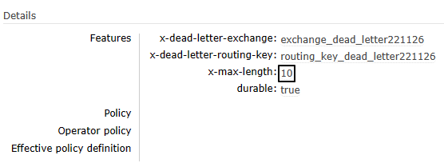

<p>生产者发送20条消息之后，消费端死信队列接收到前10条消息：</p>


<p>剩下10条消息留在队列中，等待被取走：</p>


### ④消息超时未消费
#### [1]发送消息的代码
正常发送一条消息即可，所以使用第一个例子的代码。
```java
@Test  
public void testSendMessageButReject() {  
    rabbitTemplate  
            .convertAndSend(  
                    EXCHANGE_NORMAL,  
                    ROUTING_KEY_NORMAL,  
                    "测试死信情况3：消息超时");  
}
```

#### [2]接收消息的代码
<p>把上一个例子的监听方法注释打开，给队列添加一个参数：设置队列中消息的超时时间。</p>
```java
@Argument(name = "x-message-ttl", value = "10000", type = "java.lang.Integer")
```

#### [3]测试方式
- 在RabbitMQ管理界面上删除我们要修改参数的队列
- 重启消费端程序，确认RabbitMQ服务器上的队列已经设定了新的参数。
- 在消费端程序代码中注释掉监听方法，再次重启消费端程序——也就是说此时没有监听程序了。
- 让生产者发送消息。

#### [4]执行效果
<p>队列参数生效：</p>


<p>因为没有消费端监听程序，所以消息未超时前滞留在队列中：</p>


<p>消息超时后，进入死信队列：</p>


# 十一、延迟队列
## 1、应用场景
生产者端发出消息后，并不希望用户马上接收到消息，而是推迟一段时间之后再消费。

- 电商：用户提交订单30分钟后，检查用户是否支付。
- 注册：用户注册30分钟后，发送短信问候。

## 2、RabbitMQ实现思路
- 思路1：借助消息超时时间+死信队列（就是刚刚我们测试的例子）
- 思路2：给RabbitMQ安装插件
> 提示：使用x-delayed-message插件后，生产者端消息确认的行为会发生改变。
> 本来是消息没有发送到队列才调用returnedMessage()方法；
> 但现在即使发送到了队列，也会调用这个方法。

## 3、安装插件
### ①上传插件文件
<p>文件名：rabbitmq_delayed_message_exchange-3.8.0.ez</p>
<p>目标路径：/usr/lib/rabbitmq/lib/rabbitmq_server-3.8.1/plugins/</p>

### ②启用插件
```bash
/usr/lib/rabbitmq/bin/rabbitmq-plugins enable rabbitmq_delayed_message_exchange
```

### ③重启服务
```bash
systemctl restart rabbitmq-server
```

### ④确认


## 4、编写代码测试
### ①发送消息的代码
```java
@Test  
public void testSendDelayMessage() {  
    rabbitTemplate.convertAndSend(  
            EXCHANGE_DELAY,   
            ROUTING_KEY_DELAY,   
            "测试基于插件的延迟消息 [" + new SimpleDateFormat("hh:mm:ss").format(new Date()) + "]",   
            messageProcessor -> {  
  
        // 设置延迟时间  
        messageProcessor.getMessageProperties().setDelay(10 * 1000);  
          
        return messageProcessor;  
    });  
}
```

### ②接收消息的代码
```java
package com.atguigu.mq.listener;  
  
import com.rabbitmq.client.Channel;  
import org.springframework.amqp.core.Message;  
import org.springframework.amqp.rabbit.annotation.*;  
import org.springframework.stereotype.Component;  
  
import java.io.IOException;  
import java.text.SimpleDateFormat;  
import java.util.Date;  
  
@Component  
public class MyDelayMessageListener {  
  
    public static final String EXCHANGE_DELAY = "exchange_delay_221126";  
    public static final String ROUTING_KEY_DELAY = "routing_key_delay_221126";  
    public static final String QUEUE_DELAY = "queue_delay_221126";  
  
    @RabbitListener(bindings = @QueueBinding(  
        value = @Queue(value = QUEUE_DELAY, durable = "true", autoDelete = "false"),  
        exchange = @Exchange(  
                value = EXCHANGE_DELAY,   
                durable = "true",   
                autoDelete = "false",   
                type = "x-delayed-message",   
                arguments = @Argument(name = "x-delayed-type", value = "direct")),  
        key = {ROUTING_KEY_DELAY}  
    ))  
    public void process(String dataString, Message message, Channel channel) throws IOException {  
        System.out.println("[生产者]" + dataString);  
        System.out.println("[消费者]" + new SimpleDateFormat("hh:mm:ss").format(new Date()));  
        channel.basicAck(message.getMessageProperties().getDeliveryTag(), false);  
    }  
  
}
```

### ③执行效果
<p>❤消息发送端：使用延迟插件后，即使消息成功发送到队列，也会调用returnedMessage()方法</p>


<p>❤消息接收端：</p>


<p>❤交换机的类型：</p>


