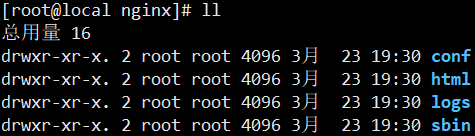
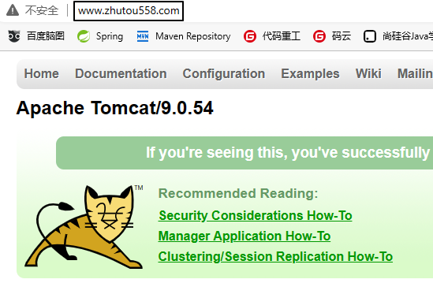
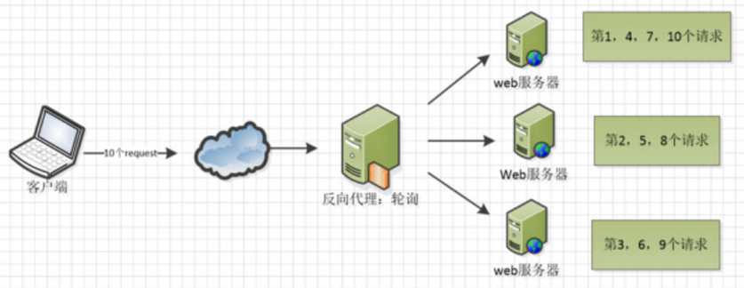
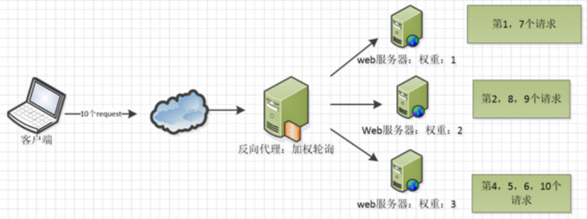
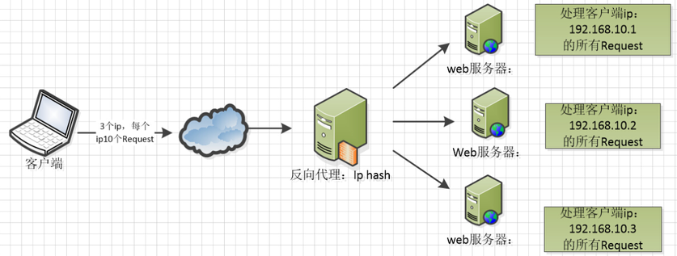
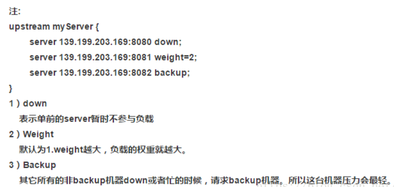
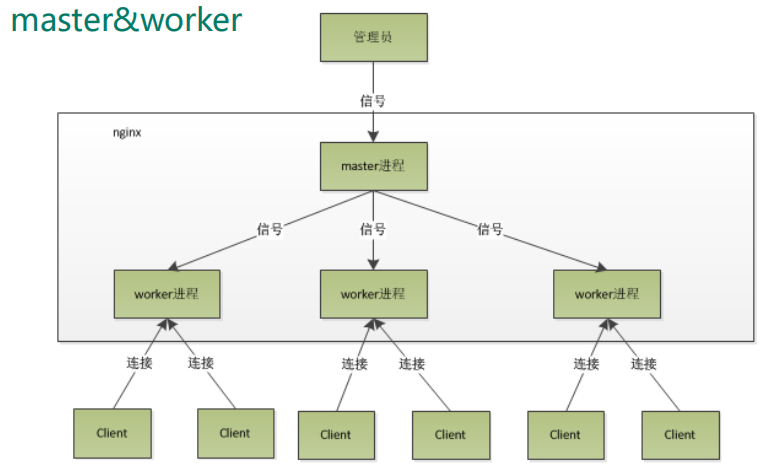
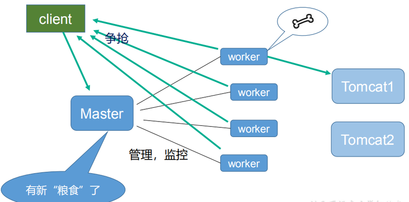

# 一、概述
## 1、Why？
Nginx最突出、最重要的功能就是负载均衡。所以我们使用Nginx最大的需求出发点就是负载均衡。<br/>
负载均衡的概念：因为单个服务器的负载承受能力有限，所以当请求并发量超过负载能力之后，就需要搭建集群。<br/>
以Tomcat为例：一个Tomcat未经优化大致的并发能力是300~500，经过优化大致能达到2000。如果现在并发量是10000，那么就需要5个Tomcat实例组成集群。<br/>
可是对于具体的一个请求来说，该找这5个Tomcat中哪一个呢？<br/>
具体一个请求还是应该去找具体的一个Tomcat；宏观来看所有请求分流到了各个Tomcat实例上。<br/>
这个任务可以由Nginx来完成：把量很大的请求分流到Tomcat集群中各个实例上。<br/>
除此之外，Nginx其它功能也很有用：
- 动静分离：Tomcat是负责执行Java代码的服务器，而HTML、CSS、JavaScript、图片等等这样的文件属于静态资源。有了Nginx，我们就可以把这些静态资源从Tomcat服务器上分离出来，减轻Tomcat服务器的压力，同时提升静态资源响应的速度。
- 反向代理：基于Nginx反向代理功能，我们可以实现请求的转发，Nginx帮助我们把请求转发到其它资源。
- 页面静态化：原本需要服务器端渲染视图才能显示的页面，就可以把渲染结果放在Nginx服务器上。这样就不需要重复执行渲染操作。相当于把一个请求从访问动态资源变成访问静态资源。

除了Nginx自身的功能，以Nginx为核心的生态也非常繁荣。这是因为Nginx可以额外安装module。这些module是根据自身需求，借助Nginx实现自己的功能。

## 2、What？


| 产地     | 俄罗斯                                         |
| -------- | ---------------------------------------------- |
| 父亲     | Igor Sysoev                                    |
| 开发语言 | C                                              |
| 生日     | 第一个公开版本0.1.0发布于2004年10月4日         |
| 特长     | 能够支撑5万并发，CPU、内存资源占用小，运行稳定 |


Nginx 名称来自于：engine X，意为“X 引擎”。主要功能包括：
- 作为Web服务器，提供 HTTP 服务。
- 提供基于反向代理的负载均衡服务。
- 提供动静分离服务。
- 基于 Lua 脚本编写脚本程序提供缓存服务。
- 还可以通过安装模块整合其他技术或提供特定功能，为数众多的 Nginx 模块构成了繁荣的 Nginx 生态。

国内网站使用 Nginx 有：百度、京东、新浪、网易、腾讯、淘宝等等。

# 二、安装
## 1、上传安装包
- nginx-1.20.1.tar.gz
- pcre-8.37.tar.gz

## 2、拍摄快照
略

## 3、准备工作
```bash
# 安装环境依赖
yum -y install make zlib zlib-devel gcc-c++ libtool openssl openssl-devel

# 安装PCRE
# ●第一步：进入/opt目录
cd /opt

# ●第二步：解压到当前目录
tar -zxvf pcre-8.37.tar.gz

# ●第三步：进入解压目录
cd /opt/pcre-8.37/

# ●第四步：生成Makefile文件
./configure

# ●第五步：编译
make

# ●第六步：安装
make install

# ●第七步：验证
pcre-config --version
```

## 4、安装Nginx
```bash
# ●第一步：进入/opt目录
cd /opt

# ●第二步：解压到当前目录
tar -zxvf /opt/nginx-1.20.1.tar.gz

# ●第三步：进入解压目录
cd /opt/nginx-1.20.1

# ●第四步：生成Makefile文件
./configure

# ●第五步：编译
make

# ●第六步：安装
make install

# ●第七步：验证
/usr/local/nginx/sbin/nginx -v
```
<p>安装完成后可以到 /usr/local/nginx 这里查看 Nginx 的安装目录：</p>



## 5、启动访问首页

### ①启动 Nginx 服务器

```shell
/usr/local/nginx/sbin/nginx
```


### ②访问 Nginx 服务器

Nginx 服务器默认监听 80 端口。


### ③停止 Nginx 服务器

```shell
/usr/local/nginx/sbin/nginx -s stop
```


### ④重新加载配置文件

```shell
/usr/local/nginx/sbin/nginx -s reload
```

# 三、配置文件
## 1、文件位置

<p>/usr/local/nginx/conf/nginx.conf</p>

去掉注释之后，内容如下：

```text
worker_processes  1;

events {
    worker_connections  1024;
}

http {
    include       mime.types;
    default_type  application/octet-stream;

    sendfile        on;
    keepalive_timeout  65;

    server {
        listen       80;
        server_name  localhost;

        location / {
            root   html;
            index  index.html index.htm;
        }
    }
}
```

由此可以看出，Nginx配置文件分成三个部分：

- 全局块
- events块
- HTTP块

## 2、全局块

<p>这个部分配置的是影响Nginx整体运行的配置指令。主要包括：</p>

- 用户组
- 允许生成的worker process数
- PID（进程ID）文件存放位置
- 日志文件存放位置
- 日志类型
- 其它配置文件引入

目前我们看到的worker_processes就是一个关键配置，它直接影响了Nginx服务器的并发能力。worker_processes越大并发能力越强——当然不是无限的，会受到硬件、操作系统的制约。

## 3、events块

<p>events块涉及的指令主要影响Nginx服务器与用户的网络连接。</p>
<p>常用的设置包括是否开启对多worker process下的网络连接进行序列化、是否允许同时接收多个网络连接、选取哪种事件驱动模型来处理连接请求、每个work process可以同时支持的最大连接数等。</p>
<p>目前我们看到的worker_connections就是指定每个work process的最大连接数为1024。</p>
<p>所以这部分配置对Nginx性能也会有较大影响</p>

## 4、HTTP块
<p>Nginx 服务器配置中最频繁的部分：代理、缓存和日志定义等绝大多数功能和第三方模块的配置都在这里。</p>
HTTP块内部又分成两部分：
- HTTP全局块：配置文件引入、MIME-TYPE 定义、日志自定义、连接超时时间、单链接请求数上限等
- server块：每一个server块配置了一个虚拟主机，对外就像是一个虚拟出来的独立的服务器。可以有多个。server块内部又分成两部分：
	- server全局块：最常见的配置是本虚拟机主机的监听配置和本虚拟主机的名称或IP配置。
	- location块：对Nginx接收到的请求进行路由的匹配规则。

## 5、配置文件语法要求
- 如果后面不是大括号，那么单行配置必须用分号结尾
- server块定义的listen和server_name，二者结合起来必须是唯一的


## 6、location块说明
一个 server 块可以配置多个 location 块。这块的主要作用是基于 Nginx  服务器接收到的请求字符串（例如 server_name/uri-string），对虚拟主机名称（也可以是IP别名）之外的字符串（例如 前面的 /uri-string）进行匹配，对特定的请求进行处理。地址定向、数据缓存和应答控制等功能，还有许多第三方模块的配置也在这里进行。


## 7、小结

配置文件结构：

- 全局块
- events 块
- http 块
  - http 全局块
  - server 块（可以有多个）
    - server 全局块
    - location 块（可以有多个）

# 四、反向代理
## 0、概念
反向代理是相对于正向代理来说的。
- 正向代理：为内网服务，内网中的节点通过代理访问外网的服务器。
- 反向代理：为外网服务，外网中的节点通过代理访问内网的服务器。

## 1、目标
通过Nginx访问Tomcat。

## 2、准备Tomcat
前提条件是安装JDK。
```bash
cd /opt
tar -zxvf apache-tomcat-9.0.54.tar.gz
/opt/apache-tomcat-9.0.54/bin/startup.sh
```

效果如下：<br/>


## 3、配置Nginx
<p>修改配置文件之后，需要让Nginx重新加载配置文件。</p>
<p>在这里，proxy_pass起到了一个“请求转发”的作用。</p>

```text
server {
	server_name www.zhutou558.com;
	location / {
		proxy_pass http://localhost:8080;
	}
}
```

## 4、配置域名
使用SwitchHosts工具添加如下配置：
```text
192.168.200.100 www.zhutou558.com
```

## 5、效果


# 五、location匹配规则
## 1、概述
<p>Nginx在location配置中还提供了更丰富的语义。上面的例子只是一种非常简单的情况。</p>
<p>location的完整语法格式是：</p>
```text
location [=|~|~*|^~] uri {
    
}
```

其中匹配规则部分的各个符号含义如下：
- =：用于不含正则表达式的 uri 前，要求请求字符串与 uri 严格匹配，如果匹配成功，就停止继续向下搜索并立即处理该请求。
- ~：用于表示 uri 包含正则表达式，并且**区分**大小写。
- ~\*：用于表示 uri 包含正则表达式，并且**不区分**大小写。
- ^~：用于不含正则表达式的 uri 前，要求 Nginx 服务器找到标识 uri 和请求字符串匹配度最高的 location 后，立即使用此 location 处理请求，而不再使用 location 块中的正则 uri 和请求字符串做匹配。

<p>注意：如果 uri 包含正则表达式，则必须要有 ~ 或者 ~* 标识。</p>

## 2、案例
### ①目标
访问不同请求地址，通过Nginx跳转到不同的Tomcat。
- 请求地址包含/edu：跳转到端口号8080
- 请求地址包含/vod：跳转到端口号8081

### ②准备Tomcat
#### [1]原Tomcat
<p>在webapps目录下创建目录：edu</p>
<p>在edu目录下创建index.html</p>
```html
<html>
<head>
<title>Hello</title>
</head>
<body>
<p>8080</p>
</body>
</html>
```

#### [2]新Tomcat
把Tomcat解压目录复制一份，修改端口号：
```bash
vim /opt/apache-tomcat-8081/conf/server.xml
```

```text
 21  -->
 22 <Server port="8006" shutdown="SHUTDOWN">
 23   <Listener className="org.apache.catalina.startup.VersionLoggerListener" />
 ……
 69     <Connector port="8081" protocol="HTTP/1.1"
 70                connectionTimeout="20000"
 71                redirectPort="8443" />
```

<p>在webapps目录下创建目录：vod</p>
<p>在vod目录下创建index.html</p>
```html
<html>
<head>
<title>Hello</title>
</head>
<body>
<p>8081</p>
</body>
</html>
```

```
启动Tomcat：
```bash
/opt/apache-tomcat-8081/bin/startup.sh
```

### ③配置Nginx
```text
server {
   listen     9000;
   server_name www.zhutou366.com;
   location ~ /edu/ {
	   proxy_pass http://localhost:8080;
   }
   location ~ /vod/ {
	   proxy_pass http://localhost:8081;
   }
}
```

### ④配置域名
在SwitchHosts工具中配置：
```text
192.168.200.100 www.zhutou366.com
```

# 六、负载均衡
## 1、准备Tomcat
启动两个Tomcat，修改首页内容易于识别即可。

## 2、配置Nginx负载均衡
```text
upstream atguiguBalance{
	server localhost:8080;
	server localhost:8081;
}

server {
   listen    9100;
   server_name www.pig358.com;
   location / {
	   proxy_pass http://atguiguBalance;
   }
}
```

## 3、Nginx负载均衡策略
无论哪种访问策略，第一个访问的服务器实例永远是随机的。

### ①轮询
轮流访问每一个服务器实例，如果有服务器宕机可以自动剔除。<br/>



### ②权重
权重大的服务器实例被访问到的几率大。
```text
upstream server_pool{   
	server 192.168.10.1 weight=1;    
	server 192.168.10.2 weight=2; 
	server 192.168.10.3 weight=3;   
}
```



### ③IP HASH
每个请求按访问ip的hash结果分配，这样每个访客固定访问一个后端服务器，可以解决session的问题。
```text
upstream server_pool{   
	ip_hash;    
	server 192.168.10.1:80;   
	server 192.168.10.2:80;  
	server 192.168.10.3:80;  
}
```



### ④公平
按后端服务器的响应时间来分配请求，响应时间短的优先分配。需借助第三方插件。
```text
upstream server_pool{   
	server 192.168.10.1:80;    
	server 192.168.10.2:80;
	server 192.168.10.3:80;
	fair;    
}
```

### ⑤其它



# 七、动静分离
## 1、概述
<p>Nginx 动静分离简单来说就是把动态请求跟静态请求分开，Nginx 处理静态请求，Tomcat处理动态请求。</p>
动静分离从目前实现角度来讲大致分为两种：
- 一种是纯粹把静态文件独立成单独的域名，放在独立的服务器上，也是目前**主流推崇**的方案；
- 另外一种方法就是动态跟静态文件混合在一起发布，通过 nginx 来分开。然后通过 location 指定不同的后缀名实现不同的请求转发。

## 2、配置静态资源访问
创建目录：/images，然后上传图片文件到这个目录。接下来配置Nginx：
```text
server {
   listen    80;
   server_name www.picture588.com;
   location / {
	   root /images;
	   autoindex on;
   }
}
```
然后配置域名，让Nginx重新加载配置文件。

## 3、Tomcat下访问图片
```bash
vim /opt/apache-tomcat-9.0.54/webapps/edu/index.html
```

```html
<html>
<head>
<title>Hello</title>
</head>
<body>
<p>8080</p>

</body>
</html>
```

测试：按照之前的配置，通过Nginx访问Tomcat下的edu/index.html。

# 八、工作机制
## 1、master和worker分工
- master进程负责分配任务（只有一个）
- worker进程负责处理请求（可以多个）



## 2、master和worker配合


## 3、当前机制的好处
- 利于执行热部署操作
	- 比如：执行nginx -s reload，工作中的worker继续工作；空闲worker重新加载配置文件；然后工作中的worker完成工作后执行重新加载。如果没有多个worker，一个worker重新加载配置文件时Nginx对外无法提供服务，相当于暂停。但Nginx是整个项目的入口，即使短时间暂停也不能接受。
- 独立进程，彼此隔离
	- 每个worker是一个独立的进程，任何一个进程抛异常都不会影响其它进程。
	- 每个worker进程内只有一个线程，基于IO多路复用技术效率极高。
	- 每个worker进程内只有一个线程，不需要加锁，不需要线程间切换，非阻塞运行，省去了大量性能开销。
> IO多路复用是Linux系统的新技术，Windows系统没有。
> 所以在Windows系统部署Nginx无法发挥出Nginx最大的性能。

## 4、Nginx并发能力评估
### ①worker数量
由于Nginx基于IO多路复用机制，每个worker进程中都是单线程，能够把CPU的性能发挥到极致。所以设置的建议是：worker数等于CPU数。
- worker比CPU少会浪费
- worker比CPU多会争抢

### ②连接数
Nginx总连接数=worker进程数量×每个worker可以建立的连接数<br/>

一个请求占用worker几个连接：
- 访问静态资源的请求：请求占用一个、响应占用一个
- 访问动态资源的请求：一共四个
	- 前端访问Nginx：请求占用一个、响应占用一个
	- Nginx访问Tomcat：请求占用一个、响应占用一个

### ③并发数
所谓并发数，也就是同时能处理的请求数：
- 访问静态资源的请求：worker进程数×worker连接数÷2
- 访问动态资源的请求：worker进程数×worker连接数÷4

# 九、Nginx高可用
Nginx作为整个系统的入口，责任重大。<br/>
所以通常结合Keepalived，搭建Nginx高可用。<br/>
平常Keepalived中维护的VIP（虚拟IP）关联Nginx的主服务器：<br/>


如果主服务器宕机，则备份服务器关联VIP：<br/>


将来主服务器恢复运行，则备份服务器把VIP还给主服务器，自己继续作为备份服务器。<br/>
由于用户始终都是在访问VIP，所以对后面主备之间的切换无感。<br/>

除了“主备”这种模式，还有“主主”：
- 当前主服务器宕机，另一个顶上。
- 宕机的服务器恢复后，不会进行切换，恢复的服务器在旁边待命。