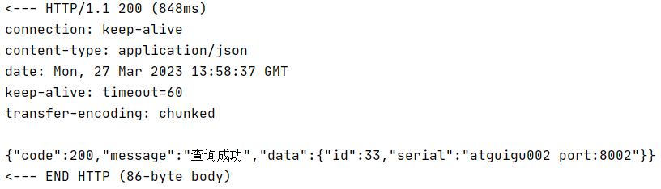

# 一、声明式远程调用
## 1、编程式远程调用
- 不使用框架：通过HttpClient等这样原生的API构造HTTP请求，非常繁琐。
- 使用框架：通过RestTemplate发送请求，比HttpClient肯定是简单，但是仍然不是最佳状态
	- 需要配置RestTemplate的bean，从而把RestTemplate加入IOC容器
	- 在配置RestTemplate的bean的时候，还需要通过@LoadBalanced注解启用负载均衡
	- 在RestTemplate请求地址这里使用微服务名称
	- 以上这些操作都和业务没有直接关系

## 2、声明式远程调用
把能够封装为统一、通用解决方案的功能交给框架，程序员专注于业务开发。<br/>
OpenFeign能够实现的效果就是：在调用远程方法时，就像调用本地方法一样。

# 二、基础操作
## 1、新建module
module名称：micro-service04-feign-order

### ①引入依赖
```xml
<dependencies>  
    <!--openfeign-->
    <dependency>
        <groupId>org.springframework.cloud</groupId>
        <artifactId>spring-cloud-starter-openfeign</artifactId>
    </dependency>
    <dependency>
        <groupId>org.springframework.cloud</groupId>
        <artifactId>spring-cloud-starter-netflix-eureka-client</artifactId>  
    </dependency>  
    <dependency>  
        <groupId>com.atguigu.cloud</groupId>  
        <artifactId>common-api</artifactId>  
        <version>1.0-SNAPSHOT</version>  
    </dependency>  
    <dependency>  
        <groupId>org.springframework.boot</groupId>  
        <artifactId>spring-boot-starter-web</artifactId>  
    </dependency>  
    <dependency>  
        <groupId>org.springframework.boot</groupId>  
        <artifactId>spring-boot-starter-actuator</artifactId>  
    </dependency>  
    <dependency>  
        <groupId>org.springframework.boot</groupId>  
        <artifactId>spring-boot-devtools</artifactId>  
        <scope>runtime</scope>  
        <optional>true</optional>  
    </dependency>  
    <dependency>  
        <groupId>org.projectlombok</groupId>  
        <artifactId>lombok</artifactId>  
        <optional>true</optional>  
    </dependency>  
    <dependency>  
        <groupId>org.springframework.boot</groupId>  
        <artifactId>spring-boot-starter-test</artifactId>  
        <scope>test</scope>  
    </dependency>  
</dependencies>
```

### ②YAML
```yaml
server:  
  port: 80  
spring:  
  application:  
    name: cloud-consumer-feign-order80  
eureka:  
  client:  
    register-with-eureka: true  
    fetch-registry: true  
    service-url:  
      defaultZone: http://localhost:7001/eureka
```

### ③主启动类
```java
@SpringBootApplication  
@EnableEurekaClient  
@EnableFeignClients  
public class FeignOrderMainType {  
  
    public static void main(String[] args) {  
        SpringApplication.run(FeignOrderMainType.class, args);  
    }  
  
}
```

### ④声明Feign接口
技巧：到Provider的Controller里复制接口方法的声明。
- 接口中和被调用的方法对应的方法建议直接从 Provider 那边复制过来，做一些调整即可
- 在调用目标方法时，不需要我们 Consumer 这边传入的参数去掉，其它声明保持一致即可
```java
package com.atguigu.springcloud.api;  
  
import com.atguigu.springcloud.entities.CommonResult;  
import com.atguigu.springcloud.entities.Payment;  
import org.springframework.cloud.openfeign.FeignClient;  
import org.springframework.web.bind.annotation.GetMapping;  
import org.springframework.web.bind.annotation.PathVariable;  
import org.springframework.web.bind.annotation.PostMapping;  
import org.springframework.web.bind.annotation.RequestBody;  
  
@FeignClient(value = "cloud-payment-service")  
public interface PaymentFeignService {  
  
    @GetMapping(value = "/payment/get/{id}")  
    CommonResult<Payment> getPaymentById(@PathVariable("id") Long id);  
  
    @PostMapping(value = "/payment/create")  
    CommonResult<Payment> create(@RequestBody Payment payment);  
  
}
```

### ⑤Controller类
```java
package com.atguigu.springcloud.controller;  
  
import com.atguigu.springcloud.api.PaymentFeignService;  
import com.atguigu.springcloud.entities.CommonResult;  
import com.atguigu.springcloud.entities.Payment;  
import org.springframework.beans.factory.annotation.Autowired;  
import org.springframework.web.bind.annotation.GetMapping;  
import org.springframework.web.bind.annotation.PathVariable;  
import org.springframework.web.bind.annotation.PostMapping;  
import org.springframework.web.bind.annotation.RestController;  
  
@RestController  
public class OrderController {  
  
    @Autowired  
    private PaymentFeignService paymentFeignService;  
  
    @PostMapping("/feign/payment/create")  
    public CommonResult<Payment> create(Payment payment){  
        return paymentFeignService.create(payment);  
    }  
  
    @GetMapping("/feign/payment/get/{id}")  
    public CommonResult<Payment> getPayment(@PathVariable("id") Long id){  
        return paymentFeignService.getPaymentById(id);  
    }  
}
```

# 三、日志打印
改变日志级别将会看到更多日志信息的打印。

## 1、Feign日志级别
- NONE：默认的，不显示任何日志
- BASIC：仅记录请求方式、URL、响应状态码及执行时间
- HEADERS：除了BASIC中定义的信息之外，还有请求和响应的头信息
- FULL：除了HEADERS中定义的信息之外，还有请求和响应的正文及元数据

## 2、配置日志bean
通过把这个bean加入IOC容器，就可以设置Feign的日志级别

```java
package com.atguigu.springcloud.config;  
  
import feign.Logger;  
import org.springframework.context.annotation.Bean;  
import org.springframework.context.annotation.Configuration;  
  
@Configuration  
public class FeignConfig {  
  
    @Bean  
    public Logger.Level feignLoggerLevel(){  
        return Logger.Level.FULL;  
    }  
}
```

## 3、指定打印日志的Feign接口
就是指定一下，我们哪一个组件需要打印日志
```yaml
logging:  
  level:  
    com.atguigu.springcloud.api.PaymentFeignService: debug
```

## 4、效果


# 四、超时时间
## 1、故障现象


## 2、设置参数
### ①基本设置
- Feign本身其实并不负责发送请求，Feign只是底层组件的封装
- Feign底层发送请求涉及到Ribbon和Hystrix两个组件
	- Ribbon负责根据服务名称找到服务实例信息列表
	- Hystrix负责判断是否需要执行熔断
- Ribbon参数设置：
	- ConnectTimeout：设定HTTP协议底层建立连接的超时时间
	- ReadTimeout：建立连接之后，在提供端读取资源的超时时间
	- MaxAutoRetries：在目标微服务集群中，当前正在访问的实例上，重试的最大次数。不包括首次调用
	- MaxAutoRetriesNextServer：在目标微服务集群中，当前正在访问的实例之外，其它实例上，重试的最大次数。不包括首次调用
	- OkToRetryOnAllOperations：是否在所有“请求方式”上都重试。如果设置为false，则仅在GET请求重试
		- GET：可以放心重试，没有限制
		- POST：满足幂等性要求才能重试
		- PUT：满足幂等性要求才能重试
		- DELETE：满足幂等性要求才能重试
- Hystrix参数设置：
	- enabled：开启超时控制功能
	- timeoutInMilliseconds：Hystrix限定的超时时间

```yaml
#设置Feign客户端超时时间（openfeign默认支持ribbon）  
ribbon:  
  ConnectTimeout: 3000  # 建立连接的超时时间
  ReadTimeout:  5000  # 建立连接后在提供端读取资源的超时时间
  MaxAutoRetries: 1 #同一台实例最大重试次数,不包括首次调用  
  MaxAutoRetriesNextServer: 1 #重试负载均衡其他的实例最大重试次数,不包括首次调用  
  OkToRetryOnAllOperations: false #是否所有操作都重试  
#hystrix的超时时间  
hystrix:  
  command:  
    default:  
      execution:  
        timeout:  
          enabled: true  # 开启超时控制功能
        isolation:  
          thread:  
            timeoutInMilliseconds: 9000 # 指定超时时间，需大于ribbon超时时间
```

### ②两套参数之间的关系
#### [1]超时后动作对比
- Ribbon超时：就Ribbon本身来说，不考虑Hystrix的熔断、降级方案，超时会报错。就像前面看到的那样。
- Hystrix超时：执行熔断、降级操作，执行兜底方案，给用户返回的响应比直接保存要好一些

所以相对来说，Hystrix是比Ribbon更宏观的控制。

#### [2]结论
- 思路1：让Ribbon的超时和重试机制充分发挥作用，那就不能让Ribbon的总超时时间超过Hystrix的超时时间
- 思路2：如果Ribbon在重试过程中，已经到达Hystrix指定的超时时间，那就不让Ribbon继续重试了。此时不需要把Ribbon的总超时时间限定在Hystrix的超时时间内

# 五、一个常见异常


Load balancer does not have available server for client

看到这样的错误，如果确信配置方面没有错，那么大部分情况是服务刚启动，在注册中心还没有注册好，等一会儿就行了。