# 一、简介
前四个字母分别为**Na**ming和**Co**nfiguration的前两个字母，最后的s为**S**ervice。意思是Nacos包含两方面功能：
- 注册中心
- 配置中心

# 二、部署Nacos服务器
## 1、下载安装包
下载地址：https://github.com/alibaba/nacos/releases/tag/1.4.2?spm=wolai.workspace.0.0.3fa542c9Jnvlni&file=1.4.2

## 2、解压
解压到非中文、无空格目录下。

## 3、启动
```bash
startup.cmd -m standalone
```

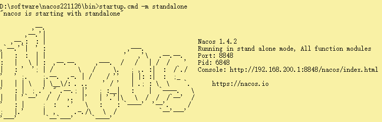

## 4、打开Nacos管理界面
访问地址：http://localhost:8848/nacos<br/>
用户名：nacos<br/>
密码：nacos<br/>

配置功能菜单项：<br/>


<br/>

服务功能菜单项：<br/>


# 三、在Nacos中注册服务
## 1、父工程增加依赖
```xml
<dependency>  
    <groupId>com.alibaba.cloud</groupId>  
    <artifactId>spring-cloud-alibaba-dependencies</artifactId>  
    <version>2.2.6.RELEASE</version>  
    <type>pom</type>  
    <scope>import</scope>  
</dependency>
```

## 2、服务提供端
### ①引入依赖
```xml
<dependencies>  
    <dependency>  
        <groupId>com.alibaba.cloud</groupId>  
        <artifactId>spring-cloud-starter-alibaba-nacos-discovery</artifactId>  
    </dependency>  
    <dependency>  
        <groupId>org.springframework.boot</groupId>  
        <artifactId>spring-boot-starter-web</artifactId>  
    </dependency>  
    <dependency>  
        <groupId>org.springframework.boot</groupId>  
        <artifactId>spring-boot-starter-actuator</artifactId>  
    </dependency>  
    <dependency>  
        <groupId>org.projectlombok</groupId>  
        <artifactId>lombok</artifactId>  
        <optional>true</optional>  
    </dependency>  
</dependencies>
```

### ②YAML配置
```yaml
server:  
  port: 9001  
  
spring:  
  application:  
    name: nacos-payment-provider  
  cloud:  
    nacos:  
      discovery:  
        server-addr: localhost:8848 # 配置Nacos地址
```

### ③主启动类
```java
package com.atguigu.springcloud.alibaba;  
  
import org.springframework.boot.SpringApplication;  
import org.springframework.boot.autoconfigure.SpringBootApplication;  
import org.springframework.cloud.client.discovery.EnableDiscoveryClient;  

// 开启注册中心客户端发现服务功能
@EnableDiscoveryClient  
@SpringBootApplication  
public class PaymentMain9001 {  
    public static void main(String[] args) {  
        SpringApplication.run(PaymentMain9001.class,args);  
    }  
}
```

### ④控制器
```java
package com.atguigu.springcloud.alibaba.controller;  
  
import org.springframework.beans.factory.annotation.Value;  
import org.springframework.web.bind.annotation.GetMapping;  
import org.springframework.web.bind.annotation.PathVariable;  
import org.springframework.web.bind.annotation.RestController;  
  
@RestController  
public class PaymentController{  
    @Value("${server.port}")  
    private String serverPort;  
  
    @GetMapping(value = "/payment/nacos/{id}")  
    public String getPayment(@PathVariable("id") Long id) {  
        return "nacos registry, serverPort: "+ serverPort+"\t id"+id;  
    }  
}
```

### ⑤测试效果


<br/>

为了后面测试Nacos负载均衡，复制Provider实例为集群：<br/>


## 3、服务消费端
### ①引入依赖
```xml
<dependencies>  
    <!--SpringCloud ailibaba nacos -->  
    <dependency>  
        <groupId>com.alibaba.cloud</groupId>  
        <artifactId>spring-cloud-starter-alibaba-nacos-discovery</artifactId>  
    </dependency>  
    <dependency>  
        <groupId>com.atguigu.cloud</groupId>  
        <artifactId>common-api</artifactId>  
        <version>1.0-SNAPSHOT</version>  
    </dependency>  
    <dependency>  
        <groupId>org.springframework.boot</groupId>  
        <artifactId>spring-boot-starter-web</artifactId>  
    </dependency>  
    <dependency>  
        <groupId>org.projectlombok</groupId>  
        <artifactId>lombok</artifactId>  
        <optional>true</optional>  
    </dependency>  
    <dependency>  
        <groupId>org.springframework.cloud</groupId>  
        <artifactId>spring-cloud-starter-openfeign</artifactId>  
    </dependency>  
</dependencies>
```

### ②YAML配置
```yaml
server:  
  port: 83  
  
spring:  
  application:  
    name: nacos-order-consumer  
  cloud:  
    nacos:  
      discovery:  
        server-addr: localhost:8848
```

### ③主启动类
```java
package com.atguigu.springcloud.alibaba;  
  
import org.springframework.boot.SpringApplication;  
import org.springframework.boot.autoconfigure.SpringBootApplication;  
import org.springframework.cloud.client.discovery.EnableDiscoveryClient;  
import org.springframework.cloud.openfeign.EnableFeignClients;  
  
@EnableFeignClients  
@EnableDiscoveryClient  
@SpringBootApplication  
public class OrderNacosMain83{  
    public static void main(String[] args){  
        SpringApplication.run(OrderNacosMain83.class,args);  
    }  
}
```

### ④Feign接口
```java
package com.atguigu.springcloud.alibaba.service;  
  
import org.springframework.cloud.openfeign.FeignClient;  
import org.springframework.web.bind.annotation.GetMapping;  
import org.springframework.web.bind.annotation.PathVariable;  
  
@FeignClient(value = "nacos-payment-provider")  
public interface PaymentFeignService {  
  
    @GetMapping(value = "/payment/nacos/{id}")  
    String getPayment(@PathVariable("id") Long id);  
  
}
```

### ⑤控制器
```java
package com.atguigu.springcloud.alibaba.controller;  
  
import com.atguigu.springcloud.alibaba.service.PaymentFeignService;  
import lombok.extern.slf4j.Slf4j;  
import org.springframework.beans.factory.annotation.Autowired;  
import org.springframework.web.bind.annotation.GetMapping;  
import org.springframework.web.bind.annotation.PathVariable;  
import org.springframework.web.bind.annotation.RestController;  
  
@RestController  
@Slf4j  
public class OrderNacosController{  
  
    @Autowired  
    private PaymentFeignService paymentFeignService;  
  
    @GetMapping(value = "/consumer/payment/nacos/{id}")  
    public String paymentInfo(@PathVariable("id") Long id){  
        return paymentFeignService.getPayment(id);  
    }  
  
}
```

### ⑥测试效果
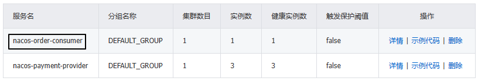

业务功能测试访问地址：http://localhost:83/consumer/payment/nacos/55

# 四、在Nacos中配置服务
## 1、Nacos中配置信息的逻辑结构
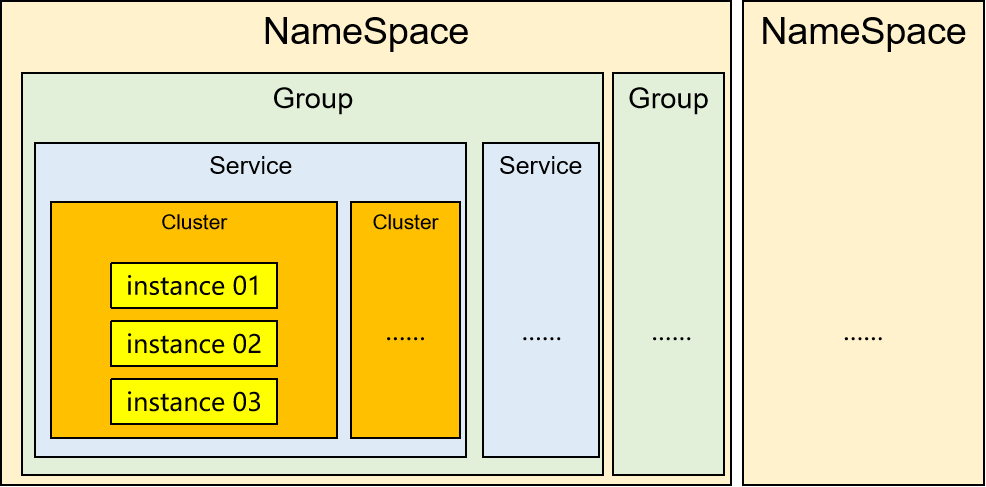

<p>看了上面这张图，我们了解到各个概念之间的包含关系。那么它们怎么对应实际开发过程中的项目呢？</p>

|Nacos配置|实际开发项目结构|
|---|---|
|NameSpace|不同服务器环境。<br/>例如：生产环境、测试环境、开发环境。|
|Group|微服务分组，也就是把相关功能的微服务归为一组。<br/>例如：电商服务组、库存服务组、物流服务组。|
|Service|具体的某一个微服务。|
|Cluster|具体微服务的集群。<br/>但是为什么有多个？<br/>为了容灾，一个大型项目可能会在不同地方的机房部署多个集群。<br/>例如：广州机房、杭州机房、北京机房。<br/>这样做有利于不同微服务识别到它们在同一个区域（同一个机房），进而在同一个区域内互相调用，提高效率。|
|instance|微服务集群中的一个实例。|

## 2、创建配置
### ①操作界面
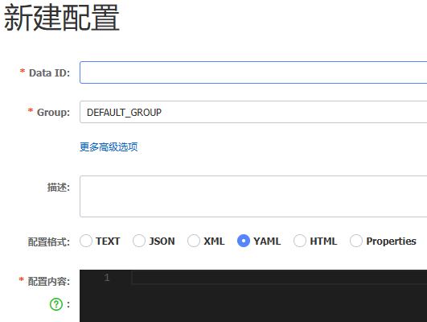

### ②Data ID
#### [1]作用
Data ID有两方面的作用：
- 作为当前配置信息的唯一标识
- 绑定具体的微服务

#### [2]设定格式
为了让Data ID能够精准的绑定到微服务，它有着非常严格的格式要求：
```text
${prefix}-${spring.profiles.active}.${file-extension}
```

实际举例：
```text
nacos-payment-provider-dev.yaml
```

下面分别解释一下每个部分的含义和对应关系：
##### <1>prefix
默认为 `spring.application.name` 的值，也可以通过配置项 `spring.cloud.nacos.config.prefix`来修改。

##### <2>spring.profiles.active
<p>当前环境对应的 profile，详情可以参考 [Spring Boot文档](https://docs.spring.io/spring-boot/docs/current/reference/html/boot-features-profiles.html#boot-features-profiles)。 **注意：当 `spring.profiles.active` 为空时，对应的连接符 `-` 也将不存在，dataId 的拼接格式变成 `${prefix}.${file-extension}`**</p>
<p>这就是说：Nacos的微服务配置可以精确到每个不同的profile。</p>

##### <3>file-exetension
<p>为配置内容的数据格式，可以通过配置项 `spring.cloud.nacos.config.file-extension` 来配置。目前只支持 `properties` 和 `yaml` 类型。</p>
<p>`yaml`类型两种都可以：yaml、yml</p>

### ③举个例子
#### [1]预期效果
<p>在Nacos创建配置项之后，只要在Nacos中进行修改，对应的微服务不需要重启就直接按照新的配置工作。</p>
<p>当然，像server.port这样的配置不重启不行。</p>

#### [2]微服务端
##### <1>增加依赖
```xml
<dependency>  
    <groupId>com.alibaba.cloud</groupId>  
    <artifactId>spring-cloud-starter-alibaba-nacos-config</artifactId>  
</dependency>
```

##### <2>新建配置文件
<p>文件名：bootstrap.yaml</p>
<p>为什么要创建这个配置文件呢？</p>
<p>Nacos和Netflix系列中的组件：Config一样，在项目初始化时，要先从配置中心拉取配置，才能保证项目的正常启动。</p>
<p>SpringBoot中配置文件的加载是存在优先级顺序的，bootstrap.yaml优先级高于application.yaml。</p>
```yaml
server:  
  port: 3377  
  
spring:  
  application:  
    name: nacos-config-client  
  cloud:  
    nacos:  
      discovery:  
        server-addr: localhost:8848 #服务注册中心地址  
      config:  
        server-addr: localhost:8848 #配置中心地址  
        file-extension: yaml #指定yaml格式的配置（yml和yaml都可以）
```

##### <3>application.yml
```yaml
spring:  
  profiles:  
    active: dev
```

##### <4>读取配置
```java
@Value("${atguigu.config.content}")  
private String configContent;
```

##### <5>自动更新配置
在读取配置的类上，使用注解：
```java
@RestController  
@RefreshScope  
public class PaymentController{  
    @Value("${server.port}")  
    private String serverPort;  
  
    @Value("${atguigu.config.content}")  
    private String configContent;

	// ...
```

#### [3]Nacos端
##### <1>Data ID
套用格式：
```text
${prefix}-${spring.profiles.active}.${file-extension}
```

具体值：
```text
nacos-config-client-dev.yaml
```

##### <2>创建配置信息
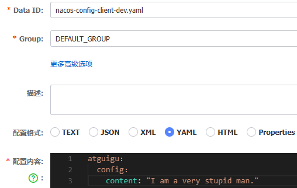

<br/>

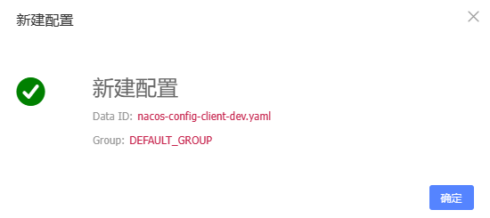
<br/>


#### [4]测试
- 访问Controller方法，看看能不能获取到配置信息
- 在Nacos上修改配置信息，看是否实时更新

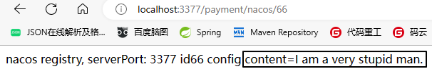

<br/>

在Nacos上修改配置之后：<br/>


并没有重启微服务。

## 3、创建名称空间
### ①创建名称空间
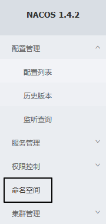

<br/>


<br/>


<br/>


### ②在名称空间下新建配置


<br/>

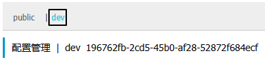

<br/>


<br/>

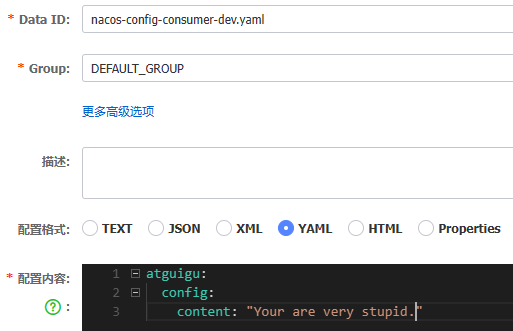


### ③在微服务中指定所属名称空间
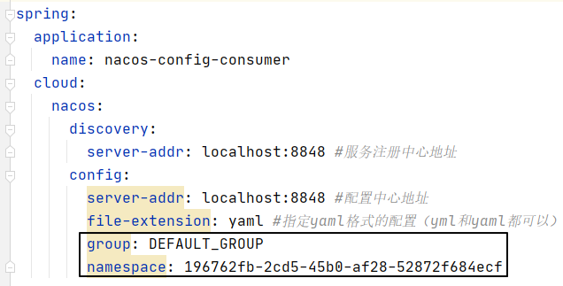


## 4、Nacos持久化
### ①建库建表
执行SQL语句，建库建表：<br/>

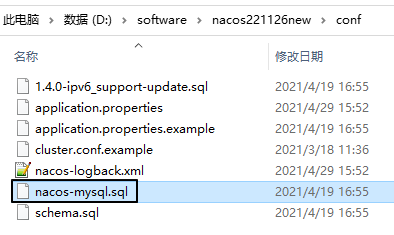

### ②配置Nacos数据源
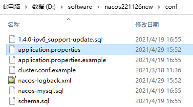

```properties
#*************** Config Module Related Configurations ***************#
### If use MySQL as datasource:
# spring.datasource.platform=mysql
spring.datasource.platform=mysql

### Count of DB:
# db.num=1
db.num=1

### Connect URL of DB:
# db.url.0=jdbc:mysql://127.0.0.1:3306/nacos?characterEncoding=utf8&connectTimeout=1000&socketTimeout=3000&autoReconnect=true&useUnicode=true&useSSL=false&serverTimezone=UTC
# db.user.0=nacos
# db.password.0=nacos
db.url.0=jdbc:mysql://192.168.200.100:63306/nacos_config?characterEncoding=utf8&connectTimeout=1000&socketTimeout=3000&autoReconnect=true&useUnicode=true&useSSL=false&serverTimezone=UTC
db.user.0=root
db.password.0=atguigu
```

### ③测试
- 创建一个新的配置
- 到MySQL中查看是否进行了保存。查看表：config_info

## 5、Nacos集群
### ①复制解压目录
例如：
- nacos18848
- nacos28848
- nacos38848

### ②集群配置文件
#### [1]修改现有配置文件
每个实例解压目录/conf/application.properties
```properties
# 修改当前实例监听的端口号
server.port=18848

# 指定 MySQL 数据库的连接信息（集群模式运行的时候必须使用一个统一的数据源）
#*************** Config Module Related Configurations ***************#
### If use MySQL as datasource:
# spring.datasource.platform=mysql
spring.datasource.platform=mysql

### Count of DB:
# db.num=1
db.num=1

### Connect URL of DB:
# db.url.0=jdbc:mysql://127.0.0.1:3306/nacos?characterEncoding=utf8&connectTimeout=1000&socketTimeout=3000&autoReconnect=true&useUnicode=true&useSSL=false&serverTimezone=UTC
# db.user.0=nacos
# db.password.0=nacos
db.url.0=jdbc:mysql://192.168.200.100:63306/nacos_config?characterEncoding=utf8&connectTimeout=1000&socketTimeout=3000&autoReconnect=true&useUnicode=true&useSSL=false&serverTimezone=UTC
db.user.0=root
db.password.0=atguigu
```

#### [2]新建集群配置
把cluster.conf.example复制出来，改名叫：cluster.conf
```properties
localhost:18848
localhost:28848
localhost:38848
```

### ③启动集群实例
- Windows系统：运行startup.cmd
- Linux系统：startup.sh

### ④查看集群节点


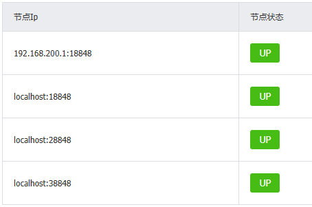

### ⑤Nginx配置参考
```text
upstream nacoscluster{ 
    server 192.168.137.150:8848;
    server 192.168.137.150:8849;
    server 192.168.137.150:8850;
}

server{               
    listen 1111;
    server_name 192.168.137.150;
    location / {
         proxy_pass http://nacoscluster;                        
    }
....省略  
```