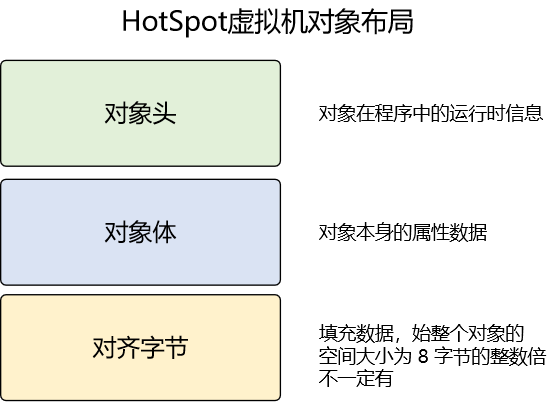
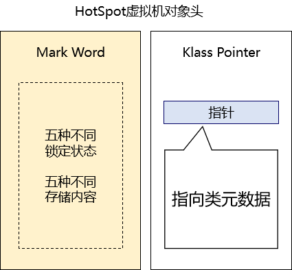
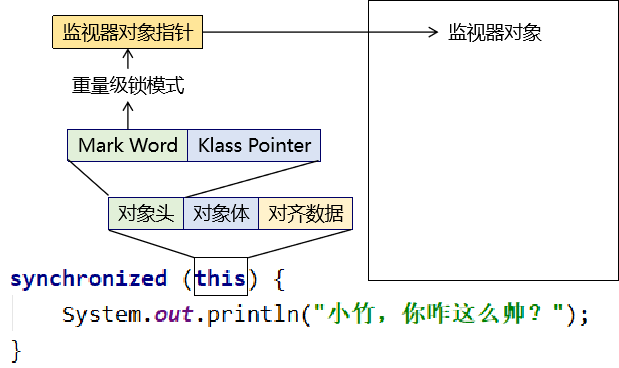
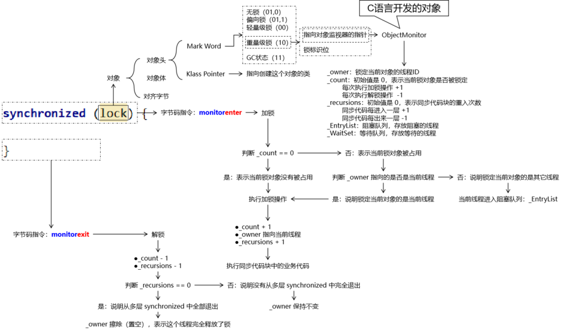
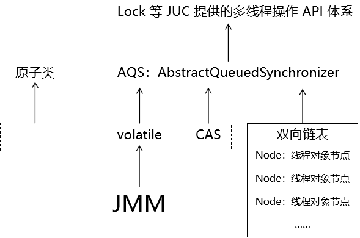
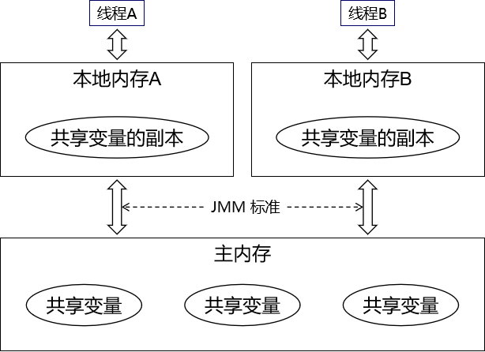

# 一、多线程相关概念
## 1、程序、进程和线程
- 程序：静态的概念，基于特定功能开发的软件。
- 进程：动态的概念，运行起来的程序。
- 线程：一个进程需要同时处理很多个任务，那么就可以分配给多个线程来分别执行。从这个角度来看，进程可以看做是线程的容器。

## 2、串行、并行、并发
- 串行：多个操作在一个线程中按顺序执行
- 并行：多个任务分别交给多个线程执行，而且每一个线程都对应一个CPU核心，没有线程间切换
- 并发：多个任务分别交给多个线程执行，但是多个线程由同一个CPU核心执行，每个线程都需要等CPU时间片，存在线程之间的切换

# 二、多线程开发基础
## 1、创建多线程
### ①继承Thread类
- 操作：
	- 声明一个类，继承Thread类
	- 重写run()方法，包含新线程中要执行的代码
	- 创建这个类的对象
	- 调用对象的start()方法
- 问题：
	- Java是单继承的，继承了Thread类就不能继承其它类，可能会导致无法实现需求功能

### ②实现Runnable接口
- 操作：
	- 声明一个类，实现Runnable接口
	- 实现run()方法，包含新线程中要执行的代码
	- 创建这个类的对象
	- 调用对象的start()方法
- 问题：
	- run()方法没有返回值：不便于获取线程计算的结果
	- run()方法没有声明抛出异常：导致实现类实现run()的过程中，不能声明抛出异常，只能try...catch

### ③Callable接口+FutureTask类
- 操作：
	- 在Callable接口中封装线程任务，实现call()方法
	- 把Callable接口类型的对象传入FutureTask类的构造器
	- 把FutureTask类的对象传入Thread类的构造器
	- 调用Thread对象的start()方法启动线程
	- 调用FutureTask对象的get()方法获取对应线程的执行结果。在get()还没有获取到目标线程执行结果的时候，调用get()方法的那个线程会被阻塞
- 问题：主要体现在java.util.concurrent.Future接口的局限性
	- get()方法带有阻塞效果，本质上是同步操作。但是本来Callable接口+FutureTask类组合的初衷是异步操作。
	- cancel()方法能够结束一个线程，但是并不能提供一个降级、兜底的方案，对调用者来说非常不友好。

### ④CompletableFuture
- 操作：
	- 创建线程池对象：按照我们的需求指定参数
	- 把线程中要执行的任务封装到指定接口类型的对象中
	- 调用CompletableFuture的静态方法获取CompletableFuture对象
	- 如有需要可以调用CompletableFuture对象的方法进行进一步处理
	- 后续方法返回的还是CompletableFuture对象本身，所以支持连缀调用
- 功能：
	- 创建一个新的、无返回值的任务交给CompletableFuture执行
	- 创建一个新的、有返回值的任务交给CompletableFuture执行
	- 在前面任务的基础上再执行一个后续任务（可同步，可异步）：
		- 消费型：接收前面任务的结果，但是当前任务无返回结果
			- CompletableFuture调用thenAccept()方法
			- 函数式接口：java.util.function.Consumer
		- 函数型：接收前面任务的结果，而且当前任务有返回结果
			- CompletableFuture调用thenApply()方法
			- 函数式接口：java.util.function.Function
		- 过程型：既不接收前面任务结果，当前任务也无返回结果
			- CompletableFuture调用thenRun()方法
			- 函数式接口：java.lang.Runnable
	- 后续处理：
		- 单纯处理异常：exceptionally()
			- 仅在前面任务抛出异常时执行
			- 接收前面任务抛出的异常（相当于捕获了异常）
			- 返回当前任务相同或子类类型（返回兜底值，让调用者可以继续执行）
		- 做最终处理：handle()
			- 不论前面任务是否抛出异常都会执行
			- 前面任务抛异常：则获取异常对象
			- 前面任务未抛出异常：则获取前面任务执行结果
		- 以同步方式获取任务结果：get()方法
			- 带有阻塞效果，如果目标任务没有结束，那么get()方法会一直阻塞
			- 主线程调用get()方法，等待目标任务完成
			- 目标任务完成后，get()方法返回
			- 主线程拿到get()方法的返回值，继续执行后续操作
		- 以异步回调方式获取任务结果：whenComplete()方法
			- 主线程调用whenComplete()方法
			- 调用whenComplete()方法时传入java.util.function.BiConsumer对象
			- 这就相当于把『BiConsumer对象』和『目标任务完成事件』绑定到了一起
			- 当触发『目标任务完成事件』时，就会调用『BiConsumer对象』的accept()方法
			- 此时调用accept()方法就不是在主线程中执行了，而是另外的线程
			- 所以主线程调用whenComplete()方法完成『绑定』操作之后，就不需要等目标任务完成了，就可以继续执行后续的其它操作
			- 小结1：因为调用accept()方法是其它线程，所以是『异步』的
			- 小结2：因为我们声明的accept()方法不是我们调用，而是系统调用的，所以叫『回调』
			- 小结3：正因为有了exceptionally()、whenComplete()等这一类功能强大的方法，所以我们才说CompletableFuture是对Future接口的重大改进

### ⑤面试题
请说说创建多线程有哪几种方式？
- 基本方式四种：
	- 继承Thread类
	- 实现Runnable接口
	- Callable接口+FutureTask
	- 线程池
- 框架：在基本方式的基础上进一步做了封装
	- CompletableFuture
	- ForkJoin
	- Spring中的@Async注解标记的方法实现异步调用
	- 定时任务
	- StreamAPI中的并行计算
	- ……

## 2、synchronized同步锁用法
### ①同步代码块
- 锁对象：任意的Java对象即可
- 锁定范围：一对大括号之间
```java
synchronized(锁对象) {

}
```

### ②同步方法
- 锁对象：
	- 非静态的同步方法：this
	- 静态的同步方法：类.class
- 锁定范围：整个方法
```java
public synchronized void doSthBad() {

}

public static synchronized void doSthGood() {

}
```

## 3、Lock系列API用法
### ①加锁、解锁
- 接口类型：java.util.concurrent.locks.Lock
- 常用实现类类型：java.util.concurrent.locks.ReentrantLock
```java
// 1、获取锁对象
Lock lock = new ReentrantLock();

try{

	// 2、加锁
	lock.lock();

	// 3、同步代码
	// ...

}catch(Exception e){

}finally{

	// 4、解锁
	lock.unlock();

}
```

### ②读写锁
#### [1]线程之间
- 读锁和读锁之间是可以共享的，仅排斥写操作。读锁是共享锁。
- 写锁排斥其它线程的读和写。写锁是独占锁。

#### [2]线程内部
- 读锁和写锁都支持可重入
- 读锁不能升级为写锁：小权限升级为大权限
- 写锁内可以再加读锁：大权限范围内做小权限操作

### ③公平锁
- 内部机制：在锁上等待时间最长的线程，下一次获取锁时有最高优先级
- 执行效果：如果加了锁的部分的代码执行时间一样，那么每一轮执行的过程中，获取到锁的线程的顺序是一样的
- 局限：吞吐量要小于非公平锁，性能较低
```java
Lock lock = new ReentrantLock(true);
```

### ④Lock接口定义的各个方法
- lock()：执行加锁操作，如果锁被占用，则一直等待直到获取锁成功
- lockInterruptibly()：
	- 执行加锁操作，如果锁被占用，则一直等待直到获取锁成功
	- 但是在等待锁释放的阻塞过程中，阻塞状态可以被打断，被打断会抛出异常
- tryLock()：尝试加锁，只尝试一次，没有任何等待时间
	- 返回true：说明加锁成功
	- 返回false：说明加锁失败
- tryLock(long time, TimeUnit unit)：尝试加锁，但是会等待一定时间
	- 返回true：说明加锁成功
	- 返回false：说明加锁失败
- unlock()：解锁

### ⑤小工具
- CountDownLatch
	- 设定一个任务数量
	- 这个数量的任务每完成一个调用一次countDown()方法
	- 设定任务全部完成才执行被await()抑制的最后一步
- CyclicBarrier
	- 设定一个任务数量
	- 各个任务执行到一个特定位置的时候，调用await()抑制后续操作
	- 所有任务都执行到这个await()抑制位置的时候，一起放行去执行后续操作
- Semaphore
	- 帮助我们管理有限的资源
	- 申请到资源就使用资源
	- 没有申请到就等待
	- 别人释放了，你申请到了就可以执行
- ForkJoin
	- Fork：递归拆分任务
	- Join：递归合并任务
- CompletableFuture
	- Java代码中封装多线程的终极解决方案

## 4、线程间通信
### ①传统方式
- 加锁：使用synchronized
- 通信：调用锁对象的wait()方法，让当前线程进入等待状态
- 通信：调用锁对象的notify()方法，让随机唤醒一个等待中的线程
- 通信：调用锁对象的notifyAll()方法，唤醒全部等待中的线程
- 虚假唤醒：使用 while 判断
```java
// 使用 if 进行判断，只判断一次。如果当前线程被唤醒时仍然需要继续wait()，
// 但是由于 if 只执行一次，所以不会再次判断。
// 造成的结果是：在不该做后续操作的情况下，执行了后续操作，导致数据不一致
if (当前线程是否要进入等待状态判断) {
	this.wait();
}

// 后续操作……
```

```java
// 使用 while 进行判断，不会只判断一次。
// 线程被唤醒后，还会再次判断，如果条件成立，则继续wait()
// 确保在正确的时机执行后续操作
while (当前线程是否要进入等待状态判断) {
	this.wait();
}

// 后续操作……
```

### ②JUC方式
- 常规操作：
	- 加锁：Lock对象加锁
	- 通信：需要使用Condition对象
		- 调用Condition对象的await()方法：让当前线程进入等待
		- 调用Condition对象的signal()方法：唤醒一个等待中线程
		- 调用Condition对象的signalAll()方法：唤醒全部等待中线程
- 定制化通信：
	- 每一个线程分配一个专门的Condition对象
	- 使用这个专门的Condition对象可以精准的控制具体某一个线程

# 三、多线程理论
## 1、线程生命周期
参考Thread类内部的枚举类：State
- NEW：新建状态。线程对象刚刚创建出来，但是还没有调用start()方法。
- RUNNABLE：就绪状态。线程对象调用了start()方法，等待CPU时间片。
- RUNNING（目前JDK版本中，State里已经没有这个值）：运行状态。线程得到了CPU时间片正在执行。
	- 遇到了synchronized且没得到锁，那么进入阻塞状态：BLOCKED
	- 遇到了锁对象调用wait()，那么进入等待状态（需要其它线程唤醒）：WAITING
	- 遇到了锁对象调用wait(timeout)或Thread.sleep(timeout)，那么进入超时等待状态：TIMED_WAITING
- TERMINATED：终止状态。线程执行完代码或抛异常。

## 2、锁重入
### ①概念
同一个线程，在已经得到一个锁之后，又遇到了同一个锁对象加的锁：
```java
synchronized (this) {
	synchronized (this) {
	
	}
}
```

### ②锁重入的必然性
- 对method02()来说，它自身的业务要求必须加同步锁
- method02()需要加同步锁这个特性不能依赖于外部调用它的外部方法
	- 虽然method01()调用method02()可以提供同步锁，
	- 但是method03()调用method02()时不提供同步锁。
- 所以当method02()自己必须加同步锁时，再被另一个也加了同步锁的方法调用，就会产生锁重入
```java
public void method01() {
	synchronized (this) {
		method02();
	}
}

public void method02() {
	synchronized (this) {
	
	}
}

public void method03() {
	method02();
}
```

### ③锁重入的要求
同一个线程已经加了同步锁，然后在后面执行过程中又遇到同一个锁对象加的同步锁，此时可以直接得到锁，而不必等待锁释放。<br/>
锁重入对synchronized和Lock系列API都是同样的要求。

## 3、锁膨胀
### ①需求背景
从JDK 1.6开始，synchronized底层原理引入锁膨胀机制。<br/>
原因是：如果申请锁的线程只有一个，不存在竞争，那么就没必要执行加锁、解锁操作。<br/>
所以在只有一个线程的情况下，不需要执行加锁、解锁操作，节约性能。<br/>

### ②各个状态
|状态名称|锁标识位|是否偏向|含义|
|---|---|---|---|
|无锁状态|01|0|没有线程来申请锁|
|偏向锁状态|01|1|当前有且只有一个线程来申请锁|
|轻量级锁状态|00|~|当前有且只有一个线程来申请锁<br/>和偏向锁的区别是：轻量级锁表示曾经有别的线程申请过，且同步代码已执行完<br/>所以现在确实没有竞争。|
|重量级锁状态|10|~|当前有多个线程申请锁，存在竞争|
|GC状态|11|~|当前对象被标记为垃圾，等待垃圾回收|

### ③特性
- 不可逆：锁膨胀过程逐步升级，不会从重量级锁回到轻量级锁。
- 可以回到无锁状态：虽然不可逆，但是如果在重量级锁状态下，没有任何线程申请锁，回到无锁状态。

### ④锁自旋
- 发生的时机：在轻量级锁状态下，A线程还没有执行完同步代码，此时又有B线程来申请锁。
- 为了在升级到重量级锁之前再争取一下，所以让B线程再多等一会儿。
- B线程在这里等待的时候，执行一些无意义的代码——这个过程我们称之为锁自旋。
- 锁自旋结束后，看A线程：
	- A线程执行完同步代码：自旋成功，B线程进去执行。
	- A线程没有执行完同步代码：自旋失败，B线程进入阻塞状态，轻量级锁升级到重量级锁。
- 锁自旋并不保证成功。
- 为了提高锁自旋的成功率，引入自适应自旋：参考上一次自旋成功的自旋次数。

## 4、对象存储结构
以HotSop虚拟机为例来说。<br/>

### ①总体结构


### ②对象体
一个对象中的业务属性。
```java
public class Person{

	private Integer personId;
	private String personName;
	private Integer personAge;

}
```

### ③对象头
- 如果是数组，还会有一个数组长度。



### ④Mark Word
- 同一时刻只可能是五种状态中的一种，所以没必要把空间分成五份来保持。
- 是什么状态，就按照这个状态的结构保存数据。

|状态名称|锁标识位|是否偏向|含义|
|---|---|---|---|
|无锁状态|01|0|没有线程来申请锁|
|偏向锁状态|01|1|当前有且只有一个线程来申请锁|
|轻量级锁状态|00|~|当前有且只有一个线程来申请锁<br/>和偏向锁的区别是：轻量级锁表示曾经有别的线程申请过，且同步代码已执行完<br/>所以现在确实没有竞争。|
|重量级锁状态|10|~|当前有多个线程申请锁，存在竞争|
|GC状态|11|~|当前对象被标记为垃圾，等待垃圾回收|

### ⑤对象监视器
- 当锁对象在锁膨胀过程中，膨胀到了重量级锁状态
- Mark Word中就会维护一个指针指向对象监视器



对象监视器中的关键属性如下：<br/>

|属性名|作用|
|---|---|
|\_count|表示当前锁对象是否被占用。默认值是0，执行加锁操作+1|
|\_recursions|表示锁重入的层次。默认值是0，重入一次+1|
|\_owner|指向占用当前锁的线程的指针。|
|\_EntryList|申请锁失败的线程存放的集合。|
|\_WaitSet|集合，存放线程间通信时调用wait()方法进入等待状态的线程。|

## 5、synchronized底层原理
- 加锁：对应字节码指令monitorenter
	- 先找到对象监视器
	- 检查对象监视器的_count属性，看是否为0
		- 为0：说明当前锁对象没有被线程占用
			- \_count+1
			- \_recursions+1
			- \_owner指向当前线程
			- 执行同步代码
		- 非0：说明当前锁对象被某个线程占用
			- 进一步检查看是否是锁重入：\_owner是否执行当前线程自己
				- 是：说明发生了锁重入，\_recursions+1，执行同步代码
				- 否：说明锁对象被其它线程占用，当前线程阻塞，进入\_EntryList集合中
- 解锁：对应字节码指令monitorexit
	- 先找到对象监视器
	- \_count-1
	- \_recursions-1
	- 检查\_recursions是否为0
		- 为0：之前即使有很多层重入的同步代码块也已经都退出了，可以正式释放锁
			- \_owner属性设置为空（擦除）
		- 非0：说明前面重入的同步代码还没有全部退出，所以先不做正式释放

总图：<br/>



## 6、Lock系列API底层原理
### ①技术体系


### ②JMM
Java Memory Model：Java内存模型。<br/>

#### [1]硬件发展不平衡
内存的读写速度跟不上CPU速度。<br/>
为了最大限度发挥CPU的性能，硬件体系就在CPU和内存之间，增加了多级缓存（通常是三级），通常也成为高速缓存。<br/>
- 离CPU越近的缓存速度越快，材料越贵，容量越小
- 离CPU越远的缓存速度越慢，材料越贱，容量越大

#### [2]缓存一致性协议
有了缓存之后，就必须面对一个问题：缓存中数据和内存中数据不一致。<br/>
为了解决这个问题，就必须给CPU指令的执行做出限定。于是就有了『缓存一致性协议』。

#### [3]对Java的影响
JVM的组成部分中，也有对应高速缓存的组件。<br/>



JVM给每个线程提供了一个『本地内存（也叫工作内存）』空间。
- 线程读写数据都是在本地内存中执行。
- 本地内存再和主内存进行数据同步。
	- 读数据：先从主内存读取到本地内存，然后再给CPU使用。
	- 写数据：CPU的计算结果，先写入本地内存，然后再写回主内存。
- 本地内存是线程私有的，每个线程都无法读写其它线程的本地内存。
- JVM结构中的本地内存对应硬件体系中的高速缓存。
- 那么就会和硬件体系一样，存在缓存不一致问题。
- 为此，JVM设定了JMM标准，避免缓存不一致。

### ③JMM三大特性
#### [1]原子性
- 概念：某个指令是否还可以再分。如果不能再分则说它具备原子性。
- 例如：a=5;赋值操作满足原子性。
- 例如：a++;操作不满足原子性，因为它包含a+1和赋值一共两个操作。
- 在并发情况下，不满足原子性的操作会导致数据运算错误。
- 对于不满足原子性的操作，或多行代码，我们可以通过加同步锁，让它们成为一个逻辑上的整体
- 这个逻辑上的整体每次只能有一个线程进来执行，从效果上相当于具备了原子性
- 当然，加同步锁并不是实现原子性的唯一办法
	- 例如：CopyOnWrite技术
	- 例如：原子类
- 原子类中没有加同步锁，它内部是通过volatile和CAS的配合保证了数据计算的正确。

#### [2]可见性
- 本地内存在各线程之间都是彼此隔离的，所以要看到其它线程的计算结果就必须读取主内存。
- 而如果某个线程没有重新读取主内存，那么它就看不到别人做的修改。
- 这就是可见性问题。

#### [3]有序性
- 为了提高性能，JVM或CPU在执行指令时，会调整指令顺序——指令重排。
- 但是随意调整指令顺序，会导致计算结果错误。
- 所以指令重排操作有一个刚性的大前提，就是必须保证计算结果正确。
- 所以从开发层面是感觉不到的。

### ④volatile关键词
#### [1]从JMM三大特性角度来看
- 原子性：volatile并不能提供原子性
- 可见性：volatile可以提供可见性保证
	- 读取volatile修饰的成员变量：要求把工作内存中的数据置为无效，强制要求读取主内存
	- 修改volatile修饰的成员变量：要求在工作内存修改完成后立即写回主内存
- 有序性：volatile会导致底层指令添加内存屏障，禁止局部的指令重排，从而对有序性有一定影响

#### [2]小结
- volatile不能修饰局部变量，只能修饰成员变量
- volatile最重要的功能就是为变量提供可见性保证

#### [3]应用场景
volatile和CAS机制配合，实现计算过程的非阻塞同步。
- 不需要阻塞线程，但是数据计算结果正确。

### ⑤CAS机制
#### [1]概念
CAS：Compare And Swap比较并交换

#### [2]工作机制
- CAS是针对内存地址执行数据的修改
- 所以修改时需要提供三个数据
	- 内存地址
	- 新值：你希望把数据修改成一个什么值
	- 旧值：你认为当前内存地址中，数据现在是什么值
- 比较操作：旧值和当前内存地址的实际值比较
	- 一致：允许修改
	- 不一致：不能修改
- CAS通常会配合自旋：如果不允许修改，则读取当前内存地址实际的值，作为旧值，再次尝试修改

### ⑥AQS机制
AQS是AbstractQueuedSynchronizer的缩写。
#### [1]内部结构
- state：表示锁释放被线程占用
	- state是volatile修饰的
	- state的修改都是用CAS方式修改的
- Node：表示双向链表中一个具体节点
	- prev：指向上一个节点
	- next：指向下一个节点
	- thread：指向当前节点内封装的线程对象
	- 上面三个属性都是volatile修饰的

#### [2]执行流程
- 加锁流程
	- 首先检查state是否为0
		- 为0：说明锁没有被线程占用
			- 通过CAS的方式修改state，如果修改成功则说明加锁成功
		- 非0：说明锁被线程占用了
			- 检查当前线程和现在独占锁的线程是否是同一个线程
				- 是：说明锁重入，再次设置state
				- 否：说明确实被其它线程占用，当前线程封装到Node对象中，加入双向链表
- 解锁流程
	- 从state中减去相应的值（和加锁时对称）
	- 通过state做减法之后的结果判定是否所有重入的锁都退出了
		- 是：那么就把独占锁这里属性置空
		- 否：表示重入锁没有完全退出

## 7、并发容器
### ①List集合
- 非同步容器：以ArrayList为典型代表，建议在单线程场景下使用
- 同步容器：以Vector、SynchronizedList为典型代表，不建议使用
- 并发容器：以CopyOnWriteArrayList为典型代表，建议在并发读写的场景下使用
	- 基于写时复制技术
	- 写时复制技术关键点在于：
		- 读操作不加任何锁
		- 写操作首先把存放数据的数组复制一份
		- 在复制出来的新数组中执行写操作
		- 写操作完成，再用新数组覆盖旧数组，旧数组等待GC

### ②Set集合
- 非同步容器：以HashSet为典型代表，建议在单线程场景下使用
- 同步容器：以SynchronizedSet为典型代表，不建议使用
- 并发容器：以CopyOnWriteArraySet为典型代表，建议在并发读写场景下使用
	- 基于写时复制技术

### ③Map集合
- 非同步容器：以HashMap为典型代表，建议在单线程场景下使用
- 同步容器：以SynchronizedMap为典型代表，不建议使用
- 并发容器：以ConcurrentHashMap为典型代表，建议在并发读写场景下使用
	- 基于锁分段技术

> 面试题：如果让你设计一款服务注册中心，你会有什么想法？<br/>
> 答：内部数据结构需要使用Map类型。<br/>
> Map的key是微服务名称；Map的value是微服务信息对象。<br/>
> 又因为注册中心面临的情况是并发读写，所以需要使用ConcurrentHashMap。

## 8、线程池
### ①为什么要使用线程池
- 为了实现对象复用：避免重复执行创建、清理操作带来的性能开销
	- 创建对象
	- 清理对象空间（GC）
- 为了对对象有一个有效的管理：设定最大对象数量，避免内存溢出

### ②线程池创建
- 不要使用JDK自带的工具类：Executors
- 建议使用ThreadPoolExecutor，构造器需要指定七个参数：
	- corePoolSize：核心线程数
	- maximumPoolSize：最大线程数
	- long keepAliveTime：非核心线程最大空闲时间
	- TimeUnit unit：非核心线程最大空闲时间的单位
	- BlockingQueue workQueue：存放等待中任务的等待队列
	- ThreadFactory threadFactory：创建线程对象的工厂对象
	- RejectedExecutionHandler handler：拒绝策略

### ③线程池内部机制
#### [1]初始状态
线程池对象刚刚创建出来时，里面一个线程都没有。【反直觉】

#### [2]第一个任务到来
这个任务不需要进入等待队列，线程池会创建一个线程对象来执行这个任务。

#### [3]继续增加任务
继续创建线程执行任务，直到线程数量达到了『核心线程数』。

#### [4]继续增加任务
此时存放等待中任务的阻塞队列未满，所以不创建『非核心线程』，任务进入等待队列。【反直觉】

#### [5]等待队列已满
此时需要创建『非核心线程』，执行最新的任务而不是等待时间最长的任务。【反直觉】
- A 请求：已等待5秒  体验差（即使现在处理这个请求，也没办法变成好体验）
- B 请求：已等待3秒  体验差
- C 请求：已等待2秒  体验差
- D 请求：刚过来    体验好（能捞一个算一个，不然这个请求体验也变差了）

#### [6]继续增加任务
线程池内，线程数量达到最大线程数，且等待队列已满——此时到达了线程池工作能力的极限。<br/>
此时再增加任务就会触发拒绝策略。
- AbortPolicy：抛异常 java.util.concurrent.RejectedExecutionException
- CallerRunsPolicy：返回给调用者。例如：main线程分配的任务无法执行，就返回给main线程。
- DiscardOldestPolicy：抛弃等待时间最长的任务。
- DiscardPolicy：随机抛弃任务。

#### [7]任务慢慢减少
- 『非核心线程』达到最大空闲时间会被释放。
- 『核心线程』不考察最大空闲时间，会被保留下来。

### ④最佳实践
#### [1]把『核心线程数』和『最大线程数』设定为相等
避免『非核心线程』创建了释放、释放了又创建
	
#### [2]『最大线程数』基于 CPU 核心数量来设置
比如：设置为 CPU 核心数量的两倍。<br/>
最理想的状态：每一个 CPU 核心执行一个线程，没有线程之间的切换。<br/>
最大负载的状态：每一个 CPU 核心执行两个线程，充分利用 CPU 资源。<br/>
不合理设置：一个 CPU 核心执行的线程数量过多，线程之间切换、阻塞等等状态浪费了大量性能。<br/>

举例：
- 串行操作：100ms
	- 第一步：20ms
	- 第二步：50ms
	- 第三步：30ms

- 并行操作：50ms
	- 第一步 A线程：20ms
	- 第二步 B线程：50ms
	- 第三步 C线程：30ms

- 并发操作：>100ms
	- 100ms是执行代码的时间，多出来的是线程上下文切换的时间