# 一、数据库概述

<br/>

## 1、为什么要使用数据库

Java程序在运行过程中，数据在内存中维护。而一旦程序结束，内存释放，内存中所有数据都会丢失。<br/>
所以必须使用数据库把数据保存到硬盘上，做永久保存。这个效果我们称之为：持久化。<br/>
那么为什么不使用I/O流的方式来做持久化呢？<br/>
通过I/O流操作硬盘上的文件读写效率太低。其实数据库表本身就是硬盘上的文件，但由于数据库表中的数据都是结构化的，所以通过数据库来操作效率高很多。<br/>

<br/>

## 2、MySQL简介

在互联网行业，MySQL数据库毫无疑问已经是最常用的数据库。<br/>
MySQL数据库由瑞典MySQL AB公司开发。<br/>
公司名中的“AB”是瑞典语“aktiebolag”股份公司的首字母缩写。<br/>
该公司于2008年1月16号被Sun（Stanford University Network）公司收购。<br/>
然而2009年，SUN公司又被Oracle收购。<br/>
因此，MySQL数据库现在隶属于Oracle（甲骨文）公司。<br/>
MySQL中的“My”是其发明者（Michael Widenius，通常称为Monty）根据其女儿的名字来命名的。<br/>
对这位发明者来说，MySQL数据库就仿佛是他可爱的女儿。<br/><br/>

MySQL的优点有很多，其中主要的优势有如下几点：

- **可移植性**：MySQL数据库几乎支持所有的操作系统，如Linux、Solaris、FreeBSD、Mac和Windows。
- **免费**：MySQL的社区版完全免费，一般中小型网站的开发都选择 MySQL 作为网站数据库。
- **开源**：2000 年，MySQL公布了自己的源代码，并采用GPL（GNU General Public
  License）许可协议，正式进入开源的世界。开源意味着可以让更多人审阅和贡献源代码，可以吸纳更多优秀人才的代码成果。
- **关系型数据库**：MySQL可以利用标准SQL语法进行查询和操作。
- **速度快、体积小、易使用**
  ：与其他大型数据库的设置和管理相比，其复杂程度较低，易于学习。MySQL的早期版本（主要使用的是MyISAM引擎）在高并发下显得有些力不从心，随着版本的升级优化（主要使用的是InnoDB引擎），在实践中也证明了高压力下的可用性。从2009年开始，阿里的“去IOE”备受关注（I是IBM，O是Oracle，E是EJB），淘宝DBA团队再次从Oracle转向MySQL，其他使用MySQL数据库的公司还有Facebook、Twitter、YouTube、百度、腾讯、去哪儿、魅族等等，自此，MySQL在市场上占据了很大的份额。
- **安全性和连接性**：十分灵活和安全的权限和密码系统，允许基于主机的验证。连接到服务器时，所有的密码传输均采用加密形式，从而保证了密码安全。由于MySQL是网络化的，因此可以在因特网上的任何地方访问，提高数据共享的效率。
- **丰富的接口**：提供了用于C、C++、Java、PHP、Python、Ruby和Eiffel、Perl等语言的API。
- **灵活**：MySQL并不完美，但是却足够灵活，能够适应高要求的环境。同时，MySQL既可以嵌入到应用程序中，也可以支持数据仓库、内容索引和部署软件、高可用的冗余系统、在线事务处理系统等各种应用类型。
- **存储引擎架构**：MySQL最重要、最与众不同的特性，这种架构的设计将查询处理（Query Processing）及其他系统任务（Server
  Task）和数据的存储/提取相分离。这种处理和存储分离的设计可以在使用时根据性能、特性，以及其他需求来选择数据存储的方式。MySQL中同一个数据库，不同的表格可以选择不同的存储引擎。其中使用最多的是InnoDB
  和MyISAM，MySQL5.5之后InnoDB是默认的存储引擎。

<br/>

针对不同用户，MySQL提供三个不同的版本：

- （1）MySQL Enterprise Server（**企业版**）：能够以更高的性价比为企业提供数据仓库应用，该版本需要付费使用，官方提供电话技术支持。
- （2）MySQL Cluster（**集群版**）：MySQL 集群是 MySQL 适合于分布式计算环境的高可用、高冗余版本。它采用了 NDB Cluster 存储引擎，允许在
  1 个集群中运行多个 MySQL 服务器。它不能单独使用，需要在社区版或企业版基础上使用。
- （3）MySQL Community Server（**社区版**）：在开源GPL许可证之下可以自由的使用。该版本完全免费，但是官方不提供技术支持。本书是基于社区版讲解和演示的。在MySQL
  社区版开发过程中，同时存在多个发布系列，每个发布处在不同的成熟阶段。

<br/>

MySQL版本说明：

- MySQL5.7：在MySQL大版本为5的范围内，5.7是最后一个版本。
- MySQL8：相对于5.7有很多重大更新，所以不再以小版本更新，而是作为大版本更新。所以7后面的8不再作为小版本，而是作为大版本出现。

<br/>

# 二、MySQL数据库安装

<br/>

## 1、客户端和服务器

- 客户端：为用户提供操作界面
- 服务器：通过网络连接，为所有客户端提供服务

<br/>

## 2、使用MySQL的总的体系结构


<br/>
<br/>


<br/>

## 3、卸载MySQL服务器

> 你要是以前安装过，而且现在能用，那就不要卸载，因为我们的重点是 SQL 语句的编写而不是 MySQL 的安装过程。<br/>
> 如果MySQL上的数据仍需使用，则必须提前备份。

<br/>


<br/>


<br/>

删除MySQL安装目录和数据目录。如果数据还需要使用则必须提前备份。

<br/>

清理注册表：

<br/>


<br/>


<br/>


<br/>


<br/>

删除path环境变量：

<br/>


<br/>

<br/>

## 4、安装MySQL服务器

双击运行：mysql-installer-community-8.0.26.0.msi<br/>

<br/>


<br/>


<br/>


<br/>


<br/>


<br/>


<br/>


<br/>


<br/>

<br/>

## 5、MySQL实例初始化


<br/>


<br/>


<br/>

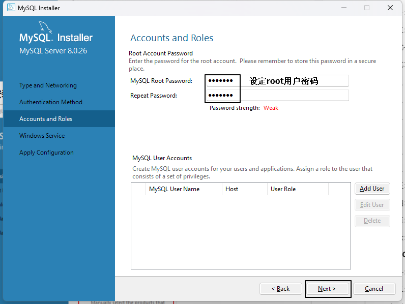

<br/>


<br/>


<br/>


<br/>


<br/>

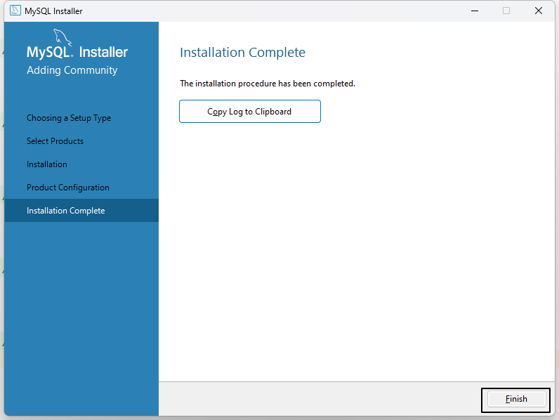

<br/>

<br/>

## 6、MySQL配置环境变量


<br/>

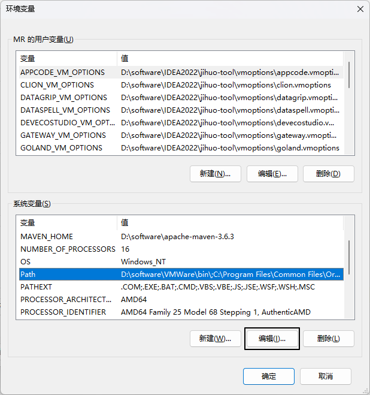

<br/>


<br/>


<br/>

<br/>

## 7、MySQL客户端

<br/>

### ①命令行客户端

<br/>

#### [1]使用

只要正确完成以上步骤，命令行客户端就是可用的，无需额外安装。

<br/>


<br/>

<br/>

#### [2]登录

```shell
# 语法格式：mysql -h 主机名 -P 端口号 -u 用户名 -p密码
mysql -h localhost -P 3306 -u root -p
Enter password:****
```

<br/>

|参数| 含义       |含义|默认值|
|---|----------|---|---|
|-h| host     |用来指定MySQL服务器的主机地址|localhost|
|-P| port     |用来指定MySQL服务器的端口号|3306|
|-u| user     |用来指定登录MySQL时使用的用户名|&nbsp;|
|-p| password |用来指定登录MySQL时使用的密码。<br/>最好在下一行输入，让密码隐藏。|&nbsp;|

<br/>

当参数使用默认值时，这个参数可以省略。所以连接本机3306的MySQL服务器时登录命令可以简化为：
```shell
mysql -u root -p
Enter password:****
```

<br/>

<br/>

#### [3]操作

成功登录MySQL服务器之后，使用SQL语句操作MySQL数据库以及里面存储的数据。

<br/>


<br/>

命令行客户端的缺点在于没有提示，不够直观，所以往往还需要图形化界面客户端。图形化界面客户端有很多，找到你自己顺手的工具即可，具体用哪个都行，不是每一个都要装。

<br/>

### ②IDEA客户端
<br/>

#### [1]连接


<br/>

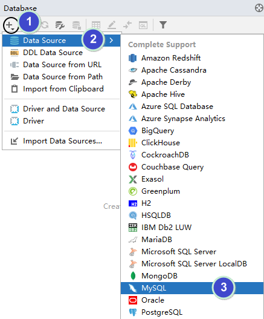

<br/>


<br/>


<br/>


<br/>


<br/>

<br/>

### ③SQLyog社区版
<br/>

#### [1]安装
运行：SQLyog-13.1.7-0.x64Community.exe

<br/>


<br/>


<br/>


<br/>


<br/>


<br/>


<br/>


<br/>

<br/>

#### [2]连接


<br/>


<br/>


<br/>


<br/>

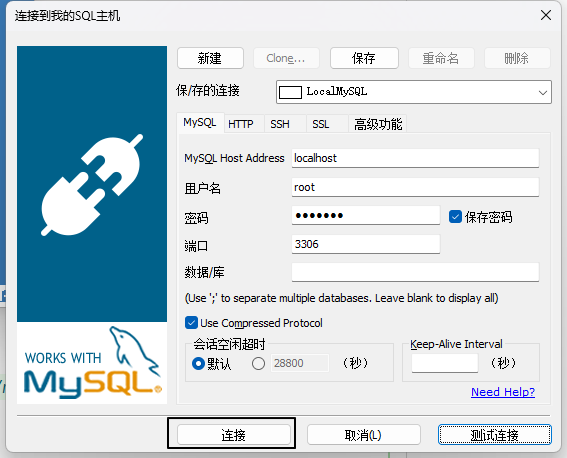

<br/>


<br/>


<br/>

<br/>

#### [3]操作

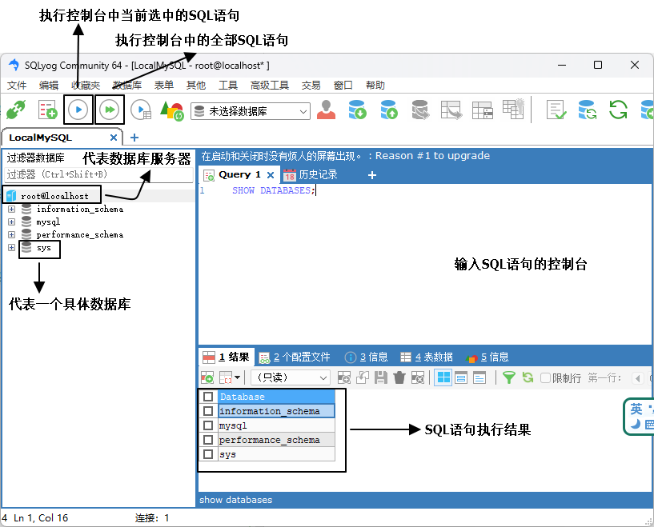

<br/>

<br/>

# 三、SQL基础语法
<br/>

## 1、SQL简介
SQL是结构化查询语言（Structured Query Language）的缩写，是一种用于管理关系型数据库的语言。<br/>
它可以用来创建、修改和查询数据库中的表、视图、存储过程和触发器等对象。<br/>
SQL是一种标准化的语言，被广泛应用于各种关系型数据库管理系统，如MySQL、Oracle、SQL Server等。<br/>
SQL语言具有简单易学、高效灵活、可扩展性强等特点，是数据管理领域中必不可少的工具之一。<br/>


<br/>

## 2、SQL分类
SQL (Structured Query Language) 是一种用于管理关系数据库系统 (RDBMS) 的编程语言。根据其用途和特点，SQL 可以分为以下几类：
- **DDL** (Data Definition Language **数据定义语言**)：用于定义数据库对象，如表、视图、索引等，常用的语句有 CREATE、ALTER、DROP 等。
- **DML** (Data Manipulation Language **数据操作语言**)：用于对数据库中的数据进行操作，如增加、修改、删除等，常用的语句有 INSERT、UPDATE、DELETE 等。
- **DQL** (Data Query Language **数据查询语言**)：用于查询数据库中的数据，常用的语句有 SELECT。
- **DCL** (Data Control Language **数据控制语言**)：用于控制数据库的访问权限和安全性，如授权、回收权限等，常用的语句有 GRANT、REVOKE 等。
- **TCL** (Transaction Control Language **事务控制语言**)：用于控制事务的提交和回滚，常用的语句有 COMMIT、ROLLBACK 等。

<br/>

## 3、SQL语法规范
<br/>

### ①大小写
SQL 关键词、数据库名、数据库表名、字段名都**不区分大小写**。

<br/>

### ②标识符命名规则
- 可以使用的符号包括：
  - 26个大小写英文字母
  - 数字0-9
  - 下划线
- 不能使用其它符号，可以用数字开头，但不能是纯数字
- 域内不同名
  - 同一个MySQL服务器上：数据库名必须唯一
  - 同一个数据库内：表名必须唯一
  - 同一个表内：字段名必须唯一

<br/>

### ③标识符命名规范
- 不建议以数字开头
- 因为SQL中不区分大小写，所以建议各个单词以下划线分开
- 不建议使用SQL关键词作为标识符（为什么说“不建议”而不是“不允许”呢？因为使用`符号（可称之为飘号）可以让SQL把关键词当做普通字符串）
- 在SQL中使用`符号（可称之为飘号）把数据库名、表名、字段名引起来，可以避免解析SQL时把标识符当做SQL关键词

<br/>

## 4、SQL注释
<br/>

### ①井号单行注释
```sql
# 单行注释，注释里的内容不会被执行
insert into t_emp(emp_name, emp_salary) VALUES ("tom", 12345.6);
```

<br/>

### ②双横线单行注释
```sql
-- 单行注释，注释里的内容不会被执行
insert into t_emp(emp_name, emp_salary) VALUES ("tom", 12345.6);
```

<br/>

### ③多行注释
```sql
/*
 多行注释，注释里的内容不会被执行
 多行注释，注释里的内容不会被执行
 多行注释，注释里的内容不会被执行
 */
insert into t_emp(emp_name, emp_salary) VALUES ("tom", 12345.6);
```

<br/>

## 5、MySQL数据类型初步
<br/>

### ①概述
我们现在最重要的并不是学习MySQL全部的数据类型，而应该是学习MySQL最常用的数据类型，然后对基本增删改查操作有了一定基础之后，再学习数据类型进一步的知识作为扩展。
- 整数类型：int
- 字符串类型：
  - char
  - varchar
- 小数类型：double

<br/>

### ②char类型
char类型是一种固定长度字符串。<br/>
什么意思呢？<br/>
就是说我们在把一个字段指定为char类型的时候，需要指定这个字段最多允许存放多少个字符：char(M)。<br/>
就好比char(4)表示最多存储4个字符，那么当字段值不够4个字符时，会在后面附加空格填充到4个字符。<br/>
从而确保这个字段中所有值都是4个字符。这就是所谓的固定长度字符串。<br/>
附加的空格在查询的时候会被去掉。<br/>
M的范围是0~255。当然char(0)这样的字段创建出来也没意义。<br/>

<br/>

### ③varchar类型
varchar类型是一种变长字符串。<br/>
我们在设定中同样会指定使用varchar类型的字段最多存放多少个字符：varchar(M)。<br/>
但和char的区别是，底层存储时并不是使用固定的字节数，而是根据实际存储的数据动态调整。<br/>
假设M设定为5：varchar(5)表示该字段最多保存5个字符。<br/>
再假设每个字符占一个字节（其实不一定），那么这个字段最多占5个字节。<br/>
那么当这个字段实际保存3个字符时，底层实际分配3个字节来存储这3个字符。

<br/>

## 6、数据库操作
<br/>

### ①查看所有数据库
```sql
# 列出当前数据库服务器上已经创建的所有数据库
show databases;
```

<br/>

### ②创建新的数据库
```sql
create database db_school;
```

<br/>

### ③删除数据库
```sql
drop database db_school;
```

<br/>

### ④指定当前要使用的数据库
由于一个服务器上可以有很多个数据库，所以我们需要明确指定一个现在要使用的数据库。<br/>
如果没有使用use语句，后面针对数据库的操作也没有加“数据库名”的限定，那么会报“ERROR 1046 (3D000): No database selected”（没有选择数据库）<br/>
使用完use语句之后，如果接下来的SQL都是针对一个数据库操作的，那就不用重复use了，如果要针对另一个数据库操作，那么要重新use。<br/>
```sql
use db_hr;
```

<br/>

### ⑤查看当前数据库中的所有数据库表
```sql
show tables;
```

<br/>

## 7、创建数据库表
<br/>

### ①基本语法


<br/>

### ②主键
<br/>

#### [1]提出问题
为什么需要主键？假设我们要给入学的学生录入信息，同时有两个tom，年龄都是15，录入下表后无法区分：
```sql
create table t_student(
    stu_name char(10),
    stu_age int
);
```

<br/>

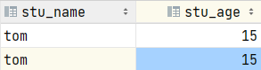

<br/>

所以我们需要在创建数据库表时，用主键作为每一条记录的**唯一标识**。

<br/>

#### [2]主键的要求
我们对主键的要求是：
- 非空：在数据库表中主键字段非常重要，它是区分每一条记录的根本依据，所以绝对不能为空。
- 唯一：为了能够区分每一条记录，所以主键值在数据库表中必须是唯一的。
- 不可修改：作为每一条记录的唯一标识，一旦修改就可能导致这条记录找不到。但是这个要求是对我们编写代码的要求，MySQL没有这个限制。

<br/>

#### [3]不要使用业务字段作为主键
什么是业务字段呢？在我们的项目中所有描述现实世界的都是业务字段。例如：学生姓名、年龄、性别、籍贯、身高、体重……<br/>
为什么不能使用业务字段作为主键呢？<br/>
即使使用唯一性的业务字段作为主键也不建议，因为业务字段可能为空，也可能删除导致表没有主键。<br/>

<br/>

#### [4]设定主键的语法


<br/>

### ③主键自增
为了保证主键值的唯一性（不重复），所以在数据库表层面为每一条新增的记录生成主键是最好的办法。<br/>
如果由程序员在Java程序中生成主键值，那么并发场景下A线程计算出来是5，B线程也计算出来是5，就重复了。<br/>
具体来说，在创建表时可以通过auto_increment关键词设置某个字段的值由MySQL生成，程序员不必指定。<br/>

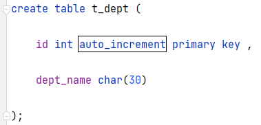

<br/>

### ④查看表结构
```sql
desc 表名;
```

<br/>

## 8、基础增删改查操作
先创建库和表做准备：
```sql
create database db_hr;
use db_hr;
create table t_emp(
    id int auto_increment primary key ,
    emp_name char(100),
    emp_age int,
    emp_salary double
);
```

<br/>

### ①insert语句


<br/>

```sql
# 插入一条数据，主键因为是自增的，所以不必指定数据了
insert into t_emp(emp_name, emp_age, emp_salary) VALUES ("tom",25,5000.00);

# 插入多条数据
insert into t_emp(emp_name, emp_age, emp_salary) VALUES ("jerry",35,6000.00), ("bob", 24, 3400.00), ("harry", 86, 6000.00);
```

<br/>

### ②delete语句
```sql
# 删除数据库表中的所有数据，但是这样做太危险了，几乎不可能发生在实际项目中
delete from t_emp;

# 根据查询条件指定要删除的记录，通常是根据主键来删除。where关键词后面通过表达式来构建查询条件，后面会详细讲
delete from t_emp where id=2;
```

<br/>

### ③update语句
在指定数据库表中修改指定字段
```sql
# 把 t_emp 表中的 emp_salary 字段设置为新值，但是这样会影响到所有记录
update t_emp set emp_salary=66666.66;

# 使用 where 子句设置查询条件，有针对性的修改
update t_emp set emp_salary=66666.66 where id=3;
```

<br/>

### ④select语句
在指定数据库表中查询指定字段
```sql
# 查询 t_emp 表中的全部记录，每条记录都显示全部字段
select * from t_emp;

# 查询 t_emp 表中的全部记录，每条记录只显示指定字段
select id, emp_name, emp_salary from t_emp;

# 查询 t_emp 表中符合查询条件的记录，每条记录只显示指定字段
select id, emp_name, emp_salary from t_emp where id=3;
```

<br/>

> 实际开发中不要采用select \*的写法，因为这样不知道具体查询了哪些字段。<br/>
> 时间一长，别说别人，自己都不记得。

<br/>

## 9、运算符与表达式

<br/>

### ①算术运算符

|符号|说明|
|---|---|
|+|在MySQL中，加号就是求和，没有字符串拼接的功能|
|-|做减法|
|\*|做乘法|
|/|做除法|
|div|做除法，但只保留商的整数部分|
|%|取模|
|mod|取模|

<br/>

**注意**：MySQL中没有+=这样的写法。

### ②比较运算符

|符号|说明|
|---|---|
|&gt;|大于|
|&lt;|小于|
|&gt;=|大于或等于|
|&lt;=|小于或等于|
|=|等于|
|!=|不等于|
|&lt;&gt;|不等于|

<br/>
**注意**：=是做是否相等的判断，不是赋值。<br/>
**注意**：不能写 xxx = null，此时要写 xxx is null<br/>
**注意**：!=或&lt;&gt;也不能用于对null值进行判断，而是要写成 xxx is not null<br/>

### ③区间或集合范围比较运算符
- 查询在区间范围的记录：between x and y
- 查询不在区间范围的记录：not between x and y
- 查询在集合范围的记录：in (x,y,z)
- 查询不在集合范围的记录：not in (x,y,z)

### ④模糊匹配比较运算符

|符号|说明|
|---|---|
|%|表示这里可以匹配任意数量的任意字符|
|\_|每一个下划线匹配一个任意字符|

### ⑤逻辑运算符

|符号|说明|
|---|---|
|&&|逻辑与|
|and|逻辑与|
|\|\||逻辑或|
|or|逻辑或|
|!|逻辑非|
|xor|逻辑异或|

### ⑥关于null值
#### [1]null值的判断
```sql
xxx is null;
xxx is not null;
xxx <=> null;
```

#### [2]null值的计算
调用ifnull()函数，在某条记录中某个字段值为null时，使用替代值来计算：
```sql
ifnull(xxx,替代值)
```


# 四、SQL进阶语法

<br/>

## 1、SQL查询语句的各子句
- (1)select
- (2)from：从哪些表中筛选
- (3)inner|left|right ...  on：关联多表查询时，去除笛卡尔积
- (4)where：从表中筛选的条件
- (5)group by：分组依据
- (6)having：在分组统计结果中再次筛选（with rollup)
- (7)order by：排序
- (8)limit：分页

必须按照从(1)到(8)的顺序编写各子句。


## 2、关联查询

<br/>

### ①概念
当A表通过某个字段关联到B表时，我们说A表和B表之间建立了关联关系。<br/><br/>

当我们根据表之间的关联关系，在查询中涉及多张表时，就是关联查询。<br/><br/>

比如：员工表通过部门编号关联部门表。<br/><br/>

关联字段需要满足以下条件：
- 逻辑意义一样
- 数据类型一样

<br/>

以下两方面不要求：
- 字段名不要求一样
- 创建外键约束不要求

### ②关联查询的各种情况


<br/>

### ③关联查询的语法要求
联合查询必须写关联条件，关联条件的个数 = n - 1。n是联合查询的表的数量。<br/>
- 如果2个表一起联合查询，关联条件数量是1， 
- 如果3个表一起联合查询，关联条件数量是2， 
- 如果4个表一起联合查询，关联条件数量是3， 
- 以此类推。。。。 
如果不指定连接条件，就会出现笛卡尔积现象，这是应该避免的。<br/>
所谓笛卡尔积就A表中每条记录都关联B表中的每条记录，既不符合逻辑，又会导致查询结果数据量暴增。<br/><br/>

关联条件可以用on子句编写，也可以写到where中。<br/>
但是建议用on单独编写，可读性更好。<br/>
每一个join后面都要加on子句：
- A inner|left|right join B on 条件
- A inner|left|right join B on 条件 inner|left|right jon C on 条件

### ④SQL实现
#### [1]内连接
- 语法：A表 inner join B表 on 连接条件
- 执行结果：A表 ∩ B表

<br/>

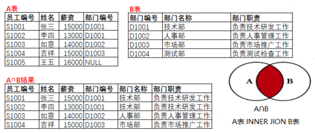

<br/>

如果遇到：“Column 'did' in field list is ambiguous”的错误提示，就是说两张表的同名字段必须加别名。

<br/>

#### [2]左外连接
- 语法：A表 left join B表 on 连接条件
- 执行结果：
	- A表全部
	- A表 - A∩B

<br/>


<br/>


<br/>

#### [3]右外连接
- 语法：A表 right join B表 on 连接条件
- 执行结果：
	- B表全部
	- B表 - A∩B

<br/>

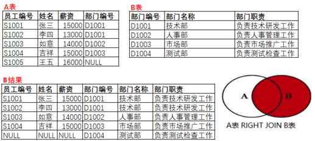

<br/>


<br/>

#### [4]全外连接
- 语法：full outer join ... on，但是MySQL不支持这个关键字，MySQL使用union（合并）结果的方式代替
- 执行结果：A表 ∪ B表
- MySQL替代方案：A表查询语句 union B表查询语句

<br/>

union的语法细节：
- 参与union的查询语句，输出的字段必须是一样的
- UNION ALL合并不去重
- UNION合并且去重

<br/>


<br/>

```sql
#查询所有员工和所有部门，包括没有指定部门的员工和没有分配员工的部门。 
SELECT * FROM t_employee LEFT JOIN t_department 
ON t_employee.did = t_department.did

UNION 

SELECT * FROM t_employee RIGHT JOIN t_department 
ON t_employee.did = t_department.did;
```

<br/>

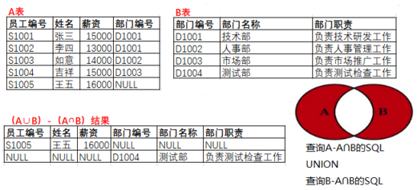

<br/>

```sql
#查询那些没有分配部门的员工和没有指定员工的部门，即A表和B表在对方那里找不到对应记录的数据。
SELECT *
FROM t_employee LEFT JOIN t_department
ON t_employee.did = t_department.did
WHERE t_employee.did IS NULL

UNION 

SELECT *
FROM t_employee RIGHT JOIN t_department
ON t_employee.did = t_department.did
WHERE t_employee.did IS NULL;
```

<br/>

#### [5]自连接
一张表自己和自己关联，物理上来说是同一张表，逻辑上当作两张表来写SQL。
```sql
/*
分析表结构：t_employee表
mid：是表示存储员工的领导编号。即该员工归谁管。领导编号其实就是“领导”作为员工身份的员工编号
   例如：eid为3的员工邓超远，他的mid是7，表示他的领导是员工编号为7的员工。
   eid为7的员工是贾宝玉，他的eid是7，贾宝玉作为员工来说，他的编号是7。

mid的取值范围受到eid字段的限制。mid的值选择必须是eid现有值范围。

可以理解为mid和eid是关联字段，如果要建外键，可以在mid字段上建外键。
foreign key(mid) references t_employee(eid)   

此时t_employee既是子表也是父表。
员工表t_employee建立了外键：
CONSTRAINT `t_employee_ibfk_3` FOREIGN KEY (`mid`) REFERENCES `t_employee` (`eid`) ON DELETE SET NULL ON UPDATE CASCADE
*/

#查询每一个员工自己的编号、名字、薪资和他的领导的编号、姓名、薪资。
#把t_employee当成两张表，通过取别名的方式
#t_employee AS emp 把员工表 当成员工表
# t_employee AS mgr 把员工表  当成存储领导信息的领导表
#emp.mid = mgr.eid; 员工表的领导编号就是领导表的员工编号
SELECT emp.eid,emp.ename,emp.salary,  mgr.eid,mgr.ename,mgr.salary
FROM t_employee AS emp INNER JOIN t_employee AS mgr
ON emp.mid = mgr.eid;
```

<br/>

#### [6]小结


<br/>

## 3、分组与聚合查询

<br/>

### ①分组的概念
根据某个（或某几个）字段的值，把查询结果分组，指定字段的值相同的划分到同一组。<br/>
例如：根据部门id分组<br/>


<br/>

### ②聚合的概念
分组之后，一个组内很可能包含很多条数据，而最终的查询结果中，一个组只生成一条记录。<br/>
所以问题来了，组内多条记录怎么压缩成一条？<br/>
两个办法：
- 情况一：某个字段在组内所有记录中的值都是一样的，那就可以直接用。
- 情况二：使用聚合函数。

<br/>

### ③练习案例一
目标：查询各部门员工的平均工资。<br/>

```sql
select avg(emp_salary), dept_id from t_emp group by dept_id;
```

<br/>

### ④练习案例二
目标：得到各部门平均工资之后显示合计数值
```sql
select avg(emp_salary), dept_id from t_emp group by dept_id with rollup ;
```

<br/>

### ⑤练习案例三
目标：先按照部门分组，在部门分组结果内再按照专业分组
```sql
select avg(emp_salary), emp_subject, dept_id  
from t_emp  
group by dept_id, emp_subject;
```

### ⑥练习案例四
目标：查询各部门平均工资，要求显示部门名称。
```sql
select avg(emp_salary), d.dept_id, dept_name  
from t_emp e  
         left join t_dept d on e.dept_id = d.dept_id  
group by dept_id;
```

### ⑦练习案例五
关于分组、聚合操作时涉及的查询条件，原则是：能在分组、聚合操作前执行的查询条件就在操作前执行。因为查询条件把不满足条件的数据过滤掉之后，分组、聚合操作运算量更小，效率更高。
- 分组、聚合操作前执行的查询条件：where子句
- 分组、聚合操作后执行的查询条件：having子句
```sql
# 分组、聚合操作前过滤数据：针对所有女员工数据根据部门 id 分组  
select avg(emp_salary), dept_id, emp_gender  
from t_emp  
where emp_gender = 'female'  
group by dept_id;  
  
# 分组、聚合操作后过滤数据：显示平均工资大于4000的聚合结果  
select avg(emp_salary) emp_avg_salary, dept_id  
from t_emp  
group by dept_id  
having emp_avg_salary > 4000;
```

## 4、子查询

<br/>

### ①概念
嵌套在另一个SQL语句中的查询。select、update、delete、insert、create等语句都可以嵌套子查询。

<br/>

### ②select嵌套子查询

<br/>

```sql
select emp_id,   
       emp_name,   
       emp_salary,   
       emp_salary - (select avg(emp_salary) from t_emp) difference  
from t_emp;
```

<br/>

### ③where嵌套子查询
where子句中嵌入子查询肯定是

<br/>

<br/>

### ④having嵌套子查询

<br/>

### ⑤EXISTS型子查询

<br/>

### ⑥from嵌套子查询

<br/>

### ⑦update嵌套子查询

<br/>

### ⑧delete嵌套子查询

<br/>

### ⑨使用子查询复制表

<br/>

## 5、排序

<br/>

## 6、分页

<br/>

## 7、系统函数

<br/>

# 五、约束

<br/>

# 六、事务

<br/>

# 七、MySQL字符集与比较规则

<br/>

# 八、选学内容

<br/>

## 1、MySQL数据类型进阶
VARCHAR格式最大长度的计算方式
在MySQL中，VARCHAR是一种变长字符串类型，可以存储长度可变的字符数据。如果您使用的是InnoDB存储引擎，那么VARCHAR字段的最大长度取决于当前行格式和字符集。

具体来说，如果当前行格式为Compact，同时字符集为utf8mb4，那么VARCHAR类型最多能够保存3072/4=768个字符。这是因为，在utf8mb4字符集下，一个字符最多占用4个字节，而Compact行格式最大记录长度为3072字节，因此，最多可以存储3072/4=768个字符。

需要注意的是，这个字符数限制还要考虑到填充（padding）和存储引擎的头部信息（header information），实际可用长度可能会更少。因此，在设计表格结构时，应该根据实际需要来选择合适的VARCHAR类型长度，以防止数据被截断。

查看当前行格式和字符集
要查看当前的行格式和字符集，可以使用以下命令：
```sql
SHOW TABLE STATUS FROM databasename WHERE Name='tablename';
```

其中，databasename和tablename分别表示要查询的数据库名和表名。执行该命令后，在结果中会列出该表的详细信息，包括行格式、字符集等。

例如，下面是一个示例输出：
```sql
+----------+--------+---------+------------+-------+----------------+-------------+-----------------+--------------+-----------+----------------+---------------------+---------------------+------------+-----------------+----------+----------------+---------+
| Name     | Engine | Version | Row_format | Rows  | Avg_row_length | Data_length | Max_data_length | Index_length | Data_free | Auto_increment | Create_time         | Update_time         | Check_time | Collation       | Checksum | Create_options | Comment |
+----------+--------+---------+------------+-------+----------------+-------------+-----------------+--------------+-----------+----------------+---------------------+---------------------+------------+-----------------+----------+----------------+---------+
| mytable  | InnoDB |      10 | Compact    | 10000 |            120 |     1257472 |               0 |      2129920 |  41943040 |           NULL | 2021-08-31 11:01:38 | 2021-08-31 11:01:38 | NULL       | utf8mb4_general_ci |     NULL |                |         |
+----------+--------+---------+------------+-------+----------------+-------------+-----------------+--------------+-----------+----------------+---------------------+---------------------+------------+-----------------+----------+----------------+---------+
```
从上面的输出可以看到，这个表格使用的是InnoDB存储引擎，行格式为Compact，字符集为utf8mb4。如果您想了解更多关于行格式和字符集的信息，请使用相应的命令进行查询。

行格式
在MySQL中，行格式（Row Format）是指存储引擎用来表示数据行的方式。不同的行格式会影响到表格的存储空间、查询效率和可靠性等方面。

常见的行格式包括Dynamic、Fixed和Compact三种。其中，Dynamic和Compact都是InnoDB存储引擎的行格式，而Fixed则主要应用于MyISAM存储引擎。这里我们重点了解一下InnoDB存储引擎中的Dynamic和Compact行格式。

Dynamic行格式
Dynamic行格式（也称为DYNAMIC或者Dynamically sized rows）是一种变长行格式，可以根据实际数据长度动态调整存储空间。在Dynamic行格式中，每个数据列前面都会有一个额外的字节用于存储该列的长度信息。这使得变长类型的数据（如VARCHAR和TEXT等）可以更加高效地存储，并且在插入或更新数据时，可以避免数据的碎片化和浪费。

Compact行格式
与Dynamic行格式相比，Compact行格式更加紧凑，适合存储较小的数据行。它不会像Dynamic行格式那样存储每个变长列的长度信息，而是通过一些算法来进行数据压缩和存储。这使得Compact行格式存储空间更小，但也导致在更新变长类型的数据时需要进行更多的操作，可能会影响到性能。

需要注意的是，在InnoDB存储引擎中，行格式的选择还会受到字符集、最大记录长度等因素的影响。在设计表格结构时，应该根据实际需要来选择合适的行格式和相关参数，以达到最优的存储效率和查询性能。

<br/>

## 2、SQL脚本导入、导出

<br/>

## 3、用户管理

<br/>

## 4、MySQL8部分新特性