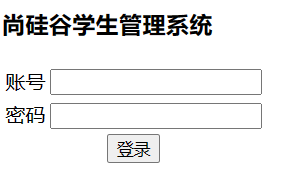
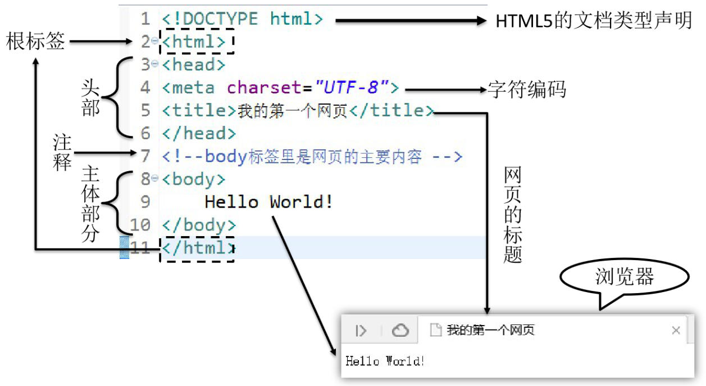
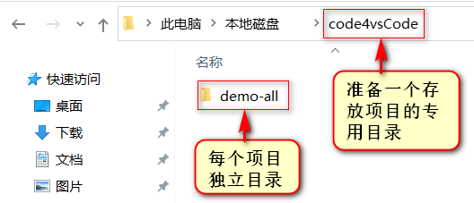
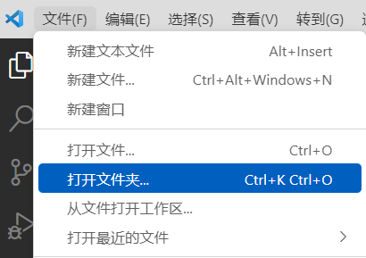
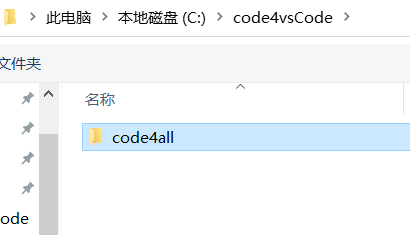
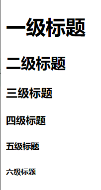
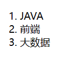
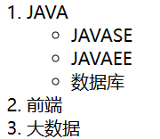
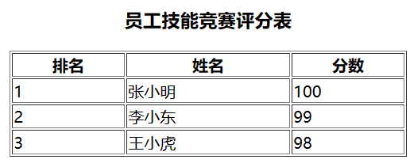
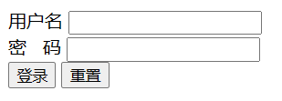

# 第二章 HTML&CSS

# 一 HTML入门

## 1.1 HTML&CSS&JavaScript的作用

> HTML 主要用于网页主体结构的搭建




> CSS 主要用于页面元素美化


> JavaScript 主要用于页面元素的动态处理


##  1.2 什么是HTML

>  HTML是Hyper Text Markup Language的缩写。意思是超文本标记语言。它的作用是搭建网页结构，在网页上展示内容

HTML5 是 **HyperText Markup Language 5 的缩写，HTML5** 技术结合了 HTML4.01 的[相关标准](https://baike.baidu.com/item/相关标准/5199682?fromModule=lemma_inlink "相关标准")并革新，符合现代网络发展要求，在 2008 年正式发布。HTML5 由不同的技术构成，其在互联网中得到了非常广泛的应用，提供更多增强[网络应用](https://baike.baidu.com/item/网络应用/2196523?fromModule=lemma_inlink "网络应用")的标准机。与传统的技术相比，HTML5 的语法特征更加明显，并且结合了 [SVG](https://baike.baidu.com/item/SVG/63178?fromModule=lemma_inlink "SVG") 的内容。这些内容在网页中使用可以更加便捷地处理多媒体内容，而且 HTML5中还结合了其他元素，对原有的功能进行调整和修改，进行[标准化工作](https://baike.baidu.com/item/标准化工作/9777788?fromModule=lemma_inlink "标准化工作")。HTML5 在 2012 年已形成了稳定的版本。2014年10月28日，W3C发布了HTML5的最终版。

## 1.3 什么是超文本

> HTML文件本质上是文本文件，而普通的文本文件只能显示字符。但是HTML技术则通过HTML标签把其他网页、图片、音频、视频等各种多媒体资源引入到当前网页中，让网页有了非常丰富的呈现方式，这就是超文本的含义——本身是文本，但是呈现出来的最终效果超越了文本。

## 1.4 什么是标记语言

> 说HTML是一种『标记语言』是因为它不是向Java这样的『编程语言』，因为它是由一系列『标签』组成的，没有常量、变量、流程控制、异常处理、IO等等这些功能。HTML很简单，每个标签都有它固定的含义和确定的页面显示效果。

-   双标签:标签是通过一组尖括号+标签名的方式来定义的：

```html
<p>HTML is a very popular fore-end technology.</p>
```

这个例子中使用了一个p标签来定义一个段落，\<p>叫**开始标签**，\</p>叫**结束标签**。开始标签和结束标签一起构成了一个完整的标签。开始标签和结束标签之间的部分叫**文本标签体**，也简称：**标签体**。

-   单标签

```html
<input type="text" name="username" />
```

-   属性

```html
<a href="http://www.xxx.com">show detail</a>
```

href="网址" 就是属性，href是属性名，"网址"是属性值

## 1.5 HTML基础结构

> 1 文档声明

+ HTML文件中第一行的内容，用来告诉浏览器当前HTML文档的基本信息，其中最重要的就是当前HTML文档遵循的语法标准。这里我们只需要知道HTML有4和5这两个大的版本
+ HTML4版本的文档类型声明是：

```HTML
<!DOCTYPE HTML PUBLIC "-//W3C//DTD HTML 4.01 Transitional//EN"
"http://www.w3.org/TR/html4/loose.dtd">
```

+ HTML5版本的文档类型声明是：

``` html
<!DOCTYPE html>
```

+ 现在主流的技术选型都是使用HTML5，之前的版本基本不用了。

> 2根标签

+ html标签是整个文档的根标签，所有其他标签都必须放在html标签里面。

> 3头部元素

+ head标签用于定义文档的头部，其他头部元素都放在head标签里。头部元素包括title标签、script标签、style标签、link标签、meta标签等等。

> 4主体元素

+ body标签定义网页的主体内容，在浏览器窗口内显示的内容都定义到body标签内。

> 5注释

+ HTML注释的写法是

``` html
<!-- 注释内容 -->
```



## 1.6 HTML的入门程序

> 第一步 准备一个纯文本文件,拓展名为html


> 第二步  使用记事本打开网页,在网页内开发代码

``` html
<!DOCTYPE html>
<html lang="en">
	<head>
        <meta charset="UTF-8">
        <title>我的第一个网页</title>
    </head>
    <body>
        hello html!!!
    </body>
</html>
```

> 第三步 使用浏览器打开文件,查看显示的内容


## 1.7 HTML概念词汇解释

> 标签

+ 代码中的一个 <> 叫做一个标签,有些标签成对出现,称之为双标签,有些标签单独出现,称之为单标签

> 属性

+ 一般在开始标签中,用于定义标签的一些特征

> 文本

+ 双标签中间的文字,包含空格换行等结构

> 元素

+ 经过浏览器解析后,每一个完整的标签(标签+属性+文本)可以称之为一个元素

## 1.8 HTML的语法规则

+ 1 根标签有且只能有一个

+ 2 无论是双标签还是单标签都需要正确关闭

+ 3 标签可以嵌套但不能交叉嵌套

+ 4 注释语法为<!-- -->  ,注意不能嵌套

+ 5 属性必须有值，值必须加引号,H5中属性名和值相同时可以省略属性值

+ 6 HTML中不严格区分字符串使用单双引号

+ 7 HTML标签不严格区分大小写,但是不能大小写混用

+ 8 HTML中不允许自定义标签名,强行自定义则无效

## 1.9 开发工具VsCode的安装和使用

+ 前端工程师“Front-End-Developer”源自于美国。大约从2005年开始正式的前端工程师角色被行业所认可，到了2010年，互联网开始全面进入移动时代，前端开发的工作越来越重要。

+ 最初所有的开发工作都是由后端工程师完成的，随着业务越来越繁杂，工作量变大，于是我们将项目中的可视化部分和一部分交互功能的开发工作剥离出来，形成了前端开发。由于互联网行业的急速发展，导致了在不同的国家，有着截然不同的分工体制。

+ 在日本和一些人口比较稀疏的国家，例如加拿大、澳大利亚等，流行“Full-Stack Engineer”，也就是我们通常所说的全栈工程师。通俗点说就是一个人除了完成前端开发和后端开发工作以外，有的公司从产品设计到项目开发再到后期运维可能都是同一个人，甚至可能还要负责UI、配动画，也可以是扫地、擦窗、写文档、维修桌椅等等。

+ 而在美国等互联网环境比较发达的国家项目开发的分工协作更为明确，整个项目开发分为前端、中间层和后端三个开发阶段，这三个阶段分别由三个或者更多的人来协同完成。国内的大部分互联网公司只有前端工程师和后端工程师，中间层的工作有的由前端来完成，有的由后端来完成。

+ PRD（产品原型-产品经理） - PSD（视觉设计-UI工程师） - HTML/CSS/JavaScript（PC/移动端网页，实现网页端的视觉展示和交互-前端工程师）
+ 前端工程师比较推崇的一款开发工具就是visual  studio code,下载地址为:https://code.visualstudio.com/


> 1 安装过程

安装过程比较简单,一路next,注意安装路径不要有中文,空格和特殊符号即可

> 2 安装插件


+ Auto Rename Tag 自动修改标签对插件
+ Chinese Language Pack  汉化包
+ HTML CSS Support  HTML CSS 支持
+ Intellij IDEA Keybindings IDEA快捷键支持
+ Live Server 实时加载功能的小型服务器
+ open in  browser 通过浏览器打开当前文件的插件
+ Prettier-Code formatter 代码美化格式化插件
+ Vetur   VScode中的Vue工具插件
+ vscode-icons  文件显示图标插件
+ Vue 3 snipptes 生成VUE模板插件
+ Vue language Features Vue3语言特征插件

> 3 创建项目

+ vscode本身没有新建项目的选项，所以要先创建一个空的文件夹，如project_xxxx。



+ 然后打开vscode，再在vscode里面选择 File -> Open Folder 打开文件夹，这样才可以创建项目


> 4 保存工作区

+ 打开文件夹后，选择“文件 -> 将工作区另存为...”，为工作区文件起一个名字，存储在刚才的文件夹下即可


+ `当然,也可以无需处理工作区,直接用vscode打开某个目录即可`直接将某个目录作为项目代码存放的根目录





> 5 在工作空间下创建目录和文件


> 6 通过live Server 小型服务器运行项目

+ 点击右下角Go Live , 或者在html编辑视图上右击 open with live Server  ,会自动启动小型服务器,并自动打开浏览器访问当前资源


+ Live Server 实时加载功能


+ Live Server使用完毕后,要记得关闭


> 7 其他常见设置

+ 设置字体:    齿轮>search>搜索    "字体大小"
+ 设置字体大小可以用滚轮控制:  齿轮>设置>搜索 "Mouse Wheel Zoom"
+ 设置左侧树缩进: 齿轮>设置>搜索 "树缩进"
+ 设置文件夹折叠:  齿轮>设置>搜索 "compact" 取消第一个勾选

## 1.10 在线帮助文档

http://www.w3school.com.cn

# 二 HTML常见标签

##  2.1 标题标签

> 标题标签一般用于在页面上定义一些标题性的内容,如新闻标题,文章标题等,有h1到h6六级标题

+ 代码

``` html
<body>
    <h1>一级标题</h1>
    <h2>二级标题</h2>
    <h3>三级标题</h3>
    <h4>四级标题</h4>
    <h5>五级标题</h5>
    <h6>六级标题</h6>
</body>
```

+ 效果



## 2.2 段落标签

> 段落标签一般用于定义一些在页面上要显示的大段文字,多个段落标签之间实现自动分段的效果

+ 代码

``` html
<body>
    <p>
        记者从工信部了解到，近年来我国算力产业规模快速增长，年增长率近30%，算力规模排名全球第二。
    </p>
    <p>
        工信部统计显示，截至去年底，我国算力总规模达到180百亿亿次浮点运算/秒，存力总规模超过1000EB（1万亿GB）。
        国家枢纽节点间的网络单向时延降低到20毫秒以内，算力核心产业规模达到1.8万亿元。中国信息通信研究院测算，
        算力每投入1元，将带动3至4元的GDP经济增长。
    </p>
    <p> 
        近年来，我国算力基础设施发展成效显著，梯次优化的算力供给体系初步构建，算力基础设施的综合能力显著提升。
        当前，算力正朝智能敏捷、绿色低碳、安全可靠方向发展。
    </p>
</body>
```

+ 效果


## 2.3 换行标签

> 单纯实现换行的标签是br,如果想添加分隔线,可以使用hr标签

+ 代码

``` html
<body>
        工信部统计显示，截至去年底，我国算力总规模达到180百亿亿次浮点运算/秒，存力总规模超过1000EB（1万亿GB）。
    <br>
        国家枢纽节点间的网络单向时延降低到20毫秒以内，算力核心产业规模达到1.8万亿元。
    <hr>
        中国信息通信研究院测算，算力每投入1元，将带动3至4元的GDP经济增长。
</body>
```

+ 效果


## 2.4 列表标签

> 有序列表  分条列项展示数据的标签, 其每一项前面的符号带有顺序特征

+ 列表标签 ol
+ 列表项标签 li
+ 代码

``` html
<ol>
    <li>JAVA</li>
    <li>前端</li>
    <li>大数据</li>
</ol>
```


+ 效果



> 无序列表 分条列项展示数据的标签, 其每一项前面的符号不带有顺序特征

+ 列表标签 ul
+ 列表项标签 li
+ 代码

``` html
<ul>
    <li>JAVASE</li>
    <li>JAVAEE</li>
    <li>数据库</li>
</ul>
```

+ 效果


> 嵌套列表 列表和列表之前可以签到,实现某一项内容详细展示

+ 代码

``` html
<ol>
    <li>
        JAVA
        <ul>
            <li>JAVASE</li>
            <li>JAVAEE</li>
            <li>数据库</li>
        </ul>
    </li>
    <li>前端</li>
    <li>大数据</li>
</ol>
```


+ 效果



## 2.5 超链接标签

> 点击后带有连接跳转的标签 ,也叫作a标签

+ href属性用于定义连接
    + href中可以使用绝对路径,以/开头,始终以一个固定路径作为基准路径作为出发点
    + href中也可以使用相对路径,不以/开头,以当前文件所在路径为出发点
    + href中也可以定义完整的URL

+ target用于定义打开的方式
    +  _blank 在新窗口中打开目标资源
    +   _self  在当前窗口中打开目标资源

+ 代码

``` html
<body>
    <!-- 
        href属性用于定义连接
            href中可以使用绝对路径,以/开头,始终以一个路径作为基准路径作为出发点
            href中也可以使用相对路径,不以/开头,以当前文件所在路径为出发点
            href中也可以定义完整的URL
        target用于定义打开的方式
            _blank 在新窗口中打开目标资源
            _self  在当前窗口中打开目标资源
     -->
   <a href="01html的基本结构.html" target="_blank">相对路径本地资源连接</a> <br>
   <a href="/day01-html/01html的基本结构.html" target="_self">绝对路径本地资源连接</a> <br>
   <a href="http://www.atguigu.com" target="_blank">外部资源链接</a> <br>
   
</body>
```

+ 效果


## 2.6 多媒体标签

> img(重点) 图片标签,用于在页面上引入图片

+ 代码

``` html
<!-- 
src
	用于定义图片的连接
title
	用于定义鼠标悬停时显示的文字
alt
	用于定义图片加载失败时显示的提示文字
-->

```

+ 效果


> audio 用于在页面上引入一段声音

+ 代码

``` html
   <!-- 
    src
        用于定义目标声音资源
    autoplay
        用于控制打开页面时是否自动播放
    controls
        用于控制是否展示控制面板
    loop
        用于控制是否进行循环播放
    --> 
   <audio src="img/music.mp3" autoplay="autoplay" controls="controls" loop="loop" />
```

+ 效果


> video

+ 代码

``` html
<body>
   <!-- 
    src
        用于定义目标视频资源
    autoplay
        用于控制打开页面时是否自动播放
    controls
        用于控制是否展示控制面板
    loop
        用于控制是否进行循环播放
    --> 
   <video src="img/movie.mp4" autoplay="autoplay" controls="controls" loop="loop" width="400px" />
</body>
```

+ 效果


## 2.7 表格标签(重点)

> 常规表格

+ table标签 代表表格
+ thead标签 代表表头 可以省略不写
+ tbody标签 代表表体 可以省略不写
+ tfoot标签 代表表尾  可以省略不写
+ tr标签 代表一行
+ td标签 代表行内的一格
+ th标签 自带加粗和居中效果的td


+ 代码

``` html
    <h3 style="text-align: center;">员工技能竞赛评分表</h3>
    <table  border="1px" style="width: 400px; margin: 0px auto;">
        <tr>
            <th>排名</th>
            <th>姓名</th>
            <th>分数</th>
        </tr>
        <tr>
            <td>1</td>
            <td>张小明</td>
            <td>100</td>
        </tr>
        <tr>
            <td>2</td>
            <td>李小东</td></td>
            <td>99</td>
        </tr>
        <tr>
            <td>3</td>
            <td>王小虎</td>
            <td>98</td>
        </tr>
    </table>
```


+ 展示效果



> 单元格跨行

+ 通过td的rowspan属性实现上下跨行

+ 代码

``` html
    <h3 style="text-align: center;">员工技能竞赛评分表</h3>
    <table  border="1px" style="width: 400px; margin: 0px auto;">
        <tr>
            <th>排名</th>
            <th>姓名</th>
            <th>分数</th>
            <th>备注</th>
        </tr>
        <tr>
            <td>1</td>
            <td>张小明</td>
            <td>100</td>
            <td rowspan="3">
                前三名升职加薪
            </td>
        </tr>
        <tr>
            <td>2</td>
            <td>李小东</td></td>
            <td>99</td>
        </tr>
        <tr>
            <td>3</td>
            <td>王小虎</td>
            <td>98</td>
        </tr>
    </table>
```

+ 效果


> 单元格跨行

+ 通过td的colspan属性实现左右的跨列

+ 代码

``` html
    <h3 style="text-align: center;">员工技能竞赛评分表</h3>
    <table  border="1px" style="width: 400px; margin: 0px auto;">
        <tr>
            <th>排名</th>
            <th>姓名</th>
            <th>分数</th>
            <th>备注</th>
        </tr>
        <tr>
            <td>1</td>
            <td>张小明</td>
            <td>100</td>
            <td rowspan="6">
                前三名升职加薪
            </td>
        </tr>
        <tr>
            <td>2</td>
            <td>李小东</td></td>
            <td>99</td>
        </tr>
        <tr>
            <td>3</td>
            <td>王小虎</td>
            <td>98</td>
        </tr>
        <tr>
            <td>总人数</td>
            <td colspan="2">2000</td>
        </tr>
        <tr>
            <td>平均分</td>
            <td colspan="2">90</td>
        </tr>
        <tr>
            <td>及格率</td>
            <td colspan="2">80%</td>
        </tr>
    </table>
```

+ 效果


## 2.8 表单标签(重点)

> 表单标签,可以实现让用户在界面上输入各种信息并提交的一种标签. 是向服务端发送数据主要的方式之一

+ form标签,表单标签,其内部用于定义可以让用户输入信息的表单项标签
    + action, form标签的属性之一,用于定义信息提交的服务器的地址
    + method, form标签的属性之一,用于定义信息的提交方式
        + get    get方式, 数据会缀到url后,以?作为参数开始的标识,多个参数用&隔开
        + post  post方式,数据会通过请求体发送,不会在缀到url后

+ input标签,主要的表单项标签,可以用于定义表单项
    + name, input标签的属性之一,用于定义提交的参数名
    + type, input标签的属性之一,用于定义表单项类型
        + text   文本框
        + password 密码框
        + submit 提交按钮
        + reset    重置按钮

+ 代码

``` html
   <form action="http://www.atguigu.com" method="get">
        用户名 <input type="text" name="username" /> <br>
        密&nbsp;&nbsp;&nbsp;码 <input type="password" name="password" /> <br>
        <input type="submit"  value="登录" />
        <input type="reset"  value="重置" />
   </form>
```

+ 效果



## 2.9 常见表单项标签(重点)

> 单行文本框

+ 代码

``` html
个性签名：<input type="text" name="signal"/><br/>
```

+ 效果


> 密码框

+ 代码

``` html
密码：<input type="password" name="secret"/><br/>
```

+ 效果


> 单选框

+ 代码

``` html 
你的性别是：
<input type="radio" name="sex" value="spring" />男
<input type="radio" name="sex" value="summer" checked="checked" />女
```

+ 效果


+ 说明
    + name属性相同的radio为一组，组内互斥
    + 当用户选择了一个radio并提交表单，这个radio的name属性和value属性组成一个键值对发送给服务器
    + 设置checked="checked"属性设置默认被选中的radio
    + 如果属性名和属性值一样的话，可以省略属性值，只写checked即可

> 复选框

+ 代码

``` html
你最喜欢的球队是：
<input type="checkbox" name="team" value="Brazil"/>巴西
<input type="checkbox" name="team" value="German" checked/>德国
<input type="checkbox" name="team" value="France"/>法国
<input type="checkbox" name="team" value="China" checked="checked"/>中国
<input type="checkbox" name="team" value="Italian"/>意大利
```

+ 效果


+ 说明
    + 设置checked="checked"属性设置默认被选中的checkbox

> 下拉框

+ 代码

``` html
你喜欢的运动是：
<select name="interesting">
    <option value="swimming">游泳</option>
    <option value="running">跑步</option>
    <option value="shooting" selected="selected">射击</option>
    <option value="skating">溜冰</option>
</select>
```

+ 效果


+ 说明
    + 下拉列表用到了两种标签，其中select标签用来定义下拉列表，而option标签设置列表项。
    + name属性在select标签中设置,value属性在option标签中设置。
    + option标签的标签体是显示出来给用户看的，提交到服务器的是value属性的值。
    + 通过在option标签中设置selected="selected"属性实现默认选中的效果。

> 按钮

+ 代码

``` html
<button type="button">普通按钮</button>或<input type="button" value="普通按钮"/>
<button type="reset">重置按钮</button>或<input type="reset" value="重置按钮"/>
<button type="submit">提交按钮</button>或<input type="submit" value="提交按钮"/>
```

+ 效果


+ 说明
    + 普通按钮: 点击后无效果，需要通过JavaScript绑定单击响应函数
    + 重置按钮: 点击后将表单内的所有表单项都恢复为默认值
    + 提交按钮: 点击后提交表单

> 隐藏域

+ 代码

``` html
<input type="hidden" name="userId" value="2233"/>
```

+ 说明
    + 通过表单隐藏域设置的表单项不会显示到页面上，用户看不到。但是提交表单时会一起被提交。用来设置一些需要和表单一起提交但是不希望用户看到的数据，例如：用户id等等。

> 多行文本框

+ 代码

``` html
自我介绍：<textarea name="desc"></textarea>
```

+ 效果


+ 说明
    + textarea没有value属性，如果要设置默认值需要写在开始和结束标签之间。

> 文件标签

+ 代码

``` html
头像:<input type="file" name="file"/>
```

+ 效果


+ 说明
    + 不同浏览器显示的样式有微小差异

## 2.10 布局相关标签

> div标签  俗称块标签,主要用于划分页面结构,做页面布局

> span标签 俗称层标签,主要用于划分元素范围,配合CSS做页面元素样式的修饰

+ 代码

``` html
    <div style="width: 500px; height: 400px;background-color: cadetblue;">
        <div style="width: 400px; height: 100px;background-color: beige;margin: 10px auto;">
            <span style="color: blueviolet;">页面开头部分</span>
        </div> 
        <div style="width: 400px; height: 100px;background-color: blanchedalmond;margin: 10px auto;">
            <span style="color: blueviolet;">页面中间部分</span>
        </div> 
        <div style="width: 400px; height: 100px;background-color: burlywood;margin: 10px auto;">
            <span style="color: blueviolet;">页面结尾部分</span>
        </div> 
    </div>
```

+ 展示效果


## 2.11 特殊字符

> 对于有特殊含义的字符,需要通过转移字符来表示


+ 代码

``` html
    &lt;span&gt;  <br>
    &lt;a href="http://www.atguigu.com"&gt;尚&nbsp;硅&nbsp;谷&lt;/a&gt; <br>
    &amp;amp;  
```

+ 效果


# 三 CSS的使用

> CSS  层叠样式表(英文全称：(Cascading Style Sheets)   能够对网页中元素位置的排版进行像素级精确控制，支持几乎所有的字体字号样式，拥有对网页对象和模型样式编辑的能力 ,简单来说,美化页面

## 3.1 CSS引入方式

> 行内式,通过元素开始标签的style属性引入, 样式语法为       样式名:样式值; 样式名:样式值;

+ 代码

```html
    <input 
        type="button" 
        value="按钮"
        style="
            display: block;
            width: 60px; 
            height: 40px; 
            background-color: rgb(140, 235, 100); 
            color: white;
            border: 3px solid green;
            font-size: 22px;
            font-family: '隶书';
            line-height: 30px;
            border-radius: 5px;
    "/> 
```

+ 效果


+ 缺点
    + html代码和css样式代码交织在一起,增加阅读难度和维护成本
    + css样式代码仅对当前元素有效,代码重复量高,复用度低

> 内嵌式

+ 代码

``` html
<head>
    <meta charset="UTF-8">
    <style>
        /* 通过选择器确定样式的作用范围 */
        input {
            display: block;
            width: 80px; 
            height: 40px; 
            background-color: rgb(140, 235, 100); 
            color: white;
            border: 3px solid green;
            font-size: 22px;
            font-family: '隶书';
            line-height: 30px;
            border-radius: 5px;
        }
    </style>
</head>
<body>
    <input type="button" value="按钮1"/> 
    <input type="button" value="按钮2"/> 
    <input type="button" value="按钮3"/> 
    <input type="button" value="按钮4"/> 
</body>
```


+ 效果


+ 说明
    + 内嵌式样式需要在head标签中,通过一对style标签定义CSS样式
    + CSS样式的作用范围控制要依赖选择器
    + CSS的样式代码中注释的方式为  /*   */
    + 内嵌式虽然对样式代码做了抽取,但是CSS代码仍然在html文件中
    + 内嵌样式仅仅能作用于当前文件,代码复用度还是不够,不利于网站风格统一

> 连接式/外部样式表

+ 可以在项目单独创建css样式文件,专门用于存放CSS样式代码


+ 在head标签中,通过link标签引入外部CSS样式即可

``` html
<head>
    <meta charset="UTF-8">
    <link href="css/buttons.css" rel="stylesheet" type="text/css"/>
</head>
<body>
    <input type="button" value="按钮1"/> 
    <input type="button" value="按钮2"/> 
    <input type="button" value="按钮3"/> 
    <input type="button" value="按钮4"/> 
</body>
```

+ 说明
    + CSS样式代码从html文件中剥离,利于代码的维护
    + CSS样式文件可以被多个不同的html引入,利于网站风格统一

## 3.2 CSS选择器

> 元素选择器

+ 代码

``` html
<head>
    <meta charset="UTF-8">
   <style>
    input {
        display: block;
        width: 80px; 
        height: 40px; 
        background-color: rgb(140, 235, 100); 
        color: white;
        border: 3px solid green;
        font-size: 22px;
        font-family: '隶书';
        line-height: 30px;
        border-radius: 5px;
    }
   </style>
</head>
<body>
    <input type="button" value="按钮1"/> 
    <input type="button" value="按钮2"/> 
    <input type="button" value="按钮3"/> 
    <input type="button" value="按钮4"/> 
    <button>按钮5</button>
</body>
```

+ 效果


+ 说明
    + 根据标签名确定样式的作用范围
    + 语法为  元素名 {}
    + 样式只能作用到同名标签上,其他标签不可用
    + 相同的标签未必需要相同的样式,会造成样式的作用范围太大

> id选择器

+ 代码

``` html
<head>
    <meta charset="UTF-8">
   <style>
    #btn1 {
        display: block;
        width: 80px; 
        height: 40px; 
        background-color: rgb(140, 235, 100); 
        color: white;
        border: 3px solid green;
        font-size: 22px;
        font-family: '隶书';
        line-height: 30px;
        border-radius: 5px;
    }
   </style>
</head>
<body>
    <input id="btn1" type="button" value="按钮1"/> 
    <input id="btn2" type="button" value="按钮2"/> 
    <input id="btn3" type="button" value="按钮3"/> 
    <input id="btn4" type="button" value="按钮4"/> 
    <button id="btn5">按钮5</button>
</body>
```

+ 效果


+ 说明
    + 根据元素id属性的值确定样式的作用范围
    + 语法为  #id值 {}
    + id属性的值在页面上具有唯一性,所有id选择器也只能影响一个元素的样式
    + 因为id属性值不够灵活,所以使用该选择器的情况较少

> class选择器

+ 代码

``` html
<head>
    <meta charset="UTF-8">
   <style>
    .shapeClass {
        display: block;
        width: 80px; 
        height: 40px; 
        border-radius: 5px;
    }
    .colorClass{
        background-color: rgb(140, 235, 100); 
        color: white;
        border: 3px solid green;
    }
    .fontClass {
        font-size: 22px;
        font-family: '隶书';
        line-height: 30px;
    }

   </style>
</head>
<body>
    <input  class ="shapeClass colorClass fontClass"type="button" value="按钮1"/> 
    <input  class ="shapeClass colorClass" type="button" value="按钮2"/> 
    <input  class ="colorClass fontClass" type="button" value="按钮3"/> 
    <input  class ="fontClass" type="button" value="按钮4"/> 
    <button class="shapeClass colorClass fontClass" >按钮5</button>
</body>
```


+ 效果


+ 说明
    + 根据元素class属性的值确定样式的作用范围
    + 语法为  .class值 {}
    + class属性值可以有一个,也可以有多个,多个不同的标签也可以是使用相同的class值
    + 多个选择器的样式可以在同一个元素上进行叠加
    + 因为class选择器非常灵活,所以在CSS中,使用该选择器的情况较多


## 3.4 CSS浮动

> CSS 的 Float（浮动）使元素脱离文档流，按照指定的方向（左或右发生移动），直到它的外边缘碰到包含框或另一个浮动框的边框为止。

+ 浮动设计的初衷为了解决文字环绕图片问题，浮动后一定不会将文字挡住，这是设计初衷。
+ 文档流是是文档中可显示对象在排列时所占用的位置/空间，而脱离文档流就是在页面中不占位置了。  

> 浮动原理

+  当把框 1 向右浮动时，它脱离文档流并且向右移动，直到它的右边缘碰到包含框的右边缘


+ 当框 1 向左浮动时，它脱离文档流并且向左移动，直到它的左边缘碰到包含框的左边缘。因为它不再处于文档流中，所以它不占据空间，实际上覆盖住了框 2，使框 2 从视图中消失。如果把所有三个框都向左移动，那么框 1 向左浮动直到碰到包含框，另外两个框向左浮动直到碰到前一个浮动框。


+  如果包含框太窄，无法容纳水平排列的三个浮动元素，那么其它浮动块向下移动，直到有足够的空间。如果浮动元素的高度不同，那么当它们向下移动时可能被其它浮动元素“卡住”


> 浮动的样式名:float


> 通过代码感受浮动的效果

+ 代码

``` html
<head>
    <meta charset="UTF-8">
   <style>
    .outerDiv {
        width: 500px;
        height: 300px;
        border: 1px solid green;
        background-color: rgb(230, 224, 224);
    }
    .innerDiv{
        width: 100px;
        height: 100px;
        border: 1px solid blue;
        float: left;
    }
    .d1{
        background-color: greenyellow;
       /*  float: right; */
    }
    .d2{
        background-color: rgb(79, 230, 124);
    }
    .d3{
        background-color: rgb(26, 165, 208);
    }
   </style>
</head>
<body>
   <div class="outerDiv">
        <div class="innerDiv d1">框1</div>
        <div class="innerDiv d2">框2</div>
        <div class="innerDiv d3">框3</div>
   </div> 
</body>
```

+ 效果


## 3.5 CSS定位

> position 属性指定了元素的定位类型。

+ 这个属性定义建立元素布局所用的定位机制。任何元素都可以定位，不过绝对或固定元素会生成一个块级框，而不论该元素本身是什么类型。相对定位元素会相对于它在正常流中的默认位置偏移。

+ 元素可以使用的顶部，底部，左侧和右侧属性定位。然而，这些属性无法工作，除非是先设定position属性。他们也有不同的工作方式，这取决于定位方法。


> 静态定位

+ 说明
    + 不设置的时候的默认值就是static，静态定位，没有定位，元素出现在该出现的位置，块级元素垂直排列，行内元素水平排列
+ 代码

``` html
<head>
    <meta charset="UTF-8">
    <style>
        .innerDiv{
                width: 100px;
                height: 100px;
        }
        .d1{
            background-color: rgb(166, 247, 46);
            position: static;
        }
        .d2{
            background-color: rgb(79, 230, 124);
        }
        .d3{
            background-color: rgb(26, 165, 208);
        }
    </style>
</head>
<body>
        <div class="innerDiv d1">框1</div>
        <div class="innerDiv d2">框2</div>
        <div class="innerDiv d3">框3</div>
</body>
```


+ 效果


> 绝对定位 

+ 说明
    + absolute ,通过 top left right bottom 指定元素在页面上的固定位置
    + 定位后元素会让出原来位置,其他元素可以占用

+ 代码

``` html
<head>
    <meta charset="UTF-8">
    <style>
        .innerDiv{
                width: 100px;
                height: 100px;
        }
        .d1{
            background-color: rgb(166, 247, 46);
            position: absolute;
            left: 300px;
            top: 100px;
        }
        .d2{
            background-color: rgb(79, 230, 124);
        }
        .d3{
            background-color: rgb(26, 165, 208);
        }
    </style>
</head>
<body>
        <div class="innerDiv d1">框1</div>
        <div class="innerDiv d2">框2</div>
        <div class="innerDiv d3">框3</div>
</body>
```


+ 效果


> 相对定位

+ 说明
    + relative 相对于自己原来的位置进行地位
    + 定位后保留原来的站位,其他元素不会移动到该位置

+ 代码

``` html
<head>
    <meta charset="UTF-8">
    <style>
        .innerDiv{
                width: 100px;
                height: 100px;
        }
        .d1{
            background-color: rgb(166, 247, 46);
            position: relative;
            left: 30px;
            top: 30px;
        }
        .d2{
            background-color: rgb(79, 230, 124);
        }
        .d3{
            background-color: rgb(26, 165, 208);
        }
    </style>
</head>
<body>
        <div class="innerDiv d1">框1</div>
        <div class="innerDiv d2">框2</div>
        <div class="innerDiv d3">框3</div>
</body>
```


+ 效果


> 固定定位

+ 说明
    + fixed 失踪在浏览器窗口固定位置,不会随着页面的上下移动而移动
    + 元素定位后会让出原来的位置,其他元素可以占用
+ 代码

``` html
<head>
    <meta charset="UTF-8">
    <style>
        .innerDiv{
                width: 100px;
                height: 100px;
        }
        .d1{
            background-color: rgb(166, 247, 46);
            position: fixed;
            right: 30px;
            top: 30px;
        }
        .d2{
            background-color: rgb(79, 230, 124);
        }
        .d3{
            background-color: rgb(26, 165, 208);
        }
    </style>
</head>
<body>
        <div class="innerDiv d1">框1</div>
        <div class="innerDiv d2">框2</div>
        <div class="innerDiv d3">框3</div>
        br*100+tab
</body>
```

+ 效果


## 3.6 CSS盒子模型

> 所有HTML元素可以看作盒子，在CSS中，"box model"这一术语是用来设计和布局时使用。

+ CSS盒模型本质上是一个盒子，封装周围的HTML元素，它包括：边距（margin），边框（border），填充（padding），和实际内容（content）


+ 说明：
    + Margin(外边距) - 清除边框外的区域，外边距是透明的。
    + Border(边框) - 围绕在内边距和内容外的边框。
    + Padding(内边距) - 清除内容周围的区域，内边距是透明的。
    + Content(内容) - 盒子的内容，显示文本和图像。


+ 代码

``` html
    <head>
        <meta charset="UTF-8">
       <style>
        .outerDiv {
            width: 800px;
            height: 300px;
            border: 1px solid green;
            background-color: rgb(230, 224, 224);
            margin: 0px auto;
        }
        .innerDiv{
            width: 100px;
            height: 100px;
            border: 1px solid blue;
            float: left;
            /* margin-top: 10px;
            margin-right: 20px;
            margin-bottom: 30px;
            margin-left: 40px; */
            margin: 10px 20px 30px 40px;
           
        }
        .d1{
            background-color: greenyellow;
            /* padding-top: 10px;
            padding-right: 20px;
            padding-bottom: 30px;
            padding-left: 40px; */
            padding: 10px 20px 30px 40px;
        }
        .d2{
            background-color: rgb(79, 230, 124);
        }
        .d3{
            background-color: rgb(26, 165, 208);
        }
       </style>
    </head>
    <body>
       <div class="outerDiv">
            <div class="innerDiv d1">框1</div>
            <div class="innerDiv d2">框2</div>
            <div class="innerDiv d3">框3</div>
       </div> 
    </body>
```

+ 效果


+ 在浏览器上,通过F12工具查看盒子模型状态


