> 课件地址：[第五阶段 框架高级 (wolai.com)](https://www.wolai.com/rhQVicw4qeKHJqrjLykRXW)<br/>
> 代码地址：[atguigu-project-221126: 深圳Java221126班课堂代码 (gitee.com)](https://gitee.com/heavy_code_industry/atguigu-project-221126)<br/>
> 联系方式：封捷 群里加微信

# 一、整个阶段技术总体说明
## 1、单体应用
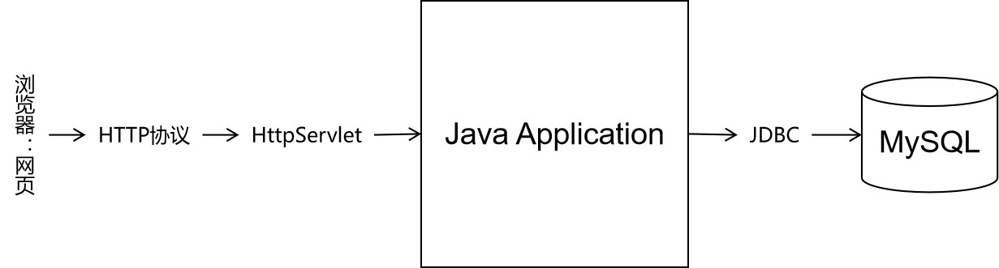
好处：简单<br/>
缺陷：
- 不能局部拆分出来配置集群，提升并发访问能力（横向扩容）
- 业务功能复杂之后，模块不那么清晰

## 2、微服务
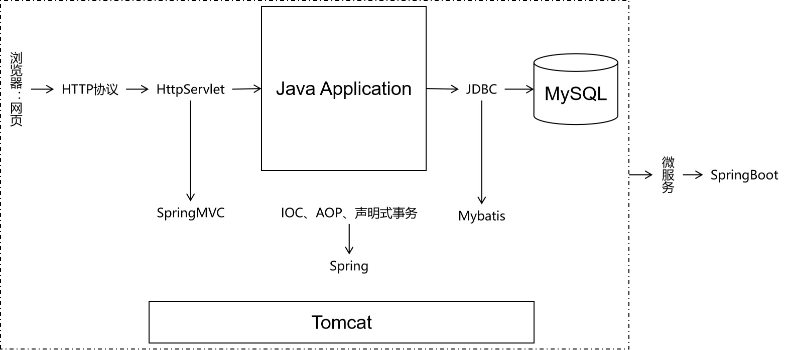

## 3、分布式系统整体
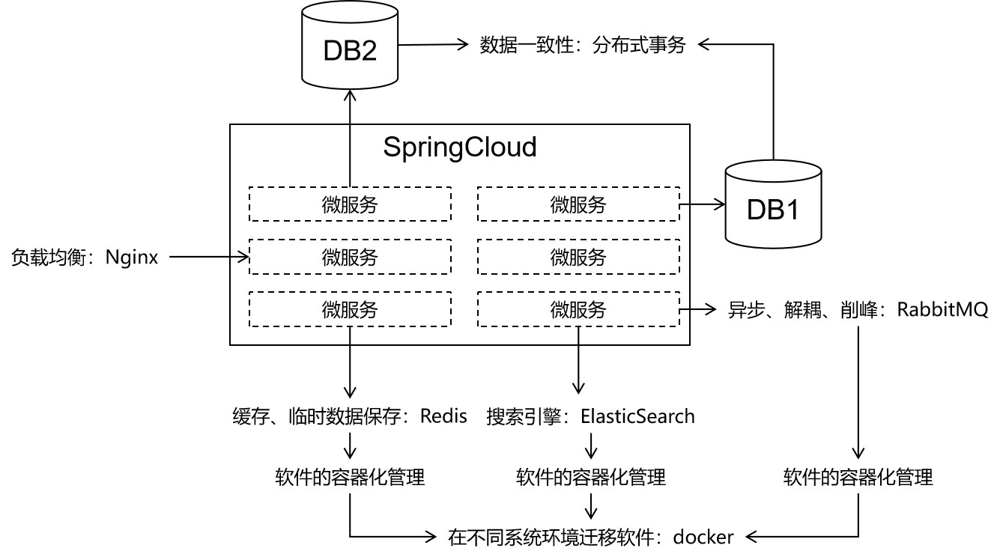

# 二、版本控制
## 1、协同开发
很多人组成一个团队，开发同一个项目。此时项目中的代码，在整个开发过程中，完全不可能手动管理，所以必须使用专门的版本控制软件。
- 宏观：整个project、module管理。
- 微观：很多人都需要修改同一个文件，此时要求版本控制软件能够深入文件内部，以行为单位来管理文件内容。

## 2、版本控制产品
- 集中式版本控制软件：典型代表就是Subversion，简称SVN
	- 在服务器保存版本历史信息
- 分布式版本控制软件：典型代表就是Git
	- 在本地保存版本历史信息

## 3、Git历史
Git产品的创始人：林纳斯·托瓦兹——Linux之父

# 三、Git工作机制
## 1、本地仓库相关
在程序员本地，自己管理自己代码的各个版本——不涉及协同开发。
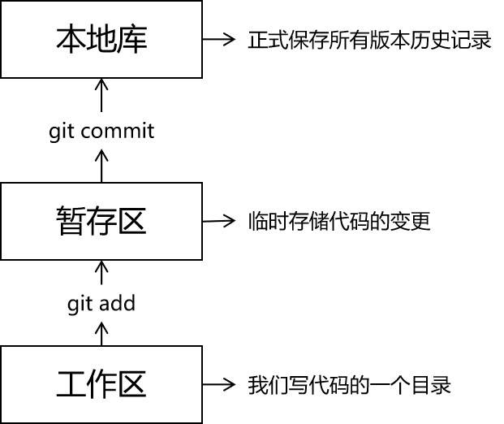

## 2、远程仓库相关
- 远程库：只和本地库交互，和工作区、暂存区无关
- 本地库：工作区、暂存区和本地库交互和远程库无关
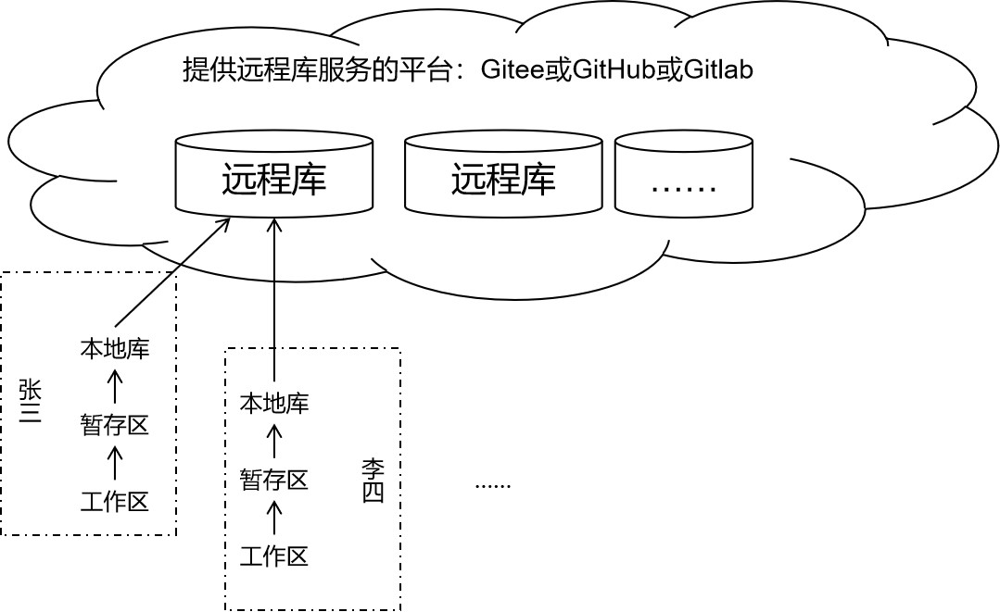

# 四、Git命令行操作
## 1、Git程序安装
参考课件内容。

## 2、本地操作
### ①全局初始化设置
用户签名和用户email地址是为了在将来团队协作过程中，区分每个人的身份。所以如果没有工作上的需要，Git本身并不要求email是一个真实的地址。
```bash
# 设置用户签名
git config --global user.name tom

# 设置用户email地址
git config --global user.email tom@qq.com
```

### ②本地库初始化
**注意**：一定要在工作区目录这里打开git bash
```bash
# 初始化本地库
git init
```
本地库初始化的效果是：在当前目录下生成一个隐藏的.git目录。


### ③查看当前目录状态
```bash
git status
```
关键信息解读：
- Untracked：未追踪。意思是Git尚未把这个文件或目录纳入版本控制体系中。
- use "git add" to track：使用git add命令可以执行对这个文件（或目录）追踪的操作——把它纳入Git的版本控制体系。
- git add：另外还有一个作用就是把工作区的修改添加到暂存区

### ④添加
#### [1]添加指定文件
```bash
# 格式：git add [文件路径]
git add Shop.java
```

#### [2]添加全部资源
把当前目录下全部文件、子目录等全部添加到暂存区（没有追踪的会追踪）
```bash
git add --all
```

### ⑤提交
#### [1]提交指定文件
```bash
# git commit -m "本次提交的说明信息" 文件路径
git commit -m "单独提交 atguigu-project-220309/pom.xml" atguigu-project-220309/pom.xml
```

#### [2]提交全部资源
```bash
# git commit -m "本次提交的说明信息"
git commit -m "2023年3月18日 第一次提交新创建的工程文件"
```

### ⑥查看历史版本
#### [1]简略日志
```bash
git reflog
```

#### [2]完整日志
```bash
git log
```

### ⑦版本穿梭
```bash
git reset --hard [版本号，可以是简略的]
```

### ⑧分支
#### [1]查看分支
```bash
git branch -v
```

#### [2]创建分支
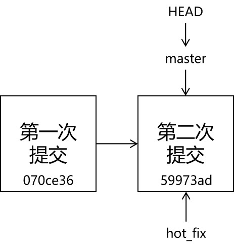
```bash
git branch [分支名称]
```

#### [3]切换分支
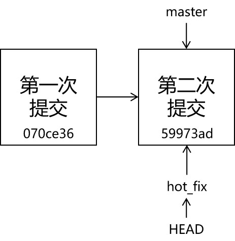
```bash
git checkout [分支名称]
```

#### [4]在分支内提交新内容
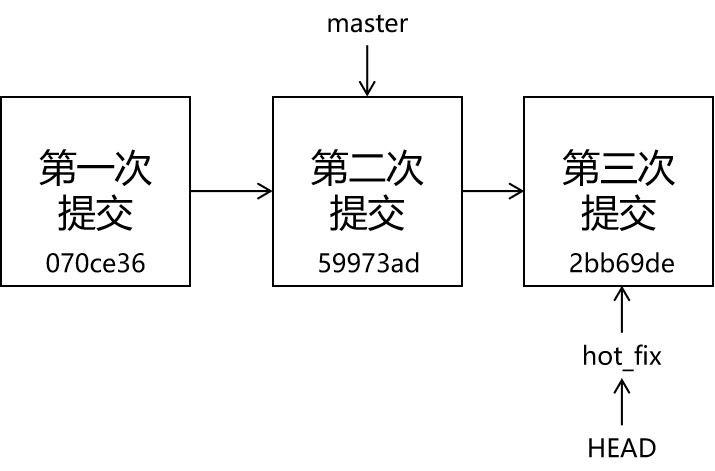

#### [5]切换回master
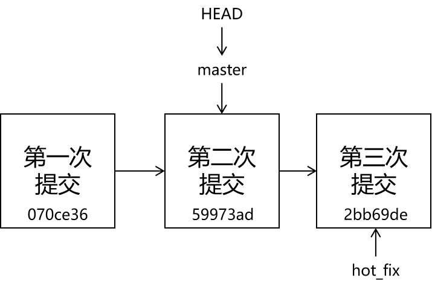

#### [6]master提交新版本
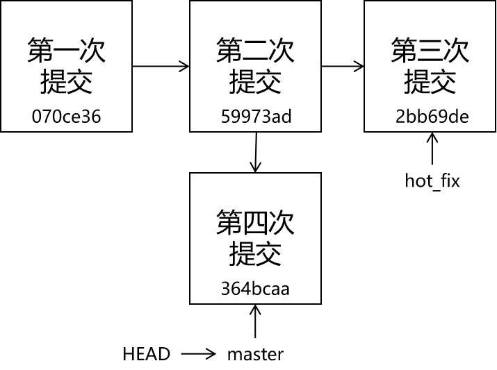

<p>此时两个分支的内容就不一样了：</p>
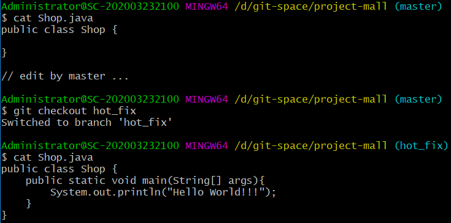

#### [5]分支的合并
<p>“分支的合并操作”一定是涉及两个分支。</p>
<p>这两个分支中，其中一个是“当前分支”。在合并分支的命令中，不需要明确指出当前分支。</p>
<p>所以合并分支的命令，需要明确指定的就是另外一个分支。</p>
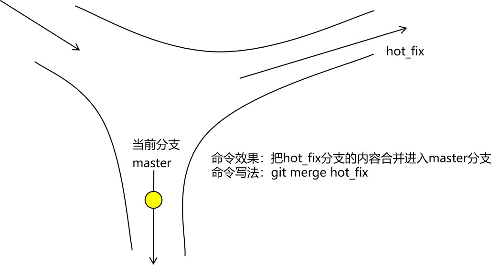
```bash
git merge [另一个分支的名称]
```

#### [5]冲突
<p>根本原因：参与合并的两个分支，在同一个文件的同一个位置（相同的行）内容不同。</p>
<p>存在意义：当版本控制系统不能决定使用哪个分支的内容时，由程序员（人）来决定。</p>
冲突的表现：<br/>

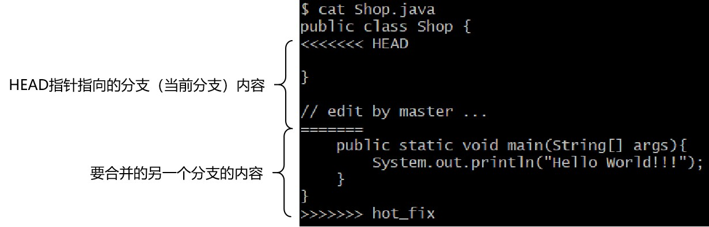

冲突的解决：
- 第一步：双方程序员协商，确定最终要保留的内容。
- 第二步：删除特殊符号，保留协商一致的内容。
- 第三步：使用git add命令标记为已解决。
- 第四步：使用git commit命令重新提交。
**注意**：此时git commit命令不能单独指定某一个文件。必须提交整个目录。
```bash
# 使用 git add 命令标记为已解决
git add Shop.java

# 使用 git commit 命令提交
git commit -m "2023年3月18日 修复冲突"
```

如果进行部分提交，会看到下面的提示信息：
```bash
$ git commit -m "2023年3月18日 修复冲突" Shop.java
fatal: cannot do a partial commit during a merge.
```

## 3、对接远程库
码云网址：[工作台 - Gitee.com](https://gitee.com/)

### ①账号
- 账号：atguigu2018ybuq@aliyun.com 密码：atguigu005
- 账号：atguigu2018lhuc@aliyun.com 密码：atguigu005
- 账号：atguigu2018east@aliyun.com 密码：atguigu005

### ②远程库工作机制
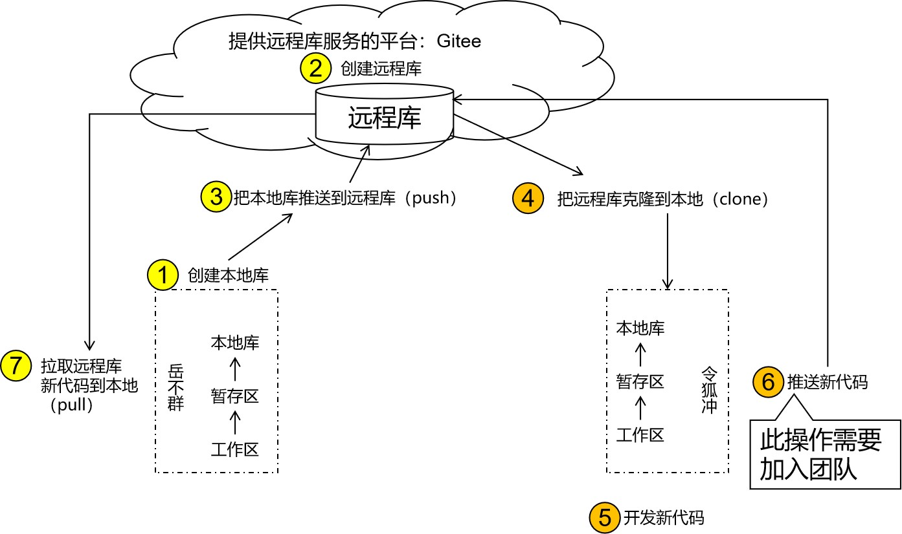

### ③创建远程库
- 仓库名称要求：仓库名只允许包含中文、字母、数字或者下划线(\_)、中划线(-)、英文句号(.)、加号(+)，必须以字母或数字开头，不能以下划线/中划线结尾，且长度为2~191个字符
- 仓库名称在同一个用户范围内不能重复
- 空仓库不能设置为公开，推送内容上去之后，再设置为公开
- 想要把仓库设置为公开，必须绑定手机号

### ④给远程地址设定别名
```bash
# 添加别名
git remote add origin https://gitee.com/atguigu-yue-buqun/repository221126mall.git

# 查看别名
git remote -v
```

### ⑤推送
```bash
git push origin master
```

### ⑥克隆
如果远程库是私有库，那么需要登录账号密码。
```bash
git clone https://gitee.com/atguigu-yue-buqun/repository221126mall.git
```
克隆命令有三个效果：
- 自动初始化本地库，也就是自动创建.git目录，不需要执行git init命令了
- 下载远程库所有文件、目录
- 自动创建远程库地址别名

### ⑦拉取
如果远程库是私有库，那么需要登录账号密码。
```pull
git pull origin master
```

### ⑧跨团队协作
只有公开仓库才能实现。
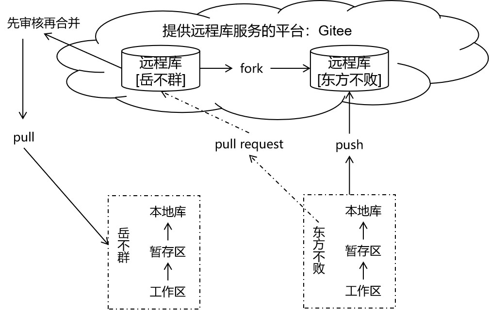

用途：
- 开发时找别人帮忙
- fork优秀的开源项目
- 开源项目本身允许不认识的人参与，需要通过fork和pull request方式审核代码

# 五、在IDEA中使用Git
## 1、本地库操作
### ①配置忽略文件
#### [1]准备规则文件
规则文件中指定要忽略的文件的规则。<br/>
文件名：随意<br/>
文件路径：随意
```text
# Compiled class file
*.class

# Log file
*.log

# BlueJ files
*.ctxt

# Mobile Tools for Java (J2ME)
.mtj.tmp/

# Package Files #
*.jar
*.war
*.nar
*.ear
*.zip
*.tar.gz
*.rar

# virtual machine crash logs, see http://www.java.com/en/download/help/error_hotspot.xml
hs_err_pid*

.classpath
.project
.settings
target
.idea
*.iml
```

#### [2]指定规则文件
在~/.gitconfig文件中做如下配置：
```text
[user]
	name = jerry
	email = jerry@qq.com
[core]
	excludesfile = C:/Users/Administrator/atguigu1126.ignore
```
**注意**：文件路径一定要使用正斜线，并且不要包含中文、空格等特殊符号。


### ②指定Git程序位置
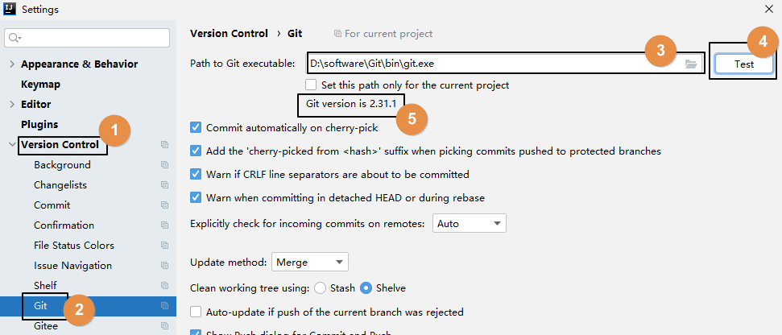

### ③初始化本地库
相当于执行 git init 命令。<br/>

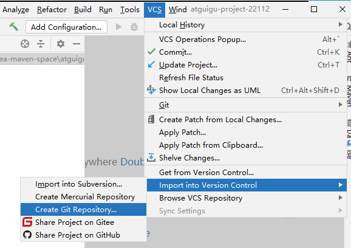

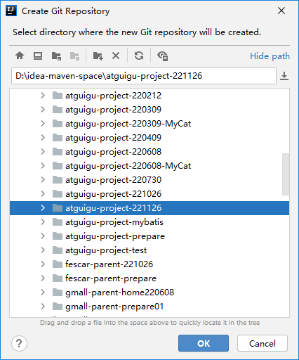

### ④添加与提交
<p>查看本地修改的状态（相当于git status）：</p>

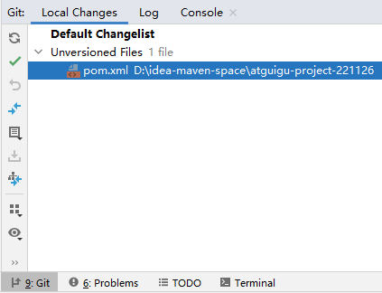

<p>添加操作：</p>

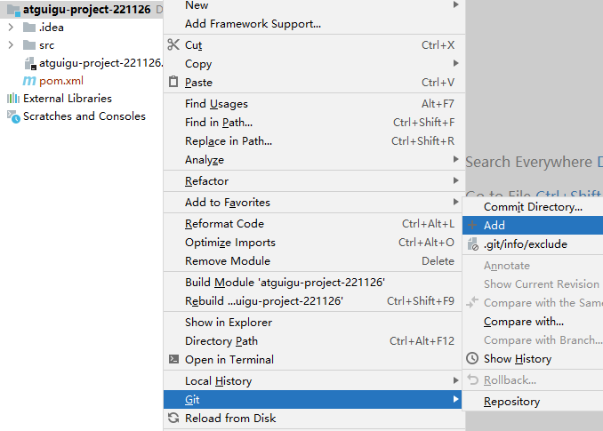

<p>提交操作：</p>

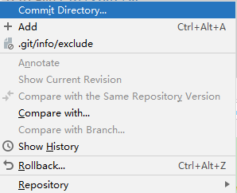

<br/>

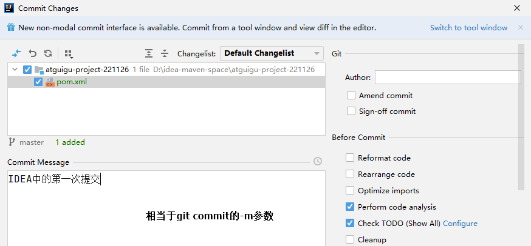

### ⑤分支操作
#### [1]操作的入口
在IDEA窗口的最右下角：<br/>

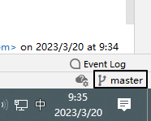

#### [2]新建分支
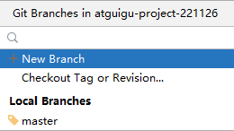

<br/>

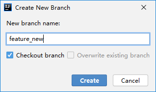

#### [3]切换分支


#### [4]合并分支
选择一个分支，把它的内容合并到当前分支：<br/>

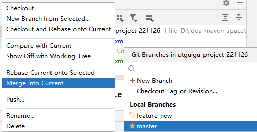

<p>协助IDEA创建必要的目录：</p>


### ⑥解决冲突
#### [1]代码层面的体现
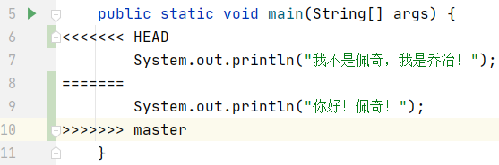

#### [2]友好提示
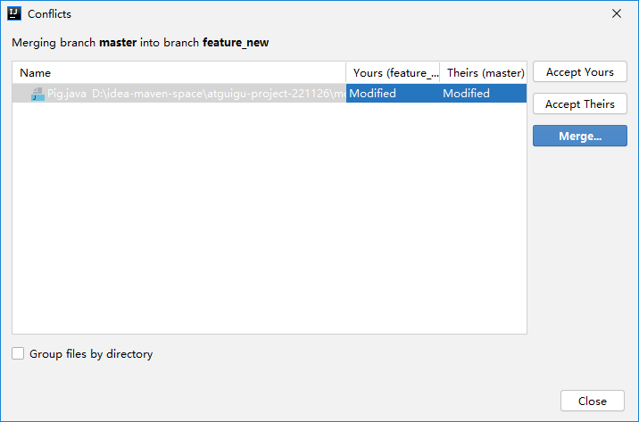

#### [3]冲突的编辑
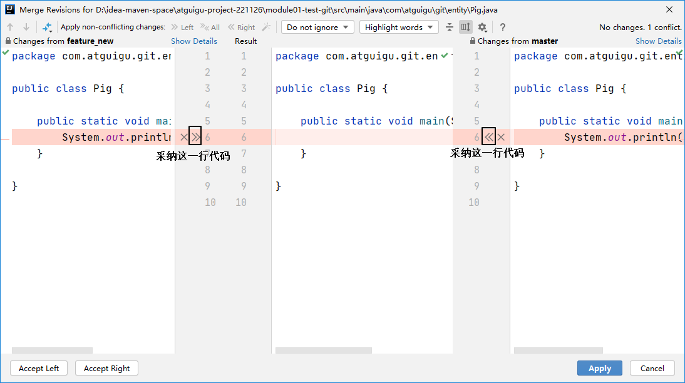

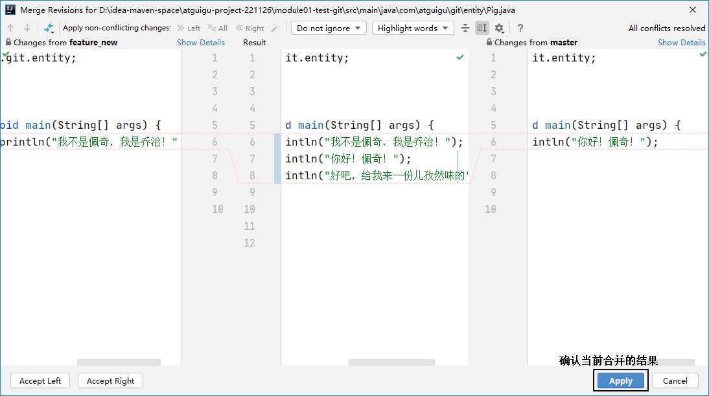


## 2、远程库操作
### ①安装Gitee插件
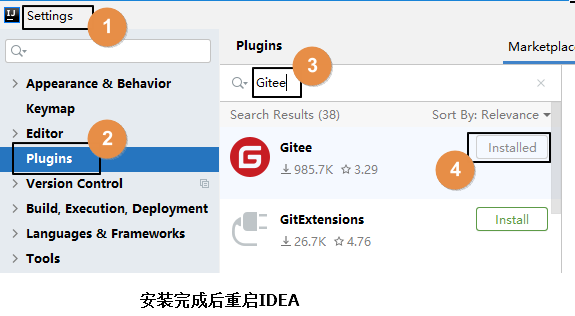

### ②设置Gitee账号
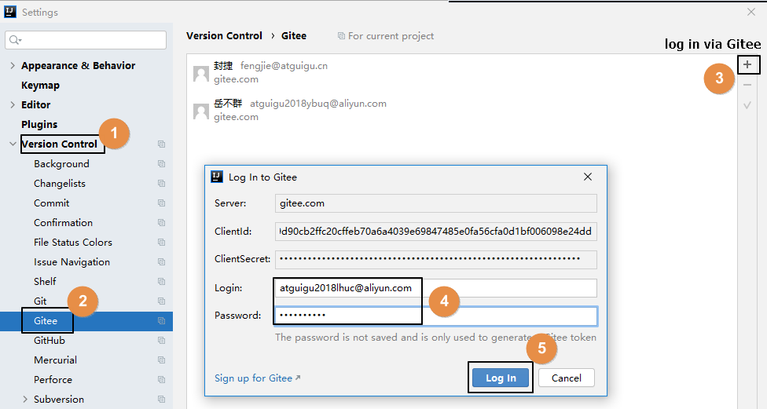

### ③分享
#### [1]分享工程


<br/>

如果需要创建私有库，则勾选Private：<br/>

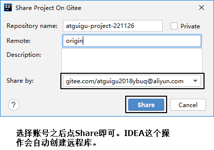

分享成功：<br/>


### ④克隆
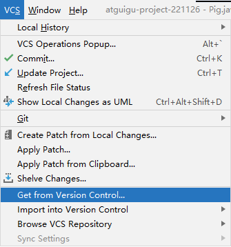


### ⑤推送和拉取
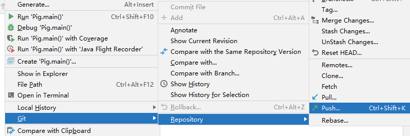

<br/>

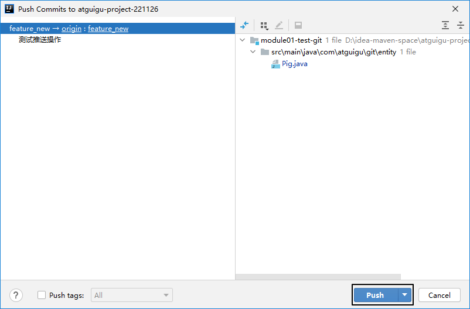

<br/>

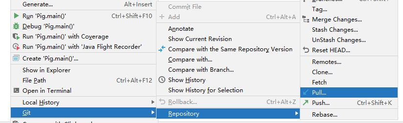

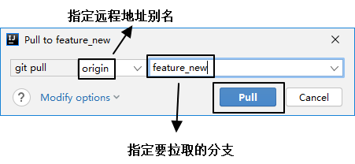

### ⑥远程库分支操作
#### [1]更新工程
远程库新建分支之后，IDEA并不会实时了解到这个变化。也就是说IDEA不会自动知道远程库新建的分支。<br/>

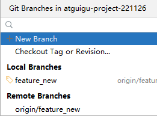

所以我们需要执行一个“更新工程”这样的操作：<br/>

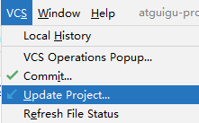

<br/>

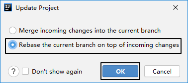

<br/>

更新之后，就能看到远程库新增的分支了：<br/>

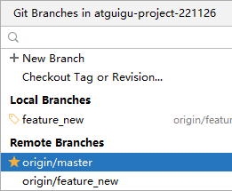


#### [2]切换到远程分支
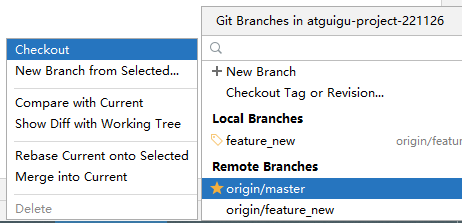

这样本地就也有这个新的分支了：<br/>

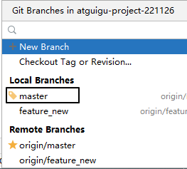

## 3、协同演练
略

# 六、补充：SSH登录
略