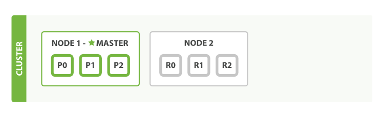

> 课件地址：https://www.wolai.com/hbmnycbejmS4cZkqSJKRF1<br/>
> 笔记地址：[note02-ElasticSearch.md · 封捷/note-frame-high-level - 码云 - 开源中国 (gitee.com)](https://gitee.com/heavy_code_industry/note-frame-high-level/blob/master/note02-ElasticSearch.md)<br/>
> 代码地址：[封捷/atguigu-project-new-221126 (gitee.com)](https://gitee.com/heavy_code_industry/atguigu-project-new-221126)

<br/>


<br/>

# 一、搜索概念
## 1、应用场景
- 全网搜索：百度、谷歌这样的搜索引擎
- 站内搜索：京东、QQ音乐

## 2、搜索如何实现
- **不使用索引**：逐行检查原始数据是否满足查询条件，性能极差
    - 查字典：到字典正文一页一页翻，查找想要找的字
- **使用索引**：先通过索引找到数据位置，精准定位后直接返回数据，性能提升非常大
    - 查字典：先到检字表中找到这个字以及这个字对应的页码，然后直接翻到这一页

## 3、倒排索引
### ①概念
全文搜索引擎目前主流的索引技术就是倒排索引的方式。
- 传统查询：根据 id 查询数据
- 倒排索引：根据关键词匹配分词结果，然后找到 id

### ②举例
#### [1]原始数据分词

|文档 ID|文档内容|
|-|-|
|1|谷歌地图之父跳槽Facebook|
|2|谷歌地图之父加盟Facebook|
|3|谷歌地图创始人拉斯离开谷歌加盟Facebook|
|4|谷歌地图之父跳槽Facebook，与Wave项目取消有关|
|5|谷歌地图之父拉斯加盟社交网站Facebook|

<br/>

|文档 ID|文档内容|
|-|-|
|1|[谷歌] [地图] [之父] [跳槽] [Facebook]|
|2|[谷歌] [地图] [之父] [加盟] [Facebook]|
|3|[谷歌] [地图] [创始] [创始人] [拉斯] [离开] [加盟] [Facebook]|
|4|[谷歌] [地图] [之父] [跳槽] [Facebook] [与] [Wave] [项目] [取消] [有关]|
|5|[谷歌] [地图] [之父] [拉斯] [加盟] [社交] [网站] [Facebook]|

#### [2]建立索引

|单词 ID|单词|关联文档的 ID|
|-|-|-|
|1|谷歌|1 2 3 4 5|
|2|地图|1 2 3 4 5|
|3|之父|1 2 4 5|
|4|跳槽|1 4|
|5|Facebook|1 2 3 4 5|
|6|加盟|2 3 5|
|7|创始|3|
|8|创始人|3|
|9|拉斯|3 5|
|10|离开|3|
|11|与|4|
|12|Wave|4|
|13|项目|4|
|14|取消|4|
|15|有关|4|
|16|社交|5|
|17|网站|5|

#### [3]搜索

用户搜索关键词：拉斯

到索引记录中查询，得知“拉斯”这个词曾出现在id为3和id为5的文档中。

然后就可以根据3和5查询文档本身的数据。

另外，全文索引还会根据匹配程度进行打分，匹配程度高的记录得分高，得分高的记录在搜索结果中靠前。

比如搜索“拉斯离开谷歌”那么3号记录得分就会高。

# 二、ElasticSearch 概述
[参见课件即可]

# 三、ElasticSearch 安装
## 1、获取安装程序
各版本安装程序下载地址：https://www.elastic.co/cn/downloads/past-releases#elasticsearch
<br/>
我们选择7.8.0：

<br/>


<br/>


<br/>

## 2、解压并运行
把elasticsearch-7.8.0-windows-x86_64.zip解压到非中文无空格目录，进入elasticsearch-7.8.0\bin目录。
然后双击运行elasticsearch.bat。


<br/>

启动完成后，在浏览器地址栏访问如下地址：
> http://localhost:9200/

看到如下页面显示则说明启动成功：<br/>


## 3、注意事项
### ①JDK版本
当前版本 ElasticSearch 要求 JDK 版本≥1.8。

### ②空间不足
默认情况下 ElasticSearch 需要 1G 空间来运行，如果当前主机内存不够，则会发生闪退的情况。
此时浏览器访问9200端口会发现提示空间不足。

<br/>

解决办法是：修改ElasticSearch解压目录/config/jvm.options文件。<br/>
把下面的配置项改为512M：

<br/>


<br/>

## 4、安装 Kibana
ElasticSearch 对外都是基于 RESTFul 风格提供 HTTP 服务，所以可以使用 Postman 来操作 ES。<br/>
另外，还可以使用 Kibana 这样的图形化界面客户端使操作更简单。<br/>
下载地址：https://www.elastic.co/cn/downloads/past-releases/kibana-7-8-0<br/>
下载后解压。

<br/>


解压后打开config/kibana.yml文件，找到下列内容，把注释打开：
```yaml
server.port: 5601
elasticsearch.hosts: ["http://localhost:9200"]
i18n.locale: "zh-CN"
```

运行kibana-7.8.0-windows-x86_64\\bin\\kibana.bat文件。再通过浏览器访问：
> http://localhost:5601

<br/>


<br/>


## 5、安装 IK 中文分词器
ElasticSearch本身不支持中文分词，所以需要我们另外安装中文分词器。而IK Analyzer是目前中文分词器中最好的一个。<br/>

### ①下载地址
> https://github.com/medcl/elasticsearch-analysis-ik/releases/download/v7.8.0/elasticsearch-analysis-ik-7.8.0.zip

### ②解压
解压elasticsearch-analysis-ik-7.8.0.zip文件，解压后的文件放入一个目录中，再把这个目录移动到 ES 的plugins目录下。

<br/>


<br/>

然后重启 ES。

### ③测试
IK 分词器提供了两种分词方式：
- ik_max_word：对文本做最细颗粒度拆分
- ik_smart：对文本做最粗颗粒度拆分

在 Kibana 中进行分词操作时可以指定分词器：
```text
POST _analyze
{
  "analyzer": "ik_smart",
  "text": "我是中国人"
}
```

# 四、ElasticSearch 数据结构

|ElasticSearch|MySQL|
|-|-|
|index|数据库|
|mapping|表结构|
|~~type~~|表|
|document|记录/行|
|field|字段/列|

<br/>

> ElasticSearch较高的版本已经废除了type这个概念。

<br/>

如果不考虑type：

|ElasticSearch|MySQL|
|-|-|
|index|表|
|mapping|表结构|
|document|记录/行|
|field|字段/列|

<br/>

ElasticSearch 中字符串有两种类型：
- text：原始数据分词，不能用来排序和聚合
- keyword：原始数据不分词，可以被用来检索过滤、排序和聚合

# 五、ElasticSearch 基本操作
## 1、index 相关操作
### ①创建索引
语法格式：
```text
PUT /索引名称
```

操作举例：
```text
PUT /my_index
```

### ②查看所有索引
语法格式：
```text
GET /_cat/indices?v
```

### ③查看单个索引的详细信息
语法格式：
```text
GET /索引名称
```

### ④删除索引
语法格式：
```text
DELETE /索引名称
```

## 2、document 相关操作
### ①创建文档
语法格式：
```text
PUT /索引名称/_doc/文档id
{
    json 格式数据
}
```

文档 id 如果存在则更新文档；不存在则新建文档。<br/>

操作举例：
```text
PUT /my_index/_doc/1
{
  "title": "小米手机",
  "category": "小米",
  "images": "http://www.gulixueyuan.com/xm.jpg",
  "price": 3999
}
```

ElasticSearch 有个强大的功能：类型推断。我们直接保存数据，ElasticSearch 可以根据我们保存的数据来推测它的类型。<br/>
但这也是双刃剑，有的时候 ElasticSearch 猜测的类型并不符合我们的预期。所以如果有特定需要那么就要在index中创建mapping来指定字段类型。<br/>

|数据|对应的类型|
|-|-|
|null|不添加字段|
|true 或 false|boolean|
|字符串|text|
|数值|long|
|小数|float|
|日期|date|


### ②查看文档
语法格式：
```text
GET /索引名称/_doc/文档id
```

### ③修改文档
和创建文档格式一样：文档 id 如果存在则更新文档；不存在则新建文档。

### ④修改局部属性
语法格式：
```text
POST /索引名称/_update/文档id
{
    "doc": {
        "属性名": "属性值"
    }
}
```

操作举例：
```text
POST /my_index/_update/1
{
    "doc": {
        "price": "2999"
    }
}
```

### ⑤删除文档
语法格式：
```text
DELETE /索引名称/_doc/文档id
```

操作举例：
```text
DELETE /my_index/_doc/1
```

### ⑥批量操作
#### [1]概述
批量操作通常分成三部分：
- 请求方式部分：POST _bulk
- 元数据部分：
    - 指定 bulk 动作
    - 指定执行批量操作的 index、type、文档 id 等信息
- 数据部分：执行批量操作用到的数据
```text
POST _bulk
{ action: { metadata }}
{ request body        }
{ action: { metadata }}
{ request body        }
```

总的语法规则：
- 每个 JSON 串都不能换行，只能放在同一行。
- 各个 JSON 串之间通过换行分隔，而不是逗号
- 多个操作不会因为某个操作失败而终止，返回结果会显示失败的详细原因

批量操作类型：
- create：批量创建文档。如果文档存在则返回错误
- index：如果文档不存在就创建，如果文档存在就更新
- update：更新一个文档，如果文档不存在就返回错误
- delete：删除一个文档，如果要删除的文档id不存在，就返回错误

#### [2]批量保存
```text
POST _bulk
{"create": {"_index":"my_index", "_id":1}}
{"emp_id":5,"emp_name":"name01","emp_age":20}
{"create": {"_index":"my_index", "_id":2}}
{"emp_id":6,"emp_name":"name02","emp_age":21}
{"create": {"_index":"my_index", "_id":3}}
{"emp_id":7,"emp_name":"name03","emp_age":22}
```

#### [3]批量删除
```text
POST _bulk
{"delete": {"_index":"my_index", "_id":2}}
{"delete": {"_index":"my_index", "_id":3}}
```

## 3、mapping 相关操作
### ①查看 mapping
语法格式：
```text
GET /索引名称/_mapping
```

### ②创建 mapping
> 注意：我们通常不会单独创建 mapping，mapping 也无法脱离 index 单独存在。
> 所以创建 mapping 也都是在创建 index 的时候同时进行

语法格式：
```text
PUT /索引名称
{
    "mappings":{
        "properties":{
            "字段名":{
                "type":"当前字段的数据类型",
                "index":布尔值，表示是否为当前字段建立索引,
                "store":布尔值，表示当前字段是否做额外存储,
                "analyzer":"当前字段使用的分词器名称",
                "search_analyzer":"搜索关键词使用的分词器"
            },
            "字段名":{
                ……
            }
        }
    }
}
```

操作举例：
```text
PUT /index_song
{
  "mappings": {
    "properties": {
      "song_id":{
        "type": "long",
        "index": true,
        "store": true
      },
      "song_name":{
        "type": "text",
        "index": true,
        "store": true,
        "analyzer": "ik_max_word",
        "search_analyzer": "ik_smart"
      },
      "singer":{
        "type": "keyword",
        "index": true,
        "store": true
      },
      "song_album":{
        "type": "text",
        "index": true,
        "store": true,
        "analyzer": "ik_max_word"
      },
      "song_lyric":{
        "type": "text",
        "index": true,
        "store": false,
        "analyzer": "ik_max_word"
      },
      "song_img":{
        "type": "keyword",
        "index": false,
        "store": true
      }
    }
  }
}
```

<br/>

### ③字段属性说明

#### [1]是否分词
- 需要分词的情况：分词之后，分词结果是有意义的、会被搜索的。例如：歌曲名称
- 不分词的情况：分词之后，分词结果没有意义，不会被搜索。例如：歌曲图片地址、地名、人名

<br/>

#### [2]是否索引
- 需要索引的情况：要搜索这个字段，就基于它建立索引。例如：歌曲名称
- 不需要索引的情况：不会被搜索的字段，不必建立索引。例如：歌曲图片地址

<br/>

# 六、DSL高级查询
<p>在ElasticSearch中，DSL代表Domain Specific Language（领域特定语言），用于构建丰富的查询和聚合操作。DSL是ElasticSearch提供的一种结构化查询语言，它允许用户以更直观和灵活的方式定义搜索条件和聚合操作。</p>

<br/>

<p>DSL查询可以按照各种条件进行过滤、排序和分页。它支持诸如匹配、范围查询、布尔逻辑、正则表达式等高级查询操作。同时，DSL还可以通过聚合操作对结果进行分组、计数、求和、平均值等统计分析。</p>

<br/>

## 1、测试数据
```text
POST db_song/_doc
{
  "song_name":"give me an apple",
  "song_singer":"tom",
  "song_album":"apple pie",
  "song_lyrics":"i want to give you an apple",
  "song_price":10
}

POST db_song/_doc
{
  "song_name":"happy tears",
  "song_singer":"jerry",
  "song_album":"apple farmer",
  "song_lyrics":"i will go to London",
  "song_price":20
}

POST db_song/_doc
{
  "song_name":"tears of happy",
  "song_singer":"jerry",
  "song_album":"apple farmer",
  "song_lyrics":"i will go to NewYork",
  "song_price":30
}

POST db_song/_doc
{
  "song_name":"fly me",
  "song_singer":"bigger one",
  "song_album":"two star",
  "song_lyrics":"i put an apple on your table",
  "song_price":40
}
```

## 2、查询全部
query下match_all
```text
# DSL：查询全部
# 从DSL语法角度来说，第一行是请求方式和请求地址，第一行下面是一个JSON格式的请求体
GET /db_song/_search
{
  "query": {
    "match_all": {}
  }
}
```

## 3、匹配查询
query下match
```text
# DSL：关键词匹配一个字段查询
GET /db_song/_search
{
  "query": {
    "match": {
      "song_name": "apple"
    }
  }
}
```

## 4、多字段匹配 [业务]
query下multi_match
```text
# DSL：关键词匹配多个字段
# 被命中的document的字段中，和关键词匹配的越多，在搜索结果中得分越高，说明匹配度越高
GET /db_song/_search
{
  "query": {
    "multi_match": {
      "query": "apple",
      "fields": [
        "song_name",
        "song_album",
        "song_singer",
        "song_lyrics"
      ]
    }
  }
}
```

## 5、前缀匹配
query下prefix
```text
# DSL查询：前缀匹配
# 分词结果以指定字符串开头的能匹配上
GET /db_song/_search
{
  "query": {
    "prefix": {
      "song_name": {
        "value": "app"
      }
    }
  }
}
```

## 6、关键字不分词
query下term
```text
# DSL查询：关键词不分词
# 原始数据：happy tears
# 原始数据分词结果：[happy][tears]
# 匹配方式：用happy tears和分词结果匹配，发现它和happy、tears都匹配不上
GET /db_song/_search
{
  "query": {
    "term": {
      "song_name": {
        "value": "happy tears"
      }
    }
  }
}
```

## 7、多个不分词的关键字
query下terms
```text
# DSL查询：多个不分词的关键词
GET /db_song/_search
{
  "query": {
    "terms": {
      "song_name": [
        "happy",
        "tears"
      ]
    }
  }
}
```

## 8、范围查询 [业务]
query下range
- gte: 大于等于，greater than equal
- lte: 小于等于，less than equal
- gt: 大于，greater than
- lt: 小于，less than
```text
# DSL查询：范围查询
# gte: 大于等于，greater than equal
# lte: 小于等于，less than equal
# gt: 大于，greater than
# lt: 小于，less than
GET /db_song/_search
{
  "query": {
    "range": {
      "song_price": {
        "gte": 20,
        "lte": 30
      }
    }
  }
}
```

## 9、bool查询 [业务]
bool 是 boolean 的缩写。表示布尔值的意思。<br/>
多个查询的组合，组合方式包括：
- must: 各个条件都必须满足，所有条件是 and 的关系
- should: 各个条件有一个满足即可，即各条件是 or 的关系
- must_not: 各个条件必须不满足，相当于各条件分别取反之后再 and
- filter: 与 must 效果等同，但是它不计算得分，效率更高点。同时也表示在已有查询结果的基础上再进行过滤

```text
# DSL查询：bool查询
# bool查询中的must
# must的值是一个数组，数组中每一个对象是一个查询条件，各个条件之间是“且”的关系
GET /db_song/_search
{
  "query": {
    "bool": {
      "must": [
        {
          "match": {
            "song_name": "apple"
          }
        },
        {
          "match": {
            "song_lyrics": "want"
          }
        }
      ]
    }
  }
}

# should的值是一个数组，数组中每一个对象是一个查询条件，各个条件之间是“或”的关系
GET /db_song/_search
{
  "query": {
    "bool": {
      "should": [
        {
          "match": {
            "song_name": "apple"
          }
        },
        {
          "match": {
            "song_lyrics": "London"
          }
        }
      ]
    }
  }
}

# must_not：各个条件取反，取反之后是“且”的关系
GET /db_song/_search
{
  "query": {
    "bool": {
      "must_not": [
        {
          "match": {
            "song_name": "apple"
          }
        },
        {
          "match": {
            "song_lyrics": "London"
          }
        }
      ]
    }
  }
}

# DSL查询：filter相当于不计算得分的must
GET /db_song/_search
{
  "query": {
    "bool": {
      "filter": [
        {
          "match": {
            "song_name":"apple"
          }
        },
        {
          "match": {
            "song_lyrics":"want"
          }
        }
      ]
    }
  }
}

# 从业务的角度也可以理解为：在前面查询结果的基础上，再进一步过滤
# DSL查询：组合各种语法
GET /db_song/_search
{
  "query": {
    "bool": {
      "must": [
        {
          "match": {
            "song_name": "apple"
          }
        }
      ],
      "filter": [
        {
          "range": {
            "song_price": {
              "gte": 10,
              "lte": 50
            }
          }
        }
      ]
    }
  }
}
```

# 七、进阶查询
## 1、聚合
### ①概念
本质上就是分组，相当于 SQL 中的 group by。

### ②测试数据
注意：只有不分词的字段才能聚合，text类型的字段无法参与聚合！
```text
PUT db_hr
{
  "mappings": {
    "properties": {
      "department":{
        "type": "keyword"
      },
      "subject":{
        "type": "keyword"
      }
    }
  }
}

# _bulk 表示批量导入数据
POST db_hr/_bulk
{ "index": {}}
{ "emp_name" : "nicole adler", "emp_age" : 20, "emp_salary":1000.00, "department":"hr","subject":"hr worker","birthday":"1995-10-12"}
{ "index": {}}
{ "emp_name" : "jason alex", "emp_age" : 21, "emp_salary":1100.00, "department":"hr","subject":"hr worker","birthday":"1992-03-07"}
{ "index": {}}
{ "emp_name" : "tom green", "emp_age" : 22, "emp_salary":1200.00, "department":"hr","subject":"hr manager","birthday":"1985-11-17"}
{ "index": {}}
{ "emp_name" : "jeff hare", "emp_age" : 23, "emp_salary":1300.00, "department":"hr","subject":"hr manager","birthday":"1999-10-14"}
{ "index": {}}
{ "emp_name" : "robert hill", "emp_age" : 24, "emp_salary":1400.00, "department":"hr","subject":"hr manager","birthday":"1997-10-11"}
{ "index": {}}
{ "emp_name" : "belinda arge", "emp_age" : 30, "emp_salary":1500.00, "department":"rd","subject":"java","birthday":"1992-05-08"}
{ "index": {}}
{ "emp_name" : "amy", "emp_age" : 31, "emp_salary":2100.00, "department":"rd","subject":"java","birthday":"2014-10-13"}
{ "index": {}}
{ "emp_name" : "hoffman", "emp_age" : 32, "emp_salary":5500.00, "department":"rd","subject":"java","birthday":"1998-02-01"}
{ "index": {}}
{ "emp_name" : "joyce dabney", "emp_age" : 25, "emp_salary":2800.00, "department":"rd","subject":"php","birthday":"1990-01-01"}
{ "index": {}}
{ "emp_name" : "rae de mesa", "emp_age" : 36, "emp_salary":7500.00, "department":"rd","subject":"php","birthday":"1983-07-06"}
{ "index": {}}
{ "emp_name" : "lisa", "emp_age" : 45, "emp_salary":15100.00, "department":"fi","subject":"fi worker","birthday":"1996-06-06"}
{ "index": {}}
{ "emp_name" : "kim deziel", "emp_age" : 55, "emp_salary":25100.00, "department":"fi","subject":"fi worker","birthday":"1991-09-11"}
{ "index": {}}
{ "emp_name" : "tina-louise foster", "emp_age" : 65, "emp_salary":35100.00, "department":"fi","subject":"fi manager","birthday":"1997-07-07"}
{ "index": {}}
{ "emp_name" : "brennan foti", "emp_age" : 75, "emp_salary":45100.00, "department":"fi","subject":"fi manager","birthday":"1998-08-15"}
```

### ③Hello World
DSL 语句：
```text
GET db_hr/_search
{
  "aggs": {
    "agg_hello_world": {
      "terms": {
        "field": "department"
      }
    }
  }
}
```

节选查询结果中的聚合部分：
```text
"aggregations" : {
    "agg_hello_world" : {
        "doc_count_error_upper_bound" : 0,
        "sum_other_doc_count" : 0,
        "buckets" : [
            {
              "key" : "hr",
              "doc_count" : 5
            },
            {
              "key" : "rd",
              "doc_count" : 5
            },
            {
              "key" : "fi",
              "doc_count" : 4
            }
        ]
    }
}
```

结果说明：
- buckets：聚合执行分组后得到的各个组
- key：聚合字段在当前组内的值
- doc_count：在当前组内包含document的数量

### ④并列的聚合
```text
# 并列的聚合：各聚各的，互不影响
GET /db_hr/_search
{
  "aggs": {
    "agg_dept": {
      "terms": {
        "field": "department"
      }
    },
    "agg_subject": {
      "terms": {
        "field": "subject"
      }
    }
  }
}
```

### ⑤嵌套的聚合
```text
# 嵌套的聚合：组内再分组
GET /db_hr/_search
{
  "aggs": {
    "agg_dept": {
      "terms": {
        "field": "department"
      },
      "aggs": {
        "agg_subject": {
          "terms": {
            "field": "subject"
          }
        }
      }
    }
  }
}
```

### ⑥对分组结果进行统计
- max：组内取最大值
- min：组内取最小值
- avg：组内取平均值
- sum：组内计算总数
- stats：组内汇总各项统计结果，包含上面的每一项
```text
# 计算每个部门平均工资
GET /db_hr/_search
{
  "aggs": {
    "agg_dept": {
      "terms": {
        "field": "department"
      },
      "aggs": {
        "avg_salary": {
          "avg": {
            "field": "emp_salary"
          }
        }
      }
    }
  }
}

# 按照各种方式统计
GET /db_hr/_search
{
  "aggs": {
    "agg_dept": {
      "terms": {
        "field": "department"
      },
      "aggs": {
        "agg_stats": {
          "stats": {
            "field": "emp_salary"
          }
        }
      }
    }
  }
}
```

## 2、指定查询结果字段
```text
# 指定查询结果中显示哪些字段
GET /db_hr/_search
{
  "query": {
    "match": {
      "emp_name": "adler"
    }
  }, 
  "_source": [
    "emp_name",
    "emp_age",
    "emp_salary"
  ]
}

```


## 3、高亮效果
```text
# 高亮效果
# 默认效果：围绕关键词加em标签
GET /db_hr/_search
{
  "query": {
    "match": {
      "emp_name": "adler"
    }
  },
  "highlight": {
    "fields": {
      "emp_name": {}
    }
  }
}

# 指定高亮效果
GET /db_hr/_search
{
  "query": {
    "match": {
      "emp_name": "adler"
    }
  },
  "highlight": {
    "fields": {
      "emp_name": {
        "pre_tags": "<span style='color:red;'>",
        "post_tags": "</span>"
      }
    }
  }
}
```

## 4、分页

使用 from、size 指定分页参数。<br/>
计算 from 值的公式：(pageNo-1)\*pageSize<br/>
适用场景：页面显示分页数据。因为from、size其实是先把所有查询结果取出再根据from、size截取，所以不适合大数据量。
```text
# 分页：from、size 分页
GET /db_hr/_search
{
  "query": {
    "match_all": {}
  },
  "from": 0,
  "size": 5
}
```

## 5、排序
```text
# 排序
# FIELD 位置：指定排序字段
# order 后面：排序方向
# 多字段排序：先根据第一个字段排序，在第一个字段值重复的范围内再根据第二个字段排序
GET /db_hr/_search
{
  "query": {
    "match_all": {}
  },
  "sort": [
    {
      "emp_salary": {
        "order": "desc"
      }
    },
    {
      "birthday": {
        "order": "asc"
      }
    }
  ]
}
```


# 八、High Level client 操作 ElasticSearch

<br/>


<br/>

## 1、搭建环境
### ①Maven 配置 POM
#### [1]父工程
```xml
<parent>
    <groupId>org.springframework.boot</groupId>
    <artifactId>spring-boot-starter-parent</artifactId>
    <version>2.3.6.RELEASE</version>
    <relativePath/>
</parent>
```

#### [2]依赖
```xml
<dependencies>
    <!--elasticsearch的高级别rest客户端-->
    <dependency>
        <groupId>org.elasticsearch.client</groupId>
        <artifactId>elasticsearch-rest-high-level-client</artifactId>
        <version>7.8.0</version>
    </dependency>
    <!--elasticsearch的rest客户端-->
    <dependency>
        <groupId>org.elasticsearch.client</groupId>
        <artifactId>elasticsearch-rest-client</artifactId>
        <version>7.8.0</version>
    </dependency>
    <!--elasticsearch的核心jar包-->
    <dependency>
        <groupId>org.elasticsearch</groupId>
        <artifactId>elasticsearch</artifactId>
        <version>7.8.0</version>
    </dependency>

    <dependency>
        <groupId>org.springframework.boot</groupId>
        <artifactId>spring-boot-starter</artifactId>
    </dependency>

    <!--json转换的jar包-->
    <dependency>
        <groupId>com.fasterxml.jackson.core</groupId>
        <artifactId>jackson-databind</artifactId>
        <version>2.9.9</version>
    </dependency>

    <!-- https://mvnrepository.com/artifact/com.alibaba/fastjson -->
    <dependency>
        <groupId>com.alibaba</groupId>
        <artifactId>fastjson</artifactId>
        <version>1.2.76</version>
    </dependency>

    <dependency>
        <groupId>org.springframework.boot</groupId>
        <artifactId>spring-boot-devtools</artifactId>
        <scope>runtime</scope>
        <optional>true</optional>
    </dependency>
    <dependency>
        <groupId>org.springframework.boot</groupId>
        <artifactId>spring-boot-configuration-processor</artifactId>
        <optional>true</optional>
    </dependency>
    <dependency>
        <groupId>org.projectlombok</groupId>
        <artifactId>lombok</artifactId>
        <optional>true</optional>
    </dependency>
    <dependency>
        <groupId>org.springframework.boot</groupId>
        <artifactId>spring-boot-starter-test</artifactId>
        <scope>test</scope>
    </dependency>
</dependencies>
```

#### [3]构建插件可选
```xml
<build>
    <plugins>
        <plugin>
            <groupId>org.springframework.boot</groupId>
            <artifactId>spring-boot-maven-plugin</artifactId>
        </plugin>
    </plugins>
</build>
```

### ②SpringBoot
#### [1]配置文件
application.properties
```properties
elasticsearch.host=localhost
elasticsearch.port=9200
```

#### [2]主启动类
不需要加额外注解，就是一个普通的主启动类

#### [3]配置类
```java
package com.atguigu.es.config;

import org.apache.http.HttpHost;
import org.elasticsearch.client.RestClient;
import org.elasticsearch.client.RestHighLevelClient;
import org.springframework.boot.context.properties.ConfigurationProperties;
import org.springframework.context.annotation.Bean;
import org.springframework.context.annotation.Configuration;

@Configuration
@ConfigurationProperties(prefix = "elasticsearch")
public class ElasticSearchConfig {

    private String host;
    private Integer port;

    public String getHost() {
        return host;
    }

    public void setHost(String host) {
        this.host = host;
    }

    public Integer getPort() {
        return port;
    }

    public void setPort(Integer port) {
        this.port = port;
    }

    @Bean
    public RestHighLevelClient restHighLevelClient(){
        RestHighLevelClient restHighLevelClient =
                new RestHighLevelClient(RestClient.builder(new HttpHost(host,port,"http")));
        return restHighLevelClient;
    }
}
```

#### [4]测试类
```java
package com.atguigu.es.test;

import org.junit.jupiter.api.Test;
import org.elasticsearch.client.RestHighLevelClient;
import org.springframework.boot.test.context.SpringBootTest;

@SpringBootTest
public class ElasticSearchTest {

    @Autowired
    private RestHighLevelClient restHighLevelClient;
}
```

## 2、索引相关操作
### ①创建索引
CreateIndexRequest导包时使用：org.elasticsearch.client.indices.CreateIndexRequest<br/>

```java
@Test
public void createIndex() throws IOException {
    CreateIndexRequest createIndexRequest = new CreateIndexRequest(INDEX_NAME);

    String mappingJSON = "{\n" +
            "    \"properties\": {\n" +
            "      \"name\": {\n" +
            "        \"type\": \"keyword\",\n" +
            "        \"index\": true,\n" +
            "        \"store\": true\n" +
            "      },\n" +
            "      \"age\": {\n" +
            "        \"type\": \"integer\",\n" +
            "        \"index\": true,\n" +
            "        \"store\": true\n" +
            "      },\n" +
            "      \"remark\": {\n" +
            "        \"type\": \"text\",\n" +
            "        \"index\": true,\n" +
            "        \"store\": true,\n" +
            "        \"analyzer\": \"ik_max_word\",\n" +
            "        \"search_analyzer\": \"ik_smart\"\n" +
            "      }\n" +
            "    }\n" +
            "  }";

    createIndexRequest.mapping(mappingJSON, XContentType.JSON);

    CreateIndexResponse createIndexResponse =
            restHighLevelClient.indices().create(createIndexRequest, RequestOptions.DEFAULT);

    boolean createIndexResult = createIndexResponse.isAcknowledged();

    System.out.println("createIndexResult = " + createIndexResult);
}
```

### ②查看索引
```java
@Test
public void getIndexTest() throws IOException {
    GetIndexRequest getIndexRequest = new GetIndexRequest(INDEX_NAME);

    GetIndexResponse getIndexResponse = restHighLevelClient.indices().get(getIndexRequest, RequestOptions.DEFAULT);

    Map<String, MappingMetadata> mappings = getIndexResponse.getMappings();
    Set<String> mappingsKeySet = mappings.keySet();
    for (String key : mappingsKeySet) {
        MappingMetadata mappingMetadata = mappings.get(key);
        System.out.println("key = " + key);
        System.out.println("mappingMetadata = " + mappingMetadata.sourceAsMap());
    }

    Map<String, Settings> settings = getIndexResponse.getSettings();
    Set<String> settingsKeySet = settings.keySet();
    for (String key : settingsKeySet) {
        Settings setting = settings.get(key);
        System.out.println("key = " + key);
        System.out.println("setting = " + setting);
    }

}
```

### ③删除索引
```java
@Test
public void testDelIndex() throws IOException {
    DeleteIndexRequest deleteIndexRequest = new DeleteIndexRequest(INDEX_NAME);

    AcknowledgedResponse response =
            restHighLevelClient.indices().delete(deleteIndexRequest, RequestOptions.DEFAULT);

    boolean deleteResult = response.isAcknowledged();

    System.out.println("deleteResult = " + deleteResult);
}
```

## 3、文档相关操作
### ①创建文档
```java
@Test
public void testSaveDoc() throws IOException {
    IndexRequest indexRequest = new IndexRequest(INDEX_NAME);

    indexRequest.id("1");

    User user = new User();
    user.setAge(20);
    user.setName("tom");
    user.setRemark("Good boy");

    indexRequest.source(JSON.toJSONString(user), XContentType.JSON);

    IndexResponse indexResponse = restHighLevelClient.index(indexRequest, RequestOptions.DEFAULT);

    DocWriteResponse.Result result = indexResponse.getResult();
    System.out.println("result = " + result);
}
```

### ②更新文档
```java
@Test
public void testUpdateDoc() throws IOException {
    UpdateRequest updateRequest = new UpdateRequest(INDEX_NAME, "1");

    User user = new User();
    user.setRemark("bab boy");

    updateRequest.doc(JSON.toJSONString(user), XContentType.JSON);

    UpdateResponse updateResponse = restHighLevelClient.update(updateRequest, RequestOptions.DEFAULT);

    DocWriteResponse.Result result = updateResponse.getResult();
    System.out.println("result = " + result);
}
```

### ③根据 id 查询文档
```java
@Test
public void testGetDoc() throws IOException {
    GetRequest getRequest = new GetRequest(INDEX_NAME);

    getRequest.id("1");

    GetResponse getResponse = restHighLevelClient.get(getRequest, RequestOptions.DEFAULT);

    String sourceAsString = getResponse.getSourceAsString();
    System.out.println("sourceAsString = " + sourceAsString);
}
```

### ④批量操作
```java
@Test
public void testBulk() throws IOException {
    BulkRequest bulkRequest = new BulkRequest(INDEX_NAME);

    for (int i = 0; i < 10; i++) {
        User user = new User();
        user.setAge(i * 10);
        user.setName("name " + i);
        user.setRemark("remark " + i);

        bulkRequest.add(
                new IndexRequest(INDEX_NAME)
                        .id("10" + i)
                        .source(JSON.toJSONString(user), XContentType.JSON));
    }

    BulkResponse bulkResponse = restHighLevelClient.bulk(bulkRequest, RequestOptions.DEFAULT);

    BulkItemResponse[] items = bulkResponse.getItems();
    for (BulkItemResponse item : items) {
        System.out.println("item = " + item.isFailed());
    }
}
```

### ⑤删除文档
```java
@Test
public void testDelDoc() throws IOException {
    DeleteRequest deleteRequest = new DeleteRequest(INDEX_NAME);

    deleteRequest.id("105");

    DeleteResponse deleteResponse =
            restHighLevelClient.delete(deleteRequest, RequestOptions.DEFAULT);

    DocWriteResponse.Result result = deleteResponse.getResult();
    System.out.println("result = " + result);
}
```

## 4、DSL 查询
### ①关键词匹配
对应DSL语句中的match查询：
```text
GET /db_song/_search
{
  "query": {
    "match": {
      "song_name": "apple"
    }
  }
}
```

<br/>

```java
@Test
public void testDSLQuery() throws IOException {
	// SearchRequest对象：代表发送给 ES 的整个请求
    SearchRequest searchRequest = new SearchRequest(INDEX_NAME_SONG);

	// SearchSourceBuilder对象：代表 DSL 语句
    SearchSourceBuilder searchSourceBuilder = new SearchSourceBuilder();

	// MatchQueryBuilder对象：代表 DSL 语句中query里面的match
    MatchQueryBuilder matchQuery = QueryBuilders.matchQuery("song_name", "apple");

	// SearchSourceBuilder对象的query()方法：代表 DSL 语句中的query
    searchSourceBuilder.query(matchQuery);

	// 把SearchSourceBuilder对象构造的 DSL 语句填充到请求对象中
    searchRequest.source(searchSourceBuilder);

	// 发送请求，执行查询，接收响应
    SearchResponse searchResponse = restHighLevelClient.search(searchRequest, RequestOptions.DEFAULT);

	// 对照 ES 返回的 JSON 数据格式，解析响应对象
    SearchHit[] hits = searchResponse.getHits().getHits();
    for (SearchHit hit : hits) {
        String searchResult = hit.getSourceAsString();
        System.out.println("searchResult = " + searchResult);
    }
}
```

### ②高亮查询
```java
    @Test
    public void testDSLQuery() throws IOException {
        SearchRequest searchRequest = new SearchRequest(INDEX_NAME_SONG);

        SearchSourceBuilder searchSourceBuilder = new SearchSourceBuilder();

        MatchQueryBuilder matchQuery = QueryBuilders.matchQuery("song_name", "apple");

        searchSourceBuilder.query(matchQuery);

        HighlightBuilder highlightBuilder = new HighlightBuilder();

        highlightBuilder.preTags("<span style='color:red;'>");
        highlightBuilder.postTags("</span>");
        highlightBuilder.field("song_name");

        searchSourceBuilder.highlighter(highlightBuilder);

        searchRequest.source(searchSourceBuilder);

        SearchResponse searchResponse = restHighLevelClient.search(searchRequest, RequestOptions.DEFAULT);

        SearchHit[] hits = searchResponse.getHits().getHits();
        for (SearchHit hit : hits) {
            String searchResult = hit.getSourceAsString();
            System.out.println("searchResult = " + searchResult);

            Map<String, HighlightField> highMap = hit.getHighlightFields();

            Set<Map.Entry<String, HighlightField>> entries = highMap.entrySet();

            for (Map.Entry<String, HighlightField> entry : entries) {
                String key = entry.getKey();
                HighlightField value = entry.getValue();

                System.out.println("key = " + key);
                System.out.println("value = " + value.getFragments()[0].toString());
            }
        }
    }

```

### ③聚合查询
```java
@Test
public void testAgg() throws IOException {
    SearchRequest searchRequest = new SearchRequest(INDEX_NAME_HR);

    SearchSourceBuilder searchSourceBuilder = new SearchSourceBuilder();

    searchSourceBuilder.aggregation(AggregationBuilders.terms("dept_agg").field("department"));

    searchRequest.source(searchSourceBuilder);

    SearchResponse searchResponse = restHighLevelClient.search(searchRequest, RequestOptions.DEFAULT);

    Map<String, Aggregation> aggregationMap = searchResponse.getAggregations().asMap();

    Set<String> keySet = aggregationMap.keySet();

    for (String key : keySet) {
        System.out.println("key = " + key);
        ParsedStringTerms parsedStringTerms = (ParsedStringTerms) aggregationMap.get(key);

        List<? extends Terms.Bucket> buckets = parsedStringTerms.getBuckets();

        for (Terms.Bucket bucket : buckets) {
            Object bucketKey = bucket.getKey();
            System.out.println("bucketKey = " + bucketKey);

            long docCount = bucket.getDocCount();
            System.out.println("docCount = " + docCount);
        }
    }
}
```

# 九、SpringData ElasticSearch
## 1、搭建环境
### ①Maven 配置 POM
#### [1]父工程
```xml
<parent>
    <groupId>org.springframework.boot</groupId>
    <artifactId>spring-boot-starter-parent</artifactId>
    <version>2.3.6.RELEASE</version>
    <relativePath/>
</parent>
```

#### [2]依赖
```xml
<dependencies>
    <dependency>
        <groupId>org.springframework.boot</groupId>
        <artifactId>spring-boot-starter-web</artifactId>
    </dependency>
    <dependency>
        <groupId>org.projectlombok</groupId>
        <artifactId>lombok</artifactId>
        <optional>true</optional>
    </dependency>
    <dependency>
        <groupId>org.springframework.boot</groupId>
        <artifactId>spring-boot-starter-test</artifactId>
        <scope>test</scope>
    </dependency>
    <dependency>
        <groupId>org.springframework.boot</groupId>
        <artifactId>spring-boot-starter-data-elasticsearch</artifactId>
    </dependency>
</dependencies>
```

### ②SpringBoot
#### [1]配置文件
application.properties
```properties
# ES 服务地址
elasticsearch.host=127.0.0.1
# ES 服务端口
elasticsearch.port=9200
# 配置日志级别,开启debug日志
logging.level.com.atguigu=debug
```

#### [2]配置类
ElasticsearchRestTemplate是spring-data-elasticsearch项目中的一个类，和其他spring项目中的template类似。<br/>

在新版的spring-data-elasticsearch中，**ElasticsearhRestTemplate**代替了原来的**ElasticsearchTemplate**。<br/>

原因是ElasticsearchTemplate基于TransportClient，TransportClient即将在8.x以后的版本中移除。所以，我们推荐使用ElasticsearchRestTemplate。<br/>

ElasticsearchRestTemplate基于RestHighLevelClient客户端的。需要自定义配置类，继承AbstractElasticsearchConfiguration，并实现elasticsearchClient()抽象方法，创建RestHighLevelClient对象。<br/>
```java
@Data
@Configuration
@ConfigurationProperties(prefix = "elasticsearch")
public class ElasticSearchConfig extends AbstractElasticsearchConfiguration {

    private String host;
    private Integer port;

    @Override
    public RestHighLevelClient elasticsearchClient() {

        RestClientBuilder builder = RestClient.builder(new HttpHost(host, port));
        RestHighLevelClient restHighLevelClient = new RestHighLevelClient(builder);
        return restHighLevelClient;

    }
}
```

### ③主启动类
常规无特殊

## 2、数据建模
### ①实体类
映射 ES 中的 Document
```java
@Data
@Document(indexName = "product",shards = 1, replicas = 1)
public class Product implements Serializable {
    // @Id 注解声明这个字段是 document 的 id
    @Id
    private Long id;

    // 声明普通字段，指定字段类型、分词器
    @Field(type = FieldType.Text, analyzer = "ik_max_word")
    private String productName;

    @Field(type = FieldType.Integer)
    private Integer store;

    @Field(type = FieldType.Double, index = true, store = false)
    private double price;
}
```

### ②Dao
```java
@Repository
public interface ProductRepository extends ElasticsearchRepository<Product, Long> {
}
```

### ③测试类
```java
package com.atguigu.es.test;

import com.atguigu.es.dao.ProductRepository;
import org.junit.jupiter.api.Test;
import org.springframework.beans.factory.annotation.Autowired;
import org.springframework.boot.test.context.SpringBootTest;
import org.springframework.data.elasticsearch.core.ElasticsearchRestTemplate;

@SpringBootTest
public class ElasticSearchTest {

    @Autowired
    private ProductRepository productRepository;

    @Autowired
    private ElasticsearchRestTemplate elasticsearchRestTemplate;

    @Test
    public void testInit() {
        // IOC 容器初始化的过程中，会根据 Product 实体类创建 index、mapping
    }

}

```

## 3、数据操作
### ①保存文档
```java
@Test
public void testSave() {

    Product product = new Product();
    product.setId(505L);
    product.setProductName("Hello Goods");
    product.setStore(6789);
    product.setPrice(3366.77);

    productRepository.save(product);
}
```

### ②根据 id 查询文档
```java
@Test
public void testGetById() {
    Product product = productRepository.findById(505L).get();
    System.out.println("product = " + product);
}
```

### ③查询全部并排序
```java
@Test
public void testSort() {
    Iterable<Product> iterable = productRepository.findAll(Sort.by(Sort.Direction.DESC, "price"));
    for (Product product : iterable) {
        System.out.println("product = " + product);
    }
}
```

## 4、自定义方法
### ①简介
Spring Data 的另一个强大功能，是根据方法名称自动实现功能。比如你的方法名叫做：findByTitle，那么它就知道你是根据title查询，然后自动帮你完成，无需写实现类。当然，方法名称要符合一定的约定。
虽然基本查询和自定义方法已经很强大了，但是如果是复杂查询（模糊、通配符、词条查询等）就显得力不从心了。此时，我们只能使用原生查询。

<br/>


### ②声明自定义方法
```java
@Repository
public interface ProductRepository extends ElasticsearchRepository<Product, Long> {

    List<Product> findByPriceBetween(double price1, double price2);

}
```

### ③测试自定义方法
```java
@Test
public void testDIY() {
    List<Product> productList =
            productRepository.findByPriceBetween(2000, 5000);
    for (Product product : productList) {
        System.out.println("product = " + product);
    }
}
```

# 十、ElasticSearch 集群[选学]
## 1、需求
单台ElasticSearch服务器往往都有最大的负载能力的限制。超过这个阈值，服务器性能就会大大降低甚至不可用。<br/>
所以生产环境中，一般都需要搭建ElasticSearch集群。<br/>
除了负载能力，单点服务器也存在其他问题：<br/>
- 单节点存储容量有限
- 存在单点故障隐患，无法实现高可用
- 单服务的并发处理能力有限

配置服务器集群时，集群中节点数量没有限制，大于等于2个节点就可以看做是集群了。<br/>
一般出于高性能及高可用方面来考虑，集群中节点数量都是3个以上。

## 2、概述
### ①空集群


### ②拥有一个索引的单节点集群


### ③拥有两个节点的集群
所有主分片和副本分片都已被分配

<br/>



### ④拥有三个节点的集群
为了分散负载而对分片进行重新分配

<br/>


### ⑤将参数 number_of_replicas 调大到 2


### ⑥关闭了一个节点后的集群


## 3、核心概念
### ①集群 Cluster
一个集群就是由一个或多个服务器节点组织在一起，共同持有整个数据，并一起提供索引和搜索功能。<br/>
一个ElasticSearch集群有一个共同的名称，默认是”elasticsearch”。<br/>
名字一样的节点会进入同一个集群；反过来说不同集群就是用不同名称来区分的。<br/>

### ②节点 Node
集群中包含很多服务器，一个节点就是其中的一个服务器。作为集群的一部分，它存储数据，参与集群的索引和搜索功能。
一个节点也是由一个名字来标识的，默认情况下，这个名字是一个随机的漫威漫画角色的名字，这个名字会在启动的时候赋予节点。
根据这个名字可以确定网络中的哪些服务器对应于ElasticSearch集群中的哪些节点。
一个节点可以通过配置集群名称的方式来加入一个指定的集群。默认情况下，每个节点都会被安排加入到一个叫做“elasticsearch”的集群中，
这意味着，如果你在你的网络中启动了若干个节点，并假定它们能够相互发现彼此，它们将会自动地形成并加入到一个叫做“elasticsearch”的集群中。
在一个集群里，只要你想，可以拥有任意多个节点。而且，如果当前你的网络中没有运行任何Elasticsearch节点，这时启动一个节点，
会默认创建并加入一个叫做“elasticsearch”的集群。

### ③分片 Shards
一个索引可以存储超出单个节点硬件限制的大量数据。
比如，一个具有10亿文档数据的索引占据1TB的磁盘空间，而任一节点都可能没有这样大的磁盘空间。
或者单个节点处理搜索请求，响应太慢。
为了解决这个问题，Elasticsearch提供了将索引划分成多份的能力，每一份就称之为分片。
当你创建一个索引的时候，你可以指定你想要的分片的数量。
每个分片本身也是一个功能完善并且独立的“索引”，这个“索引”可以被放置到集群中的任何节点上。

<br/>

分片很重要，主要有两方面的原因：
- 允许你水平分割 / 扩展你的内容容量。
- 允许你在分片之上进行分布式的、并行的操作，进而提高性能/吞吐量。
至于一个分片怎样分布，它的文档怎样聚合和搜索请求，是完全由Elasticsearch管理的，对用户透明。<br/>

我们可以在建立索引的时候创建分片信息：<br/>
```text
#number_of_shards：主分片数量,默认1(6.x版本默认为5)
#number_of_replicas：每个主分片对应的副本数量,默认1
PUT /users
{
  "settings": {
    "number_of_shards": 3,
    "number_of_replicas": 2
  }
}
```


<br/>
- ★表示master节点
- ●表示DataNode节点

粗线框格子为主分片，细线框为副本分片，主分片与副本分片不能同时在同一个节点上。<br/>
上述例子中，创建3个主分片，每个主分片配置了2个副本分片，加起来一共9个分片。<br/>
分片序号分别为0、1、2代表不同的数据段存储。其中0号分片的主分片在node-3机器上，node-1和node-2是它的备份分片。<br/>
**注意：主分片数量一旦指定后就不允许更改，否则会影响后续的数据操作(分片位置路由是取模主分片数量)。**<br/>
虽然主分片数量不可用更改，但是副本数量可以修改：

```text
粗线框格子为主分片，细线框为副本分片，主分片与副本分片不能同时在一台机器上。
```

### ④副本 Replicas
在一个网络/云的环境里，失败随时都可能发生，在某个分片/节点不知怎么的就处于离线状态，或者由于任何原因消失了，
这种情况下，有一个故障转移机制是非常有用并且是强烈推荐的。为此目的，Elasticsearch允许你创建分片的一份或多份拷贝，这些拷贝叫做复制分片(副本)。

<br/>

复制分片之所以重要，有两个主要原因：
- 在分片/节点有可能失败的情况下，提供了高可用性。为了达到这个效果，复制分片不和主分片放在同一个节点上。
- 扩展你的搜索量/吞吐量，因为搜索可以在所有的副本上并行运行。

总之，每个索引可以被分成多个分片。一个索引也可以被复制0次（意思是没有复制）或多次。<br/>
一旦复制了，每个索引就有了主分片（作为复制源的原来的分片）和复制分片（主分片的拷贝）之别。<br/>
分片和复制的数量可以在索引创建的时候指定。在索引创建之后，可以改变复制分片数量，但不能改变主分片数量。<br/>
默认情况下，Elasticsearch中的每个索引被分片1个主分片和1个复制分片，这样的话每个索引总共就有2个分片。<br/>
如果此时集群中有两个节点，那么这两个分片分别存放在两个节点上。

### ⑤分配 Allocation
将分片分配给某个节点的过程，包括分配主分片或者副本。如果是副本，还包含从主分片复制数据的过程。<br/>
这个过程是由master节点完成的。 即：Elasticsearch的分片分配和均衡机制。

### ⑥节点类型
ES 中的节点类型分为：Master、DataNode。
#### [1]master
Elasticsearch启动时，会选举出来一个Master节点。<br/>
大致的过程是：当某个节点启动后，使用Zen Discovery机制找到集群中的其他节点，并建立连接。<br/>
并从候选节点中选举出一个主节点。<br/>
参考配置如下：
```yaml
discovery.seed_hosts: [“host1”, “host2”, “host3”]
cluster.initial_master_nodes: [“node-1”, “node-2”,“node-3”]
```

Master节点主要负责：
- 管理索引（创建索引、删除索引）、分配分片
- 维护元数据
- 管理集群节点状态
不负责数据写入和查询，比较轻量级。一个ElasticSearch集群中，只有一个Master节点。在生产环境中，内存可以相对小一点，但要确保机器稳定。

#### [2]DataNode
数据节点可以有多个，负责：数据写入、数据检索，大部分Elasticsearch的压力都在DataNode节点上，在生产环境中，内存最好配置大一些。

### ⑦总结


<br/>

一个运行中的 Elasticsearch 实例称为一个节点，而集群是由一个或者多个拥有相同 cluster.name 配置的节点组成，它们共同承担数据和负载的压力。<br/>
当有节点加入集群中或者从集群中移除节点时，集群将会重新平均分布所有的数据。<br/>
当一个节点被选举成为主节点时，它将负责管理集群范围内除数据外的所有变更。<br/>
例如增加、删除索引，或者增加、删除节点等。作为用户，我们可以将请求发送到集群中的任何节点，包括主节点。<br/>
每个节点都知道任意文档所处的位置，并且能够将我们的请求直接转发到存储我们所需文档的节点。<br/>
无论我们将请求发送到哪个节点，它都能负责从各个包含我们所需文档的节点收集回数据，并将最终结果返回給客户端。<br/>
Elasticsearch 对这一切的管理都是透明的。

## 4、搭建
### ①创建目录
elasticsearch-cluster

### ②复制 ES 目录
先删除data目录，然后把原来的 ES 解压目录复制成三份：


<br/>

### ③修改配置文件
config/elasticsearch.yml

#### [1]实例 9301
```yaml
#集群名称
cluster.name: my-application
#默认为true。设置为false禁用磁盘分配决定器。
cluster.routing.allocation.disk.threshold_enabled: false
#节点名称
node.name: node-1
#配置允许的访问网络
network.host: 0.0.0.0
#http服务端口
http.port: 9201
#集群间通信端口号，在同一机器下必须不一样
transport.tcp.port: 9301
#是否允许为主节点，默认true
node.master: true
#是否为数据节点，默认true
node.data: true
#初始配置选举master节点
cluster.initial_master_nodes: ["node-1"]
#节点发现
discovery.seed_hosts: ["127.0.0.1:9301","127.0.0.1:9302","127.0.0.1:9303"]
#elasticsearch-head 跨域解决
http.cors.allow-origin: "*"
http.cors.enabled: true
```

#### [2]实例 9302
```yaml
#集群名称
cluster.name: my-application
#默认为true。设置为false禁用磁盘分配决定器。
cluster.routing.allocation.disk.threshold_enabled: false
#节点名称
node.name: node-2
#配置允许的访问网络
network.host: 0.0.0.0
#http服务端口
http.port: 9202
#集群间通信端口号，在同一机器下必须不一样
transport.tcp.port: 9302
#是否允许为主节点，默认true
node.master: true
#是否为数据节点，默认true
node.data: true
#初始配置选举master节点
cluster.initial_master_nodes: ["node-1"]
#节点发现
discovery.seed_hosts: ["127.0.0.1:9301","127.0.0.1:9302","127.0.0.1:9303"]
#elasticsearch-head 跨域解决
http.cors.allow-origin: "*"
http.cors.enabled: true
```

#### [3]实例 9303
```yaml
#集群名称
cluster.name: my-application
#默认为true。设置为false禁用磁盘分配决定器。
cluster.routing.allocation.disk.threshold_enabled: false
#节点名称
node.name: node-3
#配置允许的访问网络
network.host: 0.0.0.0
#http服务端口
http.port: 9203
#集群间通信端口号，在同一机器下必须不一样
transport.tcp.port: 9303
#是否允许为主节点，默认true
node.master: true
#是否为数据节点，默认true
node.data: true
#初始配置选举master节点
cluster.initial_master_nodes: ["node-1"]
#节点发现
discovery.seed_hosts: ["127.0.0.1:9301","127.0.0.1:9302","127.0.0.1:9303"]
#elasticsearch-head 跨域解决
http.cors.allow-origin: "*"
http.cors.enabled: true
```

### ④修改 Kibana 配置
Kibana 不需要复制，只需要把配置文件修改一下。<br/>
配置文件路径：config/kibana.yml<br/>
```yaml
elasticsearch.hosts: ["http://localhost:9200","http://localhost:9201","http://localhost:9202","http://localhost:9203"]
```

### ⑤启动测试
```text
# 查看集群健康度
GET /_cluster/health

# 查看节点信息
GET /_cat/nodes
```

节点健康度指标说明：
- 绿色：所有的主分片和副本分片都已分配。你的集群是 100% 可用的。
- 黄色：所有的主分片已经分片了，但至少还有一个副本是缺失的。不会有数据丢失，所以搜索结果依然是完整的。不过，你的高可用性在某种程度上被弱化。如果 更多的 分片消失，你就会丢数据了。把 yellow 想象成一个需要及时调查的警告。
- 红色：至少一个主分片（以及它的全部副本）都在缺失中。这意味着你在缺少数据：搜索只能返回部分数据，而分配到这个分片上的写入请求会返回一个异常。

### ⑥查看集群信息的图形化界面工具
把elasticsearch-head-master.zip解压到非中文无空格目录下。<br/>
在命令行下进入解压目录，运行：npm start

### ⑦数据测试
创建索引：
```text
PUT /shopping
{
  "settings": {
    "index": {
      "number_of_shards": "3",
      "number_of_replicas": "2"
    }
  },
  "mappings": {
      "properties": {
        "title":{
          "type": "text",
          "analyzer": "ik_max_word"
        },
        "subtitle":{
          "type": "text",
          "analyzer": "ik_max_word"
        },
        "images":{
          "type": "keyword",
          "index": false
        },
        "price":{
          "type": "float",
          "index": true
        }
      }
  }
}
```

保存文档：
```text
POST /shopping/_doc/1
{
    "title":"小米手机",
    "images":"http://www.gulixueyuan.com/xm.jpg",
    "price":3999.00
}
```
