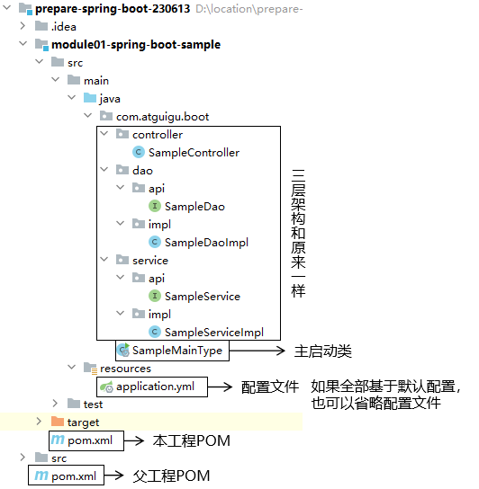

# 一、SpringBoot要解决的问题
SpringFramework 配置文件太过冗长，大型项目开发仍然不够简洁高效。

# 二、SpringBoot介绍
## 1、优势
- Create stand-alone Spring applications
- Embed Tomcat, Jetty or Undertow directly (no need to deploy WAR files)
- Provide opinionated 'starter' dependencies to simplify your build configuration
- Automatically configure Spring and 3rd party libraries whenever possible
- Provide production-ready features such as metrics, health checks, and externalized configuration
- Absolutely no code generation and no requirement for XML configuration

<br/>

翻译如下：
- 创建独立的Spring应用程序
- 直接内置Tomcat、Jetty、Undertow，所以不必为了部署应用而导出war文件
- 通过场景启动器封装了Spring Boot团队基于最佳实践的设计决策，从而简化构建配置
- 尽可能自动配置Spring和第三方库
- 提供可用于生产的功能，如度量、运行状况检查和外部化配置
- 告别了生成代码和XML配置

# 三、SpringBoot HelloWorld
## 1、一个SpringBoot应用的基本构成


## 2、HelloWorld操作
### ①目标
浏览器访问Controller方法，在页面上看到Controller方法返回的响应。

### ②配置父工程POM
```xml
<parent>  
    <groupId>org.springframework.boot</groupId>  
    <artifactId>spring-boot-starter-parent</artifactId>  
    <version>2.3.6.RELEASE</version>  
</parent>
```

### ③模块工程引入Web场景启动器
```xml
<dependencies>  
    <dependency>  
        <groupId>org.springframework.boot</groupId>  
        <artifactId>spring-boot-starter-web</artifactId>  
    </dependency>  
</dependencies>
```

### ④模块工程创建主启动类
```java
package com.atguigu.boot;  
  
import org.springframework.boot.SpringApplication;  
import org.springframework.boot.autoconfigure.SpringBootApplication;  

// 把当前工程标记为一个SpringBoot工程
@SpringBootApplication
public class SampleMainType {  
  
    public static void main(String[] args) {
	    // 进入SpringBoot启动流程  
        SpringApplication.run(SampleMainType.class, args);  
    }  
  
}
```

### ⑤模块工程创建Controller类
```java
@RestController  
public class SampleController {
  
    @GetMapping("/sample")  
    public String sample() {  
        return "sample data";  
    }  
  
}
```

## 3、HelloWorld解析
### ①为什么没有contextPath？

### ②为什么没有配置自动扫描的包？

### ③如何自定义扫描包的范围？

### ④为什么Web starter不需要写版本号？

### ⑤为什么只需要导入Web starter一个依赖？