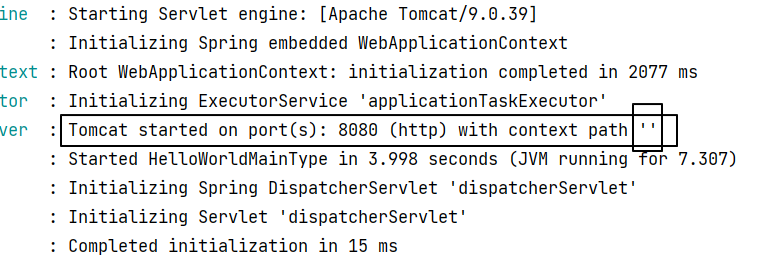
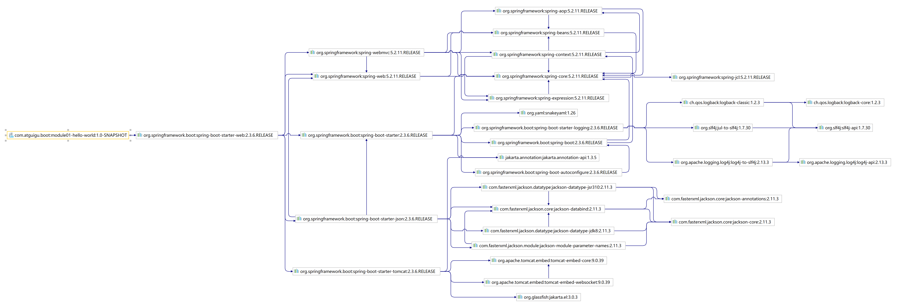

> 名字：封捷

<br/>


<br/>


<br/>

# 一、SpringBoot要解决的问题
SpringFramework 配置文件太过冗长，大型项目开发仍然不够简洁高效。所以SpringBoot相当于Spring Framework的进一步封装。

# 二、SpringBoot介绍
## 1、优势
- Create stand-alone Spring applications
- Embed Tomcat, Jetty or Undertow directly (no need to deploy WAR files)
- Provide opinionated 'starter' dependencies to simplify your build configuration
- Automatically configure Spring and 3rd party libraries whenever possible
- Provide production-ready features such as metrics, health checks, and externalized configuration
- Absolutely no code generation and no requirement for XML configuration

<br/>

翻译如下：
- 创建独立的Spring应用程序
- 直接内置Tomcat、Jetty、Undertow，所以不必为了部署应用而导出war文件
- 通过场景启动器封装了Spring Boot团队基于最佳实践的设计决策，从而简化构建配置
- 尽可能自动配置Spring和第三方库
- 提供可用于生产的功能，如度量、运行状况检查和外部化配置
- 告别了生成代码和XML配置

# 三、SpringBoot HelloWorld
## 1、一个SpringBoot应用的基本构成


## 2、HelloWorld操作
### ①目标
浏览器访问Controller方法，在页面上看到Controller方法返回的响应。

### ②配置父工程POM
```xml
<!-- 继承 SpringBoot 父工程 -->
<parent>  
    <groupId>org.springframework.boot</groupId>  
    <artifactId>spring-boot-starter-parent</artifactId>  
    <version>2.3.6.RELEASE</version>  
</parent>
```

### ③模块工程引入Web场景启动器
```xml
<dependencies>  
	<!-- 封装 Web 开发功能的场景启动器 -->
    <dependency>  
        <groupId>org.springframework.boot</groupId>  
        <artifactId>spring-boot-starter-web</artifactId>  
    </dependency>  
</dependencies>
```

### ④模块工程创建主启动类
```java
// 把当前类标记为 SpringBoot 的主启动类  
@SpringBootApplication  
public class HelloWorldMainType {  
  
    // 当前 SpringBoot 应用程序入口  
    public static void main(String[] args) {  
        // 调用 run() 方法进入 SpringBoot 启动流程  
        // 传入参数1：当前类的 Class 对象  
        // 传入参数2：main() 方法的参数  
        SpringApplication.run(HelloWorldMainType.class, args);  
    }  
  
}
```

### ⑤模块工程创建Controller类
```java
@RestController  
public class SampleController {
  
    @GetMapping("/sample")  
    public String sample() {  
        return "sample data";  
    }  
  
}
```

## 3、HelloWorld解析
### ①为什么没有contextPath？


<br/>

通过SpringBoot启动日志我们看到，默认情况下，contextPath被设置为了空字符串，所以8080后面直接对应@GetMapping注解地址即可。

<br/>

如果希望修改contextPath的值，可以编写SpringBoot配置文件。以properties格式配置文件为例：
```properties
server.servlet.context-path=/apple
```

重启SpringBoot应用使配置生效。此时就需要带上contextPath来访问Controller了：
> http://localhost:8080/apple/say/hello/to/spring/boot


### ②为什么没有配置自动扫描的包？
因为SpringBoot默认设定了自动扫描包的范围：
- 主启动类所在包
- 主启动类所在包的子包

<br/>

### ③如何自定义扫描包的范围？
如果希望修改扫描包的范围，可以使用@ComponentScan注解：
```java
// 把当前类标记为 SpringBoot 的主启动类  
@SpringBootApplication  
  
// 指定扫描包的范围  
@ComponentScan("com.atguigu.boot.fixed")  
public class HelloWorldMainType {  
  
    // 当前 SpringBoot 应用程序入口  
    public static void main(String[] args) {  
        // 调用 run() 方法进入 SpringBoot 启动流程  
        // 传入参数1：当前类的 Class 对象  
        // 传入参数2：main() 方法的参数  
        SpringApplication.run(HelloWorldMainType.class, args);  
    }  
  
}
```


### ④为什么Web starter不需要写版本号？
```xml
<!-- 封装 Web 开发功能的场景启动器 -->  
<dependency>  
    <groupId>org.springframework.boot</groupId>  
    <artifactId>spring-boot-starter-web</artifactId>  
</dependency>
```

因为当前工程直接或间接继承了spring-boot-starter-parent，它的父工程是spring-boot-dependencies，在这里看到了依赖信息的完整声明：
```xml
<dependency>  
  <groupId>org.springframework.boot</groupId>  
  <artifactId>spring-boot-starter-web</artifactId>  
  <version>2.3.6.RELEASE</version>  
</dependency>
```

<br/>

从spring-boot-dependencies中看到了很多被管理的依赖，这些依赖都是将来我们可以直接拿来用的。


### ⑤为什么只需要导入Web starter一个依赖？

我们发现，在HelloWorld中，导入了Web starter就能够使用SpringMVC全部的功能了，泰酷辣！<br/>

这是因为SpringBoot开发团队借助Maven依赖的传递性，把当前场景所需要的所有依赖都封装到场景启动器中了（场景启动器也叫“起步依赖”）。<br/>

所以我们在特定场景下开发时，只需要引入starter，而不必关心具体都需要哪些jar包。<br/>

不仅非常方便，而且SpringBoot开发团队对每个场景所需的所有jar包的版本都进行了严格测试（版本仲裁），我们可以放心使用，不会有jar包版本冲突问题。