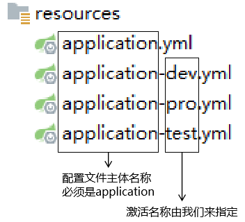

# 一、不同环境不同配置
## 1、服务器环境介绍


<p>不同环境有整套的、不同的配置，所以最好区分不同配置文件来分别保存。</p>

## 2、配置文件命名规则
### ①举例


### ②结构


### ③扩展名
两种类型的配置文件都可以选择：
- YAML格式配置文件扩展名：yml或yaml
- 属性文件扩展名：properties

### ④激活方式
```yaml
spring:  
  profiles:  
    active: pro
```

# 二、文件格式
## 1、属性文件
### ①举例
```properties
spring.datasource.username=root  
spring.datasource.password=atguigu  
spring.datasource.url=jdbc:mysql://localhost:3306  
spring.datasource.driver-class-name=com.mysql.cj.jdbc.Driver
```

### ②规则
- 每行一个键值对
- 键和值之间使用等号
- 键使用点来表示层级

## 2、YAML文件
### ①举例
```yaml
server:
  port: 80
spring:
  application:
    name: api-gateway
  redis:
    host: 192.168.200.128
    port: 6379
    database: 0
    timeout: 1800000
    password:
  cloud:
    nacos:
      discovery:
        server-addr: 192.168.200.128:8848
    gateway:
      discovery:      # 是否与服务发现组件进行结合，通过 serviceId(必须设置成大写) 转发到具体的服务实例。默认为 false，设为 true 便开启通过服务中心的自动根据 serviceId 创建路由的功能。
        locator:      # 路由访问方式：http://Gateway_HOST:Gateway_PORT/大写的serviceId/**，其中微服务应用名默认大写访问。
          enabled: true
      routes:
        - id: service-product
          uri: lb://service-product
          predicates:
            - Path=/*/product/** # 路径匹配
        - id: web-all-item
          uri: lb://web-all
          predicates:
            - Host=item.gmall.com
        - id: web-all-index
          uri: lb://web-all
          predicates:
            - Host=portal.gmall.com
        - id: web-all-list
          uri: lb://web-all
          predicates:
            - Host=list.gmall.com
        - id: web-all-user
          uri: lb://web-all
          predicates:
            - Host=passport.gmall.com
        - id: service-user
          uri: lb://service-user
          predicates:
            - Path=/*/user/**
        - id: web-all-cart
          uri: lb://web-all
          predicates:
            - Host=cart.gmall.com
        - id: service-cart
          uri: lb://service-cart
          predicates:
            - Path=/**/cart/**
        - id: web-all-order
          uri: lb://web-all
          predicates:
            - Host=order.gmall.com
        - id: service-order
          uri: lb://service-order
          predicates:
            - Path=/**/order/**
        - id: web-all-pay
          uri: lb://web-all
          predicates:
            - Host=payment.gmall.com
        - id: service-payment
          uri: lb://service-payment
          predicates:
            - Path=/**/payment/**
        - id: service-activity
          uri: lb://service-activity
          predicates:
            - Path=/**/activity/**
        - id: web-all-activity
          uri: lb://web-all
          predicates:
            - Host=activity.gmall.com
gmall:
  login:
    auth:
      url: trade.html,myOrder.html,list.html
```

### ②规则
- 通过缩进表示层级
- 缩进使用空格，空格数相同的为同一级
- 冒号左边不能有空格，冒号右边必须有空格
- 横线（减号）开头的值表示数组中的一个元素

# 三、从配置文件读取数据
## 1、使用@Value注解
### ①配置
```yaml
atguigu:  
  config:  
    message: Hello
```

### ②读取配置
```java
@RestController  
public class MyController {  
  
    @Value("${atguigu.config.message}")  
    private String message;  
  
    @GetMapping("/get/config/message")  
    public String getConfigMessage() {  
        return message;  
    }  
  
}
```

## 2、大量读取数据
### ①配置
```yaml
atguigu:  
  entity:  
    stuName: kate  
    stuAge: 25  
    subjectList:  
      - Java  
      - PHP  
      - MySQL
```

### ②读取配置
```java
@ConfigurationProperties(prefix = "atguigu.entity")  
public class Student {  
  
    private String stuName;  
    private Integer stuAge;  
    private List<String> subjectList;  
  
    public String getStuName() {  
        return stuName;  
    }  
  
    public void setStuName(String stuName) {  
        this.stuName = stuName;  
    }  
  
    public Integer getStuAge() {  
        return stuAge;  
    }  
  
    public void setStuAge(Integer stuAge) {  
        this.stuAge = stuAge;  
    }  
  
    public List<String> getSubjectList() {  
        return subjectList;  
    }  
  
    public void setSubjectList(List<String> subjectList) {  
        this.subjectList = subjectList;  
    }  
  
    @Override  
    public String toString() {  
        return "Student{" +  
                "stuName='" + stuName + '\'' +  
                ", stuAge=" + stuAge +  
                ", subjectList=" + subjectList +  
                '}';  
    }  
  
    public Student(String stuName, Integer stuAge, List<String> subjectList) {  
        this.stuName = stuName;  
        this.stuAge = stuAge;  
        this.subjectList = subjectList;  
    }  
  
    public Student() {  
    }  
}
```

### ③注册
上面这个类一定要注册之后才能生效：
```java
@SpringBootApplication  
@EnableConfigurationProperties(Student.class)  
public class MyBootMainType {  
  
    public static void main(String[] args) {  
        SpringApplication.run(MyBootMainType.class, args);  
    }  
  
}
```

### ④测试
```java
@RestController  
public class MyController {  
  
    @Autowired  
    private Student student;  
  
    @GetMapping("/get/config/student")  
    public Student getStudent() {  
        return student;  
    }  
  
}
```