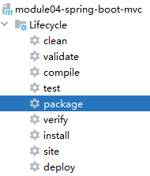

# 一、SpringBoot整合SpringMVC
## 1、Ajax异步交互
下面两个注解的用法和在SpringMVC中完全一样：
- @ResponseBody
- @RequestBody

<br/>

> 单独使用SpringMVC时还需要导入Jackson这样专门处理JSON操作的jar包，但是使用SpringBoot的Web场景启动器就不需要了。

## 2、服务器端渲染页面
### ①引入依赖
```xml
<dependencies>  
    <dependency>  
        <groupId>org.springframework.boot</groupId>  
        <artifactId>spring-boot-starter-web</artifactId>  
    </dependency>  
    <dependency>  
        <groupId>org.springframework.boot</groupId>  
        <artifactId>spring-boot-starter-thymeleaf</artifactId>  
    </dependency>  
</dependencies>
```

### ②视图前缀与后缀
> 物理视图：请求转发能够达到的完整路径
/WEB-INF/view/apple.html<br/>
/WEB-INF/view/banana.html<br/>
/WEB-INF/view/orange.html<br/>
/WEB-INF/view/grape.html<br/>
/WEB-INF/view/pear.html<br/>
> <br/>
前面都是一样的：/WEB-INF/view/（视图前缀）<br/>
后面也是一样的：.html（视图后缀）<br/>
> <br/>
所以每个处理请求的Controller方法指定中间各自不同的部分即可（逻辑视图）。<br/>
apple、banana、orange、grape、pear

<br/>

通过查看org.springframework.boot.autoconfigure.thymeleaf.ThymeleafProperties这个类我们能看到默认设置：<br/>


<br/>

所以在resources目录下创建templates目录，视图模板文件就放在这里：<br/>


<br/>

```html
<!DOCTYPE html>  
<html lang="en" xmlns:th="http://www.thymeleaf.org">  
<head>  
    <meta charset="UTF-8">  
    <title>首页</title>  
</head>  
<body>  
  
    <h3>首页</h3>  
  
    <p th:text="${attrName}"></p>  
  
</body>  
</html>
```

<br/>

> 如果修改视图前后缀，那么就配置项就参考ThymeleafProperties这个类。但是相信我，你肯定不会修改的。
> <br/>
> 顺带一提：平常我们说的类路径，归根到底它到底指的是哪个目录？<br/>
> 项目部署之后：/WEB-INF/classes目录。<br/>
> 因为不管是src/main/java还是src/main/resources在项目部署之后，资源都放在了/WEB-INF/classes目录下。

### ③Controller方法
```java
@Controller  
public class MVCController {  
  
    @GetMapping("/index.html")  
    public String toIndexPage(Model model) {  
  
        // 我们把数据存入模型，SpringMVC 会把模型中的数据存入请求域  
        model.addAttribute("attrName", "attrValue");  
  
        return "portal";  
    }  
  
}
```

## 3、静态资源
### ①寻找存放位置
参考org.springframework.boot.autoconfigure.web.ResourceProperties这个类：<br/>


<br/>

我们看到，以下四个目录均可用于存放静态资源：
- classpath:/META-INF/resources/
- classpath:/resources/
- classpath:/static/
- classpath:/public/

<br/>

通常我们会选择使用classpath:/static/目录。当然另一个办法是参考ResourceProperties这个类修改默认配置。

### ②创建目录


### ③引用静态资源
```html

```

## 4、拦截器
### ①创建拦截器
```java
@Component  
public class MyInterceptor extends HandlerInterceptorAdapter {  
  
    @Override  
    public boolean preHandle(HttpServletRequest request, HttpServletResponse response, Object handler) throws Exception {  
  
        System.out.println("MyInterceptor ...");  
  
        return true;  
    }  
}
```

### ②注册
```java
@Configuration  
public class MyConfig implements WebMvcConfigurer {  
  
    @Autowired  
    private MyInterceptor myInterceptor;  
  
    @Override  
    public void addInterceptors(InterceptorRegistry registry) {  
		// ant 风格地址匹配模式：/*表示匹配请求路径中的一级  
		// ant 风格地址匹配模式：/**表示匹配请求路径中的多级  
		// /apple/aaa  
		// /apple/aaa/bbb  
		registry.addInterceptor(myInterceptors).addPathPatterns("/apple/**");
    }  
}
```

### ③注意
拦截器和配置类要放在自动扫描包的范围内。

## 5、view-controller
```java
@Override  
public void addViewControllers(ViewControllerRegistry registry) {  
    registry.addViewController("/to/another/page").setViewName("target");  
}
```

# 二、SpringBoot整合junit
## 1、目的
和我们在Spring中整合junit一样，整合的目的是为了在单元测试类中装配IOC容器中的组件。

## 2、引入依赖
```xml
<dependencies>  
    <dependency>  
        <groupId>org.springframework.boot</groupId>  
        <artifactId>spring-boot-starter-web</artifactId>  
    </dependency>  
    <dependency>  
        <groupId>org.springframework.boot</groupId>  
        <artifactId>spring-boot-starter-test</artifactId>  
        <scope>test</scope>  
    </dependency>  
</dependencies>
```

## 3、编写单元测试
```java
@SpringBootTest  
public class MyTest {  
  
    @Autowired  
    private MyService myService;  
  
    @Test  
    public void testGetData() {  
        String data = myService.getData();  
        System.out.println("data = " + data);  
    }  
  
}
```

## 4、注意
- 单元测试类也要放在扫描包的范围内
- @Test注解要使用org.junit.jupiter.api.Test

# 三、SpringBoot整合Mybatis
## 1、建模
### ①物理建模
```sql
create table t_emp(  
    emp_id int auto_increment primary key ,  
    emp_name char(100),  
    emp_salary double  
);  
  
insert into t_emp(emp_name, emp_salary) VALUES ("tom", 1000.00);  
insert into t_emp(emp_name, emp_salary) VALUES ("jerry", 2000.00);  
insert into t_emp(emp_name, emp_salary) VALUES ("harry", 3000.00);
```

### ②逻辑建模
```java
public class Emp {  
  
    private Integer empId;  
    private String empName;  
    private Double empSalary;
```

## 2、引入依赖
```xml
<dependencies>  
    <dependency>  
        <groupId>org.mybatis.spring.boot</groupId>  
        <artifactId>mybatis-spring-boot-starter</artifactId>  
        <version>2.2.2</version>  
    </dependency>  
    <dependency>  
        <groupId>org.springframework.boot</groupId>  
        <artifactId>spring-boot-starter-test</artifactId>  
        <scope>test</scope>  
    </dependency>  
	<dependency>  
	    <groupId>mysql</groupId>  
	    <artifactId>mysql-connector-java</artifactId>  
	</dependency>
    <dependency>  
        <groupId>com.alibaba</groupId>  
        <artifactId>druid</artifactId>  
        <version>1.2.8</version>  
    </dependency>  
</dependencies>
```

## 3、Mapper
### ①接口
```java
@Mapper  
public interface EmpMapper {  
  
    List<Emp> selectAll();  
  
}
```

### ②配置文件


<br/>

```xml
<?xml version="1.0" encoding="UTF-8" ?>  
<!DOCTYPE mapper  
        PUBLIC "-//mybatis.org//DTD Mapper 3.0//EN"  
        "http://mybatis.org/dtd/mybatis-3-mapper.dtd">  
<mapper namespace="com.atguigu.boot.mapper.EmpMapper">  
    <select id="selectAll" resultType="Emp">  
        select emp_id, emp_name, emp_salary from t_emp    
    </select>  
</mapper>
```

## 4、YAML配置
从下面配置的例子可以看出：原来在Mybatis全局配置文件中做的配置，可以在SpringBoot配置文件中配置。具体配置项的结构一方面参考org.mybatis.spring.boot.autoconfigure.MybatisProperties类，另外借助IDEA提示。<br/>

```yaml
spring:  
  datasource:  
    url: jdbc:mysql://localhost:3306/db_hr?serverTimezone=Asia/Shanghai  
    username: root  
    password: atguigu  
    driver-class-name: com.mysql.cj.jdbc.Driver  
    type: com.alibaba.druid.pool.DruidDataSource  
mybatis:  
  mapper-locations: classpath:/mapper/*Mapper.xml  
  configuration:  
    map-underscore-to-camel-case: true  
  type-aliases-package: com.atguigu.boot.entity  
logging:  
  level:  
    com.atguigu.boot.mapper: debug
```

## 5、单元测试
```java
@SpringBootTest  
public class MybatisTest {  
  
    @Autowired  
    private DataSource dataSource;  
  
    @Autowired  
    private EmpMapper empMapper;  
  
    @Test  
    public void testEmpMapperSelect() {  
        List<Emp> empList = empMapper.selectAll();  
        for (Emp emp : empList) {  
            System.out.println("emp = " + emp);  
        }  
    }  
  
    @Test  
    public void testConn() throws SQLException {  
        Connection connection = dataSource.getConnection();  
        System.out.println("connection = " + connection);  
    }  
  
}
```

## 6、Mapper扫描
- 方式一：在Mapper接口上加@Mapper注解
- 方式二：在主启动类上加@MapperScan注解
```java
@SpringBootApplication  
@MapperScan("com.atguigu.boot.mapper")  
public class MybatisMainType {  
  
    public static void main(String[] args) {  
        SpringApplication.run(MybatisMainType.class, args);  
    }  
  
}
```

## 7、其它配置
其它可用配置参考org.mybatis.spring.boot.autoconfigure.MybatisProperties类


# 四、SpringBoot整合Spring Data JPA
## 1、JPA简介
JPA也是Java官方设计的一套标准，也是由一系列接口组成的。<br/>
作用是规定ORM操作的标准。<br/>
ORM：Object Relationship Mapping对象关系映射。
- 对象：Java实体类
- 关系：关系型数据库

<br/>

ORM基本的映射关系是：
- Java类对应数据库中的表
- Java类的对象对应表中的行（记录）
- Java类的属性对应表中的列（字段）

<br/>

复杂的ORM映射包括：
- 一对一关系（单向、双向）
- 一对多关系（单向、双向）
- 多对多关系（单向、双向）
- 聚合
- 继承
- ……

<br/>

Hibernate完整实现了JPA这套标准。Spring Data也提供了JPA的实现。而Spring Data本身并不是操作数据库的，而仅仅是Spring提供的一套操作数据的解决方案。所以Spring Data和JPA整合之后，只需要写接口就能完成常规CRUD操作。

<br/>

虽然访问关系型数据库用到Spring Data + JPA不多，但是后面访问ElasticSearch、Redis，用的就是Spring Data框架。

## 2、引入依赖
```xml
<dependencies>
	<!-- Spring Data 和 JPA 整合时使用的场景启动器 -->
    <dependency>  
        <groupId>org.springframework.boot</groupId>  
        <artifactId>spring-boot-starter-data-jpa</artifactId>  
    </dependency>  
    <dependency>  
        <groupId>mysql</groupId>  
        <artifactId>mysql-connector-java</artifactId>  
    </dependency>  
    <dependency>  
        <groupId>com.alibaba</groupId>  
        <artifactId>druid</artifactId>  
        <version>1.2.8</version>  
    </dependency>  
    <dependency>  
        <groupId>org.springframework.boot</groupId>  
        <artifactId>spring-boot-starter-test</artifactId>  
        <scope>test</scope>  
    </dependency>  
</dependencies>
```

## 3、创建实体类
```java
@Entity // 声明实体类  
@Table(name="t_emp") // 指定实体类对应的数据库表  
public class Emp implements Serializable {  
  
    @Id // 声明主键  
    @GeneratedValue(strategy = GenerationType.IDENTITY) // 声明主键值通过自增方式生成  
    @Column(name = "emp_id") // 指定对应字段名称  
    private Integer empId;  
  
    @Column(name = "emp_name")  
    private String empName;  
  
    @Column(name = "emp_salary")  
    private Double empSalary;
```

## 4、创建Dao接口
```java
// 具体模块 DAO 不需要写实现类，声明接口即可  
// 接口要求继承 JpaRepository// 接口需要传入两个泛型参数：  
// 泛型参数一：实体类类型（加了@Entity注解的类）  
// 泛型参数二：实体类中主键字段的类型
public interface EmpDao extends JpaRepository<Emp, Integer> {  
}
```

## 5、主启动类
```java
@SpringBootApplication  
public class JPAMainType {  
  
    public static void main(String[] args) {  
        SpringApplication.run(JPAMainType.class, args);  
    }  
  
}
```

## 6、YAML配置
```yaml
spring:  
  datasource:  
    username: root  
    password: atguigu  
    url: jdbc:mysql://localhost:3306/db_hr?serverTimezone=Asia/Shanghai  
    driver-class-name: com.mysql.cj.jdbc.Driver  
    type: com.alibaba.druid.pool.DruidDataSource  
  jpa:  
    database: mysql # 指定数据库的类型
    show-sql: true  
    generate-ddl: true  
    hibernate:  
      ddl-auto: update  
      naming_strategy: org.hibernate.cfg.ImprovedNamingStrategy  
logging:  
  level:  
    com.atguigu.boot.dao: debug
```

## 7、测试
```java
@SpringBootTest  
public class JPATest {  
  
    @Autowired  
    private DataSource dataSource;  
  
    @Autowired  
    private EmpDao empDao;  
  
    @Test  
    public void testConn() throws SQLException {  
        Connection connection = dataSource.getConnection();  
        System.out.println("connection = " + connection);  
    }  
  
    @Test  
    public void testEmpDao() {  
        List<Emp> empList = empDao.findAll();  
        for (Emp emp : empList) {  
            System.out.println("emp = " + emp);  
        }  
    }
      
	@Test  
	public void testFindById() {  
	    Optional<Emp> optional = empDao.findById(2);  
	  
	    Emp emp = optional.orElse(new Emp(3, "no data", 0.0));  
	  
	    System.out.println("emp = " + emp);  
	}
  
}
```

# 五、SpringBoot整合Redis
## 1、引入依赖
```xml
<dependencies>  
    <!-- Redis -->  
    <dependency>  
        <groupId>org.springframework.boot</groupId>  
        <artifactId>spring-boot-starter-data-redis</artifactId>  
    </dependency>  
  
    <!-- Spring2.X 集成 Redis 所需 commons-pool2 -->    
    <dependency>  
        <groupId>org.apache.commons</groupId>  
        <artifactId>commons-pool2</artifactId>  
        <version>2.6.0</version>  
    </dependency>  
  
    <dependency>  
        <groupId>org.springframework.boot</groupId>  
        <artifactId>spring-boot-starter-test</artifactId>  
        <scope>test</scope>  
    </dependency>  
</dependencies>
```

## 2、YAML配置
```yaml
spring:  
  redis:  
    host: 192.168.200.128  
    port: 6379
```

## 3、测试
```java
@SpringBootTest  
public class RedisTest {  
  
    @Autowired  
    private RedisTemplate redisTemplate;  
  
    @Autowired  
    private StringRedisTemplate stringRedisTemplate;  
  
    @Test  
    public void testRedisGet() {  
        ValueOperations operator = redisTemplate.opsForValue();  
        operator.set("hello", "tom");  
        Object hello = operator.get("hello");  
        System.out.println("hello = " + hello);  
    }  
  
    @Test  
    public void testStringRedisTemplate() {  
        ValueOperations<String, String> operator = stringRedisTemplate.opsForValue();  
        operator.set("myKey", "myValue");  
        String myKey = operator.get("myKey");  
        System.out.println("myKey = " + myKey);  
    }  
  
}
```

# 六、SpringBoot整合RabbitMQ
## 1、生产者工程
### ①引入依赖
```xml
<dependencies>  
    <dependency>  
        <groupId>org.springframework.boot</groupId>  
        <artifactId>spring-boot-starter-amqp</artifactId>  
    </dependency>  
    <dependency>  
        <groupId>org.springframework.boot</groupId>  
        <artifactId>spring-boot-starter-test</artifactId>  
    </dependency>  
</dependencies>
```

### ②YAML配置
```yaml
spring:  
  rabbitmq:  
    host: 192.168.200.128  
    port: 5672  
    username: guest  
    password: guest  
    publisher-confirms: true  
    publisher-returns: true  
    listener:  
      simple:  
        acknowledge-mode: manual  
        prefetch: 1
```

### ③主启动类
```java
@SpringBootApplication  
public class RabbitMainType {  
  
    public static void main(String[] args) {  
        SpringApplication.run(RabbitMainType.class, args);  
    }  
  
}
```

### ④测试
```java
@SpringBootTest  public class RabbitMQTest {    
    
    public static final String EXCHANGE_DIRECT = "exchange.direct.order";    
    public static final String ROUTING_KEY = "order";  
    
    @Autowired    
private RabbitTemplate rabbitTemplate;  
    
    @Test    
public void testSendMessage() {    
        rabbitTemplate.convertAndSend(    
                EXCHANGE_DIRECT,     
                ROUTING_KEY,     
                "Hello atguigu");    
    }    
    
}
```

## 2、消费者工程
### ①引入依赖
比生产者工程多一个：
```xml
<dependency>  
    <groupId>org.springframework.boot</groupId>  
    <artifactId>spring-boot-starter-web</artifactId>  
</dependency>
```

### ②一样
- 主启动类和生产者工程一样
- YAML配置和生产者工程一样

### ③监听器
```java
package com.atguigu.boot.listener;  
    
import com.rabbitmq.client.Channel;    
import org.springframework.amqp.core.Message;    
import org.springframework.amqp.rabbit.annotation.Exchange;    
import org.springframework.amqp.rabbit.annotation.Queue;    
import org.springframework.amqp.rabbit.annotation.QueueBinding;    
import org.springframework.amqp.rabbit.annotation.RabbitListener;    
import org.springframework.stereotype.Component;    

@Component  
public class MyMessageListener {    
    
    public static final String EXCHANGE_DIRECT = "exchange.direct.order";    
    public static final String ROUTING_KEY = "order";    
    public static final String QUEUE_NAME  = "queue.order";    
    
    @RabbitListener(bindings = @QueueBinding(    
            value = @Queue(value = QUEUE_NAME, durable = "true"),    
            exchange = @Exchange(value = EXCHANGE_DIRECT),    
            key = {ROUTING_KEY}    
    ))    
    public void processMessage(String dateString,    
                               Message message,    
                               Channel channel) {    
        System.out.println(dateString);    
    }
    
}
```


# 七、SpringBoot应用部署
## 1、jar包方式部署
> 这种方式运行SpringBoot应用，还是使用内置Tomcat，服务器环境上有JDK即可。所以按照Maven常规的方式导出的jar包是不够的。<br/>
> 需要使用SpringBoot定制的jar包。

### ①引入构建插件
```xml
<!-- build 标签：针对构建过程进行配置 -->
<build>
  <!-- plugins 标签：构建过程需要使用的插件 -->
  <plugins>
    <!-- plugin 标签：配置具体的一个插件 -->
    <plugin>
      <groupId>org.springframework.boot</groupId>

      <!-- SpringBoot参与Maven构建过程专用的插件 -->
      <artifactId>spring-boot-maven-plugin</artifactId>
    </plugin>
  </plugins>
</build>
```

### ②指定打包方式
因为Maven本身默认情况就是生成jar包，所以不必指定。想指定也行：
```xml
<packaging>jar</packaging>
```

### ③导出jar包


### ④启动jar包
```shell
java -jar xxx.jar
```

### ⑤contextPath
和jar包名称无关，就按SpringBoot应用中配置的访问。

### ⑥问题
这种方式确实很方便，但是Tomcat用的是SpringBoot内置的，此时无法对Tomcat进行优化定制。<br/>
所以生产环境通常还是会使用war包方式部署。<br/>

## 2、war包方式部署
### ①引入构建插件
和jar包部署时一样：
```xml
<build>
    <plugins>
        <plugin>
            <groupId>org.springframework.boot</groupId>
            <artifactId>spring-boot-maven-plugin</artifactId>
        </plugin>
    </plugins>
</build>
```

### ②指定打包方式
```xml
<packaging>war</packaging>
```

### ③创建Servlet初始化器
放在扫描包范围内：<br/>


<br/>

```java
import com.atguigu.boot.YourApplication;
import org.springframework.boot.builder.SpringApplicationBuilder;
import org.springframework.boot.web.servlet.support.SpringBootServletInitializer;

public class ServletInitializer extends SpringBootServletInitializer {

    @Override
    protected SpringApplicationBuilder configure(SpringApplicationBuilder application) {
        // 这里要传入的是我们的主启动类的 Class 对象
        return application.sources(YourApplication.class);
    }
}
```

### ④主启动类增加注解
```java
import org.springframework.boot.SpringApplication;
import org.springframework.boot.autoconfigure.SpringBootApplication;
import org.springframework.boot.web.servlet.ServletComponentScan;

@SpringBootApplication
@ServletComponentScan
public class YourApplication {

    public static void main(String[] args) {
        SpringApplication.run(YourApplication.class, args);
    }

}
```

### ⑤导出war包


<br/>

### ⑥部署war包


<br/>

部署后请启动Tomcat。

### ⑦访问路径说明
contextPath以war文件解压目录名为准，SpringBoot中配置的此时已经无效了。

# 八、综合案例
## 1、案例要求
- 功能1：显示首页
- 功能2：在首页点击超链接，到下一个页面以列表形式显示全部数据
- 功能3：点击超链接执行删除操作，成功后回到列表页面
- 功能4：点击超链接前往添加数据的表单页面，提交表单执行新增，成功后回到列表页面
- 功能5：点击超链接前往更新数据的表单页面，提交表单执行更新，成功后回到列表页面
- 功能6：给列表查询功能加缓存功能
- 功能7：删除之后，删除缓存
- 功能8：更新缓存
  - 更新前删除对应缓存
  - 更新后重新填充缓存

## 2、缓存思路
- 先查缓存
  - 缓存命中：返回数据
  - 缓存未命中，查数据库，然后存入缓存

## 3、Redis数据类型设计
- Redis 的 list 类型：通过下标访问。而我们希望在更新时通过主键来访问某一条记录，所以不合适。
- Redis 的 hash 类型：包含所有数据整体，也可以根据主键定位到某一条，所以适合。