# 一、注解
我们标记在主启动类上的@SpringBootApplication内部包含多个注解，其中最关键的是下面三个。

<br/>

## 1、@SpringBootConfiguration
本质上是@Configuration注解，作用是把主启动类标识为一个配置类。而配置类中可以使用@Bean注解代替传统XML配置文件中的bean标签。

<br/>

## 2、@ComponentScan
<p>@ComponentScan注解是用于指定Spring应用程序扫描组件的范围。在给定的包及其子包中，它会自动扫描并注册带有特定注解（如@Component、@Service、@Repository等）的类作为Spring Bean。</p>
<p>在上述代码片段中，@ComponentScan注解通过excludeFilters属性定义了两个自定义过滤器来排除某些组件的扫描。</p>
<p>FilterType.CUSTOM和TypeExcludeFilter.class：这个自定义过滤器（TypeExcludeFilter）可以排除特定类型的组件。它是一个类型过滤器，用于排除特定的类或接口。通过使用FilterType.CUSTOM类型，我们可以指定自己定义的过滤器类来处理类型的排除逻辑。</p>
<p>FilterType.CUSTOM和AutoConfigurationExcludeFilter.class：这个自定义过滤器（AutoConfigurationExcludeFilter）主要用于排除自动配置类的扫描。自动配置类是Spring Boot中用于自动装配应用程序的核心类。通过排除自动配置类的扫描，我们可以控制哪些自动配置类不被加载和应用。</p>
<p>总的来说，这个@ComponentScan注解的配置表明，在指定的包及其子包中进行组件扫描，并排除自定义过滤器所定义的特定类型（如TypeExcludeFilter）和自动配置类（如AutoConfigurationExcludeFilter）的扫描。这个注解提供了一种灵活的方式来控制组件的自动扫描范围和过滤逻辑，以满足应用程序的特定需求。</p>

<br/>

## 3、@EnableAutoConfiguration
在下面自动配置部分详述。

<br/>

# 二、场景启动器

> 也有人把场景启动器叫“起步依赖”

## 1、依赖管理

- 我们工程的顶级父工程继承了spring-boot-starter-parent
- spring-boot-starter-parent继承了spring-boot-dependencies
- 在spring-boot-dependencies中通过properties标签定义了很多依赖的版本
- 在spring-boot-dependencies中通过dependencyManagement标签管理很多依赖
    - 这些依赖都可以被子工程直接使用
    - 子工程使用这些依赖时，不需要写版本号

<br/>

## 2、版本仲裁
SpringBoot每一个starter都对引入的所有依赖进行了严格的版本测试，能够确保它们的版本都是正确的。

<br/>

## 3、依赖传递
导入一个starter，基于Maven的依赖传递机制，就能把这个场景下所需的所有依赖都导入进来。<br/>
极大简化了pom.xml配置。

<br/>

## 4、结论
SpringBoot通过场景启动器的机制，达到的效果是：
- 一个场景导入一个依赖即可，其它依赖都可以传递进来
- 这个场景下所需的配置，都通过引入自动配置实现了，而自动配置的类也是通过依赖传递自动导入的
- 而且因为有版本仲裁，间接引入的依赖也都可以放心使用

# 三、自动配置
## 1、@EnableAutoConfiguration
### ①两种导入方式
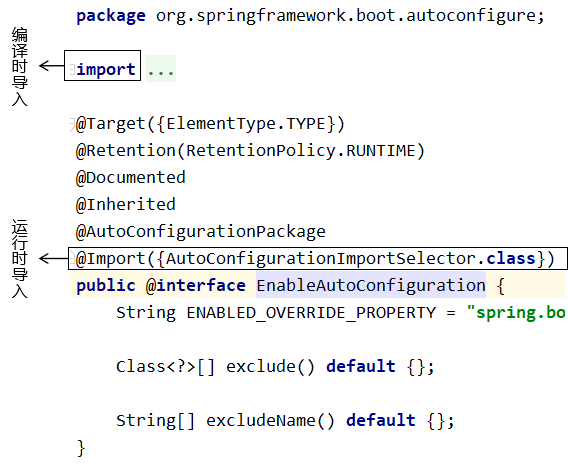

### ②AutoConfigurationImportSelector
<p>AutoConfigurationImportSelector是Spring Boot框架中的一个关键类，它的主要作用是根据条件自动选择加载和导入需要的自动配置类（Auto-configuration classes）。</p>
<p>在Spring Boot中，自动配置类是一种通过约定大于配置的方式，根据应用的环境、依赖等条件来自动配置应用程序的类。这些自动配置类通常被放置在META-INF/spring.factories文件中，并使用org.springframework.boot.autoconfigure.EnableAutoConfiguration作为键。</p>
<p>AutoConfigurationImportSelector负责根据特定的条件选择并导入自动配置类。它实现了ImportSelector接口，这个接口是Spring Framework提供的用于定义自定义导入策略的接口。</p>
具体而言，AutoConfigurationImportSelector执行以下任务：
- 找到并加载所有的自动配置类。
- 对每个自动配置类进行条件匹配，根据条件是否满足进行过滤。
- 根据条件匹配结果，返回符合条件的自动配置类的全限定类名数组。
- 将返回的自动配置类的全限定类名数组作为导入类集合，告诉Spring容器需要导入哪些自动配置类。
- Spring容器根据导入的自动配置类来进行相应的自动配置。
通过AutoConfigurationImportSelector，Spring Boot能够根据条件自动选择和导入适当的自动配置类，从而根据应用的环境和依赖自动配置应用程序。这大大简化了开发人员的工作，减少了手动配置的工作量，并提高了应用程序的可维护性和灵活性。<br/>

<br/>

### ③自动配置类是否加载的依据
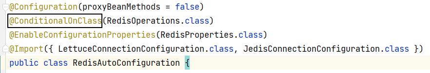

<br/>

@ConditionalOnClass(RedisOperations.class)含义：
- @ConditionalOnClass表示RedisAutoConfiguration类是否加载是有条件的，条件是看RedisOperations接口是否能加载
- 如果RedisOperations接口能够加载到内存，那么@ConditionalOnClass(RedisOperations.class)条件满足
- 如果@ConditionalOnClass(RedisOperations.class)条件满足，那么RedisAutoConfiguration类加载到IOC容器
- RedisOperations接口是spring-data-redis.jar中的
- spring-data-redis.jar又是spring-boot-starter-data-redis场景启动器导入的

### ④关联SpringBoot配置项
- 注册配置项类：@EnableConfigurationProperties(RedisProperties.class)
- 配置项类本身：RedisProperties
- 配置项类需要加注解：@ConfigurationProperties
  - prefix 属性：指定SpringBoot配置文件进行配置时使用的前缀
  - 配置项类中通过getXxx()、setXxx()方法定义属性，这些属性就是可以使用的配置项名称（YAML、properties配置文件中使用的配置项）

### ⑤框架预定义的自动配置类
这里要读取spring.factories，位置如下：<br/>


<br/>

<p>读取这个spring.factories文件，其中与自动化配置相关的属性是：org.springframework.boot.autoconfigure.EnableAutoConfiguration。</p>
<p>读取这个属性值，会得到一个List&lt;String&gt;类型的集合对象。其中保存了各种具体的自动配置类的全类名。</p>
<p>接下来根据这些全类名，尝试通过反射创建实例对象。</p>
<p>但是如果没有引入对应的依赖，则实例化失败，SpringBoot不加载这个类对应的自动配置信息。</p>
<p>反之如果实例化成功，则这个自动配置类生效。其中我们以RedisAutoConfiguration为例来看一下：</p>

```Java
@Configuration(
    proxyBeanMethods = false
)
@ConditionalOnClass({RedisOperations.class})
@EnableConfigurationProperties({RedisProperties.class})
@Import({LettuceConnectionConfiguration.class, JedisConnectionConfiguration.class})
public class RedisAutoConfiguration {
    public RedisAutoConfiguration() {
    }

    // 把 RedisTemplate 放入 IOC 容器，bean的id为redisTemplate，因此我们可以直接使用@Autowired自动装配
    @Bean
    @ConditionalOnMissingBean(
        name = {"redisTemplate"}
    )
    public RedisTemplate<Object, Object> redisTemplate(RedisConnectionFactory redisConnectionFactory) throws UnknownHostException {
        RedisTemplate<Object, Object> template = new RedisTemplate();
        template.setConnectionFactory(redisConnectionFactory);
        return template;
    }

    // 把 StringRedisTemplate 放入 IOC 容器，因此我们可以直接使用@Autowired自动装配
    @Bean
    @ConditionalOnMissingBean
    public StringRedisTemplate stringRedisTemplate(RedisConnectionFactory redisConnectionFactory) throws UnknownHostException {
        StringRedisTemplate template = new StringRedisTemplate();
        template.setConnectionFactory(redisConnectionFactory);
        return template;
    }
}
```

<br/>

<p>那么自动配置的具体属性在哪里呢？我们看到@EnableConfigurationProperties注解中指定了RedisProperties.class，RedisProperties类中就设定了连接Redis所需的自动配置属性，有些属性有默认值。部分源码如下：</p>

```Java
@ConfigurationProperties(
    prefix = "spring.redis"
)
public class RedisProperties {
    private int database = 0;
    private String url;
    private String host = "localhost";
    private String password;
    private int port = 6379;
    private boolean ssl;
    private Duration timeout;
```

<p>prefix属性定义了在yaml配置文件中引用各属性的属性名的前缀。</p>

目前我们看到过的：
> ThymeleafProperties<br/>
> ResourceProperties<br/>
> MybatisProperties<br/>
> RedisProperties<br/>
> RabbitProperties

# 四、启动过程
## 1、概述
<p>当我们启动一个Spring Boot应用时，会经历以下主要步骤：</p>
<p>加载Spring Boot框架：应用程序首先会加载Spring Boot框架的相关类和配置。这包括Spring Boot的核心依赖、自动配置类等。</p>
<p>创建并配置ApplicationContext：Spring Boot会创建一个ApplicationContext对象，它是Spring容器的根对象。在这个阶段，Spring Boot会执行一些基本的初始化工作，如设置默认的配置属性、注册BeanPostProcessor等。</p>
<p>执行自动配置：Spring Boot会根据约定和条件自动装配（Auto-configure）应用程序。这涉及到加载并解析spring.factories文件，根据环境、依赖、配置等条件选择和导入合适的自动配置类。</p>
<p>扫描和注册Bean：Spring Boot会扫描应用程序中的组件，并将其注册为Spring Bean。这包括使用@Component、@Service、@Repository、@Controller等注解标记的类。</p>
<p>运行应用程序：完成自动配置和Bean注册后，Spring Boot会运行应用程序。这涉及到调用被@SpringBootApplication或其他Spring Boot启动注解标记的类中的main()方法。</p>
<p>启动内嵌的Web服务器：如果应用程序是一个Web应用程序，Spring Boot会自动启动一个内嵌的Web服务器（如Tomcat、Jetty等）。它会根据应用程序的配置和依赖自动配置Web服务器。</p>
<p>处理请求和响应：一旦Web服务器启动，Spring Boot会开始处理HTTP请求并生成相应的响应。这涉及到调用相关的控制器（Controller）和服务（Service）类来处理业务逻辑。</p>
<p>这是一个简化的Spring Boot启动过程的概述。在实际运行中，还会有更多的细节和步骤，如加载配置文件、处理AOP、处理事务等。然而，以上步骤提供了一个基本的框架，帮助我们理解Spring Boot应用程序的启动过程。</p>

## 2、入口

```Java
SpringApplication.run(主启动类.class, args);
```

<br/>

## 3、加载spring.factories
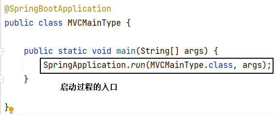

<br/>

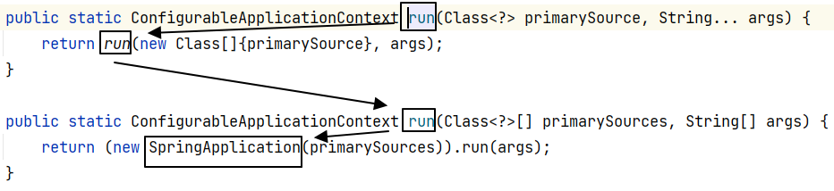

<br/>

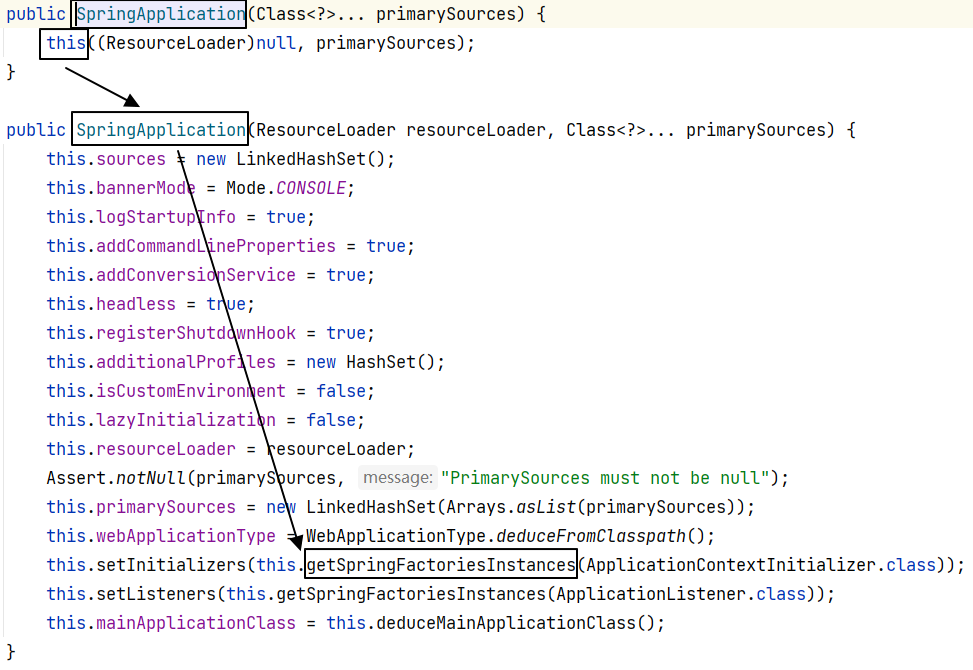

<br/>

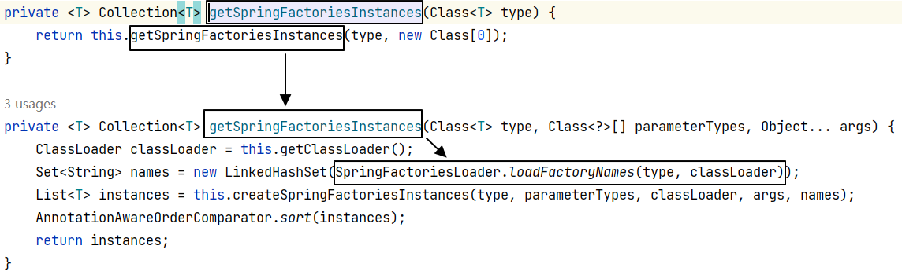

<br/>

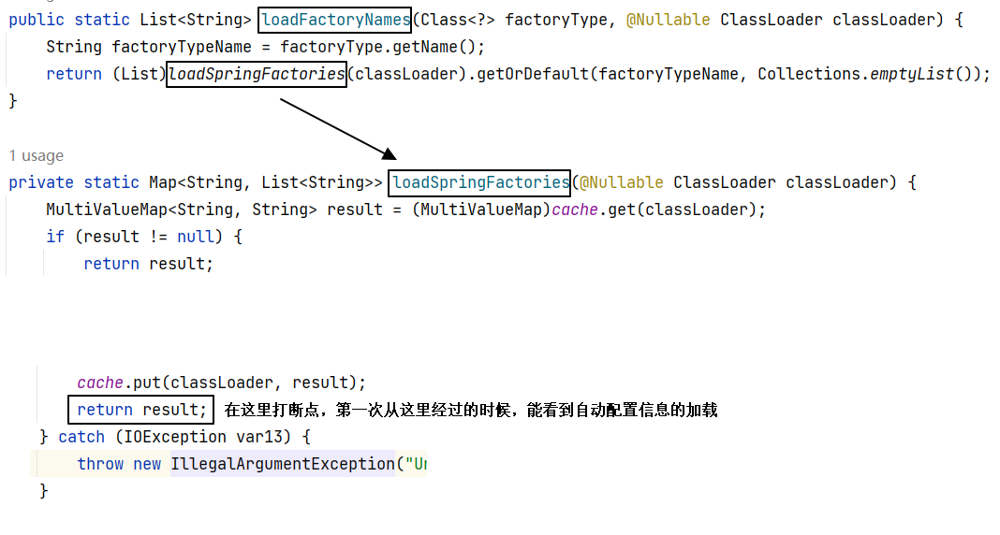

<br/>

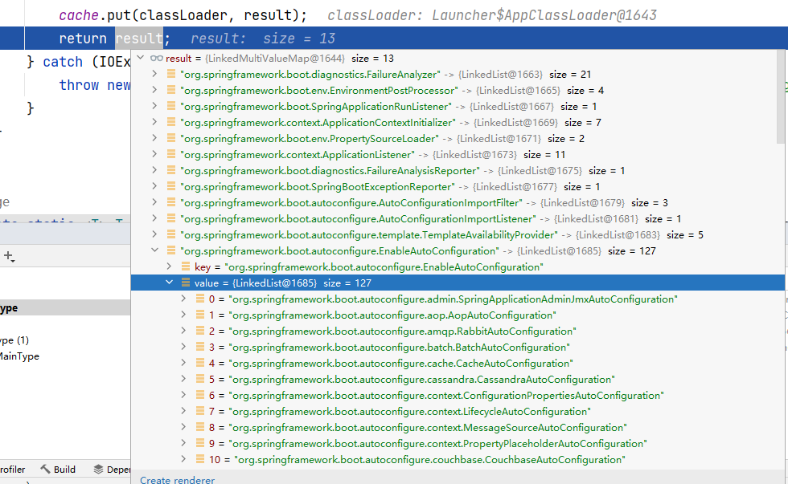

## 2、内嵌的Web服务器
<p>Spring Boot通过内嵌的Web服务器来运行Web应用程序。它提供了对多个常见的Web服务器（如Tomcat、Jetty和Undertow）的支持，可以根据应用程序的配置自动选择和配置适当的服务器。</p>
<p>在启动过程中，Spring Boot会执行以下步骤来启动内嵌的Web服务器：</p>
<p>根据应用程序的依赖关系和配置，确定要使用的内嵌Web服务器。这是通过检测应用程序的类路径上是否存在相应的Web服务器依赖来实现的。如果存在多个可选的Web服务器依赖，Spring Boot会根据默认约定进行选择。</p>
<p>创建并配置内嵌的Web服务器实例。Spring Boot会创建一个适当类型的Web服务器对象，并设置其所需的配置信息。这些配置信息可以通过应用程序的配置文件（如application.properties或application.yml）进行指定。</p>
<p>执行Web服务器的启动方法。Spring Boot会调用内嵌Web服务器的start()方法来启动Web服务器。这将触发Web服务器的初始化过程，包括加载相关的类和配置，并开始监听入站请求。</p>
<p>注册Spring MVC框架。Spring Boot会注册Spring MVC框架，以处理HTTP请求并生成相应的响应。它将配置请求映射、处理器适配器、视图解析器等，以确保正确处理Web请求。</p>
<p>运行应用程序。一旦内嵌的Web服务器启动并注册了Spring MVC框架，Spring Boot会运行应用程序。它将等待并处理传入的HTTP请求，并将相应的响应返回给客户端。</p>
<p>通过内嵌的Web服务器，Spring Boot能够方便地打包和部署Web应用程序，无需额外安装和配置外部的Web服务器。此外，Spring Boot还提供了许多自定义和扩展选项，以满足特定Web应用程序的需求。</p>

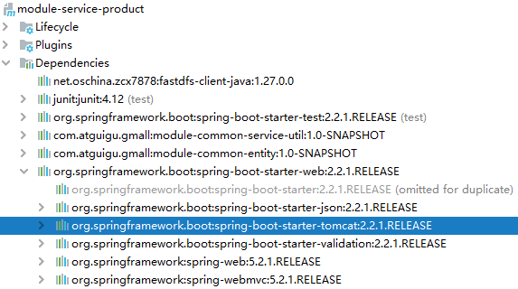

<br/>

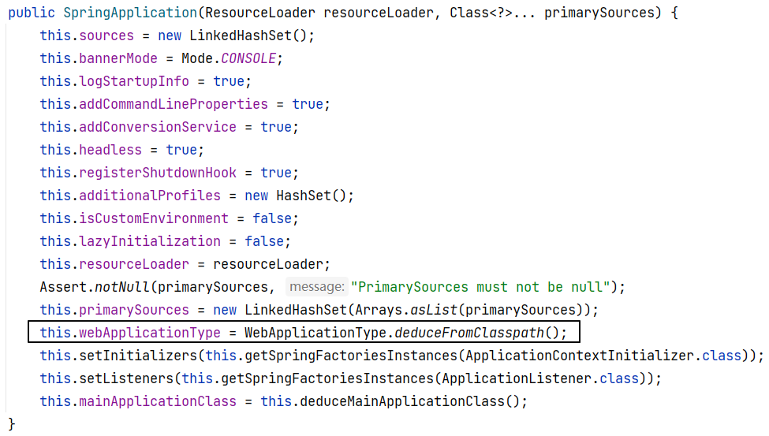

## 3、run()方法
### ①run()方法返回值
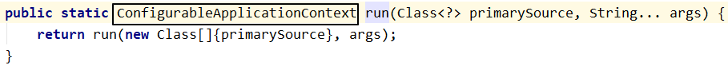

### ②ConfigurableApplicationContext
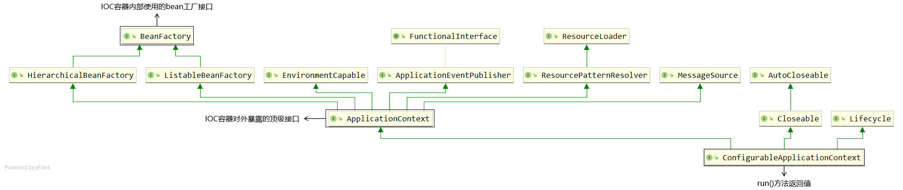