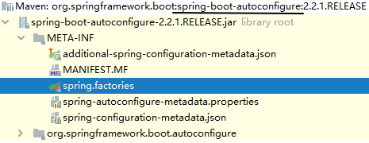

# 一、注解
## 1、@SpringBootApplication
内部包含多个注解，其中最关键的是下面三个。

<br/>

### ①@SpringBootConfiguration
本质上是@Configuration注解，作用是把主启动类标识为一个配置类。而配置类中可以使用@Bean注解代替传统XML配置文件中的bean标签。

<br/>

### ②@ComponentScan
默认的包扫描配置
- 启动类所在的包
- 启动类所在包的子包

<br/>

### ③@EnableAutoConfiguration
在下面自动配置部分详述。

<br/>

## 2、@ComponentScan
手动指定包扫描范围。

## 3、@EnableDiscoveryClient
基于微服务名称注册微服务，并发现其它微服务。

<br/>

# 二、场景启动器

> 也有人把场景启动器叫“起步依赖”

## 1、依赖管理

- 我们工程的顶级父工程继承了spring-boot-starter-parent
- spring-boot-starter-parent继承了spring-boot-dependencies
- 在spring-boot-dependencies中通过properties标签定义了很多依赖的版本
- 在spring-boot-dependencies中通过dependencyManagement标签管理很多依赖
    - 这些依赖都可以被子工程直接使用
    - 子工程使用这些依赖时，不需要写版本号

<br/>

## 2、版本仲裁
SpringBoot每一个starter都对引入的所有依赖进行了严格的版本测试，能够确保它们的版本都是正确的。

<br/>

## 3、依赖传递
导入一个starter，基于Maven的依赖传递机制，就能把这个场景下所需的所有依赖都导入进来。<br/>
极大简化了pom.xml配置。

<br/>

## 4、结论
SpringBoot通过场景启动器的机制，达到的效果是：
- 一个场景导入一个依赖即可，其它依赖都可以传递进来
- 这个场景下所需的配置，都通过引入自动配置实现了，而自动配置的类也是通过依赖传递自动导入的
- 而且因为有版本仲裁，间接引入的依赖也都可以放心使用


# 三、自动配置

## 1、@EnableAutoConfiguration
### ①两种导入方式


### ②AutoConfigurationImportSelector
自动配置导入选择器。这个类的核心方法是：selectImports(AnnotationMetadata annotationMetadata)。<br/>
这里要读取spring.factories，位置如下：<br/>



<br/>

<p>读取这个spring.factories文件，其中与自动化配置相关的属性是：org.springframework.boot.autoconfigure.EnableAutoConfiguration。</p>
<p>读取这个属性值，会得到一个List&lt;String&gt;类型的集合对象。其中保存了各种具体的自动配置类的全类名。</p>
<p>接下来根据这些全类名，尝试通过反射创建实例对象。</p>
<p>但是如果没有引入对应的依赖，则实例化失败，SpringBoot不加载这个类对应的自动配置信息。</p>
<p>反之如果实例化成功，则这个自动配置类生效。其中我们以RedisAutoConfiguration为例来看一下：</p>

```Java
@Configuration(
    proxyBeanMethods = false
)
@ConditionalOnClass({RedisOperations.class})
@EnableConfigurationProperties({RedisProperties.class})
@Import({LettuceConnectionConfiguration.class, JedisConnectionConfiguration.class})
public class RedisAutoConfiguration {
    public RedisAutoConfiguration() {
    }

    // 把 RedisTemplate 放入 IOC 容器，bean的id为redisTemplate，因此我们可以直接使用@Autowired自动装配
    @Bean
    @ConditionalOnMissingBean(
        name = {"redisTemplate"}
    )
    public RedisTemplate<Object, Object> redisTemplate(RedisConnectionFactory redisConnectionFactory) throws UnknownHostException {
        RedisTemplate<Object, Object> template = new RedisTemplate();
        template.setConnectionFactory(redisConnectionFactory);
        return template;
    }

    // 把 StringRedisTemplate 放入 IOC 容器，因此我们可以直接使用@Autowired自动装配
    @Bean
    @ConditionalOnMissingBean
    public StringRedisTemplate stringRedisTemplate(RedisConnectionFactory redisConnectionFactory) throws UnknownHostException {
        StringRedisTemplate template = new StringRedisTemplate();
        template.setConnectionFactory(redisConnectionFactory);
        return template;
    }
}
```

<br/>

<p>那么自动配置的具体属性在哪里呢？我们看到@EnableConfigurationProperties注解中指定了RedisProperties.class，RedisProperties类中就设定了连接Redis所需的自动配置属性，有些属性有默认值。部分源码如下：</p>

```Java
@ConfigurationProperties(
    prefix = "spring.redis"
)
public class RedisProperties {
    private int database = 0;
    private String url;
    private String host = "localhost";
    private String password;
    private int port = 6379;
    private boolean ssl;
    private Duration timeout;
```

<p>prefix属性定义了在yaml配置文件中引用各属性的属性名的前缀。</p>

# 四、启动过程
## 1、入口

```Java
SpringApplication.run(主启动类.class, args);
```

<br/>

## 2、Tomcat
SpringBoot微服务启动后，当前微服务会被部署到内置Tomcat上启动运行：<br/>


## 3、run()方法
### ①run()方法返回值


### ②ConfigurableApplicationContext


## 4、小结

- 第一步：创建IOC容器
- 第二步：根据主启动类.class读取主启动类上的注解信息。
- 第三步：读取自动配置信息，并根据自动配置信息初始化bean实例放入IOC容器。只有引入对应场景启动器的自动配置类才能实例化成功。
- 第四步：包扫描，把程序员自定义的bean放入IOC容器