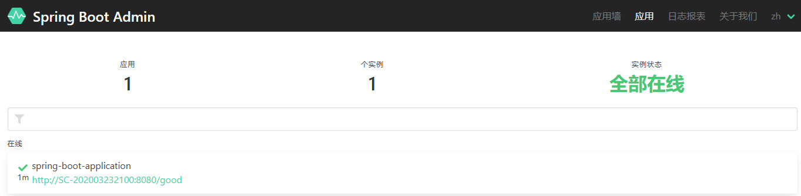

# 一、SpringBoot Actuator组件
**Spring Boot Actuator**是SpringBoot自带的一个组件 , 可以帮助我们监控和管理Spring Boot应用，比如健康检查、审计、统计和HTTP追踪等。

## 1、引入依赖
```xml
<dependency>
    <groupId>org.springframework.boot</groupId>
    <artifactId>spring-boot-starter-actuator</artifactId>
</dependency>
```

## 2、增加配置
```yaml
management:
  endpoints:
    web:
      exposure:
        include: '*'  # 对外暴露的访问入口 , 默认是/health和/info
      base-path: /monitor # 默认是actuator
  endpoint:
    health:
      show-details: ALWAYS	# 显示所有健康状态
  server:
    port: 9999
```

## 3、访问监控地址


## 4、常用访问地址
|HTTP 方法<br>|路径<br>|描述<br>|
|-|-|-|
|GET<br>|/autoconfig<br>|提供了一份自动配置报告，记录哪些自动配置条件通过了，哪些没通过<br>|
|GET<br>|/**configprops**<br>|描述配置属性(包含默认值)如何注入Bean<br>|
|GET<br>|/**beans**<br>|描述应用程序上下文里全部的Bean，以及它们的关系<br>|
|GET<br>|/dump<br>|获取线程活动的快照<br>|
|GET<br>|/**env**<br>|获取全部环境属性<br>|
|GET<br>|/env/{name}<br>|根据名称获取特定的环境属性值<br>|
|GET<br>|/**health**<br>|报告应用程序的健康指标，这些值由HealthIndicator的实现类提供<br>|
|GET<br>|/info<br>|获取应用程序的定制信息，这些信息由info打头的属性提供<br>|
|GET<br>|/**mappings**<br>|描述全部的URI路径，以及它们和控制器(包含Actuator端点)的映射关系<br>|
|GET<br>|/metrics<br>|报告各种应用程序度量信息，比如内存用量和HTTP请求计数<br>|
|GET<br>|/metrics/{name}<br>|报告指定名称的应用程序度量值<br>|
|POST<br>|/shutdown<br>|关闭应用程序，要求endpoints.shutdown.enabled设置为true<br>|
|GET<br>|/trace<br>|提供基本的HTTP请求跟踪信息(时间戳、HTTP头等)<br>|

# 二、SpringBoot Admin组件
<p>上面我们讲了Spring Boot Actuator可以通过http协议获取系统状态信息，但是返回的是JSON格式数据，看起来不太方面，而且还需要记忆路径比较麻烦。</p>
<p>Spring Boot Admin给我们提供了更加友好的可视化界面来查看这些信息。</p>
<p>Spring Boot Admin是一个开源社区项目，用于管理和监控SpringBoot应用程序。</p>
<p>应用程序作为Spring Boot Admin Client向Spring Boot Admin Server注册，Client会定时向Server发送数据，Server使用友好的界面展示数据。</p>

## 1、服务端
### ①创建module
略

### ②引入依赖
```xml
    <dependencies>
        <dependency>
            <groupId>org.springframework.boot</groupId>
            <artifactId>spring-boot-starter-web</artifactId>
        </dependency>
        <dependency>
            <groupId>de.codecentric</groupId>
            <artifactId>spring-boot-admin-starter-server</artifactId>
            <version>2.2.0</version>
        </dependency>
    </dependencies>
```

### ③配置
```yaml
spring:
  application:
    name: admin-server
server:
  port: 8769
```

### ④主启动类
```java
@SpringBootApplication
@EnableAdminServer
public class Application {
    public static void main(String[] args) {
        SpringApplication.run(Application.class,args);
    }
}
```

## 2、客户端
客户端就是被监控的SpringBoot应用。

### ①引入依赖
```xml
<dependency>
    <groupId>de.codecentric</groupId>
    <artifactId>spring-boot-admin-starter-client</artifactId>
    <version>2.2.0</version>
</dependency>
```

### ②配置
给被监控的应用增加配置：
```yaml
spring:
  boot:
    admin:
      client:
        url: http://localhost:8769
```

### ③界面


<br/>

