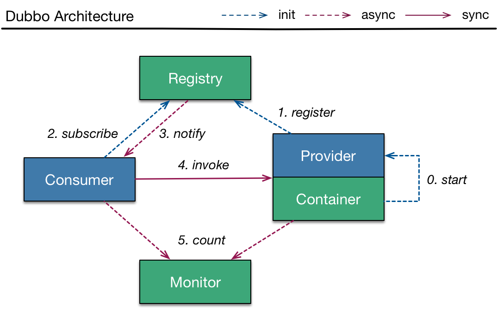
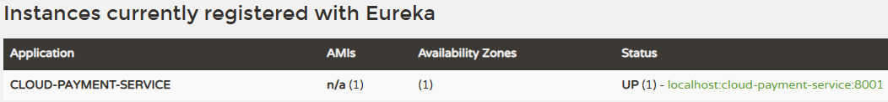
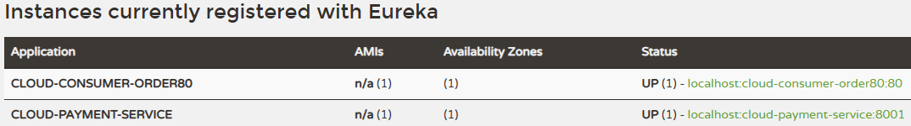

# 一、注册中心
## 1、为什么需要注册中心
微服务A ---调用---> 微服务B，如果微服务B发生了变化，比如：IP地址、端口号、其它相关参数变更。微服务A本身无法自动得知。那么继续按照旧的参数来调用，很有可能发生调用失败情况。<br/>
如果手动操作，微服务B通过手动操作重启之后，微服务A里面还需要修改微服务B的调用参数。从而导致微服务A跟着进行重新部署。<br/>
这就说明当前这种情况下，微服务A和B耦合度较高。<br/>
而引入注册中心后，微服务B参数的变更会自动发布到注册中心（我们管这个操作叫“注册”），而微服务A自动从注册中心获取到微服务B的新参数，自动根据新参数调用，不需要重启、重新部署。相当于和微服务B解耦合了。

## 2、注册中心工作机制
### ①C/S结构
- Client：注册中心的客户端。服务的提供者和消费者都是这样的客户端。
- Server：注册中心服务器本身。

### ②C/S之间通信方式
#### [1]主动推送
服务消费端订阅注册中心。服务提供端增加实例会把新实例注册到注册中心，注册中心接收到新实例注册之后会通知服务消费端，然后服务消费端会到注册中心重新拉取注册信息。<br/>
典型代表：Dubbo/Zookeeper组合中的Zookeeper<br/>



#### [2]定时轮询
Eureka不支持注册信息订阅，消费者定时访问注册中心，发现信息更新则拉取到本地。Nacos两种都支持。

### ③术语
- 服务注册：微服务把自己的信息发布到注册中心
	- 说明：由于SpringCloud中没有严格的“提供者”、“消费者”区分，所以每一个微服务都可以在注册中心注册。
- 服务发现：微服务访问注册中心，从注册中心获取到新注册的其它服务；或者是已有服务更新了参数

# 二、操作演示
## 1、Eureka服务器端
Eureka是以微服务的形式来创建的，所以创建一个微服务module引入相应配置就是Eureka注册中心。

### ①引入依赖
```xml
<dependencies>  
    <dependency>  
        <groupId>org.springframework.cloud</groupId>  
        <artifactId>spring-cloud-starter-netflix-eureka-server</artifactId>  
    </dependency>
    <dependency>  
        <groupId>org.springframework.boot</groupId>  
        <artifactId>spring-boot-starter-web</artifactId>  
    </dependency>  
    <dependency>  
        <groupId>org.springframework.boot</groupId>  
        <artifactId>spring-boot-starter-actuator</artifactId>  
    </dependency>  
    <dependency>  
        <groupId>org.springframework.boot</groupId>  
        <artifactId>spring-boot-devtools</artifactId>  
        <scope>runtime</scope>  
        <optional>true</optional>  
    </dependency>  
</dependencies>
```

### ②YAML
由于当前微服务本身就是Eureka服务器自己，所以下面两个配置：
- register-with-eureka: false表示我不需要在自己这里注册自己
- fetchRegistry: false表示我不需要从我自己这取回服务信息
```yaml
server:  
  port: 7001  
eureka:
  instance:
    hostname: localhost  
  client:
    register-with-eureka: false
    fetchRegistry: false
    service-url:
      defaultZone: http://localhost:7001/eureka
```

### ③主启动类
@EnableEurekaServer注解：表示当前微服务启用“Eureka服务器”功能
```java
package com.atguigu.springcloud;  
  
import org.springframework.boot.SpringApplication;  
import org.springframework.boot.autoconfigure.SpringBootApplication;  
import org.springframework.cloud.netflix.eureka.server.EnableEurekaServer;  
  
@EnableEurekaServer  
@SpringBootApplication  
public class EurekaMainType {  
  
    public static void main(String[] args) {  
        SpringApplication.run(EurekaMainType.class, args);  
    }  
      
}
```

### ④访问地址
#### [1]服务间调用地址
YAML配置文件中指定的是服务间调用地址：http://localhost:7001/eureka

#### [2]网页界面访问地址
网页界面访问地址：http://localhost:7001

## 2、提供端注册
### ①增加依赖
在provider-payment微服务增加依赖：
```xml
<dependency>  
    <groupId>org.springframework.cloud</groupId>  
    <artifactId>spring-cloud-starter-netflix-eureka-client</artifactId>  
</dependency>
```

### ②增加配置
eureka顶格
```yaml
eureka:  
  client:  
    register-with-eureka: true  
    fetchRegistry: true  
    service-url:  
      defaultZone: http://localhost:7001/eureka
```

### ③增加注解
在主启动类上增加注解：@EnableEurekaClient，表示当前微服务启用“Eureka客户端”功能

### ④启动测试


## 3、消费端注册
### ①引入环境
下面步骤和提供端一样：
- 增加依赖
- 增加配置
- 增加注解
- 启动测试

### ②注册效果


### ③效果说明
目前仅仅只是把微服务注册到Eureka了，但是并没有体现在微服务的调用过程中，我们的代码仍然还是消费端直接访问提供端。如果想要实现消费端通过注册中心获取信息再调用提供端，我们还需要引入下一个组件。