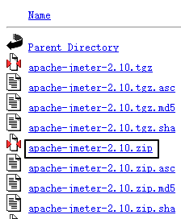
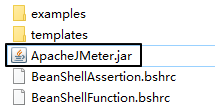
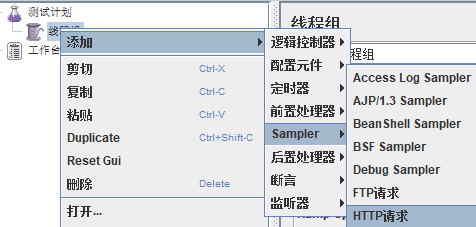
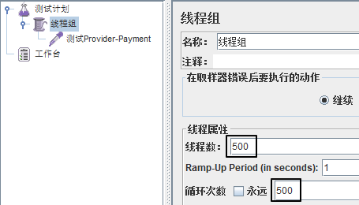

# 一、提出问题
## 1、服务雪崩
微服务之间存在错综复杂的调用关系：
- 调用别人：可能连续调用很多个微服务（直接、间接）
- 被别人调用：直接、间接的有很多微服务来调用我

任何一个微服务出现超时、抛异常、卡死等问题时，都有可能导致故障在系统中蔓延开来。越深的微服务，这样的风险越大。<br/>

当有一个微服务出现故障进而导致系统中很多微服务也无法访问，甚至导致整个系统瘫痪，这样的现象我们称之为：服务的雪崩<br/>


## 2、解决问题的思路
### ①断路器
- 断路器一打开，Consumer就不能访问Provider了
- 断路器平常是关闭的
- 当Consumer调用Provider遇到故障时，断路器会打开
- 断路器打开之后，一段时间内，Consumer不能访问Provider
- 这段时间内，Consumer全部使用备选方案，不发送请求
- 这一段时间之后，断路器进入“半开”状态
- 半开状态就是放行一个请求，试探一下，看看Provider是否正常
	- Provider正常了：断路器关闭，Consumer就可以正常访问Provider了
	- Provider仍然不正常：断路器重新回到打开状态，又一段时间不能访问Provider了


### ②备选方案
为了配合断路器的使用，Consumer和Provider两端都可以提前准备备选方案。<br/>
一旦出现故障则执行备选方案。<br/>
备选方案肯定没办法返回正常状态下应该返回的数据。但是有如下好处：
- 调用我的人不至于拿到一个抛异常的信息，我在备选方案中返回的是一个相对友好的信息
- 返回备选方案后，调用我的人就不需要继续等待了，可以继续执行后续的操作
我们对被选方案有一个要求：为了避免调用者使用备选方案后，返回值导致类型转换异常，所以备选方案对应的备用方法的返回值必须和原来正常的返回值类型一致。<br/>
此时也体现了CommonResult存在的价值：不管操作成功还是失败，都可以返回相同类型的数据

### ③服务降级
站在用户角度，我们对比下面三种情况：
- 服务器端处理用户请求成功：用户看到正常的结果页面（用户体验打分：10分）
- 服务器端处理用户请求失败：用户看到的是抛异常的页面（用户体验打分：-10分）
- 服务器端处理用户请求失败：用户看到的是一个比较友好的提示信息（用户体验打分：0分）

所以服务降级就是：虽然不能给用户返回正常的结果，但是还是返回一个提示信息。虽然比用户预期的体验差一些，但是比抛异常、报错这样还是好一些。<br/>

前面提到的备选方案，其实就是在后端实现服务降级的一个具体措施。

# 二、准备工作
## 1、Jmeter使用
### ①下载地址
https://archive.apache.org/dist/jmeter/binaries/?spm=wolai.workspace.0.0.ac33767bFqVAab

<br/>



### ②使用
- 解压到非中文、无空格目录
- 进入bin目录
- 双击ApacheJMeter.jar运行


### ③操作
先在测试计划下创建线程组：<br/>


然后在线程组下创建HTTP请求：<br/>



在线程组内设置并发压力：<br/>



在HTTP请求内设置目标服务器的访问参数：<br/>


点这里开始：<br/>


## 2、创建测试用的Provider
### ①引入依赖
```xml
<dependencies>  
    <!--新增hystrix-->  
    <dependency>  
        <groupId>org.springframework.cloud</groupId>  
        <artifactId>spring-cloud-starter-netflix-hystrix</artifactId>  
    </dependency>  
    <dependency>  
        <groupId>org.springframework.cloud</groupId>  
        <artifactId>spring-cloud-starter-netflix-eureka-client</artifactId>  
    </dependency>  
    <dependency>  
        <groupId>com.atguigu.cloud</groupId>  
        <artifactId>common-api</artifactId>  
        <version>1.0-SNAPSHOT</version>  
    </dependency>  
    <dependency>  
        <groupId>org.springframework.boot</groupId>  
        <artifactId>spring-boot-starter-web</artifactId>  
    </dependency>  
    <dependency>  
        <groupId>org.springframework.boot</groupId>  
        <artifactId>spring-boot-starter-actuator</artifactId>  
    </dependency>  
    <dependency>  
        <groupId>org.springframework.boot</groupId>  
        <artifactId>spring-boot-devtools</artifactId>  
        <scope>runtime</scope>  
        <optional>true</optional>  
    </dependency>  
    <dependency>  
        <groupId>org.projectlombok</groupId>  
        <artifactId>lombok</artifactId>  
        <optional>true</optional>  
    </dependency>  
    <dependency>  
        <groupId>org.springframework.boot</groupId>  
        <artifactId>spring-boot-starter-test</artifactId>  
        <scope>test</scope>  
    </dependency>  
</dependencies>
```

### ②YAML
```yaml
server:  
  port: 8001  
  
spring:  
  application:  
    name: cloud-hystrix-payment-service  
  
eureka:  
  client:  
    register-with-eureka: true  
    fetch-registry: true  
    service-url:  
      defaultZone: http://localhost:7001/eureka/
```

### ③主启动类
```java
package com.atguigu.springcloud;  
  
import org.springframework.boot.SpringApplication;  
import org.springframework.boot.autoconfigure.SpringBootApplication;   
import org.springframework.cloud.netflix.eureka.EnableEurekaClient;  
  
@SpringBootApplication  
@EnableEurekaClient  
public class PaymentHystrixMain8001 {  
    public static void main(String[] args) {  
        SpringApplication.run(PaymentHystrixMain8001.class,args);  
    }  
}
```

### ④Service接口
```java
package com.atguigu.springcloud.service;  
  
public interface PaymentService {  
    String paymentInfo_OK(Integer id);  
    String payment_Timeout(Integer id);  
}
```

### ⑤Service实现类
```java
package com.atguigu.springcloud.service.impl;  
  
import com.atguigu.springcloud.service.PaymentService;  
import com.netflix.hystrix.contrib.javanica.annotation.HystrixCommand;  
import com.netflix.hystrix.contrib.javanica.annotation.HystrixProperty;  
import org.springframework.stereotype.Service;  
import java.util.concurrent.TimeUnit;  
  
@Service  
public class PaymentServiceImpl implements PaymentService {  
  
    //成功  
    public String paymentInfo_OK(Integer id){  
        return "线程池："+Thread.currentThread().getName()+"   paymentInfo_OK,id：  "+id+"\t"+"哈哈哈"  ;  
    }  
  
    //失败  
    public String payment_Timeout(Integer id){  
        int timeNumber = 3;  
        try { TimeUnit.SECONDS.sleep(timeNumber); }catch (Exception e) {e.printStackTrace();}  
        return "线程池："+Thread.currentThread().getName()+"   paymentInfo_TimeOut,id：  "+id+"\t"+"呜呜呜"+" 耗时(秒)"+timeNumber;  
    }
}
```

### ⑥Controller方法
```java
package com.atguigu.springcloud.controller;  
  
import com.atguigu.springcloud.service.PaymentService;  
import lombok.extern.slf4j.Slf4j;  
import org.springframework.beans.factory.annotation.Value;  
import org.springframework.web.bind.annotation.GetMapping;  
import org.springframework.web.bind.annotation.PathVariable;  
import org.springframework.web.bind.annotation.RestController;  
import javax.annotation.Resource;  
  
@RestController  
@Slf4j  
public class PaymentController {  
  
    @Resource  
    private PaymentService paymentService;  
  
    @Value("${server.port}")  
    private String serverPort;  
  
    @GetMapping("/payment/hystrix/ok/{id}")  
    public String paymentInfo_OK(@PathVariable("id") Integer id){  
        String result = paymentService.paymentInfo_OK(id);  
        log.info("*******result:"+result);  
        return result;  
    }  
    @GetMapping("/payment/hystrix/timeout/{id}")  
    public String paymentInfo_TimeOut(@PathVariable("id") Integer id){  
        String result = paymentService.payment_Timeout(id);  
        log.info("*******result:"+result);  
        return result;  
    }  
}
```

## 3、创建测试用的Consumer
### ①引入依赖
```xml
<dependencies>  
    <!--新增hystrix-->  
    <dependency>  
        <groupId>org.springframework.cloud</groupId>  
        <artifactId>spring-cloud-starter-netflix-hystrix</artifactId>  
    </dependency>  
    <dependency>  
        <groupId>org.springframework.cloud</groupId>  
        <artifactId>spring-cloud-starter-openfeign</artifactId>  
    </dependency>  
    <dependency>  
        <groupId>org.springframework.cloud</groupId>  
        <artifactId>spring-cloud-starter-netflix-eureka-client</artifactId>  
    </dependency>  
    <dependency>  
        <groupId>com.atguigu.cloud</groupId>  
        <artifactId>common-api</artifactId>  
        <version>1.0-SNAPSHOT</version>  
    </dependency>  
    <dependency>  
        <groupId>org.springframework.boot</groupId>  
        <artifactId>spring-boot-starter-web</artifactId>  
    </dependency>  
    <dependency>  
        <groupId>org.springframework.boot</groupId>  
        <artifactId>spring-boot-starter-actuator</artifactId>  
    </dependency>  
    <dependency>  
        <groupId>org.springframework.boot</groupId>  
        <artifactId>spring-boot-devtools</artifactId>  
        <scope>runtime</scope>  
        <optional>true</optional>  
    </dependency>  
    <dependency>  
        <groupId>org.projectlombok</groupId>  
        <artifactId>lombok</artifactId>  
        <optional>true</optional>  
    </dependency>  
    <dependency>  
        <groupId>org.springframework.boot</groupId>  
        <artifactId>spring-boot-starter-test</artifactId>  
        <scope>test</scope>  
    </dependency>  
</dependencies>
```

### ②YAML
```yaml
server:  
  port: 80  
  
spring:  
  application:  
    name: cloud-hystrix-order-service  
  
eureka:  
  client:  
    register-with-eureka: true  
    fetch-registry: true  
    service-url:  
      defaultZone: http://localhost:7001/eureka/
```

### ③主启动类
```java
package com.atguigu.springcloud;  
  
import org.springframework.boot.SpringApplication;  
import org.springframework.boot.autoconfigure.SpringBootApplication;  
import org.springframework.cloud.netflix.eureka.EnableEurekaClient;  
import org.springframework.cloud.openfeign.EnableFeignClients;  
  
@SpringBootApplication  
@EnableEurekaClient  
@EnableFeignClients  
public class OrderHystrixMain80 {  
    public static void main(String[] args) {  
        SpringApplication.run(OrderHystrixMain80.class,args);  
    }  
}
```

### ④Feign接口
```java
package com.atguigu.springcloud.service;  
  
import org.springframework.cloud.openfeign.FeignClient;  
import org.springframework.web.bind.annotation.GetMapping;  
import org.springframework.web.bind.annotation.PathVariable;  
  
@FeignClient("cloud-hystrix-payment-service")  
public interface PaymentHystrixService {  
    @GetMapping("/payment/hystrix/ok/{id}")  
    String paymentInfo_OK(@PathVariable("id") Integer id);  
  
    @GetMapping("/payment/hystrix/timeout/{id}")  
    String payment_Timeout(@PathVariable("id") Integer id);  
}
```

### ⑤Controller类
```java
package com.atguigu.springcloud.controller;  
  
import com.atguigu.springcloud.service.PaymentHystrixService;  
import lombok.extern.slf4j.Slf4j;  
import org.springframework.web.bind.annotation.GetMapping;  
import org.springframework.web.bind.annotation.PathVariable;  
import org.springframework.web.bind.annotation.RestController;  
import javax.annotation.Resource;  
  
@RestController  
@Slf4j  
public class OrderHystrixController {  
    @Resource  
    private PaymentHystrixService paymentHystrixService;  
  
    @GetMapping("/consumer/payment/hystrix/ok/{id}")  
    public String paymentInfo_OK(@PathVariable("id") Integer id){  
        String result = paymentHystrixService.paymentInfo_OK(id);  
        log.info("*******result:"+result);  
        return result;  
    }  
    @GetMapping("/consumer/payment/hystrix/timeout/{id}")  
    public String paymentInfo_TimeOut(@PathVariable("id") Integer id){  
        String result = paymentHystrixService.payment_Timeout(id);  
        log.info("*******result:"+result);  
        return result;  
    }  
  
}
```

# 三、服务降级
## 1、提供端
### ①声明备选方法


```java
// 专门声明一个方法，作为正常业务方法失败后的备选方法  
public String payment_TimeoutFallBack(Integer id) {  
    return "抱歉！系统忙，请稍后再试！id = " + id + " 线程名：" + Thread.currentThread().getName();  
}
```

### ②配置降级
```java
// @HystrixCommand 执行 Hystrix 相关设置  
@HystrixCommand(  
    // fallbackMethod 属性：指定当前方法失败后，要调用的备选方法  
    fallbackMethod = "payment_TimeoutFallBack",  
  
    // commandProperties 属性：指定其它参数  
    commandProperties = {  
        // 指定超时时间：当前方法超过 5000 毫秒就判定为失败  
        @HystrixProperty(name = "execution.isolation.thread.timeoutInMilliseconds", value = "5000")  
    }  
)  
public String payment_Timeout(Integer id){  
    int timeNumber = 3;  
    try { TimeUnit.SECONDS.sleep(timeNumber); }catch (Exception e) {e.printStackTrace();}  
    return "线程池："+Thread.currentThread().getName()+"   paymentInfo_TimeOut,id：  "+id+"\t"+"呜呜呜"+" 耗时(秒)"+timeNumber;  
}
```

### ⑥触发降级的情况
- 方法内超时
- 方法内抛异常
- 在方法外等待的时间超时

## 2、消费端
### ①YAML增加配置
```yaml
feign:  
  hystrix:  
    enabled: true #如果处理自身的容错就开启。开启方式与生产端不一样。
```

### ②主启动类增加注解
```java
@EnableHystrix
```

### ③声明备选方法
```java
public String paymentInfo_TimeOutFallback(Integer id){   
    return "Consumer报告：服务降级！id = " + id;  
}
```

### ④配置降级
```java
@HystrixCommand(  
    fallbackMethod = "paymentInfo_TimeOutFallback",  
    commandProperties = {  
        @HystrixProperty(name = "execution.isolation.thread.timeoutInMilliseconds", value = "2000")  
    }  
)  
@GetMapping("/consumer/payment/hystrix/timeout/{id}")  
public String paymentInfo_TimeOut(@PathVariable("id") Integer id){  
    String result = paymentHystrixService.payment_Timeout(id);  
    log.info("*******result:"+result);  
    return result;  
}
```

### ⑤类级别统一设置
在类级别使用注解指定一个方法，可以作为这个类中各个方法的备选方案。
```java
@DefaultProperties(defaultFallback = "paymentInfo_TimeOutFallback")
```

- **注意1**：业务方法还是需要加@HystrixCommand注解。
- **注意2**：备选方案方法，由于要适配各个方法，各个业务方法参数列表未必一致，所以框架要求是一个无参的方法。

### ⑥从业务代码中剥离降级方案
最大的好处：把降级方案从业务代码中剥离出来，让业务代码更加聚焦，不受降级方案的干扰。

#### [1]声明一个类实现Feign接口
```java
package com.atguigu.springcloud.service.impl;  
  
import com.atguigu.springcloud.service.PaymentHystrixService;  
import org.springframework.stereotype.Component;  
  
@Component  
public class PaymentHystrixServiceFallback implements PaymentHystrixService {  
    @Override  
    public String paymentInfo_OK(Integer id) {  
        return "服务降级了！这里是 PaymentHystrixServiceFallback 类提供的降级方案。ok";  
    }  
  
    @Override  
    public String payment_Timeout(Integer id) {  
        return "服务降级了！这里是 PaymentHystrixServiceFallback 类提供的降级方案。timeout";  
    }  
}
```

#### [2]把Controller类中降级代码去掉
```java
package com.atguigu.springcloud.controller;  
  
import com.atguigu.springcloud.service.PaymentHystrixService;  
import lombok.extern.slf4j.Slf4j;  
import org.springframework.web.bind.annotation.GetMapping;  
import org.springframework.web.bind.annotation.PathVariable;  
import org.springframework.web.bind.annotation.RestController;  
  
import javax.annotation.Resource;  
  
@RestController  
@Slf4j  
public class OrderHystrixController {  
  
    @Resource  
    private PaymentHystrixService paymentHystrixService;  
  
    @GetMapping("/consumer/payment/hystrix/ok/{id}")  
    public String paymentInfo_OK(@PathVariable("id") Integer id){  
        String result = paymentHystrixService.paymentInfo_OK(id);  
        log.info("*******result:"+result);  
        return result;  
    }  
  
    @GetMapping("/consumer/payment/hystrix/timeout/{id}")  
    public String paymentInfo_TimeOut(@PathVariable("id") Integer id){  
        String result = paymentHystrixService.payment_Timeout(id);  
        log.info("*******result:"+result);  
        return result;  
    }  
  
}
```

#### [3]在Feign接口中引用Fallback类
```java
// 通过注解的 fallback 属性指定实现降级方案的类  
@FeignClient(  
    value = "cloud-hystrix-payment-service",   
    fallback = PaymentHystrixServiceFallback.class)  
public interface PaymentHystrixService {  
    @GetMapping("/payment/hystrix/ok/{id}")  
    String paymentInfo_OK(@PathVariable("id") Integer id);  
  
    @GetMapping("/payment/hystrix/timeout/{id}")  
    String payment_Timeout(@PathVariable("id") Integer id);  
}
```

# 四、断路器
## 1、工作机制
### ①三种状态
- 关闭状态：断路器关闭状态时，请求可以由业务逻辑代码正常执行。
- 全开状态：断路器打开状态时，所有请求都被放行，直接执行降级方案。
- 半开状态：断路器半开状态时，放行一个请求，执行业务逻辑代码。
	- 执行业务逻辑代码成功：断路器关闭
	- 执行业务逻辑代码失败：断路器回到全开状态
- 从全开到半开状态有一个时间间隔，可以通过参数设置

### ②可设置参数说明
|参数名|参数含义|
|---|---|
|circuitBreaker.enabled|打开断路器功能|
|circuitBreaker.requestVolumeThreshold|在一个限定时间内，请求的总数量阈值|
|circuitBreaker.errorThresholdPercentage|在限定时间内，请求失败比例阈值|
|circuitBreaker.sleepWindowInMilliseconds|从全开到半开的时间间隔|

### ③断路器打开的条件
『请求总数量阈值』和『请求失败比例阈值』二者都达到了要求才能够打开断路器。这就体现出框架对于断路器的打开是非常慎重的。

## 2、设置举例
### ①Service方法
```java
@HystrixCommand(  
    fallbackMethod = "paymentCircuitBreakerFallback",  
    commandProperties = {  
        // 开启断路器  
        @HystrixProperty(name = "circuitBreaker.enabled", value = "true"),  
  
        // 在限定时间内，发送够多少个请求才能打开断路器  
        @HystrixProperty(name = "circuitBreaker.requestVolumeThreshold",value = "1"),  
  
        // 断路器从全开到半开状态中间的时间长度  
        @HystrixProperty(name = "circuitBreaker.sleepWindowInMilliseconds",value = "15000")  
    }  
)  
public String paymentCircuitBreaker(Integer id) {  
  
    if (id > 50) {  
        throw new RuntimeException("[Provider] paymentCircuitBreaker() 我疯啦！");  
    }  
  
    return "[Provider] paymentCircuitBreaker() 正常。";  
}  
  
public String paymentCircuitBreakerFallback(Integer id) {  
    return "[Provider] paymentCircuitBreaker() 降级方案。id = " + id;  
}
```

### ②Controller方法
```java
@GetMapping("/payment/hystrix/circuit/breaker/{id}")  
public String paymentCircuitBreaker(@PathVariable Integer id) {  
    return paymentService.paymentCircuitBreaker(id);  
}
```

# 五、仪表盘
## 1、创建module
```xml
<dependencies>  
    <!--新增hystrix dashboard-->  
    <dependency>  
        <groupId>org.springframework.cloud</groupId>  
        <artifactId>spring-cloud-starter-netflix-hystrix-dashboard</artifactId>  
    </dependency>  
    <dependency>  
        <groupId>org.springframework.boot</groupId>  
        <artifactId>spring-boot-starter-actuator</artifactId>  
    </dependency>  
    <dependency>  
        <groupId>org.springframework.boot</groupId>  
        <artifactId>spring-boot-devtools</artifactId>  
        <scope>runtime</scope>  
        <optional>true</optional>  
    </dependency>  
    <dependency>  
        <groupId>org.projectlombok</groupId>  
        <artifactId>lombok</artifactId>  
        <optional>true</optional>  
    </dependency>  
    <dependency>  
        <groupId>org.springframework.boot</groupId>  
        <artifactId>spring-boot-starter-test</artifactId>  
        <scope>test</scope>  
    </dependency>  
</dependencies>
```

## 2、YAML
```yaml
server:  
  port: 9001  
hystrix:  
  dashboard:  
    proxy-stream-allow-list: "localhost"
```


## 3、主启动类
```java
package com.atguigu.springcloud;  
  
import org.springframework.boot.SpringApplication;  
import org.springframework.boot.autoconfigure.SpringBootApplication;  
import org.springframework.cloud.netflix.hystrix.dashboard.EnableHystrixDashboard;  
  
@SpringBootApplication  
@EnableHystrixDashboard  
public class HystrixDashboardMain9001 {  
    public static void main(String[] args) {  
        SpringApplication.run(HystrixDashboardMain9001.class,args);  
    }  
}
```

## 3、监控依赖
所有被监控的微服务，都必须导入actuator才能被监控：
```xml
<dependency>  
    <groupId>org.springframework.boot</groupId>  
    <artifactId>spring-boot-starter-actuator</artifactId>  
</dependency>
```

## 4、指定监控路径
```java
package com.atguigu.springcloud.config;  
  
import com.netflix.hystrix.contrib.metrics.eventstream.HystrixMetricsStreamServlet;  
import org.springframework.boot.SpringBootConfiguration;  
import org.springframework.boot.web.servlet.ServletRegistrationBean;  
import org.springframework.context.annotation.Bean;  
  
@SpringBootConfiguration  
public class ServletRegisterConfig {  
  
    /**  
     *此配置是为了服务监控而配置，与服务容错本身无关，springcloud升级后的坑  
     *ServletRegistrationBean因为springboot的默认路径不是"/hystrix.stream"，  
     *只要在自己的项目里配置上下面的servlet就可以了  
     */  
    @Bean  
    public ServletRegistrationBean getServlet() {  
        HystrixMetricsStreamServlet streamServlet = new HystrixMetricsStreamServlet();  
        ServletRegistrationBean registrationBean = new ServletRegistrationBean(streamServlet);  
        registrationBean.setLoadOnStartup(1);  
        registrationBean.addUrlMappings("/hystrix.stream");  
        registrationBean.setName("HystrixMetricsStreamServlet");  
        return registrationBean;  
    }  
      
}
```

## 5、打开仪表盘
访问地址：http://localhost:9001/hystrix<br/>

指定被监控路径：<br/>

