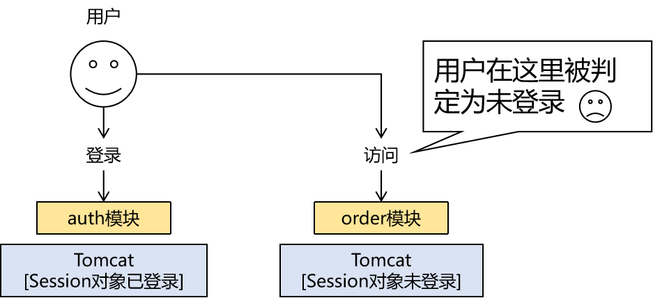

> 课件地址：[SpringCloud (wolai.com)](https://www.wolai.com/b9JdpwWjnv36vL2Q6w822B)
# 一、概念
## 1、架构演变
### ①什么是架构
架构其实就是项目的结构。只不过，架构是专门用于描述比较复杂、庞大的事物的结构。

### ②单体架构
一个项目，创建一个工程来开发，部署的时候导出一个war包，放在一个Tomcat上运行，底层使用一个服务器。<br/>
- 好处：结构简单
- 挑战1：业务功能越来越复杂，模块有了拆分的需求
- 挑战2：互联网时代到来，有了提高性能的需求

### ③单体架构的拆分
#### [1]纵向
工程拆分为多个module，靠Maven依赖机制实现上层对下层的调用。但是因为最终只导出一个war包，在一个Tomcat上部署运行，所以本质上还是单体架构应用。<br/>


#### [2]横向
整个项目按照功能模块，横向拆分为多个单体应用。只要各个应用之间不存在互相调用，那么就不能称之为分布式架构。<br/>


### ④方法远程调用
#### [1]内涵
在上面“单体架构应用横向拆分”的基础上，如果能实现模块与模块之间横向的、基于网络的远程调用，那么这个项目的架构也就可以称之为是分布式架构了。<br/>


远程调用是相对于本地调用来说的：
- 本地调用：就在当前工程内部直接调用方法，不需要访问网络
- 远程调用：
	- 在你要发送的请求中封装目标方法的所有信息（方法名、参数……），通过网络发送请求。
	- 对方接收到请求，调用对应的目标方法（通常是基于反射技术）
	- 目标方法的执行结果（返回值、是否抛出异常……）封装为响应数据
	- 响应数据返回给方法调用者

#### [2]外延
方法远程调用对架构的影响：
- 项目内部：有了方法远程调用就可以说是分布式架构
- 项目外部：通过方法远程调用，访问第三方接口，实现自己项目实现不了的功能
	- 例如：查天气预报、发短信、做支付、查物流、查身份证信息、查银行卡信息、查车辆违章……


### ⑤SOA
SOA：Service Oriented Architecture面向服务的架构<br/>
当分布式的理论和技术实现发展到一定阶段后，业界提出了“服务”的概念。<br/>
假设A模块调用B模块：
- B模块：服务的提供者provider
- A模块：服务的消费者consumer

有了服务的概念，就可以以服务为单位，来划分项目的各个模块，并设计模块之间（服务之间）调用关系。<br/>
- 对于被调用者来说，只关心自己内部的业务逻辑，内聚性更高。同时也隐藏了内部实现的细节，更安全。
- 对于调用者来说，不必关心服务提供者内部的具体实现细节，只关心自己的业务即可。

对于整个项目的层面也是“高内聚、低耦合”理念的体现。而且把服务的功能暴露到网络上之后，不仅项目内部可以访问使用，如有需要项目外部也可以访问。

<br/>

> 调用接口怎么理解？<br/>
> 这里的接口是指我们JavaSE的时候学习的interface吗？<br/>
> 服务提供者会声明接口（interface），接口中的抽象方法就定义了入参、返回值这些信息。<br/>
> 服务消费者根据接口中定义的入参、返回值执行远程调用。<br/>
> 所以当我们说到调用一个接口，实际上完整表述是：调用一个以某个interface接口为代表的远程方法。<br/>
> 这里也是面向接口编程思想的体现：只要interface声明不变，不管服务提供者怎么调整，服务消费者都不需要改变。

### ⑥微服务
#### [1]概念
微服务是马丁·福勒和詹姆斯·路易斯提出的架构风格理念。马丁福勒博客对微服务的官方定义是：
> In short, the microservice architectural style [1] is an approach to developing a single application as a suite of small services, each running in its own process and communicating with lightweight mechanisms, often an HTTP resource API. These services are built around business capabilities and independently deployable by fully automated deployment machinery. There is a bare minimum of centralized management of these services, which may be written in different programming languages and use different data storage technologies.

<br/>

原文网址：[Microservices Guide (martinfowler.com)](https://www.martinfowler.com/microservices/)<br/>

根据上面的描述，我们可以总结出微服务的如下几个关键特定：
- a suite of small services：一组小型服务
- **in its own process：在自己独立的进程中运行**
- communicating with lightweight mechanisms：以轻量级方式交互（通常是**HTTP**资源API）
- built around business capabilities：围绕业务能力构建
- **independently deployable：可以独立部署**
- **fully automated deployment machinery：应用的部署是完全自动化的**

#### [2]和SpringBoot的关系
- 微服务：理念
- SpringBoot：基于微服务理念研发的具体落地的产品

#### [3]辨析
分布式、SOA、微服务辨析：
- SQA和微服务都是分布式：苹果和桃子都是水果
- 微服务是比SOA更新一些的理念

### ⑦服务网格
服务网格：Service Mesh<br/>
倡导的理念：给每个服务提供一个“底座”，服务自己只需要关注自己负责的业务，除此之外，凡是和服务间调用、服务治理、服务监控等等相关的事情全部由底座来完成。<br/>


## 2、分布式的好处
### ①集群：局部横向扩容
#### [1]分布式和集群概念辨析
- 相同点：都涉及到使用多个服务器实例
- 不同点：
	- 集群是同构的：在一个集群里每一个服务器实例运行的是项目中相同的模块
	- 分布式是异构的：在分布式架构中，每一个服务器运行项目中不同的模块

#### [2]局部横向扩容
单体架构拆分成分布式架构之后，可以很灵活的对局部的某个（或某些）模块进行扩容。通过配置集群的方式，增加负载的承受能力。<br/>


### ②服务：功能独立，细节隐藏
- 服务内部：隐藏具体的实现细节，降低了被恶意攻击的风险。同时提高了项目结构上的内聚性。
- 服务之间：某些公共功能抽取出来，减少了代码的冗余。对于服务消费者来说，不需要知道服务提供者内部的实现细节，提高开发效率。

### ③高可用：系统更健壮
单一节点存在单点故障的风险。所以通过配置集群、主从、主备、主主等形式，让服务器在运行过程中有多个实例对外提供服务，一方面是提升并发能力，另外避免单点故障提高系统的可用性——即使某一个实例不可用，但整个系统对外仍然是可用的。

## 3、分布式带来的问题
### ①会话信息不一致



### ②数据不一致
#### [1]多个关系型数据库
无法纳入同一个本地事务中，就只能通过分布式事务解决：<br/>


#### [2]多个不同类型数据库


<br/>

- 情况1：缓存不一致问题（通过延时双删策略解决，但这是最终一致性并非强一致性）
- 情况2：不是缓存，就是同一个逻辑内，不同操作
	- 可以采用TCC方式解决：Try、Cancel、Confirm
		- Try：各个模块尝试执行操作
		- Cancel：各个模块都暴露一个执行取消操作的接口
		- Confirm：各个模块都暴露一个执行确认操作的接口
		- 全局范围有一个协调者，调用各模块的Try接口
			- 如果执行都成功，则调用各个模块的Confirm接口
			- 如果有任何一个失败，则调用各个模块的Cancel接口


### ③系统结构更复杂
#### [1]部署难度增大
- 模块众多，每一个都需要部署
- 模块内部仅仅能够通过单元测试不够，还必须总体进行联调

#### [2]系统性风险增加
服务的雪崩：<br/>


### ④小结
所有上面提到的问题都是应对新挑战所不可避免的，不是我们没事找事。


# 二、SpringCloud介绍
## 1、她是一组框架
SpringCloud不是单独的一个框架，而是一组框架的总和，她是分布式、微服务环境下开发的一个综合解决方案。

### ①SpringCloud的作用
> 官方介绍：
> Spring Cloud provides tools for developers to quickly build some of the common patterns in distributed systems (e.g. configuration management, service discovery, circuit breakers, intelligent routing, micro-proxy, control bus). Coordination of distributed systems leads to boiler plate patterns, and using Spring Cloud developers can quickly stand up services and applications that implement those patterns. They will work well in any distributed environment, including the developer’s own laptop, bare metal data centres, and managed platforms such as Cloud Foundry.

每一个微服务相当于市场上的一个公司，SpringCloud就提供了一整套方案，从各个方面管理这些公司。所以SpringCloud就相当于治理市场的ZF。
- 治理：倾向于宏观的、大范围的管理，而且不仅有**刚性**的约束，还会有一些**柔性**的调控，还有一些状态的监控


### ②SpringCloud版本号
SpringCloud所整合的很多具体框架，有它们自己各自的版本，这些版本是使用传统的数字方式来记录的。比如SpringBoot的版本：2.3.6.RELEASE。<br/>
而SpringCloud的版本和具体某个框架的版本并没有直接关系，所以如果使用同样的版本格式，会让人产生不必要的联想。<br/>
所以SpringCloud使用伦敦地铁站的名字来作为版本号，按照首字母排序。A开头的是第一个大版本，B开头的是第二个大版本……

<br/>

|英文|中文|终结版本|要求的SpringBoot版本|SpringBoot代表版本|
|--|--|--|--|--|
|Angel|安吉尔|SR6|1.2.X|1.2.8|
|Brixton|布里克斯顿|SR7|1.3.X|1.3.8|
|Camden|卡梅登|SR7|1.4.X|1.4.2|
|Dalston|达斯顿|SR5|1.5.X|\*|
|Edgware|艾奇韦尔|SR5|1.5.X|1.5.19|
|Finchley|芬奇利|SR2|2.0.X|2.0.8|
|Greenwich|格林威治|SR6|2.1.X|2.1.2|
|Hoxton|霍克斯顿|SR12|2.2.X|2.2.6|
|2020aka Ilford|埃福的|GA|2.5.X|2.5.7|
|2021aka Jubilee|朱比利|GA|2.6.X|2.6.1|
|2022 aka Kilburn|基尔伯恩|GA|3.0.X|Spring Framework 6.X<br/>SpringBoot 3.X，<br/>要求JDK17，兼容 Jakarta EE|

<br/>

## 2、各组件扮演的角色
- 初始状态：微服务A通过RestTemplate调用微服务B
- 为了实时获取微服务B的状态、参数变化，引入注册中心：Eureka、Nacos
- 微服务B扩展为集群，微服务A需要有能力负载均衡：Ribbon
- 微服务A调用微服务B始终没有返回响应或调用失败，为了避免故障蔓延，引入熔断器：Hystrix
- 微服务A调用微服务B，靠自己写代码（编程式）涉及RestTemplate、负载均衡、熔断器非常繁琐，所以引入Feign声明式远程调用：OpenFeign
- 整个系统微服务众多，由网关提供对外的统一入口，同时解决跨域问题、还可以执行过滤、鉴权等操作：Gateway
- 逐一维护各个微服务配置信息繁琐，引入配置中心：Nacos

## 3、两个时代
- 旧时代：Netflix
- 新时代：Alibaba

# 三、搭建基础环境
## 1、创建父工程
```xml
<!-- 统一管理jar包版本 -->
<properties>  
    <project.build.sourceEncoding>UTF-8</project.build.sourceEncoding>  
    <maven.compiler.source>1.8</maven.compiler.source>  
    <maven.compiler.target>1.8</maven.compiler.target>  
    <junit.version>4.12</junit.version>  
    <log4j.version>1.2.17</log4j.version>  
    <lombok.version>1.16.18</lombok.version>  
    <mysql.version>5.1.47</mysql.version>  
    <druid.version>1.1.16</druid.version>  
    <mybatis.spring.boot.version>1.3.0</mybatis.spring.boot.version>  
</properties>  
  
<!-- 子模块继承之后，锁定版本+子modlue不用写groupId和version  -->  
<dependencyManagement>  
    <dependencies>  
        <dependency>  
            <groupId>org.springframework.boot</groupId>  
            <artifactId>spring-boot-dependencies</artifactId>  
            <version>2.3.6.RELEASE</version>  
            <type>pom</type>  
            <scope>import</scope>  
        </dependency>  
        <dependency>  
            <groupId>org.springframework.cloud</groupId>  
            <artifactId>spring-cloud-dependencies</artifactId>  
            <version>Hoxton.SR9</version>  
            <type>pom</type>  
            <scope>import</scope>  
        </dependency>  
        <dependency>  
            <groupId>com.alibaba.cloud</groupId>  
            <artifactId>spring-cloud-alibaba-dependencies</artifactId>  
            <version>2.2.6.RELEASE</version>  
            <type>pom</type>  
            <scope>import</scope>  
        </dependency>  
  
        <dependency>  
            <groupId>mysql</groupId>  
            <artifactId>mysql-connector-java</artifactId>  
            <version>${mysql.version}</version>  
        </dependency>  
        <dependency>  
            <groupId>com.alibaba</groupId>  
            <artifactId>druid</artifactId>  
            <version>${druid.version}</version>  
        </dependency>  
        <dependency>  
            <groupId>org.mybatis.spring.boot</groupId>  
            <artifactId>mybatis-spring-boot-starter</artifactId>  
            <version>${mybatis.spring.boot.version}</version>  
        </dependency>  
        <dependency>  
            <groupId>junit</groupId>  
            <artifactId>junit</artifactId>  
            <version>${junit.version}</version>  
        </dependency>  
        <dependency>  
            <groupId>log4j</groupId>  
            <artifactId>log4j</artifactId>  
            <version>${log4j.version}</version>  
        </dependency>  
        <dependency>  
            <groupId>org.projectlombok</groupId>  
            <artifactId>lombok</artifactId>  
            <version>${lombok.version}</version>  
            <optional>true</optional>  
        </dependency>  
    </dependencies>  
</dependencyManagement>  
  
<build>  
    <plugins>  
        <plugin>  
            <groupId>org.springframework.boot</groupId>  
            <artifactId>spring-boot-maven-plugin</artifactId>  
            <configuration>  
                <fork>true</fork>  
                <addResources>true</addResources>  
            </configuration>  
        </plugin>  
    </plugins>  
</build>
```

## 2、微服务provider-payment
### ①引入依赖
```xml
<dependencies>  
    <dependency>  
        <groupId>org.springframework.boot</groupId>  
        <artifactId>spring-boot-starter-web</artifactId>  
    </dependency>  
    <dependency>  
        <groupId>org.springframework.boot</groupId>  
        <artifactId>spring-boot-starter-actuator</artifactId>  
    </dependency>  
    <dependency>  
        <groupId>org.mybatis.spring.boot</groupId>  
        <artifactId>mybatis-spring-boot-starter</artifactId>  
    </dependency>  
    <dependency>  
        <groupId>com.alibaba</groupId>  
        <artifactId>druid-spring-boot-starter</artifactId>  
        <version>1.2.16</version>  
    </dependency>  
    <dependency>  
        <groupId>mysql</groupId>  
        <artifactId>mysql-connector-java</artifactId>  
    </dependency>  
    <dependency>  
        <groupId>org.springframework.boot</groupId>  
        <artifactId>spring-boot-starter-jdbc</artifactId>  
    </dependency>  
    <dependency>  
        <groupId>org.springframework.boot</groupId>  
        <artifactId>spring-boot-devtools</artifactId>  
        <scope>runtime</scope>  
        <optional>true</optional>  
    </dependency>  
    <dependency>  
        <groupId>org.projectlombok</groupId>  
        <artifactId>lombok</artifactId>  
        <optional>true</optional>  
    </dependency>  
    <dependency>  
        <groupId>org.springframework.boot</groupId>  
        <artifactId>spring-boot-starter-test</artifactId>  
        <scope>test</scope>  
    </dependency>  
</dependencies>
```

### ②YAML配置文件
```yaml
server:  
  port: 8001  
  
spring:  
  application:  
    name: cloud-payment-service  
  datasource:  
    type: com.alibaba.druid.pool.DruidDataSource  
    driver-class-name: com.mysql.jdbc.Driver  
    url: jdbc:mysql://192.168.200.100:63306/cloud2021?useUnicode=true&characterEncoding=utf-8&useSSL=false  
    username: root  
    password: atguigu  
  
mybatis:  
  mapperLocations: classpath:/mapper/*.xml  
  type-aliases-package: com.atguigu.springcloud.entities
```

### ③主启动类
```java
package com.atguigu.springcloud;  
  
import org.springframework.boot.SpringApplication;  
import org.springframework.boot.autoconfigure.SpringBootApplication;  
  
@SpringBootApplication  
public class PaymentMain8001 {  
    public static void main(String[] args) {  
        SpringApplication.run(PaymentMain8001.class, args);  
    }  
}
```

### ④建模
#### [1]物理建模
```sql
CREATE DATABASE IF NOT EXISTS cloud2021 DEFAULT CHARACTER SET utf8;  
  
USE cloud2021;  
  
DROP TABLE IF EXISTS payment;  
  
CREATE TABLE payment  
(  
    id     BIGINT(20) NOT NULL AUTO_INCREMENT COMMENT 'ID',  
    SERIAL VARCHAR(300) DEFAULT NULL,  
    PRIMARY KEY (id)  
) ENGINE = INNODB  
  AUTO_INCREMENT = 33  
  DEFAULT CHARSET = utf8;  
  
INSERT INTO payment (id, SERIAL)  
VALUES (31, '尚硅谷001'),  
       (32, 'atguigu002');
```

#### [2]逻辑建模
```java
package com.atguigu.springcloud.entities;

import lombok.AllArgsConstructor;  
import lombok.Data;  
import lombok.NoArgsConstructor;  
import java.io.Serializable;  

@Data  
@AllArgsConstructor  
@NoArgsConstructor  
public class Payment implements Serializable {  
    private Long id;  
    private String serial;  
}
```

#### [3]统一响应模型
在下面两种情况都使用这个统一规范的数据格式：
- 服务的提供者返回JSON数据给服务的消费者
- 服务返回JSON格式响应数据给前端的Ajax请求

```java
package com.atguigu.springcloud.entities;  
  
import lombok.AllArgsConstructor;  
import lombok.Data;  
import lombok.NoArgsConstructor;  

import java.io.Serializable;
  
@Data  
@AllArgsConstructor  
@NoArgsConstructor  
public class CommonResult<T> implements Serializable{  

	// 响应码：我们自己设定的响应码，和HTTP响应状态码没有直接关系
    private Integer code;  

	// 响应消息，通常是在处理请求失败时设置错误消息，如果响应成功可以设置为OK或什么都不设置
    private String message;  

	// 做查询操作时返回的查询结果数据
    private T data;  
  
    public CommonResult(Integer code,String message){  
        this(code,message,null);  
    }  
}
```

### ⑤持久化层
#### [1]Dao类
```java
package com.atguigu.springcloud.dao;  
  
import com.atguigu.springcloud.entities.Payment;  
import org.apache.ibatis.annotations.Mapper;  
import org.apache.ibatis.annotations.Param;  
  
@Mapper  
public interface PaymentDao {  
    public int create(Payment payment);      
    public Payment getPaymentById(@Param("id") Long id);  
}
```

#### [2]Mapper配置文件
src\\main\\resources\\mapper\\PaymentMapper.xml
```xml
<?xml version="1.0" encoding="UTF-8"?>  
<!DOCTYPE mapper PUBLIC "-//mybatis.org//DTD Mapper 3.0//EN" "http://mybatis.org/dtd/mybatis-3-mapper.dtd">  
  
<mapper namespace="com.atguigu.springcloud.dao.PaymentDao">  
    <insert id="create"  useGeneratedKeys="true" keyProperty="id">  
            insert into payment(serial) values(#{serial});  
    </insert>  
  
    <resultMap id="BaseResultMap" type="com.atguigu.springcloud.entities.Payment">  
        <id column="id" property="id" jdbcType="BIGINT"></id>  
        <result column="serial" property="serial" jdbcType="VARCHAR"></result>  
    </resultMap>  
  
    <select id="getPaymentById"  parameterType="Long" resultMap="BaseResultMap">  
            select * from payment where id=#{id}  
    </select>  
  
</mapper>
```

### ⑥业务逻辑层
#### [1]接口
```java
package com.atguigu.springcloud.service;  
  
import com.atguigu.springcloud.entities.Payment;  
import org.apache.ibatis.annotations.Param;  
  
public interface PaymentService {  
    public int create(Payment payment); //写  
    public Payment getPaymentById(Long id);  //读取  
}
```

#### [2]实现类
```java
package com.atguigu.springcloud.service.impl;  
  
import com.atguigu.springcloud.dao.PaymentDao;  
import com.atguigu.springcloud.entities.Payment;  
import com.atguigu.springcloud.service.PaymentService;  
import org.apache.ibatis.annotations.Param;  
import org.springframework.beans.factory.annotation.Autowired;  
import org.springframework.stereotype.Service;  
import javax.annotation.Resource;  
  
@Service  
public class PaymentServiceImpl implements PaymentService {  
  
    @Autowired  
    private PaymentDao paymentDao;  
     
    public int create(Payment payment){  
        return paymentDao.create(payment);  
    }  
  
    public Payment getPaymentById( Long id){  
        return paymentDao.getPaymentById(id);  
    }  
}
```

### ⑦控制器
```java
package com.atguigu.springcloud.controller;

import com.atguigu.springcloud.entities.CommonResult;
import com.atguigu.springcloud.entities.Payment;
import com.atguigu.springcloud.service.PaymentService;
import lombok.extern.slf4j.Slf4j;
import org.springframework.web.bind.annotation.*;
import javax.annotation.Resource;

@RestController
@Slf4j
public class PaymentController {

    @Resource
    private PaymentService paymentService;

    @PostMapping(value = "/payment/create")
    public CommonResult<Payment> create(@RequestBody Payment payment){ //埋雷
       int result = paymentService.create(payment);
       log.info("*****插入结果："+result);
       if (result>0){  //成功
           return new CommonResult(200,"插入数据库成功",result);
       }else {
           return new CommonResult(444,"插入数据库失败",null);
       }
    }

    @GetMapping(value = "/payment/get/{id}")
    public CommonResult<Payment> getPaymentById(@PathVariable("id") Long id){
        Payment payment = paymentService.getPaymentById(id);
        log.info("*****查询结果："+payment);
        if (payment!=null){  //说明有数据，能查询成功
            return new CommonResult(200,"查询成功",payment);
        }else {
            return new CommonResult(444,"没有对应记录，查询ID："+id,null);
        }
    }
}
```

### ⑧测试
#### [1]查询操作
请求地址：http://localhost:8001/payment/get/31

#### [2]创建操作
请求地址：http://localhost:8001/payment/create<br/>


## 3、微服务consumer-order
### ①引入依赖
```xml
<dependencies>  
    <dependency>  
        <groupId>org.springframework.boot</groupId>  
        <artifactId>spring-boot-starter-web</artifactId>  
    </dependency>  
    <dependency>  
        <groupId>org.springframework.boot</groupId>  
        <artifactId>spring-boot-starter-actuator</artifactId>  
    </dependency>  
    <dependency>  
        <groupId>org.springframework.boot</groupId>  
        <artifactId>spring-boot-devtools</artifactId>  
        <scope>runtime</scope>  
        <optional>true</optional>  
    </dependency>  
    <dependency>  
        <groupId>org.projectlombok</groupId>  
        <artifactId>lombok</artifactId>  
        <optional>true</optional>  
    </dependency>  
    <dependency>  
        <groupId>org.springframework.boot</groupId>  
        <artifactId>spring-boot-starter-test</artifactId>  
        <scope>test</scope>  
    </dependency>  
</dependencies>
```

### ②YAML配置文件
```yaml
server:  
  port: 80  
spring:  
  application:  
    name: cloud-consumer-order80
```

### ③主启动类
```java
package com.atguigu.springcloud;  
  
import org.springframework.boot.SpringApplication;  
import org.springframework.boot.autoconfigure.SpringBootApplication;  
  
@SpringBootApplication  
public class OrderMain80 {  
    public static void main(String[] args) {  
        SpringApplication.run(OrderMain80.class,args);  
    }  
}
```

### ④建模
把provider工程中的实体类复制过来。

### ⑤配置RestTemplate
#### [1]简介
在Java语言中，HttpClient是通过编写代码发送HTTP请求的最基本工具，但是使用太繁琐了，需要自己手动设定请求的所有细节。所以为了简化开发，Spring封装了RestTemplate给我们使用，相对方便了很多。

#### [2]基本用法
使用RestTemplate最初级的方式需要提供三个参数：
- url：请求地址
- requestMap：请求参数
- ResponseBean.class：转换HTTP响应的目标类型

#### [3]配置bean
```java
package com.atguigu.springcloud.config;  
  
import org.springframework.boot.SpringBootConfiguration;  
import org.springframework.context.annotation.Bean;  
import org.springframework.web.client.RestTemplate;  
  
@SpringBootConfiguration  
public class ApplicationContextConfig {  
  
    @Bean  
    // @LoadBalanced 后面用到，暂时注释掉  
    public RestTemplate getRestTemplate(){  
        return new RestTemplate();  
    }  
  
}
```

### ⑥控制器
```java
package com.atguigu.springcloud.controller;  
  
import com.atguigu.springcloud.entities.CommonResult;  
import com.atguigu.springcloud.entities.Payment;  
import lombok.extern.slf4j.Slf4j;  
import org.springframework.web.bind.annotation.GetMapping;  
import org.springframework.web.bind.annotation.PathVariable;  
import org.springframework.web.bind.annotation.PostMapping;  
import org.springframework.web.bind.annotation.RestController;  
import org.springframework.web.client.RestTemplate;  
  
import javax.annotation.Resource;  
  
@RestController  
@Slf4j  
public class OrderController {  
  
    public static final String PAYMENT_URL = "http://localhost:8001";  
  
    @Resource  
    private RestTemplate restTemplate;  
  
    @PostMapping("/consumer/payment/create")  
    public CommonResult<Payment>   create(Payment payment){  
        return restTemplate.postForObject(PAYMENT_URL+"/payment/create",payment,CommonResult.class);  //写操作  
    }  
  
    @GetMapping("/consumer/payment/get/{id}")  
    public CommonResult<Payment> getPayment(@PathVariable("id") Long id){  
        return restTemplate.getForObject(PAYMENT_URL+"/payment/get/"+id,CommonResult.class);  
    }  
}
```

## 4、抽取通用工程
这个工程不是微服务，仅仅只是把重复的类抽取出来，然后另外两个微服务工程依赖它。
```xml
<dependencies>  
    <dependency>  
        <groupId>org.springframework.boot</groupId>  
        <artifactId>spring-boot-devtools</artifactId>  
        <scope>runtime</scope>  
        <optional>true</optional>  
    </dependency>  
  
    <dependency>  
        <groupId>org.projectlombok</groupId>  
        <artifactId>lombok</artifactId>  
        <optional>true</optional>  
    </dependency>  
    <dependency>  
        <groupId>cn.hutool</groupId>  
        <artifactId>hutool-all</artifactId>  
        <version>5.1.0</version>  
    </dependency>  
</dependencies>
```