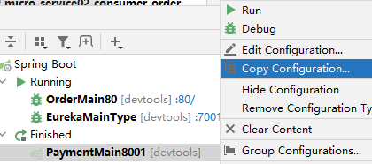
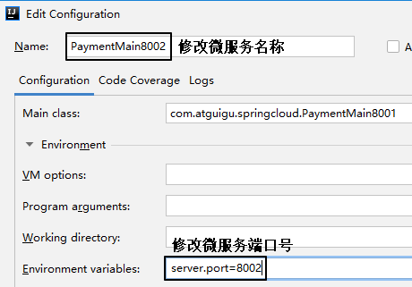

# 一、简介
## 1、基本信息
<p>Spring Cloud Ribbon是基于Netflix Ribbon实现的一套客户端负载均衡（Client Load Balance）的工具。</p>

<p>简单的说，Ribbon是Netflix发布的开源项目，主要功能是提供客户端的软件负载均衡算法和服务调用。</p>

<p>Ribbon客户端组件提供一系列完善的配置项，如：连接超时，重试等。</p>

<p>简单的说，就是在配置文件中列出Load Balancer(简称LB)后面所有的机器，Ribbon会自动的帮助你基于某种规则（如简单轮询，随机连接等）去连接这些机器。</p>

## 2、特点
Ribbon最大的特点是：客户端负载均衡。为什么这么说呢？因为使用Ribbon时：
- 在consumer端引入Ribbon的jar包
- Ribbon在consumer端进行计算
- 在consumer端决定访问集群中的具体哪一个实例

> 大家想想Ribbon和Nginx的区别在哪里？
- Ribbon是Java写的，Nginx是C写的
- Ribbon基于SpringCloud，Nginx直接安装在Linux系统上
- Ribbon是客户端负载均衡，相当于正向代理；Nginx为服务器端提供代理，属于反向代理
- Ribbon是为微服务中代理consumer去访问provider；Nginx是为微服务系统外的请求做负载均衡访问微服务系统

## 3、工作机制
<p>第一步，先选择EurekaServer，它优先选择在同一个区域内负载较少的server。</p>

<p>第二步，根据微服务名称到Eureka服务器查找对应的服务列表。根据服务列表，选择集群中某一个实例的地址。其中Ribbon提供了多种策略。比如：轮询、随机和根据响应时间加权。</p>

<p>第三步：拿到具体某一个实例的地址后，调用RestTemplate发送请求。</p>

总结：Ribbon其实就是一个软负载均衡的客户端组件。

# 二、操作演示
## 1、消费端操作
### ①依赖信息[看看就行]
Ribbon的依赖信息是：
```xml
<dependency>
	<groupId>org.springframework.cloud</groupId>
	<artifactId>spring-cloud-starter-netflix-ribbon</artifactId>
</dependency>
```
注意：这个不需要手动引用，Eureka客户端自带Ribbon

### ②增加注解@LoadBalanced
```java
package com.atguigu.springcloud.config;  
  
import org.springframework.boot.SpringBootConfiguration;  
import org.springframework.cloud.client.loadbalancer.LoadBalanced;  
import org.springframework.context.annotation.Bean;  
import org.springframework.web.client.RestTemplate;  
  
@SpringBootConfiguration  
public class ApplicationContextConfig {  
  
    @Bean  
    @LoadBalanced    
    public RestTemplate getRestTemplate(){  
        return new RestTemplate();  
    }  
  
}
```

### ③基于服务名调用
```java
public static final String PAYMENT_URL = "http://cloud-payment-service";
```

## 2、提供端操作
### ①修改Controller方法
```java
@GetMapping(value = "/payment/get/{id}")  
public CommonResult<Payment> getPaymentById(@PathVariable("id") Long id, HttpServletRequest request){  
    Payment payment = paymentService.getPaymentById(id);  
    log.info("*****查询结果："+payment);  
    if (payment!=null){  //说明有数据，能查询成功  
        // 附加当前服务器端口号，目的是了解当前请求访问的是集群中的哪一个实例  
        String serial = payment.getSerial() + " " + request.getServerPort();  
        payment.setSerial(serial);  
  
        return new CommonResult<>(200,"查询成功", payment);  
    }else {  
        return new CommonResult<>(444,"没有对应记录，查询ID："+id,null);  
    }  
}
```

### ②集群化运行




# 三、负载均衡策略
## 1、策略介绍[面试]
-   轮询 RoundRobinRule：轮流访问每一个集群实例
-   权重 WeightedResponseTimeRule：权重高的实例被访问到的几率大，而权重值是根据服务提供者的响应时间设定的，响应时间越长权重值越小。它的实现原理是，刚开始使用轮询策略并开启一个计时器，每一段时间收集一次所有服务提供者的平均响应时间，然后再给每个服务提供者附上一个权重，权重越高被选中的概率也越大。
-   随机 RandomRule：从集群服务列表中随机选择一个访问
-   最小连接数 BestAvailableRule：也叫最小并发数，它是遍历服务提供者列表，选取连接数最小的⼀个服务实例。如果有相同的最小连接数，那么会调用轮询策略进行选取。
-   重试策略 RetryRule：按照轮询策略来获取服务，如果获取的服务实例为null或已经失效，则在指定的时间之内不断地进行重试来获取服务，如果超过指定时间依然没获取到服务实例则返回null。
-   可用性敏感 AvailabilityFilteringRule：先过滤掉非健康的服务实例，然后再选择连接数较小的服务实例。
-   区域敏感 ZoneAvoidanceRule：根据服务所在区域(zone)的性能和服务的可用性来选择服务实例，在没有区域的环境下，该策略和轮询策略类似。

> 不管具体采用哪一个策略，最初确定第一个被访问的微服务实例时都是随机选择的。 即使是轮询也只是每一轮访问的顺序一样，第一轮访问的顺序是随机的。

## 2、定制策略[了解]
### ①说明
如果不希望你所定制的策略在整个IOC容器范围内生效，则把它放在自动扫描包的范围之外。

### ②创建定制策略的配置类
```java
package com.atguigu.myrule;  
  
import com.netflix.loadbalancer.IRule;  
import com.netflix.loadbalancer.RandomRule;  
import org.springframework.context.annotation.Bean;  
import org.springframework.context.annotation.Configuration;  
  
@Configuration  
public class MySelfRule {  
  
    @Bean  
    public IRule myRule(){  
        return new RandomRule();//定义为随机  
    }  
}
```

### ③增加注解
```java
package com.atguigu.springcloud;  
  
import com.atguigu.myrule.MySelfRule;  
import org.springframework.boot.SpringApplication;  
import org.springframework.boot.autoconfigure.SpringBootApplication;  
import org.springframework.cloud.netflix.eureka.EnableEurekaClient;  
import org.springframework.cloud.netflix.ribbon.RibbonClient;  
  
@EnableEurekaClient  
@SpringBootApplication  
@RibbonClient(name = "CLOUD-PAYMENT-SERVICE",configuration = MySelfRule.class)
public class OrderMain80 {  
    public static void main(String[] args) {  
        SpringApplication.run(OrderMain80.class,args);
    }  
}
```
