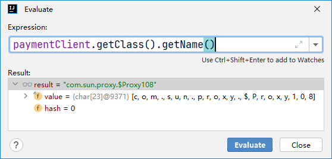
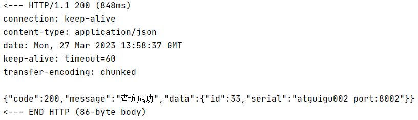

# 一、声明式远程调用
## 1、编程式远程调用
- 不使用框架：通过HttpClient等这样原生的API构造HTTP请求，非常繁琐。
- 使用框架：通过RestTemplate发送请求，比HttpClient肯定是简单，但是仍然不是最佳状态
	- 需要配置RestTemplate的bean，从而把RestTemplate加入IOC容器
	- 在配置RestTemplate的bean的时候，还需要通过@LoadBalanced注解启用负载均衡
	- 在RestTemplate请求地址这里使用微服务名称
	- 以上这些操作都和业务没有直接关系

## 2、声明式远程调用
把能够封装为统一、通用解决方案的功能交给框架，程序员专注于业务开发。<br/>
OpenFeign能够实现的效果就是：在调用远程方法时，就像调用本地方法一样。

# 二、基础操作
## 1、新建module
module名称：micro-service04-feign-order

### ①引入依赖
```xml
<dependencies>  
    <!--openfeign-->
    <dependency>
        <groupId>org.springframework.cloud</groupId>
        <artifactId>spring-cloud-starter-openfeign</artifactId>
    </dependency>
    <dependency>
        <groupId>org.springframework.cloud</groupId>
        <artifactId>spring-cloud-starter-netflix-eureka-client</artifactId>  
    </dependency>  
    <dependency>  
        <groupId>com.atguigu.cloud</groupId>  
        <artifactId>common-api</artifactId>  
        <version>1.0-SNAPSHOT</version>  
    </dependency>  
    <dependency>  
        <groupId>org.springframework.boot</groupId>  
        <artifactId>spring-boot-starter-web</artifactId>  
    </dependency>  
    <dependency>  
        <groupId>org.springframework.boot</groupId>  
        <artifactId>spring-boot-starter-actuator</artifactId>  
    </dependency>  
    <dependency>  
        <groupId>org.springframework.boot</groupId>  
        <artifactId>spring-boot-devtools</artifactId>  
        <scope>runtime</scope>  
        <optional>true</optional>  
    </dependency>  
    <dependency>  
        <groupId>org.projectlombok</groupId>  
        <artifactId>lombok</artifactId>  
        <optional>true</optional>  
    </dependency>  
    <dependency>  
        <groupId>org.springframework.boot</groupId>  
        <artifactId>spring-boot-starter-test</artifactId>  
        <scope>test</scope>  
    </dependency>  
</dependencies>
```

### ②YAML
```yaml
server:  
  port: 80  
spring:  
  application:  
    name: cloud-consumer-feign-order80  
eureka:  
  client:  
    register-with-eureka: true  
    fetch-registry: true  
    service-url:  
      defaultZone: http://localhost:7001/eureka
```

### ③主启动类
```java
@SpringBootApplication  
@EnableEurekaClient  
@EnableFeignClients  
public class FeignOrderMainType {  
  
    public static void main(String[] args) {  
        SpringApplication.run(FeignOrderMainType.class, args);  
    }  
  
}
```

### ④声明Feign接口
技巧：到Provider的Controller里复制接口方法的声明。
- 接口中和被调用的方法对应的方法建议直接从 Provider 那边复制过来，做一些调整即可
- 在调用目标方法时，不需要我们 Consumer 这边传入的参数去掉，其它声明保持一致即可
```java
package com.atguigu.springcloud.api;  
  
import com.atguigu.springcloud.entities.CommonResult;  
import com.atguigu.springcloud.entities.Payment;  
import org.springframework.cloud.openfeign.FeignClient;  
import org.springframework.web.bind.annotation.GetMapping;  
import org.springframework.web.bind.annotation.PathVariable;  
import org.springframework.web.bind.annotation.PostMapping;  
import org.springframework.web.bind.annotation.RequestBody;  
  
@FeignClient(value = "cloud-payment-service")  
public interface PaymentFeignService {  
  
    @GetMapping(value = "/payment/get/{id}")  
    CommonResult<Payment> getPaymentById(@PathVariable("id") Long id);  
  
    @PostMapping(value = "/payment/create")  
    CommonResult<Payment> create(@RequestBody Payment payment);  
  
}
```

### ⑤Controller类
```java
package com.atguigu.springcloud.controller;  
  
import com.atguigu.springcloud.api.PaymentFeignService;  
import com.atguigu.springcloud.entities.CommonResult;  
import com.atguigu.springcloud.entities.Payment;  
import org.springframework.beans.factory.annotation.Autowired;  
import org.springframework.web.bind.annotation.GetMapping;  
import org.springframework.web.bind.annotation.PathVariable;  
import org.springframework.web.bind.annotation.PostMapping;  
import org.springframework.web.bind.annotation.RestController;  
  
@RestController  
public class OrderController {  
  
    @Autowired  
    private PaymentFeignService paymentFeignService;  
  
    @PostMapping("/feign/payment/create")  
    public CommonResult<Payment> create(Payment payment){  
        return paymentFeignService.create(payment);  
    }  
  
    @GetMapping("/feign/payment/get/{id}")  
    public CommonResult<Payment> getPayment(@PathVariable("id") Long id){  
        return paymentFeignService.getPaymentById(id);  
    }  
}
```

# 三、为什么可以通过接口调用方法


<br/>

> 原因：框架基于JDK的动态代理技术，给接口提供了实现类。实际上调用的是代理对象的方法。<br/>
> 以后大家在任何场合看到com.sun.proxy.$Proxy5这样的类型，就可以直接断定这里使用了JDK的动态代理技术。

# 四、日志打印
改变日志级别将会看到更多日志信息的打印。

## 1、Feign日志级别
- NONE：默认的，不显示任何日志
- BASIC：仅记录请求方式、URL、响应状态码及执行时间
- HEADERS：除了BASIC中定义的信息之外，还有请求和响应的头信息
- FULL：除了HEADERS中定义的信息之外，还有请求和响应的正文及元数据

## 2、配置日志bean
通过把这个bean加入IOC容器，就可以设置Feign的日志级别

```java
package com.atguigu.springcloud.config;  
  
import feign.Logger;  
import org.springframework.context.annotation.Bean;  
import org.springframework.context.annotation.Configuration;  
  
@Configuration  
public class FeignConfig {  
  
    @Bean  
    public Logger.Level feignLoggerLevel(){  
        return Logger.Level.FULL;  
    }  
}
```

## 3、指定打印日志的Feign接口
<p>就是指定一下，我们哪一个组件需要打印日志。</p>
<p>**注意**：Feign接口全类名部分一定要改成你自己的，实际的全类名。</p>

```yaml
logging:  
  level:  
    com.atguigu.springcloud.api.PaymentFeignService: debug
```

## 4、效果


