# 一、提出问题
## 1、服务雪崩
微服务之间存在错综复杂的调用关系：
- 调用别人：可能连续调用很多个微服务（直接、间接）
- 被别人调用：直接、间接的有很多微服务来调用我

任何一个微服务出现超时、抛异常、卡死等问题时，都有可能导致故障在系统中蔓延开来。越深的微服务，这样的风险越大。<br/>

当有一个微服务出现故障进而导致系统中很多微服务也无法访问，甚至导致整个系统瘫痪，这样的现象我们称之为：服务的雪崩<br/>

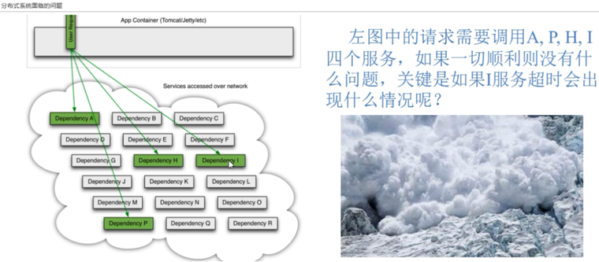

## 2、解决问题的思路
### ①断路器
- 断路器一打开，Consumer就不能访问Provider了，所以断路器平常是关闭的
- 当Consumer调用Provider遇到故障时，断路器会打开
- 断路器打开之后，一段时间内，Consumer不能访问Provider
- 这段时间内，Consumer全部使用备选方案，不发送请求
- 这一段时间之后，断路器进入“半开”状态
- 半开状态就是放行一个请求，试探一下，看看Provider是否正常
	- Provider正常了：断路器关闭，Consumer就可以正常访问Provider了
	- Provider仍然不正常：断路器重新回到打开状态，又一段时间不能访问Provider了


### ②备选方案
为了配合断路器的使用，Consumer和Provider两端都可以提前在开发时准备备选方案。<br/>
一旦出现故障则执行备选方案。<br/>
备选方案肯定没办法返回正常状态下应该返回的数据。但是有如下好处：
- 调用我的人不至于拿到一个抛异常的信息，我在备选方案中返回的是一个相对友好的信息
- 返回备选方案后，调用我的人就不需要继续等待了，可以继续执行后续的操作

<br/>

我们对被选方案有一个要求：返回值类型一致。原因很简单：避免类型转换异常。<br/>
此时也体现了CommonResult存在的价值：不管操作成功还是失败，都可以返回相同类型的数据。<br/>


### ③服务降级
站在用户角度，我们对比下面三种情况：
- 服务器端处理用户请求成功：用户看到正常的结果页面（用户体验打分：10分）
- 服务器端处理用户请求失败：用户看到的是抛异常的页面（用户体验打分：-10分）
- 服务器端处理用户请求失败：用户看到的是一个比较友好的提示信息（用户体验打分：0分）

所以服务降级就是：虽然不能给用户返回正常的结果，但是还是返回一个提示信息。虽然比用户预期的体验差一些，但是比抛异常、报错这样还是好一些。<br/>

前面提到的备选方案，其实就是在后端实现服务降级的一个具体措施。<br/>

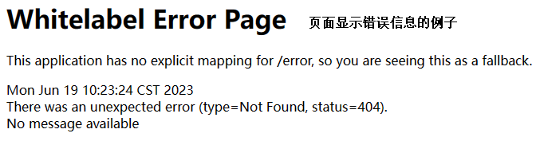

<br/>

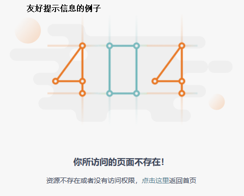

# 二、准备工作
## 1、Jmeter使用
### ①下载地址
https://archive.apache.org/dist/jmeter/binaries/?spm=wolai.workspace.0.0.ac33767bFqVAab

<br/>

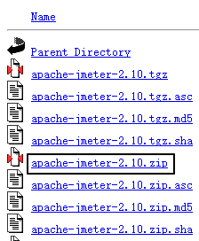

### ②使用
- 解压到非中文、无空格目录
- 进入bin目录
- 双击ApacheJMeter.jar运行

<br/>

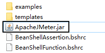

### ③操作
先在测试计划下创建线程组：<br/>

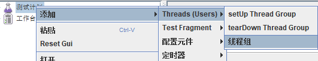

然后在线程组下创建HTTP请求：<br/>

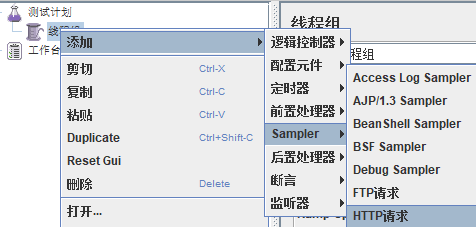

在线程组内设置并发压力：<br/>

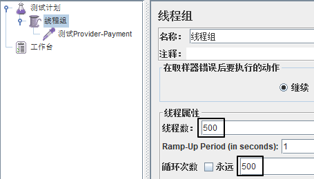

在HTTP请求内设置目标服务器的访问参数：<br/>

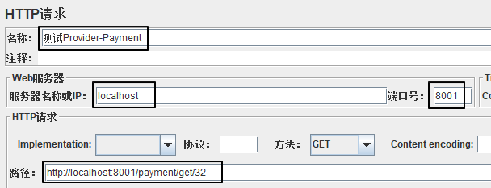

点这里开始：<br/>


## 2、创建测试用的Provider
### ①引入依赖
```xml
<dependencies>  
    <!--新增hystrix-->  
    <dependency>  
        <groupId>org.springframework.cloud</groupId>  
        <artifactId>spring-cloud-starter-netflix-hystrix</artifactId>  
    </dependency>  
    <dependency>  
        <groupId>org.springframework.cloud</groupId>  
        <artifactId>spring-cloud-starter-netflix-eureka-client</artifactId>  
    </dependency>  
    <dependency>  
        <groupId>com.atguigu.cloud</groupId>  
        <artifactId>common-api</artifactId>  
        <version>1.0-SNAPSHOT</version>  
    </dependency>  
    <dependency>  
        <groupId>org.springframework.boot</groupId>  
        <artifactId>spring-boot-starter-web</artifactId>  
    </dependency>  
    <dependency>  
        <groupId>org.springframework.boot</groupId>  
        <artifactId>spring-boot-starter-actuator</artifactId>  
    </dependency>  
    <dependency>  
        <groupId>org.springframework.boot</groupId>  
        <artifactId>spring-boot-devtools</artifactId>  
        <scope>runtime</scope>  
        <optional>true</optional>  
    </dependency>  
    <dependency>  
        <groupId>org.projectlombok</groupId>  
        <artifactId>lombok</artifactId>  
        <optional>true</optional>  
    </dependency>  
    <dependency>  
        <groupId>org.springframework.boot</groupId>  
        <artifactId>spring-boot-starter-test</artifactId>  
        <scope>test</scope>  
    </dependency>  
</dependencies>
```

### ②YAML
```yaml
server:  
  port: 8001  
  
spring:  
  application:  
    name: cloud-hystrix-payment-service  
  
eureka:  
  client:  
    register-with-eureka: true  
    fetch-registry: true  
    service-url:  
      defaultZone: http://localhost:7001/eureka/
```

### ③主启动类
```java
package com.atguigu.springcloud;  
  
import org.springframework.boot.SpringApplication;  
import org.springframework.boot.autoconfigure.SpringBootApplication;   
import org.springframework.cloud.netflix.eureka.EnableEurekaClient;  
  
@SpringBootApplication  
@EnableEurekaClient  
public class PaymentHystrixMain8001 {  
    public static void main(String[] args) {  
        SpringApplication.run(PaymentHystrixMain8001.class,args);  
    }  
}
```

### ④Service接口
```java
package com.atguigu.springcloud.service;  
  
public interface PaymentService {  
    String paymentInfo_OK(Integer id);  
    String payment_Timeout(Integer id);  
}
```

### ⑤Service实现类
```java
package com.atguigu.springcloud.service.impl;  
  
import com.atguigu.springcloud.service.PaymentService;  
import com.netflix.hystrix.contrib.javanica.annotation.HystrixCommand;  
import com.netflix.hystrix.contrib.javanica.annotation.HystrixProperty;  
import org.springframework.stereotype.Service;  
import java.util.concurrent.TimeUnit;  
  
@Service  
public class PaymentServiceImpl implements PaymentService {  
  
    //成功  
    public String paymentInfo_OK(Integer id){  
        return "线程池："+Thread.currentThread().getName()+"   paymentInfo_OK,id：  "+id+"\t"+"哈哈哈"  ;  
    }  
  
    //失败  
    public String payment_Timeout(Integer id){  
        int timeNumber = 3;  
        try { TimeUnit.SECONDS.sleep(timeNumber); }catch (Exception e) {e.printStackTrace();}  
        return "线程池："+Thread.currentThread().getName()+"   paymentInfo_TimeOut,id：  "+id+"\t"+"呜呜呜"+" 耗时(秒)"+timeNumber;  
    }
}
```

### ⑥Controller方法
```java
package com.atguigu.springcloud.controller;  
  
import com.atguigu.springcloud.service.PaymentService;  
import lombok.extern.slf4j.Slf4j;  
import org.springframework.beans.factory.annotation.Value;  
import org.springframework.web.bind.annotation.GetMapping;  
import org.springframework.web.bind.annotation.PathVariable;  
import org.springframework.web.bind.annotation.RestController;  
import javax.annotation.Resource;  
  
@RestController  
@Slf4j  
public class PaymentController {  
  
    @Resource  
    private PaymentService paymentService;  
  
    @Value("${server.port}")  
    private String serverPort;  
  
    @GetMapping("/payment/hystrix/ok/{id}")  
    public String paymentInfo_OK(@PathVariable("id") Integer id){  
        String result = paymentService.paymentInfo_OK(id);  
        log.info("*******result:"+result);  
        return result;  
    }  
    @GetMapping("/payment/hystrix/timeout/{id}")  
    public String paymentInfo_TimeOut(@PathVariable("id") Integer id){  
        String result = paymentService.payment_Timeout(id);  
        log.info("*******result:"+result);  
        return result;  
    }  
}
```

## 3、创建测试用的Consumer
### ①引入依赖
```xml
<dependencies>  
    <!--新增hystrix-->  
    <dependency>  
        <groupId>org.springframework.cloud</groupId>  
        <artifactId>spring-cloud-starter-netflix-hystrix</artifactId>  
    </dependency>  
    <dependency>  
        <groupId>org.springframework.cloud</groupId>  
        <artifactId>spring-cloud-starter-openfeign</artifactId>  
    </dependency>  
    <dependency>  
        <groupId>org.springframework.cloud</groupId>  
        <artifactId>spring-cloud-starter-netflix-eureka-client</artifactId>  
    </dependency>  
    <dependency>  
        <groupId>com.atguigu.cloud</groupId>  
        <artifactId>common-api</artifactId>  
        <version>1.0-SNAPSHOT</version>  
    </dependency>  
    <dependency>  
        <groupId>org.springframework.boot</groupId>  
        <artifactId>spring-boot-starter-web</artifactId>  
    </dependency>  
    <dependency>  
        <groupId>org.springframework.boot</groupId>  
        <artifactId>spring-boot-starter-actuator</artifactId>  
    </dependency>  
    <dependency>  
        <groupId>org.springframework.boot</groupId>  
        <artifactId>spring-boot-devtools</artifactId>  
        <scope>runtime</scope>  
        <optional>true</optional>  
    </dependency>  
    <dependency>  
        <groupId>org.projectlombok</groupId>  
        <artifactId>lombok</artifactId>  
        <optional>true</optional>  
    </dependency>  
    <dependency>  
        <groupId>org.springframework.boot</groupId>  
        <artifactId>spring-boot-starter-test</artifactId>  
        <scope>test</scope>  
    </dependency>  
</dependencies>
```

### ②YAML
```yaml
server:  
  port: 80  
  
spring:  
  application:  
    name: cloud-hystrix-order-service  
  
eureka:  
  client:  
    register-with-eureka: true  
    fetch-registry: true  
    service-url:  
      defaultZone: http://localhost:7001/eureka/
```

### ③主启动类
```java
package com.atguigu.springcloud;  
  
import org.springframework.boot.SpringApplication;  
import org.springframework.boot.autoconfigure.SpringBootApplication;  
import org.springframework.cloud.netflix.eureka.EnableEurekaClient;  
import org.springframework.cloud.openfeign.EnableFeignClients;  
  
@SpringBootApplication  
@EnableEurekaClient  
@EnableFeignClients  
public class OrderHystrixMain80 {  
    public static void main(String[] args) {  
        SpringApplication.run(OrderHystrixMain80.class,args);  
    }  
}
```

### ④Feign接口
```java
package com.atguigu.springcloud.service;  
  
import org.springframework.cloud.openfeign.FeignClient;  
import org.springframework.web.bind.annotation.GetMapping;  
import org.springframework.web.bind.annotation.PathVariable;  
  
@FeignClient("cloud-hystrix-payment-service")  
public interface PaymentHystrixService {  
    @GetMapping("/payment/hystrix/ok/{id}")  
    String paymentInfo_OK(@PathVariable("id") Integer id);  
  
    @GetMapping("/payment/hystrix/timeout/{id}")  
    String payment_Timeout(@PathVariable("id") Integer id);  
}
```

### ⑤Controller类
```java
package com.atguigu.springcloud.controller;  
  
import com.atguigu.springcloud.service.PaymentHystrixService;  
import lombok.extern.slf4j.Slf4j;  
import org.springframework.web.bind.annotation.GetMapping;  
import org.springframework.web.bind.annotation.PathVariable;  
import org.springframework.web.bind.annotation.RestController;  
import javax.annotation.Resource;  
  
@RestController  
@Slf4j  
public class OrderHystrixController {  
    @Resource  
    private PaymentHystrixService paymentHystrixService;  
  
    @GetMapping("/consumer/payment/hystrix/ok/{id}")  
    public String paymentInfo_OK(@PathVariable("id") Integer id){  
        String result = paymentHystrixService.paymentInfo_OK(id);  
        log.info("*******result:"+result);  
        return result;  
    }  
    @GetMapping("/consumer/payment/hystrix/timeout/{id}")  
    public String paymentInfo_TimeOut(@PathVariable("id") Integer id){  
        String result = paymentHystrixService.payment_Timeout(id);  
        log.info("*******result:"+result);  
        return result;  
    }  
  
}
```

# 三、服务降级
## 1、提供端
### ①主启动类增加注解
```java
// 启用断路器功能
@EnableCircuitBreaker
```

### ②声明备选方法
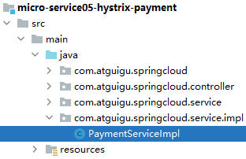

```java
// 专门声明一个方法，作为正常业务方法失败后的备选方法  
public String payment_TimeoutFallBack(Integer id) {  
    return "抱歉！系统忙，请稍后再试！id = " + id + " 线程名：" + Thread.currentThread().getName();  
}
```

### ③配置降级
```java
// @HystrixCommand 执行 Hystrix 相关设置  
@HystrixCommand(  
    // fallbackMethod 属性：指定当前方法失败后，要调用的备选方法  
    fallbackMethod = "payment_TimeoutFallBack",  
  
    // commandProperties 属性：指定其它参数  
    commandProperties = {  
        // 指定超时时间：当前方法超过 5000 毫秒就判定为失败  
        @HystrixProperty(name = "execution.isolation.thread.timeoutInMilliseconds", value = "5000")  
    }  
)  
public String payment_Timeout(Integer id){  
    int timeNumber = 3;  
    try { TimeUnit.SECONDS.sleep(timeNumber); }catch (Exception e) {e.printStackTrace();}  
    return "线程池："+Thread.currentThread().getName()+"   paymentInfo_TimeOut,id：  "+id+"\t"+"呜呜呜"+" 耗时(秒)"+timeNumber;  
}
```

### ⑥触发降级的情况
- 方法内超时
- 方法内抛异常
- 在方法外等待的时间超时

## 2、消费端
### ①YAML增加配置
```yaml
feign:  
  hystrix:  
    enabled: true #如果处理自身的容错就开启。开启方式与提供端不一样。
```
<p>当设置feign.hystrix.enabled为true时，Feign客户端将使用Hystrix来包装请求，并提供故障保护、线程池隔离、熔断器等功能。这样可以防止由于远程服务不可用或响应时间过长而导致的级联故障，并提高系统的可靠性和弹性。</p>


### ②主启动类增加注解
```java
@EnableHystrix
```

### ③声明备选方法
```java
public String paymentInfo_TimeOutFallback(Integer id){   
    return "Consumer报告：服务降级！id = " + id;  
}
```

### ④配置降级
```java
@HystrixCommand(  
    fallbackMethod = "paymentInfo_TimeOutFallback",  
    commandProperties = {  
        @HystrixProperty(name = "execution.isolation.thread.timeoutInMilliseconds", value = "2000")  
    }  
)  
@GetMapping("/consumer/payment/hystrix/timeout/{id}")  
public String paymentInfo_TimeOut(@PathVariable("id") Integer id){  
    String result = paymentHystrixService.payment_Timeout(id);  
    log.info("*******result:"+result);  
    return result;  
}
```

### ⑤类级别统一设置
在类级别使用注解指定一个方法，可以作为这个类中各个方法的备选方案。
```java
@DefaultProperties(defaultFallback = "paymentInfo_TimeOutFallback")
```

- **注意1**：业务方法还是需要加@HystrixCommand注解。
- **注意2**：备选方案方法，由于要适配各个方法，各个业务方法参数列表未必一致，所以框架要求是一个无参的方法。

### ⑥从业务代码中剥离降级方案
最大的好处：把降级方案从业务代码中剥离出来，让业务代码更加聚焦，不受降级方案的干扰。

#### [1]声明一个类实现Feign接口
```java
package com.atguigu.springcloud.service.impl;  
  
import com.atguigu.springcloud.service.PaymentHystrixService;  
import org.springframework.stereotype.Component;  
  
@Component  
public class PaymentHystrixServiceFallback implements PaymentHystrixService {  
    @Override  
    public String paymentInfo_OK(Integer id) {  
        return "服务降级了！这里是 PaymentHystrixServiceFallback 类提供的降级方案。ok";  
    }  
  
    @Override  
    public String payment_Timeout(Integer id) {  
        return "服务降级了！这里是 PaymentHystrixServiceFallback 类提供的降级方案。timeout";  
    }  
}
```

#### [2]把Controller类中降级代码去掉
```java
package com.atguigu.springcloud.controller;  
  
import com.atguigu.springcloud.service.PaymentHystrixService;  
import lombok.extern.slf4j.Slf4j;  
import org.springframework.web.bind.annotation.GetMapping;  
import org.springframework.web.bind.annotation.PathVariable;  
import org.springframework.web.bind.annotation.RestController;  
  
import javax.annotation.Resource;  
  
@RestController  
@Slf4j  
public class OrderHystrixController {  
  
    @Resource  
    private PaymentHystrixService paymentHystrixService;  
  
    @GetMapping("/consumer/payment/hystrix/ok/{id}")  
    public String paymentInfo_OK(@PathVariable("id") Integer id){  
        String result = paymentHystrixService.paymentInfo_OK(id);  
        log.info("*******result:"+result);  
        return result;  
    }  
  
    @GetMapping("/consumer/payment/hystrix/timeout/{id}")  
    public String paymentInfo_TimeOut(@PathVariable("id") Integer id){  
        String result = paymentHystrixService.payment_Timeout(id);  
        log.info("*******result:"+result);  
        return result;  
    }  
  
}
```

#### [3]在Feign接口中引用Fallback类
```java
// 通过注解的 fallback 属性指定实现降级方案的类  
@FeignClient(  
    value = "cloud-hystrix-payment-service",   
    fallback = PaymentHystrixServiceFallback.class)  
public interface PaymentHystrixService {  
    @GetMapping("/payment/hystrix/ok/{id}")  
    String paymentInfo_OK(@PathVariable("id") Integer id);  
  
    @GetMapping("/payment/hystrix/timeout/{id}")  
    String payment_Timeout(@PathVariable("id") Integer id);  
}
```

<p>在@FeignClient注解中，fallback属性和fallbackFactory属性都用于指定服务降级处理的类，但有一些区别。</p>

1. fallback属性：
    
    - 类型：Class对象
    - 使用方式：@FeignClient(fallback = YourFallbackClass.class)
    - 功能：指定一个类作为服务降级处理的实现类。该类需要实现对应Feign接口，并提供降级处理的方法。当远程服务调用失败或超时时，Feign将会调用降级类中的对应方法来返回默认值或进行其他处理。
    
1. fallbackFactory属性：
    
    - 类型：Class对象
    - 使用方式：@FeignClient(fallbackFactory = YourFallbackFactoryClass.class)
    - 功能：指定一个工厂类用于创建服务降级处理的实例。该工厂类需要实现FallbackFactory接口，并提供创建降级类实例的方法。Feign在需要降级处理时，将会调用工厂类的create方法来创建降级类的实例，然后调用实例中的降级方法。

<br/>

区别：
- fallback属性只能指定一个降级处理的类，而fallbackFactory属性可以指定一个工厂类，从而支持动态创建多个降级处理的实例。
- fallback属性中的降级类需要实现Feign接口，而fallbackFactory属性中的降级类需要实现FallbackFactory接口。
- fallbackFactory属性在某些情况下更加灵活，可以在创建降级类实例时进行参数传递和自定义逻辑处理。而fallback属性比较简单，只需要提供一个降级类即可。
- fallbackFactory属性可以通过Throwable参数获取调用失败的异常信息，而fallback属性无法获取异常信息。

<p>综上所述，fallback属性适用于简单的服务降级处理，而fallbackFactory属性适用于复杂的场景，如需要根据不同的异常类型返回不同的默认值或进行其他定制化处理。</p>


# 四、断路器
## 1、工作机制
### ①三种状态
- 关闭状态：断路器关闭状态时，请求可以由业务逻辑代码正常执行。
- 全开状态：断路器打开状态时，所有请求都被放行，直接执行降级方案。
- 半开状态：断路器半开状态时，放行一个请求，执行业务逻辑代码。
	- 执行业务逻辑代码成功：断路器关闭
	- 执行业务逻辑代码失败：断路器回到全开状态
- 从全开到半开状态有一个时间间隔，可以通过参数设置

### ②可设置参数说明
|参数名|参数含义|
|---|---|
|circuitBreaker.enabled|打开断路器功能|
|circuitBreaker.requestVolumeThreshold|请求的总数量阈值（从进入关闭状态开始统计）|
|circuitBreaker.errorThresholdPercentage|请求失败比例阈值（从进入关闭状态开始统计）|
|circuitBreaker.sleepWindowInMilliseconds|从全开到半开的时间间隔|

### ③断路器打开的条件
从进入关闭状态开始统计，『请求总数量阈值』和『请求失败比例阈值』二者都达到了要求才能够打开断路器。这就体现出框架对于断路器的打开是非常慎重的。

## 2、设置举例
### ①Service方法
```java
@HystrixCommand(  
    fallbackMethod = "paymentCircuitBreakerFallback",  
    commandProperties = {  
        // 开启断路器  
        @HystrixProperty(name = "circuitBreaker.enabled", value = "true"),  
  
        // 在限定时间内，发送够多少个请求才能打开断路器  
        @HystrixProperty(name = "circuitBreaker.requestVolumeThreshold",value = "1"),  
  
        // 断路器从全开到半开状态中间的时间长度  
        @HystrixProperty(name = "circuitBreaker.sleepWindowInMilliseconds",value = "15000")  
    }  
)  
public String paymentCircuitBreaker(Integer id) {  
  
    if (id > 50) {  
        throw new RuntimeException("[Provider] paymentCircuitBreaker() 我疯啦！");  
    }  
  
    return "[Provider] paymentCircuitBreaker() 正常。";  
}  
  
public String paymentCircuitBreakerFallback(Integer id) {  
    return "[Provider] paymentCircuitBreaker() 降级方案。id = " + id;  
}
```

### ②Controller方法
```java
@GetMapping("/payment/hystrix/circuit/breaker/{id}")  
public String paymentCircuitBreaker(@PathVariable Integer id) {  
    return paymentService.paymentCircuitBreaker(id);  
}
```

# 五、仪表盘

<br/>

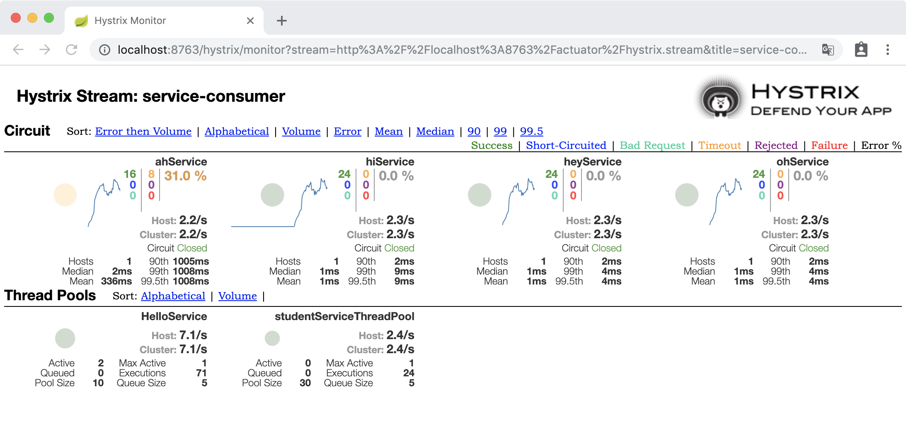

<br/>

## 1、创建module
```xml
<dependencies>  
    <!--新增hystrix dashboard-->  
    <dependency>  
        <groupId>org.springframework.cloud</groupId>  
        <artifactId>spring-cloud-starter-netflix-hystrix-dashboard</artifactId>  
    </dependency>  
    <dependency>  
        <groupId>org.springframework.boot</groupId>  
        <artifactId>spring-boot-starter-actuator</artifactId>  
    </dependency>  
    <dependency>  
        <groupId>org.springframework.boot</groupId>  
        <artifactId>spring-boot-devtools</artifactId>  
        <scope>runtime</scope>  
        <optional>true</optional>  
    </dependency>  
    <dependency>  
        <groupId>org.projectlombok</groupId>  
        <artifactId>lombok</artifactId>  
        <optional>true</optional>  
    </dependency>  
    <dependency>  
        <groupId>org.springframework.boot</groupId>  
        <artifactId>spring-boot-starter-test</artifactId>  
        <scope>test</scope>  
    </dependency>  
</dependencies>
```

## 2、YAML
```yaml
server:  
  port: 9001  
hystrix:  
  dashboard:  
    proxy-stream-allow-list: "localhost"
```


## 3、主启动类
```java
package com.atguigu.springcloud;  
  
import org.springframework.boot.SpringApplication;  
import org.springframework.boot.autoconfigure.SpringBootApplication;  
import org.springframework.cloud.netflix.hystrix.dashboard.EnableHystrixDashboard;  
  
@SpringBootApplication  
@EnableHystrixDashboard  
public class HystrixDashboardMain9001 {  
    public static void main(String[] args) {  
        SpringApplication.run(HystrixDashboardMain9001.class,args);  
    }  
}
```

## 3、监控依赖
所有被监控的微服务，都必须导入actuator才能被监控：
```xml
<dependency>  
    <groupId>org.springframework.boot</groupId>  
    <artifactId>spring-boot-starter-actuator</artifactId>  
</dependency>
```

## 4、指定监控路径
**注意**：在被监控的微服务中添加下面的配置！<br/>

```java
package com.atguigu.springcloud.config;  
  
import com.netflix.hystrix.contrib.metrics.eventstream.HystrixMetricsStreamServlet;  
import org.springframework.boot.SpringBootConfiguration;  
import org.springframework.boot.web.servlet.ServletRegistrationBean;  
import org.springframework.context.annotation.Bean;  
  
@SpringBootConfiguration  
public class ServletRegisterConfig {  
  
    /**  
     *此配置要在被监控的服务中添加，与服务容错本身无关，springcloud升级后的坑  
     *ServletRegistrationBean因为springboot的默认路径不是"/hystrix.stream"，  
     *只要在自己的项目里配置上下面的servlet就可以了  
     */  
    @Bean  
    public ServletRegistrationBean getServlet() {  
        HystrixMetricsStreamServlet streamServlet = new HystrixMetricsStreamServlet();  
        ServletRegistrationBean registrationBean = new ServletRegistrationBean(streamServlet);  
        registrationBean.setLoadOnStartup(1);  
        registrationBean.addUrlMappings("/hystrix.stream");  
        registrationBean.setName("HystrixMetricsStreamServlet");  
        return registrationBean;  
    }  
      
}
```

## 5、打开仪表盘
访问地址：http://localhost:9001/hystrix<br/>

指定被监控路径：<br/>

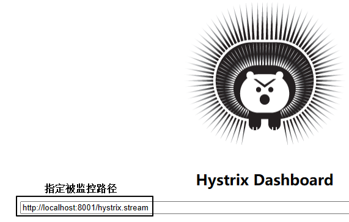

# 六、超时时间
## 1、故障现象
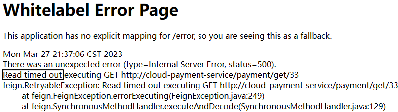

## 2、设置参数
### ①基本设置
- Feign本身其实并不负责发送请求，Feign只是底层组件的封装
- Feign底层发送请求涉及到Ribbon和Hystrix两个组件
	- Ribbon负责根据服务名称找到服务实例信息列表，然后负载均衡
	- Hystrix负责判断是否需要执行熔断
- Ribbon参数设置：
	- ConnectTimeout：设定HTTP协议底层建立连接的超时时间
	- ReadTimeout：建立连接之后，在提供端读取资源的超时时间
	- MaxAutoRetries：在目标微服务集群中，当前正在访问的实例上，重试的最大次数。不包括首次调用
	- MaxAutoRetriesNextServer：在目标微服务集群中，当前正在访问的实例之外，其它实例上，重试的最大次数。不包括首次调用
	- OkToRetryOnAllOperations：是否在所有“请求方式”上都重试。如果设置为false，则仅在GET请求重试
		- GET：可以放心重试，没有限制
		- POST：满足幂等性要求才能重试
		- PUT：满足幂等性要求才能重试
		- DELETE：满足幂等性要求才能重试
- Hystrix参数设置：
	- enabled：开启超时控制功能
	- timeoutInMilliseconds：Hystrix限定的超时时间，一旦超过这个时间则执行熔断

```yaml
#设置Feign客户端超时时间（openfeign默认支持ribbon）  
ribbon:  
  ConnectTimeout: 3000  # 建立连接的超时时间
  ReadTimeout:  5000  # 建立连接后在提供端读取资源的超时时间
  MaxAutoRetries: 1 #同一台实例最大重试次数,不包括首次调用  
  MaxAutoRetriesNextServer: 1 #重试负载均衡其他的实例最大重试次数,不包括首次调用  
  OkToRetryOnAllOperations: false #是否所有请求方式都重试  
#hystrix的超时时间  
hystrix:  
  command:  
    default:  
      execution:  
        timeout:  
          enabled: true  # 开启超时控制功能
        isolation:  
          thread:  
            timeoutInMilliseconds: 9000 # 指定超时时间，需大于ribbon超时时间
```

### ②超时后动作对比
- Ribbon超时：就Ribbon本身来说，不考虑Hystrix的熔断、降级方案，超时会报错。就像前面看到的那样。
- Hystrix超时：执行熔断、降级操作，执行兜底方案，给用户返回的响应比直接报错要好一些

### ③超时时间具体数值的设置

具体的超时时间设置应该根据你的系统需求和网络环境来决定。以下是一些设置超时时间的建议：

1. 网络延迟较低的情况下，可以将超时时间设置为较小的值，例如1000毫秒（1秒）。这样可以尽快获得响应并及时处理。

<br/>

2. 网络延迟较高的情况下，需要适当增加超时时间。可以根据实际情况进行调整，一般建议在2000毫秒（2秒）到5000毫秒（5秒）之间。

<br/>

3. 对于耗时操作或者需要处理大量数据的请求，超时时间可能需要更长。可以根据经验和测试结果逐步调整，确保请求能够在合理的时间内完成。

<br/>

此外，还需要注意以下几点：
- 不要将超时时间设置得过短，以免误判正常请求，导致频繁触发降级或错误处理机制。
- 考虑不同服务之间的响应时间差异，可以针对不同的服务或接口设置不同的超时时间。
- 超时时间的设置也需要与其他容错机制（如重试、熔断等）相协调，确保整个系统的稳定性和可用性。

总结来说，超时时间的设置应综合考虑系统需求、网络环境和实际场景，进行测试和调优，以达到合理的响应时间和系统稳定性。

### ④Ribbon和Hystrix之间的彼此协调
如果Ribbon的`ReadTimeout`设置的时间小于Hystrix的`timeoutInMilliseconds`，可能会导致Ribbon在等待响应的过程中直接报错，而没有触发Hystrix的熔断机制。

<br/>

这是因为Ribbon作为客户端负载均衡器，在发送请求后会等待一段时间来接收远程服务的响应。如果在这个等待时间内没有得到响应，Ribbon会认为请求失败，并直接抛出异常。

<br/>

而Hystrix的`timeoutInMilliseconds`是在请求执行阶段控制超时时间的。当请求执行时间超过设定的超时时间时，Hystrix会中断该请求并进行降级处理。

<br/>

所以，为了避免上述情况，建议将Ribbon的`ReadTimeout`设置为大于或等于Hystrix的`timeoutInMilliseconds`，以确保Hystrix有足够的时间来生效并进行熔断处理。这样可以更好地实现请求的容错和降级机制。

<br/>

## 3、一个常见异常
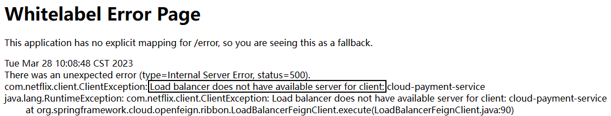

Load balancer does not have available server for client

看到这样的错误，如果确信配置方面没有错，那么大部分情况是服务刚启动，在注册中心还没有注册好，等一会儿就行了。

<br/>


# 七、总结
## 1、要解决的问题
服务雪崩。解决的思路：
- 熔断：通过断路器来实现。
- 降级：通过备选方案来实现。

## 2、技术实现
### ①服务降级
#### [1]概念
站在用户体验的角度，正常情况应该是能够返回用户预期的结果。<br/>
最差的情况是应用程序故障并且把报错信息显示到了页面上。<br/>
二者折中的处理方案就是给一个相对比较友好的错误提示——这个结果相对于用户预期的结果体验是有所下降的，所以叫服务降级。

#### [2]当前微服务被调用场景
主要是@HystrixCommand的使用：
- fallbackMethod属性：当前方法出现问题的时候，去调用的备选方法（当前方法专属的）
- commandProperties属性：专门设置Hystrix相关属性，开发人员指定属性名和属性值
	- execution.isolation.thread.timeoutInMilliseconds属性：指定Hystrix超时时间，超过这个时间会触发降级
- defaultFallback属性：指定默认的备选方案方法，在当前类范围内生效。
	- 类中的每个业务方法都可以使用这个方法作为备选方案
	- 由于每个业务方法参数列表都不保证一样，所以通用的备选方法必须是无参的

#### [3]当前微服务调用服务提供者场景
当前微服务调用服务提供者底层需要使用：
- RestTemplate
- Ribbon
- Hystrix
<p>为了简化开发，SpringCloud框架就把上面组件操作的细节封装到了OpenFeign组件中。所以此时服务降级就是在OpenFeign组件中实现。</p>
<p>开发中常用的方式：</p>
- 声明一个类，实现Feign接口（标记@FeignClient注解的接口）。
- 实现Feign接口的类加入IOC容器。
- 在@FeignClient注解中使用fallBack属性指定实现Feign接口的类作为统一的降级方案。

#### [4]备选方案方法
我们对备选方案的方法的要求是：返回值必须是原本的业务方法返回值类型一致。<br/>
假设：原本调用业务方法预期返回String类，但是因为服务降级返回的是Integer类型，就会发生类型转换错误。<br/>
所以此时就体现出微服务调用过程中返回统一的类型的重要性。比如我们使用的：CommonResult&lt;T&gt;。

#### [5]触发降级的条件
对于标记了@HystrixCommand注解的方法：
- 方法内超时：代码执行已经进入方法内了，但是方法执行过程中超时了。
- 方法内抛异常：代码执行已经进入方法内了，但是方法执行过程中抛异常了。
- 方法外等待超时：受并发能力的限制，处理当前请求的线程超过并发能力只能在方法外等待其它线程执行完成才能调用业务方法。


### ②断路器
#### [1]功能


- 断路器关闭状态：调用者可以正常调用业务方法
- 断路器全开状态：调用者在一定时间内无法调用业务方法，采用降级的备选方案
- 断路器半开状态：调用者在等待指定时间后，放一个请求去调用业务方法
	- 成功：断路器回到关闭状态
	- 失败：断路器回到全开状态

#### [2]配置
在@HystrixCommand注解中，通过commandProperties属性来设置：

<br/>

|参数名|参数含义|
|---|---|
|circuitBreaker.enabled|打开断路器功能|
|circuitBreaker.requestVolumeThreshold|请求的总数量阈值（从进入关闭状态开始统计）|
|circuitBreaker.errorThresholdPercentage|请求失败比例阈值（从进入关闭状态开始统计）|
|circuitBreaker.sleepWindowInMilliseconds|从全开到半开的时间间隔|

