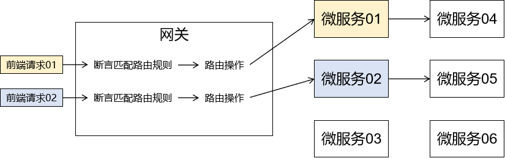
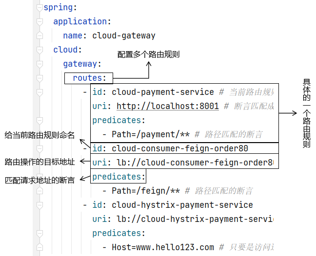

# 一、简介
一句话：网关就是整个微服务系统的入口。
- 前端请求发送给网关，网关通过『**断言**』进行匹配。
- 已匹配的请求经过网关的『**路由**』进入对应的微服务
- 如有需要，网关还可以对请求进行『**过滤**』

<br/>



<br/>



<br/>

路径匹配语法含义：<br/>


<br/>

主机匹配语法含义：<br/>


<br/>

静态路由：

<br/>


<br/>

动态路由：

<br/>


# 二、搭建测试环境
## 1、引入依赖
```xml
<dependencies>  
    <!--新增gateway，不需要引入web和actuator模块-->  
    <dependency>  
        <groupId>org.springframework.cloud</groupId>  
        <artifactId>spring-cloud-starter-gateway</artifactId>  
    </dependency>  
    <dependency>  
        <groupId>com.atguigu.cloud</groupId>  
        <artifactId>common-api</artifactId>  
        <version>1.0-SNAPSHOT</version>  
    </dependency>  
    <dependency>  
        <groupId>org.springframework.cloud</groupId>  
        <artifactId>spring-cloud-starter-netflix-eureka-client</artifactId>  
    </dependency>
</dependencies>
```

## 2、YAML
```yaml
server:  
  port: 80
spring:  
  application:  
    name: cloud-gateway  
  
eureka:  
  client:  
    register-with-eureka: true  
    fetch-registry: true  
    service-url:  
      defaultZone: http://localhost:7001/eureka
```

## 3、主启动类
```java
package com.atguigu.springcloud;  
  
import org.springframework.boot.SpringApplication;  
import org.springframework.boot.autoconfigure.SpringBootApplication;  
import org.springframework.cloud.netflix.eureka.EnableEurekaClient;  
  
@SpringBootApplication  
@EnableEurekaClient  
public class GateWayMain9527 {  
    public static void main(String[] args) {  
            SpringApplication.run( GateWayMain9527.class,args);  
        }  
}
```

# 三、配置网关路由
## 1、概述
<p>网关接收到请求先使用断言（predicate）进行匹配，如果匹配成功则执行配套的路由规则。</p>

断言匹配方式非常多，我们常用下面两种方式：
- 路径匹配
- 主机匹配

路由规则也有两种：
- 静态路由
- 动态路由

## 2、案例：路径匹配&静态路由
- **注意**：routes、predicates都是复数形式
- **注意**：id和Path前有横线
- **注意**：Path是首字母大写
- **注意**：Path和值之间是等号
- **注意**：多个路由规则之间，Path的值不能重复

```yaml
spring:  
  application:  
    name: cloud-gateway  
  cloud:  
    gateway:  
      routes:  
        - id: cloud-payment-service  
          uri: http://localhost:8001  
          predicates:  
            - Path=/payment/**
```

## 3、案例：路径匹配&动态路由
**注意**：使用微服务名称作为路由地址时，协议是“lb”，意思是负载均衡。
```yaml
- id: cloud-consumer-order80  
  uri: lb://cloud-consumer-order80
  predicates:  
    - Path=/consumer/payment/**
```

## 4、案例：主机匹配
### ①配置域名
```text
127.0.0.1 www.hello552.com
```

### ②配置网关
主机匹配：当访问网关的请求的主机地址和这里的配置匹配，则采纳这个路由规则。此时要求网关微服务必须监听80端口
```yaml
- id: cloud-hystrix-payment-service  
  uri: lb://cloud-hystrix-payment-service  
  predicates:  
    - Host=www.hello552.com
```

## 5、小结
- 通过网关路由到某个微服务，这个微服务再调用其它微服务就和网关无关了
- 请求都是先发送到网关，然后再进行断言匹配，最后再执行路由规则

# 四、过滤
### 1、过滤器的三要素
我们在JavaWeb阶段学习的Filter、现在网关里的Filter、SpringMVC里的拦截器，都可以从下面三个方面来认识：
- 拦截：和我们接收到的请求进行匹配，匹配到的请求就会进入执行过滤逻辑的方法
	- JavaWeb阶段的Filter：web.xml中配置
	- SpringMVC的拦截器：SpringMVC配置文件中mvc:Interceptor标签中配置
	- 网关里的Filter：过滤器加入IOC容器，网关接收到的所有请求都会被拦截
- 过滤：当前要执行的过滤逻辑，通常是封装到指定方法中
- 放行：让当前请求继续执行，原本它想要访问谁就继续访问谁
	- JavaWeb阶段的Filter放行：chain.doFilter()
	- SpringMVC的拦截器：preHandle()方法中返回true
	- 网关里的Filter：chain.filter(exchange)

## 2、API要求
实现下面这个接口：
```java
package org.springframework.cloud.gateway.filter;  
  
import org.springframework.web.server.ServerWebExchange;  
import reactor.core.publisher.Mono;  
  
public interface GlobalFilter {  
    Mono<Void> filter(ServerWebExchange exchange, GatewayFilterChain chain);  
}
```

我们使用网关中自定义过滤器功能会发现API都很怪，原因是网关底层是WebFlux技术，基于响应式编程的风格结合Netty开发的。<br/>
这一套技术组合相对于我们熟悉的“请求、响应”模型，完全是另一套体系。<br/>

## 3、基本用法
- 创建一个过滤器类并加入IOC容器
- 实现GlobalFilter接口
- 在filter()方法中编写过滤逻辑
```java
package com.atguigu.springcloud.filter;  
  
import org.springframework.cloud.gateway.filter.GatewayFilterChain;  
import org.springframework.cloud.gateway.filter.GlobalFilter;  
import org.springframework.http.server.reactive.ServerHttpRequest;  
import org.springframework.stereotype.Component;  
import org.springframework.web.server.ServerWebExchange;  
import reactor.core.publisher.Mono;  
  
@Component  
public class MyAuthFilter implements GlobalFilter {  
  
  
    @Override  
    public Mono<Void> filter(ServerWebExchange exchange, GatewayFilterChain chain) {  
          
        // 1、获取请求对象  
        ServerHttpRequest request = exchange.getRequest();  
          
        // 2、获取当前请求路径  
        String path = request.getURI().getPath();  
          
        // 3、打印请求路径  
        System.out.println("path = " + path);  
  
        // 4、放行  
        return chain.filter(exchange);  
    }  
}
```

## 4、同步请求和异步请求区分
### ①为什么要区别对待
- 同步请求：点击超链接->后端程序->渲染视图->返回给浏览器是一个**完整的HTML页面**
- 异步请求：点击按钮->触发单击响应函数->发送Ajax请求->后端程序->返回**JSON格式响应数据**

<br/>

> 你（相当于统一处理请求的组件）给家里宠物买口粮。<br/>
> 老虎：需要肉（就好比服务器端渲染时需要完整HTML页面）<br/>
> 兔子：需要菜（就好比前渲染时需要JSON数据）

### ②为什么要放在过滤器这里说
因为创建过滤器、拦截器都是面对很多请求做统一处理。这些请求中就很可能有的是同步、有的是异步。<br/>
假设做登录检查，同步请求、异步请求都需要检查。如果不满足登录要求：
- 同步请求：重定向到登录页面
- 异步请求：返回包含提示信息的JSON

### ③网关过滤器的操作
#### [1]同步请求
```java
/**  
 * 同步请求  
 * @param exchange  
 * @return  
 */private Mono<Void> synchronizeRequestRefuse(ServerWebExchange exchange) {  
  
    // 1、获取 Response 对象  
    ServerHttpResponse response = exchange.getResponse();  
  
    // 2、设置响应状态码：表示重定向  
    response.setStatusCode(HttpStatus.SEE_OTHER);  
  
    // 3、指定重定向的目标地址  
    String location = "http://www.baidu.com";  
  
    // 4、执行响应消息头：指定 location        
    response.getHeaders().set("location", location);  
    
    // 5、响应设置完成：把一个设置好的 response 对象交给框架，  
    // 框架就知道要去执行重定向了  
    return response.setComplete();  
}
```

#### [2]异步请求
```java
/**  
 * 异步请求
 *  
 * @param exchange  
 * @return  
 */private Mono<Void> aSynchronizeRequestRefuse(ServerWebExchange exchange) {  
  
    // 1、创建 Map 对象封装数据    
	Map<String, String> map = new HashMap<>();  
    map.put("k1", "v1");  
  
    // 2、把 Result 对象转换为 JSON 字符串    
	String resultJSON = new JSONConverter().convert(map, null).toJSONString(4);  
  
    // 3、为了后面设置响应体，JSON 字符串需要获取字节数组    
	byte[] bytes = resultJSON.getBytes();  
  
    // 4、获取响应对象    
	ServerHttpResponse response = exchange.getResponse();  
  
    // 5、设置响应消息头    
	response.getHeaders().set("Content-type", "application/json;charset=UTF-8");  
  
    // 6、把字节数组放入响应缓冲区    
	DataBuffer wrap = response.bufferFactory().wrap(bytes);  
  
    // 7、封装为 Mono 对象返回    
	return response.writeWith(Mono.just(wrap));  
}
```

### ④案例
```java
package com.atguigu.springcloud.filter;  
  
import cn.hutool.json.JSON;  
import cn.hutool.json.JSONConverter;  
import cn.hutool.json.JSONObject;  
import org.springframework.cloud.gateway.filter.GatewayFilterChain;  
import org.springframework.cloud.gateway.filter.GlobalFilter;  
import org.springframework.core.io.buffer.DataBuffer;  
import org.springframework.http.HttpStatus;  
import org.springframework.http.server.reactive.ServerHttpRequest;  
import org.springframework.http.server.reactive.ServerHttpResponse;  
import org.springframework.stereotype.Component;  
import org.springframework.util.MultiValueMap;  
import org.springframework.web.server.ServerWebExchange;  
import reactor.core.publisher.Mono;  
  
import java.util.HashMap;  
import java.util.Map;  
  
@Component  
public class MyFilter implements GlobalFilter {  
    @Override  
    public Mono<Void> filter(ServerWebExchange exchange, GatewayFilterChain chain) {  
  
        // 1、获取请求对象    
		ServerHttpRequest request = exchange.getRequest();  
  
        // 2、获取请求路径    
		String path = request.getURI().getPath();  
        System.out.println("path = " + path);  
  
        // 3、获取请求参数    
		MultiValueMap<String, String> queryParams = request.getQueryParams();  
        String userName = queryParams.get("userName").get(0);  
        if ("tom".equals(userName)) {  
            return synchronizeRequestRefuse(exchange);  
        }  
  
        if ("jerry".equals(userName)) {  
            return aSynchronizeRequestRefuse(exchange);  
        }  
  
        // 4、放行    
		return chain.filter(exchange);  
    }  
  
    /**  
     * 同步请求  
     *  
     * @param exchange  
     * @return  
     */    
     private Mono<Void> synchronizeRequestRefuse(ServerWebExchange exchange) {  
  
        // 1、获取 Response 对象    
		ServerHttpResponse response = exchange.getResponse();  
  
        // 2、设置响应状态码：表示重定向    
		response.setStatusCode(HttpStatus.SEE_OTHER);  
  
        // 3、指定重定向的目标地址    
		String location = "http://www.baidu.com";  
  
        // 4、执行响应消息头：指定 locationresponse.getHeaders().set("location", location);  
  
        // 5、响应设置完成：把一个设置好的 response 对象交给框架，    
		// 框架就知道要去执行重定向了    
		return response.setComplete();  
    }  
  
    /**  
     * 异步请求  
     *  
     * @param exchange  
     * @return  
     */    
     private Mono<Void> aSynchronizeRequestRefuse(ServerWebExchange exchange) {  
  
        // 1、创建 Map 对象封装数据    
		Map<String, String> map = new HashMap<>();  
        map.put("k1", "v1");  
  
        // 2、把 Result 对象转换为 JSON 字符串    
		String resultJSON = new JSONConverter().convert(map, null).toJSONString(4);  
  
        // 3、为了后面设置响应体，JSON 字符串需要获取字节数组    
		byte[] bytes = resultJSON.getBytes();  
  
        // 4、获取响应对象    
		ServerHttpResponse response = exchange.getResponse();  
  
        // 5、设置响应消息头    
		response.getHeaders().set("Content-type", "application/json;charset=UTF-8");  
  
        // 6、把字节数组放入响应缓冲区    
		DataBuffer wrap = response.bufferFactory().wrap(bytes);  
  
        // 7、封装为 Mono 对象返回    
		return response.writeWith(Mono.just(wrap));  
    }  
}
```

## 5、网关是否能被绕开？
网关一旦被绕过，前端请求直接访问被过滤逻辑保护的微服务，那么网关过滤就无效了。<br/>
那么网关是否能被绕过呢？<br/>
如果网关对外暴露公网IP，而后面微服务都在内网——只能通过网关路由进来，不能直接访问，那么网关就绕不过去了。