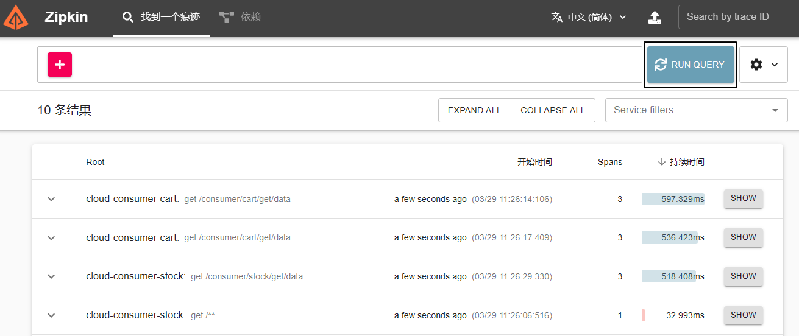
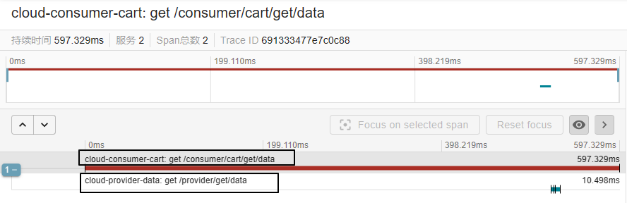

# 一、概述
## 1、缘起
当一个系统中，微服务非常多，互相之间调用关系复杂的时候，具体的一个请求有可能形成一个很长的调用链路。

## 2、产品
|功能|负责收集数据|负责图形化界面展示|
|---|---|---|
|服务监控|actuator|Hystrix dashboard|
|链路追踪|Sleuth|zipkin|

# 二、搭建Zipkin服务器
## 1、下载安装
```bash
cd /opt
curl -sSL https://zipkin.io/quickstart.sh | bash -s 
java -jar zipkin.jar
```

## 2、打开图形化界面
访问地址：http://192.168.200.100:9411/zipkin/

# 三、微服务对接Zipkin
## 1、引入依赖
```xml
<!--包含了sleuth+zipkin-->  
<dependency>  
    <groupId>org.springframework.cloud</groupId>  
    <artifactId>spring-cloud-starter-zipkin</artifactId>  
</dependency>
```

## 2、YAML配置
在已有的YAML配置文件中，增加如下配置：
```yaml
spring:  
  application:  
    name: cloud-provider-data  
  zipkin:  
    base-url: http://192.168.200.100:9411  
    sleuth:  
      sampler:  
        #采样率值介于0~1之间，1表示全部采样  
        probability: 1
```

# 四、测试效果
- 先执行一些请求，这样才能有采样数据
- 然后到zipkin界面上查看



