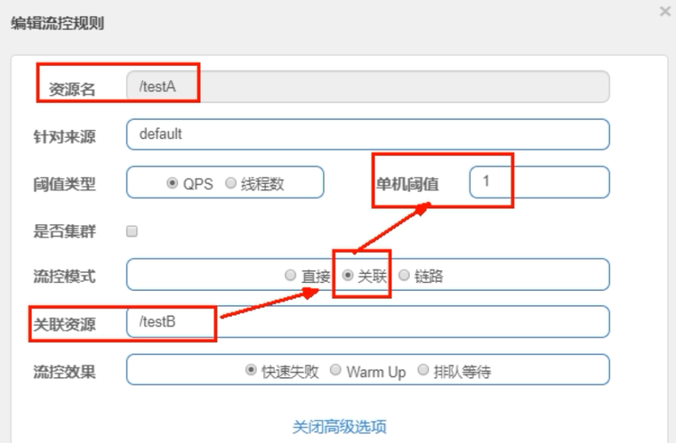

> Spring Cloud Alibaba版的Hystrix

<br/>

# 一、下载安装
## 1、下载地址
https://github.com/alibaba/Sentinel/releases/download/1.8.2/sentinel-dashboard-1.8.2.jar

## 2、启动
```bash
java -jar sentinel-dashboard-1.8.2.jar
```

## 3、图形化界面
- 访问地址：http://localhost:8080
- 用户名：sentinel
- 密码：sentinel

## 4、创建测试用的微服务
### ①提供端
#### [1]引入依赖
```xml
<dependencies>
    <dependency>  
        <groupId>com.alibaba.cloud</groupId>  
        <artifactId>spring-cloud-starter-alibaba-nacos-discovery</artifactId>  
    </dependency>  
    <dependency>  
        <groupId>com.alibaba.csp</groupId>  
        <artifactId>sentinel-datasource-nacos</artifactId>  
    </dependency>  
    <dependency>  
        <groupId>com.alibaba.cloud</groupId>  
        <artifactId>spring-cloud-starter-alibaba-sentinel</artifactId>  
    </dependency>  
    <dependency>  
        <groupId>org.springframework.boot</groupId>  
        <artifactId>spring-boot-starter-web</artifactId>  
    </dependency>  
    <dependency>  
        <groupId>org.springframework.boot</groupId>  
        <artifactId>spring-boot-starter-actuator</artifactId>  
    </dependency>  
    <dependency>  
        <groupId>cn.hutool</groupId>  
        <artifactId>hutool-all</artifactId>  
        <version>4.6.3</version>  
    </dependency>  
    <dependency>  
        <groupId>org.projectlombok</groupId>  
        <artifactId>lombok</artifactId>  
        <optional>true</optional>  
    </dependency>  
</dependencies>
```

#### [2]YAML
```yaml
server:  
  port: 8401  
  
spring:  
  application:  
    name: cloudalibaba-sentinel-service  
  cloud:  
    nacos:  
      discovery:  
        server-addr: localhost:8848  
    sentinel:  
      transport:  
        dashboard: localhost:8080  
        port: 8719  #默认8719，应用与Sentinel控制台交互的端口，应用本地会起一个HttpServer占用该端口  
  
management:  
  endpoints:  
    web:  
      exposure:  
        include: '*'
```

#### [3]主启动类
```java
package com.atguigu.springcloud.alibaba;  
  
import org.springframework.boot.SpringApplication;  
import org.springframework.boot.autoconfigure.SpringBootApplication;  
import org.springframework.cloud.client.discovery.EnableDiscoveryClient;  
  
@EnableDiscoveryClient  
@SpringBootApplication  
public class MainApp8401{  
    public static void main(String[] args) {  
        SpringApplication.run(MainApp8401.class, args);  
    }  
}
```

#### [4]控制器
```java
package com.atguigu.springcloud.alibaba.controller;  
  
import lombok.extern.slf4j.Slf4j;  
import org.springframework.web.bind.annotation.GetMapping;  
import org.springframework.web.bind.annotation.RestController;  
  
@RestController  
@Slf4j  
public class FlowLimitController{  
    @GetMapping("/testA")  
    public String testA() {  
        return "------testA";  
    }  
  
    @GetMapping("/testB")  
    public String testB() {  
        return "------testB";  
    }  
}
```

#### [5]在Sentinel查看监控信息
微服务刚启动的时候没有，需要我们访问几次业务方法。
> http://localhost:8401/testB

<br/>


#### [6]QPS
Query Per Second：每秒请求数量。

# 二、防护规则
## 1、流控规则
### ①新建流控规则界面


### ②参数说明
- 资源名：一个具体请求地址
- 阈值类型：选择根据QPS还是并发线程数来进行限流
- 流控模式：
	- 直接：当前资源达到限流条件，执行限流
	- 关联：当关联的资源达到阈值，对自己执行限流
	- 链路：针对从指定资源来的请求进行限流
- 流控效果：
	- 快速失败：当时马上返回限流结果，页面看到：Blocked by Sentinel (flow limiting)
	- Warm Up：使用阈值除以冷加载因子（codeFactor），从这个数值一直到阈值，这个过程中在预热时间内，逐步、有过程的达到阈值
	- 排队等待：让请求匀速排队通过，阈值类型必须是QPS，否则无效

### ③测试案例
#### [1]case01
- 资源名：/testA
- 访问地址：/testA
- 阈值类型：QPS
- 流控模式：直接
- 流控效果：快速失败
把QPS设置为1（比较容易看到结果），然后反复刷新访问/testA。Java代码没有修改，限流效果是页面看到：Blocked by Sentinel (flow limiting)

#### [2]case02
- 资源名：/testA
- 访问地址：/testA
- 阈值类型：并发线程数
- 流控模式：直接
- 流控效果：快速失败

- Java代码未修改时：没有问题
- Java代码修改，让请求处理过程中线程睡一会儿：Blocked by Sentinel (flow limiting)

#### [3]case03
- 资源名：/testA
- 访问地址：/testA
- 阈值类型：QPS
- 流控模式：关联
	- 关联的资源/testB
- 流控效果：快速失败


为了便于操作，我们借助PostMan来对B造成有压力的访问。

#### [4]case04
- 资源名：/testB
- 阈值类型：QPS
- 单机阈值：10
- 流控模式：直接
- 流控效果：**Warm Up**
- 预热时长：5

为了便于操作，我们借助PostMan来对B造成有压力的访问。

#### [5]case05
- 资源名：/testB
- 阈值类型：QPS
- 单机阈值：1
- 流控模式：直接
- 流控效果：排队等待
- 超时时间：20000
- 测试效果：请求一个一个被放行到微服务的Controller方法

## 2、熔断规则

> 熔断和限流的区别：<br/>
> ❤熔断是由于微服务自身发生问题，采取熔断策略避免单个微服务的故障蔓延到整个系统。<br/>
> ❤限流是出于保护微服务的目的，在外界压力太大的时候，限制流量。

<br/>

### ①规则介绍
熔断规则就是指定在哪些情况下，会触发熔断操作。
- 慢调用比例阈值：同时满足以下两个条件，触发熔断
	- 在统计时间内，总的请求数量达到我们设定的值
	- 响应时间超过RT（最大响应时间）的请求的比例超过阈值
- 异常比例阈值：同时满足以下两个条件，触发熔断
	- 在统计时间内，总的请求数量达到我们设定的值
	- 发生异常的请求的比例达到阈值
- 异常数阈值：在统计时间内异常数量达到阈值，触发熔断

<br/>

熔断状态：
- 关闭：没有熔断，可以正常请求的状态
- 全开：执行了熔断，所有请求都不能执行，会持续一段时间
- 半开：全开持续时间到达后，放行一个请求去执行操作，探测恢复状态
	- 响应时间正常、没有抛异常：结束熔断状态
	- 响应时间不正常或抛异常：继续熔断

### ②测试案例
#### [1]case01


<br/>

触发熔断规则之后，会看到页面显示：Blocked by Sentinel (flow limiting)

#### [2]case02


前5个请求，Sentinel没有做熔断，第六个请求看到了熔断效果：Blocked by Sentinel (flow limiting)

#### [3]case03


<br/>

## 3、热点Key限流
考虑到实际项目中，即使是同一个资源，也会出现：不同参数对应的流量压力不同。<br/>
所以热点Key限流，就是针对某一个参数进行限流操作。<br/>


<br/>

我们设定的单机阈值是针对某个参数值，这个参数值在统计时间内，出现的次数达到这里设定的阈值，就会触发流控。

<br/>

统计窗口时长设置的是每一个统计周期的时间长度。在每一个统计周期内，是重新开始统计的。

<br/>


<br/>

**注意**：使用热点Key规则时务必加入下面依赖！
```xml
<dependency> 
    <groupId>com.alibaba.csp</groupId> 
    <artifactId>sentinel-parameter-flow-control</artifactId> 
</dependency>
```

**注意**：在业务方法上一定要通过@SentinelResource注解指定规则中资源名称
```java
@GetMapping("/testC")  
@SentinelResource(  
        // 一定要通过 value 属性指定 Sentinel 中规则里面设置的资源名  
        value = "/testC")  
public String testC(String param) {  
    return "----------testC param="+param;  
}
```

<br/>

热点Key规则生效后，会抛出异常：异常后面是超出阈值的参数
> com.alibaba.csp.sentinel.slots.block.flow.param.ParamFlowException: aaa


## 4、系统规则
针对当前整个微服务来设置参数。
- LOAD：基于系统负载来触发系统保护
- RT：基于系统中所有入口的平均RT来触发系统保护
- 线程数：基于单台机器（一个微服务实例）所有入口流量的并发线程数触发系统保护
- 入口QPS：基于单台机器（一个微服务实例）所有入口流量的QPS触发系统保护
- CPU使用率：基于当前机器的CPU使用率触发系统保护

# 三、降级方案
## 1、大致工作机制
Sentinel能够提供比Hystrix更丰富的配置。Sentinel能够把方法自身故障（例如：抛出异常）情况和违背规则（例如：流控规则、熔断规则）情况区分对待。
- 方法自身故障：对应fallback设定
- 违背规则：对应blockHandler设定

## 2、@SentinelResource注解
### ①value属性
value属性用来指定Sentinel配置的规则中资源名称。要求和资源名称完全一致。比如：有斜杠就都有，没有就都没有。

### ②关于方法自身故障的降级配置
通过fallback属性指定降级方法，如果没有配合fallbackClass，那么要求降级方法必须在当前类中。细节要求如下：
- 返回值类型必须和原业务方法返回值类型一致，因为降级方法被调用后返回值会代替原业务方法返回值返回给调用者，这样就能保证返回给调用者的是相同的类型
- 参数列表要求和原业务方法一致。如果需要获取异常信息，则可以额外增加一个Throwable类型的参数（非必须）

如果希望把降级方法抽取到另外的一个类中，则需要再设定fallbackClass属性。此时对降级方法有一个额外要求：使用public static声明。其它方面要求还是和上面一致。

<br/>

```java
@GetMapping("/testA")  
@SentinelResource(  
        // value 属性指定 Sentinel 中配置的规则名称，要求完全一样  
        value = "/testA",  
  
        // fallback 属性指定一个降级方法，在触发流控规则时执行（倾向于对微服务保护的规则）  
        fallback = "testA_fallback"  
)  
public String testA() {  
    return "----------testA";  
}  
  
public String testA_fallback() {  
    return "----------testA testA_fallback";  
}
```

### ③关于违背规则的降级配置
通过blockHandler属性指定降级方法，如果没有配合blockHandlerClass，那么要求降级方法必须在当前类中。细节要求：
- 返回值类型必须和原业务方法返回值类型一致，因为降级方法被调用后返回值会代替原业务方法返回值返回给调用者，这样就能保证返回给调用者的是相同的类型
- 参数列表要求和原业务方法一致，并且额外增加一个BlockException类型的参数。

如果希望把降级方法抽取到另外一个类中，则需要再设定blockHandlerClass属性。此时对降级方法有一个额外要求：使用public static声明。其它方面要求还是和上面一致。

<br/>

```java
@GetMapping("/testB")  
@SentinelResource(  
        value = "/testB",  
  
        // blockHandler 属性指定一个降级方法，在触发熔断规则时执行（倾向于微服务内部故障的规则）  
        blockHandler = "testB_blockHandler"  
)  
public String testB() {  
    throw new RuntimeException("atguigu my exception");  
}  
  
public String testB_blockHandler(BlockException blockException) {  
    return "----------testB testB_blockHandler blockException=" + blockException;  
}
```

### ④exceptionsToIgnore属性
指定要忽略的异常类型，忽略之后将不会触发fallback降级。

### ⑤注意
如果fallback和blockHandler属性都指定了降级方法，那么：
- 未触发熔断规则时执行fallback属性指定的降级方法
- 触发熔断规则时执行blockHandler属性指定的降级方法

# 四、规则持久化
## 1、要解决的问题
微服务或Sentinel一旦重启，所有配置的规则都会丢失。所以Sentinel也存在持久化需求。此时解决问题的思路是借助Nacos持久化，在Nacos配置中心中添加Sentinel相关的配置。

## 2、操作方式
### ①确认依赖
要求业务的微服务中存在下面依赖：<br/>

```xml
<dependency>  
    <groupId>com.alibaba.csp</groupId>  
    <artifactId>sentinel-datasource-nacos</artifactId>  
</dependency>
```

### ②补充YAML配置
在sentinel配置项下增加datasource配置：
```yaml
spring:  
  application:  
    name: cloudalibaba-sentinel-service  
  cloud:  
    nacos:  
      discovery:  
        server-addr: localhost:8848 #Nacos服务注册中心地址  
    sentinel:  
      transport:  
        dashboard: localhost:8080 #配置Sentinel dashboard地址  
        port: 8719  
      datasource:  
        ds1:  
          nacos:  
            server-addr: localhost:8848  
            dataId: cloudalibaba-sentinel-service  
            groupId: DEFAULT_GROUP  
            data-type: json  
            rule-type: flow
```

- **注意**：为了让Nacos中的配置和当前微服务以及Sentinel能够彼此关联，要求Sentinel配置数据源的里面dataId值和当前微服务名称一致。
- data-type：表示在Nacos配置中心中，配置数据是JSON类型。
- rule-type：表示在Sentinel中配置的是流控规则

### ③Nacos配置中心添加配置


<br/>

配置内容如下：
```json
[
    {
         "resource": "/testA",
         "limitApp": "default",
         "grade": 1,
         "count": 1,
         "strategy": 0,
         "controlBehavior": 0,
         "clusterMode": false 
    }
]
```

属性含义如下：<br/>


