> 课件地址：https://www.wolai.com/hjjqmxqy7QN9mXCVeUPEP2

## 一、Docker简介
### 1、学习目标
- 掌握Docker基础知识，能够理解Docker镜像与容器的概念
- 完成Docker安装与启动
- 掌握Docker镜像与容器相关命令
- 掌握Tomcat Nginx 等软件的常用应用的安装
- 掌握docker迁移与备份相关命令
- 能够运用Dockerfile编写创建容器的脚本
- 能够搭建与使用docker私有仓库
<br/>

### 2、Docker可以解决什么问题
设想一个场景：你开发了一个war包，在本地怎么运行起来呢？
- 本地运行：装JDK、装Tomcat、部署war包
- 服务器运行：装JDK、装Tomcat、部署war包
<br/>

而这会带来什么问题呢？
- 环境不一致，导致程序运行出错
- 反复安装相同需求的环境软件，浪费精力
<br/>

### 3、Docker简介
#### ①Docker作用
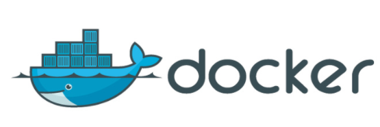
<br/>
从Docker的Logo我们能看出：Docker就是提供一个类似平台的统一标准，我们把软件环境安装到Docker之后，Docker再帮助我们迁移到其它系统。
从而简化在不同系统之间迁移应用程序的繁琐操作步骤。
- 海：实际操作系统
- 鲸：Docker
- 集装箱：待迁移的应用程序
<br/>

#### ②Docker的组成
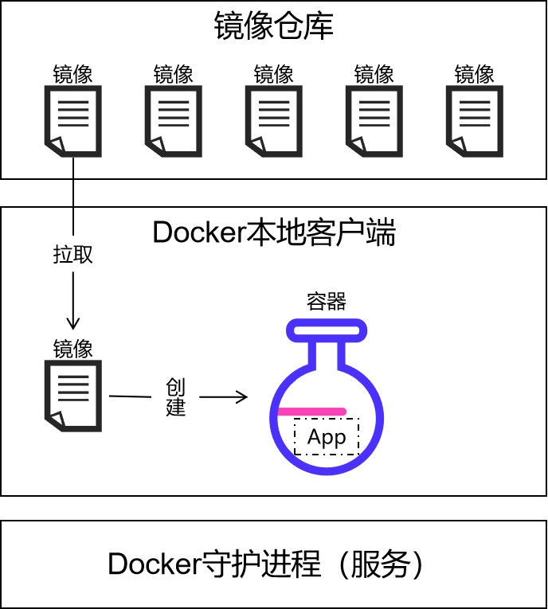
<br/>

## 二、Docker安装
### 1、环境要求
以下介绍的安装步骤限于CentOS7版本使用，其它环境请酌情调整。
<br/>
为了能够使用 yum 方式安装，所以要确保当前系统可以访问外网。
```shell script
ping www.baidu.com -c 5
```

### 2、准备工作
```shell script
# 安装 VIM 文本编辑器
yum install -y vim

# 安装 C 编译器
yum install -y gcc

# 安装 C++ 编译器
yum install -y gcc-c++

# 查看版本号，验证 gcc 安装是否成功
gcc -v

# 安装 Docker 所需的底层组件
yum install -y yum-utils device-mapper-persistent-data lvm2

# 设置 yum 仓库为国内站点，否则超慢
yum-config-manager --add-repo http://mirrors.aliyun.com/docker-ce/linux/centos/docker-ce.repo

# 更新 yum 软件包索引
yum makecache fast
```
<br/>

### 3、安装 Docker 社区版
```shell script
# 时间会比较长，耐心等待
yum -y install docker-ce
```
<br/>

### 4、Docker基本操作
```shell script
# 启动 Docker 服务
systemctl start docker

# 设置 Docker 服务为开机自动启动
systemctl enable docker

# 查看 Docker 版本
docker version

# 下载并运行 HelloWorld
docker run hello-world
```
<br/>

HelloWorld打印内容如下：
> Unable to find image 'hello-world:latest' locally
> latest: Pulling from library/hello-world
> 2db29710123e: Pull complete 
> Digest: sha256:6e8b6f026e0b9c419ea0fd02d3905dd0952ad1feea67543f525c73a0a790fefb
> Status: Downloaded newer image for hello-world:latest
> 
> Hello from Docker!
> This message shows that your installation appears to be working correctly.
> 
> To generate this message, Docker took the following steps:
>  1. The Docker client contacted the Docker daemon.
>  2. The Docker daemon pulled the "hello-world" image from the Docker Hub.
>     (amd64)
>  3. The Docker daemon created a new container from that image which runs the
>     executable that produces the output you are currently reading.
>  4. The Docker daemon streamed that output to the Docker client, which sent it
>     to your terminal.
> 
> To try something more ambitious, you can run an Ubuntu container with:
>  $ docker run -it ubuntu shell script
> 
> Share images, automate workflows, and more with a free Docker ID:
>  https://hub.docker.com/
> 
> For more examples and ideas, visit:
>  https://docs.docker.com/get-started/

<br/>

run命令的底层行为：<br/>
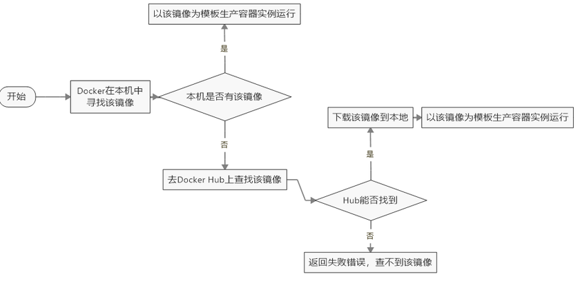

### 5、配置镜像加速[参考]
不是必须的配置，是否要配自己决定。下面三个镜像仓库地址选择一个即可。
#### ①创建配置文件
```shell script
# 编辑配置文件
vim /etc/docker/daemon.json
```
<br/>

#### ②文件内容
##### [1]阿里云[推荐]
```json
{
  "registry-mirrors": ["https://8y2y8njn.mirror.aliyuncs.com/"]
}
```
<br/>

##### [2]网易云
```json
{
  "registry-mirrors": ["http://hub-mirror.c.163.com"]
}
```
<br/>

##### [3]USTC
USTC是老牌的Linux镜像服务提供者了，还在遥远的Ubuntu 5.04版本的时候就在用。USTC的Docker镜像加速器速度很快。
USTC Docker mirror的优势之一就是不需要注册，是真正的公共服务。
```json
{
  "registry-mirrors": ["https://docker.mirrors.ustc.edu.cn/"]
}
```
<br/>

#### ③重启Docker服务
```shell script
# 重新加载守护进程
systemctl daemon-reload

# 重启 Docker 服务
systemctl restart docker
```
<br/>

### 6、卸载
现在大家先不要卸，以后有需要再说。
```shell script
# 停止服务
systemctl stop docker 

# 卸载 docker-ce
yum -y remove docker-ce

# 删除 Docker 库目录
rm -rf /var/lib/docker

# 卸载 docker
yum -y remove docker \
docker-client \
docker-client-latest \
docker-common \
docker-latest \
docker-latest-logrotate \
docker-logrotate \
docker-engine
```
<br/>

## 三、Docker 常用命令
### 1、操作 Docker 服务
本质上这些是Linux系统操作服务的命令，并不是 Docker 的命令。<br/>
启动 Docker 服务其实本质上是启动了 Docker 的守护进程。<br/>
运行 docker xxx 命令是操作 Docker 的客户端。<br/>
作为一个 C/S 结构的应用程序，Docker 是通过客户端访问服务器端（守护进程）来实现具体功能的。

|功能|命令|
|-|-|
|启动docker|systemctl start docker|
|停止docker|systemctl stop docker|
|重启docker|systemctl restart docker|
|查看docker状态|systemctl status docker|
|开机启动|systemctl enable docker|
<br/>

### 2、Docker 常用命令
|命令|功能|
|-|-|
|docker info|查看Docker概要信息|
|docker --help|查看Docker帮助文档|
|docker cp|本地文件系统(OS操作系统or宿主机)和容器之间进行文件或者文件夹拷贝|
|docker exec|登录一个容器（或者说进入一个容器），使用命令行操作正在运行的容器。|
|docker images|显示所有镜像列表。你行不行啊？细狗|
|docker ps|显示容器列表|
|docker pull|拉取镜像|
|docker restart|重启一个或多个容器|
|docker rm|删除一个或多个容器|
|docker rmi|删除一个或多个镜像|
|docker run|创建并运行一个容器|
|docker save|导出镜像到一个文件(tar)中|
|docker search|搜索镜像（从Docker Hub）|
|docker start|启动一个或多个已经停止的容器|
|docker stop|停止一个或多个正在运行的容器|
<br/>

### 3、镜像命令
#### ①查看镜像
查看镜像使用命令：docker images
<br/>
镜像文件存储在/var/lib/docker/image/overlay2/imagedb/content/sha256目录下
<br/>
镜像列表表头字段说明：
- REPOSITORY：镜像名称
- TAG：镜像标签
- IMAGE ID：镜像ID
- CREATED：镜像的创建日期（不是获取该镜像的日期）
- SIZE：镜像大小
<br/>

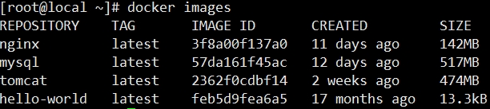

#### ②搜索镜像
搜索镜像使用命令：docker search 镜像名称
<br/>
镜像列表表头字段说明：
<br/>
- NAME：仓库名称
- DESCRIPTION：镜像描述
- STARS：用户评价，反应一个镜像的受欢迎程度
- OFFICIAL：是否官方
- AUTOMATED：自动构建，表示该镜像由Docker Hub自动构建流程创建
<br/>

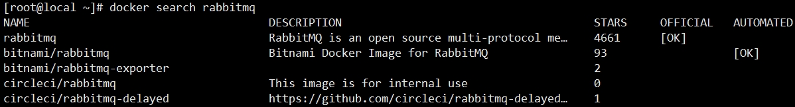

#### ③拉取镜像
拉取镜像就是把镜像文件从镜像仓库下载到本地。
<br/>
拉取镜像的命令是：docker pull 镜像名称[:版本号]
<br/>
如果省略版本号则拉取最新版。
<br/>

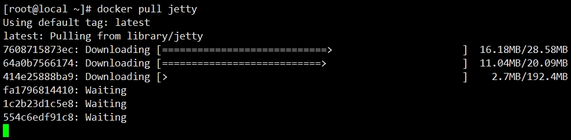

#### ④删除镜像
删除镜像的命令是：docker rmi 镜像ID或镜像名称
<br/>


<br/>

使用 -f 参数表示强制删除：docker rmi -f 镜像ID或镜像名称
<br/>
如果要删除多个镜像，那就把镜像名称或id列表用空格隔开即可：docker rmi -f 镜像ID或镜像名称 镜像ID或镜像名称
<br/>
删除全部镜像：docker rmi -f $(docker images -qa)

### 4、容器命令
镜像：静态；容器：动态。<br/>
镜像：类比Java的类；容器：类比Java的对象——根据镜像创建容器。<br/>
容器中存放我们安装的程序。<br/>

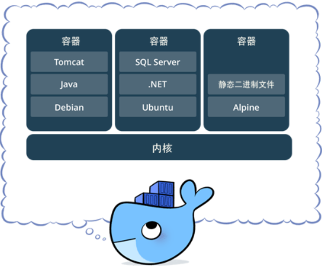

#### ①查看容器
|查看正在运行的容器|docker ps|
|-|-|
|查看所有容器|docker ps -a|
|查看最后一次运行的容器|docker ps -l|
|查看停止的容器|docker ps -f status=exited|

#### ②创建与启动容器
##### [1]概述
创建容器命令：docker run
<br/>


<br/>

docker run 命令常用参数列表：
|参数|作用|
|-|-|
|-i|表示以交互模式运行容器，通常配合 -t 参数|
|-t|表示容器启动后进入其命令行|
|--name|为创建的容器命名|
|-v|设定目录映射关系，把宿主机目录映射到 Docker 内部。可以使用多个 -v 做多个映射。<br/>建议使用：因为直接在宿主机修改文件更方便。|
|-d|以守护进程方式运行容器|
|-p|设定端口号映射关系，把宿主机端口号映射到 Docker 内部的端口号。|

##### [2]交互式创建容器
启动完成后，直接进入当前容器。使用exit命令退出容器。需要注意的是以此种方式启动容器，如果退出容器，则容器会进入停止状态。可以理解成交互式容器是前台容器。
<br/>

命令格式：
```shell script
docker run -it --name=容器名称 镜像名称:标签 command
```

命令举例：
```shell script
docker run -it --name=mycentos centos:7 /bin/bash
```

命令说明：
- docker run 表示创建容器
- -it 表示运行容器并进入它的命令行
- --name=mycentos 表示给当前的容器命名
- centos:7 是创建容器的镜像名称
- /bin/bash script 指定登录容器命令行之后使用的交互式 Shell 程序。

<br/>

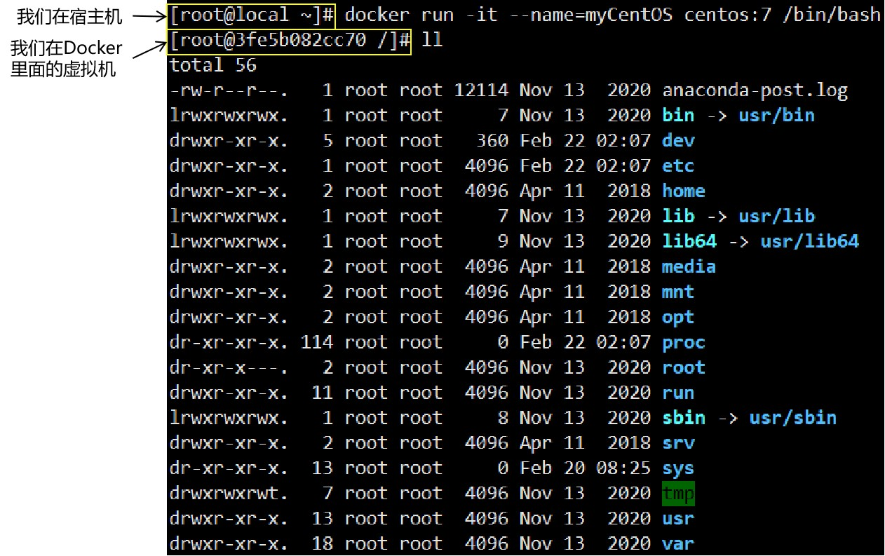

<br/>

复制一个会话，查看目前已有的容器：
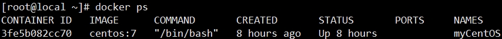

<br/>
相关命令：<br/>

- 查看当前正在运行的容器：docker ps
- 查看所有容器：docker ps -a
- 退出当前已登录容器：exit（退出后，容器也被关闭了，但没有被删除）
- 退出但不关闭容器：ctrl + p + q

##### [3]创建后台容器
```shell script
docker run -i -d --name=mycentos2 centos:7
```
创建容器的时候，COMMAND 默认是 /bin/bash，这个 /bin/bash 不是守护进程。<br/>
所以如果不带 -i 参数，那么 /bin/bash 程序执行完就结束了，容器本身也就关闭了。<br/>
所以容器的 COMMAND 如果不是守护进程的形式，并且没有使用 -i 参数以交互模式运行，<br/>
那么容器创建后执行完 COMMAND 就自动关闭了。<br/>

##### [4]登录一个已存在的容器
命令格式：
```shell script
docker exec -it 容器名称 (或者容器ID)  command
```
命令说明：
- exec：表示执行这个容器
- -i 参数：表示交互模式
- -t 参数：表示登录到容器的命令行
- /bin/bash：表示登录到容器后执行的程序。/bin/bash 本身是一个命令行终端

命令举例：
```shell script
docker exec -it mycentos10 /bin/bash
```

命令格式：
```shell script
docker attach 容器 ID 或名称
```

命令举例：
```shell script
docker attach myCentOS
```

> exec 和 attach 的区别：
> exec 登录到容器后会启动一个新的终端，而 attach 不会。

#### ③启动、停止容器
启动容器：
```shell script
docker start 容器 ID 或名称
```

停止容器：
```shell script
docker stop 容器 ID 或名称
```

#### ④文件拷贝
我们需要在容器内安装一个软件，软件首先需要有安装包，我们就需要把安装包拷贝到容器内。
我们通常的操作是先把文件上传到宿主机，然后我们在将文件从宿主机拷贝到容器内的某个目录下面进行安装。
<br/>
命令格式：
```shell script
docker cp 资源在宿主机中的路径 容器名称:容器目录
```

命令举例：
```shell script
docker cp story.txt myCentOS:/
```

命令格式（反向拷贝）：
```shell script
docker cp 容器名称:资源路径 宿主机目录
```

命令举例：
```shell script
docker cp myCentOS:/story.txt ./
```

#### ⑤端口号映射
我们可以在创建容器的时候，将宿主机的端口号与容器的端口号进行映射，这样外部请求就可以通过宿主机的端口号访问到容器里的进程。
<br/>

命令格式：
```shell script
docker {创建容器所需要的所有参数} -p 宿主机端口号:容器端口号 创建容器的镜像名称
```

命令举例：
```shell script
docker run -d -p 8000:80 --name=myNginx02 nginx
```

#### ⑥目录挂载
我们可以在创建容器的时候，将宿主机的目录与容器内的目录进行映射，这样我们就可以在宿主机改容器里的文件。
<br/>

命令格式：
```shell script
docker {创建容器所需要的所有参数} -v 宿主机目录:容器目录 创建容器的镜像名称
```

命令举例：
```shell script
docker run -i -d --name=myCentOS2 -v /tmp:/tmp centos:7
```

测试：
- 在宿主机创建文件、编辑文件，然后看容器
- 在容器里创建文件、编辑文件，再看宿主机

目录权限：<br/>
使用--privileged=true参数可以给挂载的目录设置权限，解决权限不足的问题。

#### ⑦查看容器日志
##### [1]命令说明
命令格式：
```shell script
docker logs [OPTIONS] 容器ID或名称
```

参数说明：
- -t 表示加入时间戳
- -f 表示跟踪最新的日志打印，按ctrl+c退出
- -n[空格]数字 显示最后多少条日志

##### [2]测试方式
创建 Nginx 容器
```shell script
docker run -d -p 80:80 --name=myNginx nginx
```

查看容器日志
```shell script
docker logs -t -n 5 myNginx
```

#### ⑧查看容器内运行的进程
命令格式：
```shell script
docker top 容器ID或名称
```

#### ⑨查看容器细节
命令格式（查看全部信息）：
```shell script
docker inspect 容器ID或名称
```

查询结果数据结构：一个 JSON 数组中放一个 JSON 对象。<br/>

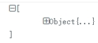

<br/>

JSON 对象包含诸多属性：<br/>

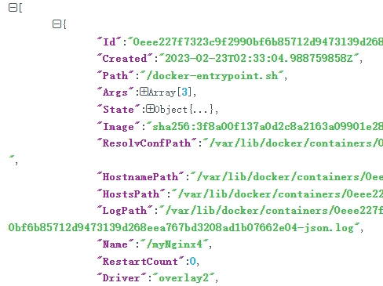

<br/>

命令格式（查看指定信息）：
```shell script
docker inspect --format='{{.JSON对象属性名.级联属性名}}' 容器ID或名称
```

命令举例（查看指定信息）：
```shell script
docker inspect --format='{{.Config.Env}}' myCentOS
```

#### ⑩删除容器
正在运行中的容器不能删除，必须先关闭才行。<br/>
命令格式：
```shell script
docker rm 容器ID或名称
```

使用 -f 参数可以强制删除

## 四、实操演练
### 1、用 Docker 安装 MySQL
#### ①使用 MySQL8 镜像
> 8.0.32
```shell script
# 拉取镜像
docker pull mysql

# 创建容器
docker run --name=myMySQL01 \
-p 63306:3306 \
--privileged=true \
-e MYSQL_ROOT_PASSWORD=atguigu \
-v /home/mysql/docker-data/conf:/etc/mysql/conf.d \
-v /home/mysql/docker-data/data/:/var/lib/mysql \
-v /home/mysql/docker-data/logs/:/var/log/mysql \
-d mysql

# 登录容器
docker exec -it myMySQL01 /bin/bash

# 登录 MySQL
root@47bb71193bc8:/# mysql -u root -p
Enter password: 
```

<br/>

图形化界面客户端远程连接后执行 SQL 语句测试
```sql
create database db_hr;
use db_hr;
create table t_emp(
    emp_id int auto_increment primary key,
    emp_name char(100),
    emp_salary double(10,3)
);
insert into t_emp(emp_name, emp_salary) values ("tom", 500.55);
insert into t_emp(emp_name, emp_salary) values ("约翰", 666.66);
select emp_id,emp_name,emp_salary from t_emp;
```
#### ②使用 MySQL5.7 镜像
##### [1]创建容器
```shell script
# 拉取镜像文件
docker pull mysql:5.7

# 创建容器
# 端口号映射：把宿主机的23306端口号映射到容器的3306
# 目录挂载：配置文件目录、数据目录、日志目录
# 指定 root 用户的密码：通过环境变量指定的，环境变量名称是 MYSQL_ROOT_PASSWORD
# 通过 -e 参数设置环境变量
docker run -d --name=dockerMySQL03 -p 23306:3306 \
-v /home/mysql5.7/docker-data/conf:/etc/mysql/conf.d \
-v /home/mysql5.7/docker-data/data:/var/lib/mysql \
-v /home/mysql5.7/docker-data/logs:/var/log/mysql \
-e MYSQL_ROOT_PASSWORD=123456 \
mysql:5.7

# 登录进入容器
docker exec -it dockerMySQL03 /bin/bash
root@cb721ef3d011:/# mysql -u root -p
Enter password:

```

#### [2]执行授权
授权之后，才能让远程客户端连接。注意：此时root用户的密码是：atguigu
```sql
# 在MySQL中执行
grant all privileges on *.* to root@'%' identified by 'atguigu';
```

```bash
# 在宿主机执行
docker restart dockerMySQL03
```

登录 MySQL 后执行 SQL 语句：和上一个例子一样即可。<br/>

##### [3]配置字符集
```shell script
# 创建配置文件
# /home/mysql5.7/docker-data/conf 是创建容器时挂载的目录
# my.cnf 是 MySQL 要求的配置文件名
vim /home/mysql5.7/docker-data/conf/my.cnf
```

配置文件内容如下：
```properties
[mysqld]
character_set_server=utf8
init_connect='SET NAMES utf8'
```

重启 MySQL 容器：
```shell script
docker restart dockerMySQL03
```

新建数据库测试，因为旧数据库的字符集并没有修改。

### 2、用 Docker 安装 Tomcat
```shell script
# 拉取镜像
docker pull tomcat

# 创建容器
docker run -d \
-p 18080:8080 \
-v /usr/local/webapps:/usr/local/tomcat/webapps \
--name=myTomcat01 \
tomcat
```

上传 war 包：
<br/>

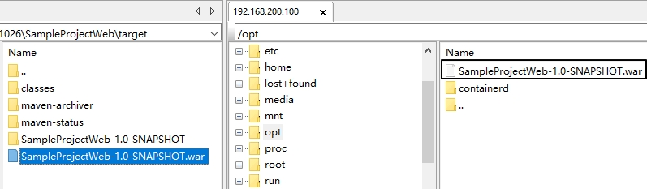

```shell script
# 把 war 包复制到容器中
docker cp /opt/SampleProjectWeb-1.0-SNAPSHOT.war myTomcat01:/usr/local/tomcat/webapps
```

访问测试：
> http://192.168.200.100:18080/SampleProjectWeb-1.0-SNAPSHOT/index.html

### 3、用 Docker 安装 Nginx
```shell script
# 拉取镜像
docker pull nginx

# 创建并启动容器
docker run -d --name=myNginx04 -p 15678:80 nginx
```

访问测试：
> http://192.168.200.100:15678/

### 4、用 Docker 安装 Redis
```shell script
# 拉取镜像
docker pull redis

# 创建容器
docker run -d --name=myRedis -p 16379:6379 redis
```


## 五、环境迁移
我们在 Docker 里装好一套环境，可以很方便的导出再到目标服务恢复为镜像，从而实现所谓的：“软件带环境安装”。

### 1、把容器保存为镜像
命令格式：
```shell script
# 镜像名称必须小写；容器不要求是运行的
docker commit 容器名称 镜像名称
```

命令举例：
```shell script
docker commit dockerRedis16 my_redis_image
```

> 场景举例：拉取CentOS镜像，创建容器。再在这个容器中安装JDK、Tomcat、MySQL……。然后再部署应用（war包）。此时容器导出镜像就有所有这些环境，而且还有部署好的war包。

### 2、把镜像导出为 tar 包
命令格式：
```shell script
docker save -o 导出的tar文件名 镜像名
```

命令举例：
```shell script
docker save -o my_redis.tar my_redis_image
```

### 3、把 tar 包恢复为镜像
先把要被恢复的镜像删掉。
```shell script
docker rmi my_redis_image
```

恢复镜像命令格式：
```shell script
docker load -i 之前导出的tar文件 
```

恢复镜像命令举例：
```shell script
docker load -i my_redis.tar
```

## 六、使用 Dockerfile 开发镜像
所谓开发镜像，并不是完全从零开始，而是在已有镜像的基础上，再做一些自己的定制。<br/>
Dockerfile 本质上是一个文本文件，由一系列命令和参数构成。<br/>
Docker 可以读取 Dockerfile 文件并据此构建镜像。<br/>

- 对于开发人员：可以为开发团队提供一个完全一致的开发环境；
- 对于测试人员：可以直接拿开发时所构建的镜像或者通过Dockerfile文件构建一个新的镜像开始工作了；
- 对于运维人员：在部署时，可以实现应用的无缝移植。

### 1、常用命令
|**命令**|**作用**|
|-|-|
|FROM image_name:tag|定义了使用哪个基础镜像启动构建流程|
|MAINTAINER user_name|声明镜像的创建者|
|ENV key value|设置环境变量 (可以写多条)|
|RUN command|是Dockerfile的核心部分(可以写多条)|
|ADD source_dir/file dest_dir/file|将宿主机的文件复制到容器内，如果是一个压缩文件，将会在复制后自动解压|
|COPY source_dir/file dest_dir/file|和ADD相似，但是如果有压缩文件并不能解压|
|WORKDIR path_dir|设置工作目录|

### 2、实操演练
```shell script
# 创建目录
mkdir -p /usr/local/test

# 进入目录
cd /usr/local/test

# 新建文件（文件名不能改）
vim Dockerfile 
```

文件内容：
```text
FROM nginx
RUN echo '这是一个本地构建的nginx镜像' > /usr/share/nginx/html/index.html
```

执行构建：
```shell script
# 命令格式
docker build -t 镜像名称:镜像标签 路径

# 命令举例
# 最后的点的意思是以当前目录为基准目录，如果有需要复制进镜像的文件则以此为基准路径查找
# . 表示当前目录
docker build -t my_nginx:v1 .

# 创建容器
docker run -d --name myNewNginx -p 2233:80 my_nginx:v1
```

## 七、私有仓库
### 1、初步启动
搭建自己的私有仓库来存储和管理自己的镜像。

```shell script
# 拉取私有仓库镜像
docker pull registry

# 启动私有仓库容器
docker run -d --name=registry -p 5000:5000 registry
```

访问测试：http://192.168.200.100:5000/v2/\_catalog<br/>

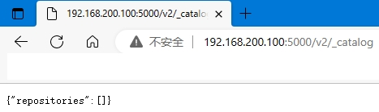

<br/>

看到{"repositories":[]}表示私有仓库搭建成功并且内容为空

### 2、信任私有仓库
修改/etc/docker/daemon.json，添加如下内容：
> "insecure-registries":["192.168.200.100:5000"]

<br/>

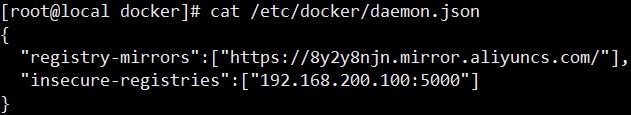

<br/>

```shell script
# 重启 Docker 服务
systemctl restart docker
```

### 3、上传镜像
```shell script
# 启动私有仓库容器
docker start registry

# 标记镜像为私有仓库的镜像
docker tag my_nginx:v1 192.168.200.100:5000/my_nginx:v2

# 上传
docker push 192.168.200.100:5000/my_nginx:v2
```

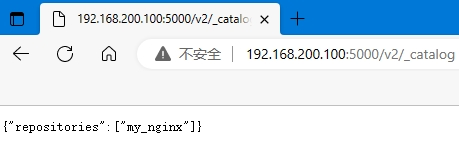

### 4、从私有库拉取镜像
```shell script
docker pull 192.168.200.100:5000/my_nginx:v2
```

## 八、作业
> 必须掌握的内容
- 安装 Docker
- 拉取 CentOS 镜像
- 根据 CentOS 镜像创建容器
- 登录到 CentOS 容器中
- 创建 Tomcat 的 Docker 容器并部署 war 包
- 创建 Nginx 的 Docker 容器
- 创建 MySQL 的 Docker 容器并通过远程客户端访问

## 九、回顾
### 1、定位
工具：和Git、Maven一样，会用就可以，重点在于掌握基本操作。

### 2、基本操作
#### ①镜像操作
- 搜索镜像：docker search mysql
- 拉取镜像：docker pull mysql:5.7
    - 如果省略冒号后面的部分，下载最新版
- 查看本地镜像：docker images
- 删除镜像：docker rmi mysql:5.7
    - 先删除这个镜像创建的容器

#### ②容器操作
- 创建容器：docker run
    - 参数：-i 以交互模式创建容器
    - 参数：-t 创建容器之后，登录进入容器的命令行
    - 参数：--name 给新创建的容器起个名字
    - 参数：-d 让新创建的容器以守护进程形式运行
    - 参数：-p 80:80 端口映射，把宿主机的端口号映射到容器里的端口号
    - 参数：-v 宿主机目录或文件:容器内的目录或文件 目录挂载，把宿主机的目录挂载到容器内
    - 参数：-e 给容器内部设置环境变量
    - Linux 命令换行：使用“\”，一定要注意该加空格的地方加上空格。否则Linux合并成一行执行的时候就出错了。
- 双向复制文件：docker cp
    - 从宿主机到容器：docker cp 宿主机内目录或文件的路径 容器名称:容器内路径
    - 从容器到宿主机：docker cp 容器名称：目录或文件路径 宿主机目录
- 登录容器：docker exec -it 容器名称或ID /bin/bash
- 启动容器：docker start 容器名称或ID
- 停止容器：docker stop 容器名称或ID
- 重启容器：docker restart 容器名称或ID
- 查看容器：docker ps（列出所有正在运行的容器）
- 查看容器：docker ps -a（列出所有容器）
- 删除容器：docker rm 容器名称列表（各个容器之间使用空格分开）
- 查看日志：docker logs 容器名称或ID

#### ③迁移
- 思路1：容器 -> 镜像 -> 保存成文件 -> 传输文件 -> 从文件恢复为镜像 -> 根据镜像创建容器
- 思路2：基于 Dockerfile 定制镜像