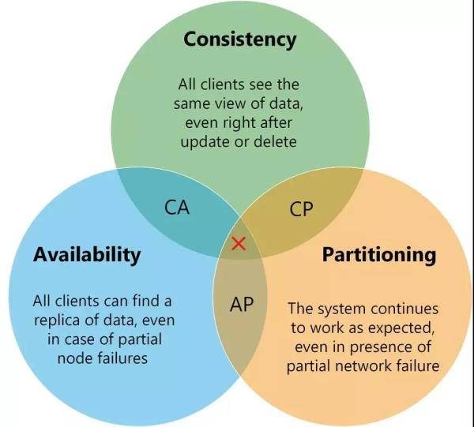
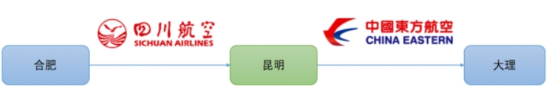
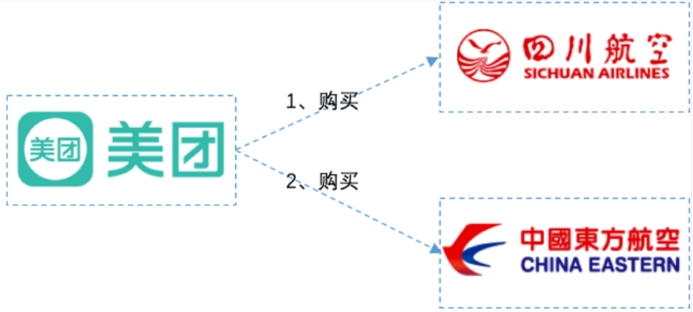
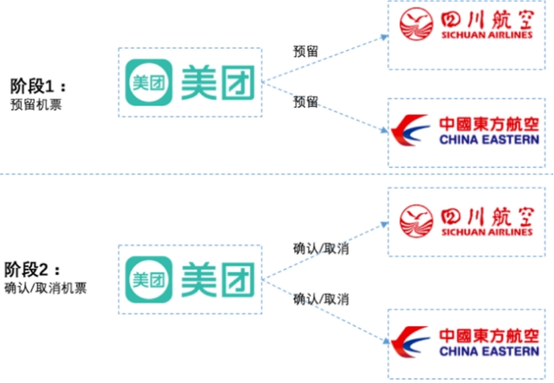
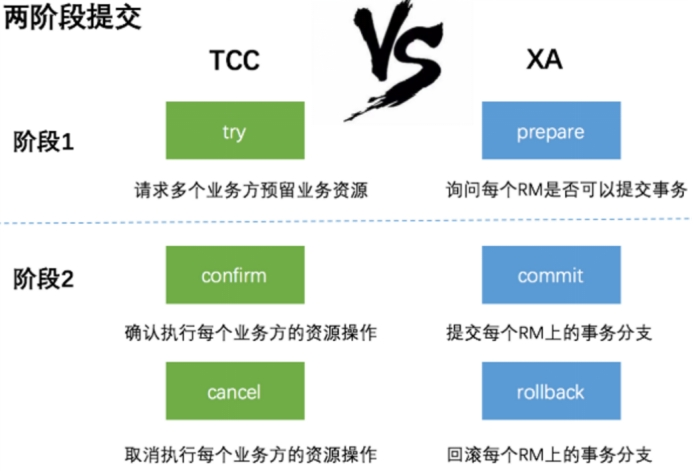
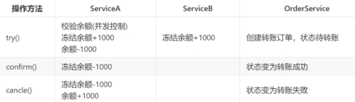
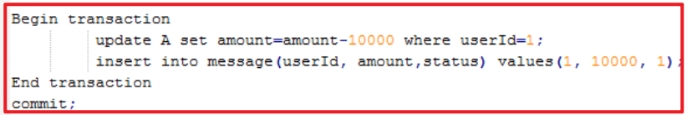
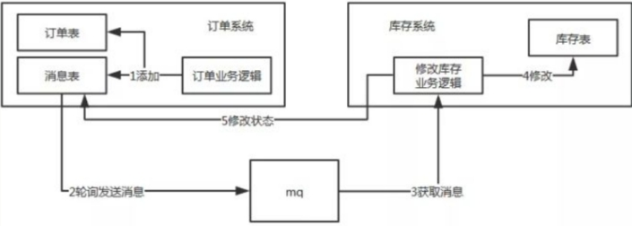
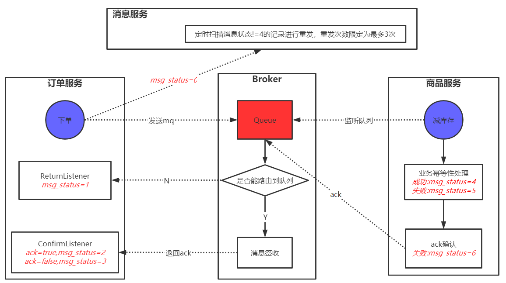
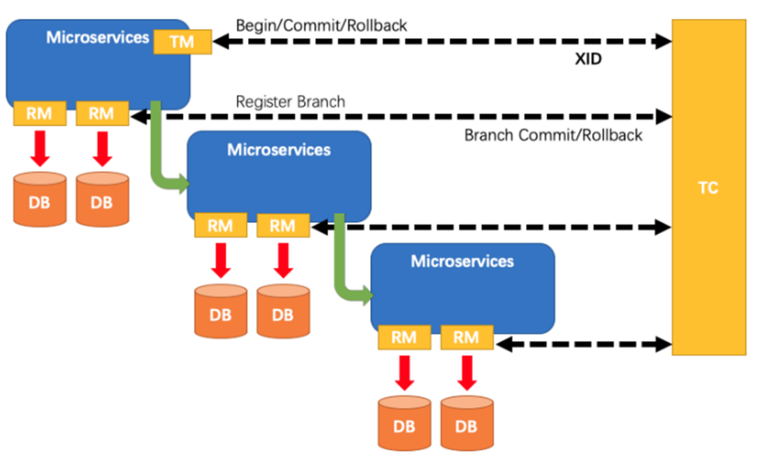

# 零、事务复习
## 1、应用程序连接数据库
Java程序->JDBC->数据库连接->关系型数据库

## 2、具体一个业务功能
往往一个业务功能需要执行很多条SQL语句，其中也完全有可能包含多个“增删改”操作。而且业务功能要求，这些“增删改”操作，要么一起生效，要么全部撤销——否则有任何一个操作失败，其它操作保留就会导致数据不一致。
```java
// 1、获取数据库连接
Connection connection = ...;

// 2、开启事务（关闭事务的自动提交）
connection.setAutoCommit(false);

try {
	// 3、执行业务操作
	// 操作A 执行SQL语句……
	// 操作B 执行SQL语句……
	// 操作C 执行SQL语句……

	// 4、提交事务
	connection.commit();

} catch(Exception e) {

	// 5、回滚事务
	connection.rollBack();

} fianlly {

	// 6、释放资源：把数据库连接放回数据库连接池（标记为空闲）
	connection.close();

}
```

# 一、理论
## 1、提出问题
在分布式系统中，对于一套有原子性要求的业务操作，为了保证数据的一致性，如何实现各个具体操作：**要么都做、要么都撤**。<br/>
> 原子性：一个包含多个操作的业务功能，不能缺少任何一个操作。
> 一致性：业务功能操作执行前数据是正确的，业务执行后数据仍然是正确的。

<br/>


## 2、解决问题
### ①基本原则
#### [1]CAP
CAP 定理，又叫做布鲁尔定理。对于设计分布式系统（不仅仅是分布式事务）的架构师来说，CAP 就是你的入门理论。<br/>
分布式系统（Distribution System）正变得越来越重要，大型网站几乎都是分布式的。<br/>
分布式系统的最大难点就是各节点的状态如何同步。CAP 定理是这方面的基本定理，也是理解分布式系统的起点。<br/>




##### (1)C：一致性
**C**onsistency 一致性：同一份数据在多个不同服务器节点上存在多个副本，这些副本数据保持一致。
- 强一致性：分布式系统中的数据在任何一个相同的时刻具有同样的值。
- 弱一致性：数据更新后，能够容忍数据在短暂的一段时间内可以不一致。也可称之为：最终一致性。

<br/>

数据的『正本』和『副本』：
- 通常 MySQL 这样的关系型数据库中存储的数据视为正本。
- 通常 Redis、ElasticSearch 等 NoSQL 数据库中存储的数据视为副本。

<br/>

说白了就是一个字：对。

##### (2)A：可用性
**A**vailable 可用性：这是在系统工作过程中，衡量系统性能的一个指标。指系统提供的服务必须一直处于可用的状态，每次只要收到用户的请求，服务器就必须给出回应。在合理的时间内返回合理的响应——不是错误和超时的响应。<br/>
- 只有非故障节点才能满足业务正常。
- 只有在合理的时间内用户才能接受。
- 只有返回合理的响应，信息才有价值。
说白了就是一个字：快。

##### (3)P：分区容错性
**P**artition Toleration 分区容错性

●分区<br/>
网络节点之间无法通信的情况下，节点被隔离，产生了网络分区，此时整个系统仍然是可以工作的。大多数分布式系统都分布在多个子网络。每个子网络就叫做一个区（partition）。<br/>
●分区容错<br/>
即使各子网络之间无法通信，甚至某个分区出现了故障，但整个系统对外仍然是可用的。<br/>

##### (4)小结
CAP 中的三者不可能同时满足。通常来说 P 是要求必须实现的：从外部视角来看，不管系统内部如何，我们无法接受整个系统对外不可用。在满足 P 的基础上，CP 和 AP 二选一。CAP 不可能同时满足。

#### [2]BASE
BASE = **B**saically **A**vailable（基本可用） + **S**oft state（软状态）+ **E**ventually consistent（最终一致性）。<br/>
理论的提出者是 eBay 的架构师。<br/>
BASE 定理是对 CAP 定理的进一步探讨。既然 CAP 中『一致性』和『可用性』无法同时满足，那如何在二者间达到一个可以接受的平衡呢？<br/>
BASE 定理的主张是：哪怕是做不到强一致性，也应该尽量做到最终一致性。<br/>

##### (1)基本可用
相对于『用户请求什么就返回什么』的完整功能来说，基本可用是指系统在无法准确返回用户所请求的数据时也返回相关数据，而不是『什么都不返回』。<br/>
相对于『收到用户请求就立即返回结果』的优质用户体验来说，基本可用是指系统在无法立即响应用户请求时，稍作延迟仍然能够返回响应，而不是『放弃响应』。<br/>
也就是说：服务可以适度『降级』，但不能完全不可用。

##### (2)软状态
满足 ACID 的事务属性就达到了『硬状态』。在传统的关系型数据库中，事务要么提交，要么回滚——非黑即白、非此即彼。而『软状态』允许系统暂时处于中间状态：从一个操作的发起到它同步到各个分布式节点，允许存在这样一个『正在同步数据』的中间过程。

##### (3)最终一致性
相对于关系型数据库事务的『立即一致』，分布式系统应该追求『最终一致』，允许系统在同步数据的过程中存在暂时的数据不一致状态，只要数据能够达到『最终一致』，我们就可以认为系统是可靠的。

#### [3]小结
不管 CAP 还是 BASE，它们都只是标准。它们没有提供分布式事务问题的解决方案，但是它们是解决方案是否成立的衡量标准。

### ②解决方案
#### [1]XA与两阶段提交

<br/>


<br/>

**XA协议**：XA是一个分布式事务协议。XA中大致分为两部分：事务管理器和本地资源管理器。其中本地资源管理器往往由数据库实现，比如Oracle、DB2这些商业数据库都实现了XA接口，而事务管理器作为全局的调度者，负责各个本地资源的提交和回滚。<br/>
**两阶段提交**：简称2PC（Two phase Commit）。<br/>
在分布式系统里，每个节点都可以知晓自己操作的成功或者失败，却无法知道其他节点操作的成功或失败。<br/>
当一个事务跨多个节点时，为了保持事务的原子性与一致性，需要引入一个协调者（Coordinator）来统一掌控所有参与者（Participant）的操作结果，并指示它们是否要把操作结果进行真正的提交（commit）或者回滚（rollback）。<br/>

2PC顾名思义分为两个阶段，其实施思路可概括为：<br/>

- （1）投票阶段（voting phase）：参与者将操作结果通知协调者；
- （2）提交阶段（commit phase）：收到参与者的通知后，协调者再向参与者发出通知，根据反馈情况决定各参与者是否要提交还是回滚；

算法执行过程中，**所有节点都处于阻塞状态，所有节点所持有的资源（例如数据库数据，本地文件等）都处于封锁状态。**<br/>

典型场景为：<br/>

- （1）某一个参与者发出通知之前，所有参与者以及协调者都处于阻塞状态；

- （2）在协调者发出通知之前，所有参与者都处于阻塞状态；

另外，如有协调者或者某个参与者出现了崩溃，为了避免整个算法处于一个完全阻塞状态，往往需要借助超时机制来将算法继续向前推进，故此时算法的效率比较低。<br/>

总的来说，**2PC是一种比较保守的算法**。

举例说明：<br/>

甲乙丙丁四人要组织一个会议，需要确定会议时间，设甲是协调者，乙丙丁是参与者。<br/>

**投票阶段：**<br/>

- （1）甲发邮件给乙丙丁，周二十点开会是否有时间；
- （2）乙回复有时间；
- （3）丙回复有时间；
- （4）丁迟迟不回复，此时对于这个活动，甲乙丙均处于阻塞状态，算法无法继续进行；
- 甲：在等待丁的回复
- 乙：在等待甲的下一个通知
- 丙：在等待甲的下一个通知
- （5）丁回复有时间（或者没有时间）；
- 此时甲收集到了全部反馈信息：乙（成功），丙（成功），丁（失败）
- 甲通知下一步操作：会议取消
<br/>

**提交阶段：**<br/>

- （1）协调者甲将收集到的结果反馈给乙丙丁（什么时候反馈，以及反馈结果如何，在此例中取决与丁的时间与决定）；
- （2）乙收到；（收到通知，会议取消）
- （3）丙收到；（收到通知，会议取消）
- （4）丁收到；（收到通知，会议取消）

<br/>

**结论**：2PC效率很低，分布式事务很难做。具体来说，它的缺陷如下：
- 性能问题
    - 2PC遵循强一致性。在事务执行过程中，各个节点占用着数据库资源，只有当所有节点准备完毕，事务协调者才会通知提交，参与者提交后释放资源。这样的过程有着非常明显的性能问题。
- 协调者单点故障问题
    - 2PC模型的核心，一旦事务协调者节点挂掉，参与者收不到提交或是回滚通知，参与者会一直处于中间状态无法完成事务。
- 丢失消息导致的不一致问题
    - 第二个阶段，如果发生局部网络问题，一部分事务参与者收到了提交消息，另一部分事务参与者没收到提交消息，那么就导致了节点之间数据的不一致。
- 技术支持问题
	- 参与该方案的关系型数据库必须支持XA协议，方案才能落地

#### [2]TCC
TCC：Try、Confirm、Cancel<br/>
TCC 的作用主要是解决跨服务调用场景下的分布式事务问题<br/>

##### (1)场景案例

以航班预定的案例，来介绍TCC要解决的事务场景。<br/>
在这里笔者虚构一个场景，把自己当做航班预定的主人公，来介绍这个案例。从合肥 –> 昆明 –> 大理。<br/>
准备从合肥出发去云南大理，使用美团App(机票代理商)订机票。<br/>
发现没有从合肥直达大理的航班，需要到昆明进行中转。如下图：<br/>



<br/>
从图中我们可以看出来，从合肥到昆明乘坐的是四川航空，从昆明到大理乘坐的是东方航空。<br/>
由于使用的是美团App预定，当我选择了这种航班预定方案后，美团App要去四川航空和东方航空各帮我购买一张票。如下图：<br/>

 

<br/>
考虑最简单的情况：美团先去川航帮我买票，如果买不到，那么东航也没必要买了。如果川航购买成功，再去东航购买另一张票。<br/>
现在问题来了：假设美团先从川航成功买到了票，然后去东航买票的时候，因为天气问题，东航航班被取消了。那么此时，美团必须取消川航的票，因为只有一张票是没用的，不取消就是浪费我的钱。那么如果取消会怎样呢？如果读者有取消机票经历的话，非正常退票，肯定要扣手续费的。在这里，川航本来已经购买成功，现在因为东航的原因要退川航的票，川航应该是要扣代理商的钱的。<br/>
那么美团就要保证，如果任一航班购买失败，都不能扣钱，怎么做呢？<br/>

两个航空公司都为美团提供以下3个接口：**机票预留接口、确认接口、取消接口**。<br/>

美团App分2个阶段进行调用，如下所示：<br/>

 

<br/>

***\*在第 1 阶段：\****<br/>

美团分别请求两个航空公司预留机票，两个航空公司分别告诉美团预留成功还是失败。航空公司需要保证，机票预留成功的话，之后一定能购买到。<br/>

***\*在第 2 阶段：\****<br/>

如果两个航空公司都预留成功，则分别向两个公司发送确认购买请求。<br/>
如果两个航空公司任意一个预留失败，则对于预留成功的航空公司也要取消预留。这种情况下，对于之前预留成功机票的航班取消，也不会扣用户的钱，因为购买并没实际发生，之前只是请求预留机票而已。<br/>
通过这种方案，可以保证两个航空公司购买机票的一致性，要不都成功，要不都失败，即使失败也不会扣用户的钱。如果在两个航班都已经已经确认购买后，再退票，那肯定还是要扣钱的。<br/>
当然，实际情况肯定这里提到的肯定要复杂，通常航空公司在第一阶段，对于预留的机票，会要求在指定的时间必须确认购买(支付成功)，如果没有及时确认购买，会自动取消。假设川航要求10分钟内支付成功，东航要求30分钟内支付成功。以较短的时间算，如果用户在10分钟内支付成功的话，那么美团会向两个航空公司都发送确认购买的请求，如果超过10分钟(以较短的时间为准)，那么就不能进行支付。<br/>
这个方案提供给我们一种跨服务保证事务一致性的一种解决思路，可以把这种方案当做TCC的雏形。<br/>
TCC是Try ( 尝试 ) — Confirm(确认) — Cancel ( 取消 ) 的简称：<br/>

| **操作方法** | **含义**                                                     |
| ------------ | ------------------------------------------------------------ |
| Try          | 完成所有业务检查（一致性），预留业务资源(准隔离性)<br/>回顾上面航班预定案例的阶段1，机票就是业务资源，<br/>所有的资源提供者(航空公司)预留都成功，try阶段才算成功 |
| Confirm      | 确认执行业务操作，不做任何业务检查， 只使用Try阶段预留的业务资源。<br/>回顾上面航班预定案例的阶段2，美团APP确认两个航空公司机票都预留成功，<br/>因此向两个航空公司分别发送确认购买的请求。 |
| Cancel       | 取消Try阶段预留的业务资源。回顾上面航班预定案例的阶段2，<br/>如果某个业务方的业务资源没有预留成功，则取消所有业务资源预留请求。 |

有同学立马会想到，TCC与XA两阶段提交有着异曲同工之妙，下图列出了二者之间的对比：<br/>

 

<br/>

**1) 在阶段1：**<br/>

在XA中，各个RM准备提交各自的事务分支，事实上就是准备提交资源的更新操作(insert、delete、update等)；而在TCC中，是主业务活动请求(try)各个从业务服务预留资源。<br/>

**2) 在阶段2：**<br/>

XA根据第一阶段每个RM是否都prepare成功，判断是要提交还是回滚。如果都prepare成功，那么就commit每个事务分支，反之则rollback每个事务分支。<br/>
TCC中，如果在第一阶段所有业务资源都预留成功，那么confirm各个从业务服务，否则取消(cancel)所有从业务服务的资源预留请求。<br/>

##### (2)TCC两阶段提交与XA两阶段提交的区别
XA是资源层面（直接操作数据库）的分布式事务，强一致性，在两阶段提交的整个过程中，一直会持有资源的锁。<br/>
XA事务中的两阶段提交内部过程是对开发者屏蔽的 ，其内部会委派给TransactionManager进行真正的两阶段提交，因此开发者从代码层面是感知不到这个过程的。而且事务管理器在两阶段提交过程中，从prepare到commit/rollback过程中，资源实际上一直都是被加锁的。如果有其他人需要更新这两条记录，那么就必须等待锁释放。<br/>
TCC是业务层面（操作Java服务）的分布式事务，最终一致性，不会一直持有资源的锁。<br/>
TCC中的两阶段提交并没有对开发者完全屏蔽，也就是说从代码层面，开发者是可以感受到两阶段提交的存在。如上述航班预定案例：在第一阶段，航空公司需要提供**try接口**(机票资源预留)。在第二阶段，航空公司提需要提供**confirm/cancel接口**(确认购买机票/取消预留)。开发者明显的感知到了两阶段提交过程的存在。try、confirm/cancel在执行过程中，一般都会开启各自的本地事务，来保证方法内部业务逻辑的ACID特性。其中：<br/>

- try过程的本地事务，是保证资源预留的业务逻辑的正确性。
- confirm/cancel执行的本地事务逻辑确认/取消预留资源，以保证最终一致性，也就是所谓的补偿型事务

由于是多个独立的本地事务，因此不会对资源一直加锁。<br/>
TCC 将事务提交分为 Try - Confirm - Cancel 3个操作。这和两阶段提交有点类似，Try为第一阶段，Confirm - Cancel为第二阶段，是一种应用层面侵入业务的两阶段提交。<br/>

| **操作方法** | 含义                                                         |
| ------------ | ------------------------------------------------------------ |
| Try          | 预留业务资源/数据效验-尝试检查当前操作是否可行               |
| Confirm      | 确认执行业务操作，实际提交数据，不做任何业务检查，try成功，confirm必定成功 |
| Cancel       | 取消执行业务操作，实际回滚数据                               |

其核心在于将业务分为两个操作步骤完成。不依赖 RM 对分布式事务的支持，而是通过对业务逻辑的分解来实现分布式事务。<br/>

 

例如： A要向 B 转账，思路大概是：<br/>
假设用户user表中有两个字段：可用余额(available_money)、冻结余额(frozen_money) A扣钱对应服务A(ServiceA) B加钱对应服务B(ServiceB) 转账订单服务(OrderService) 业务转账方法服务(BusinessService)<br/>
ServiceA，ServiceB，OrderService都需分别实现try()，confirm()，cancle()方法，方法对应业务逻辑如下<br/>

 

<br/>
其中业务调用方BusinessService中就需要调用<br/>

```java
ServiceA.try()
ServiceB.try()
OrderService.try()
```

- 当所有try()方法均执行成功时，对全局事务进行提交，即由事务管理器调用每个微服务的confirm()方法
- 当任意一个方法try()失败(预留资源不足，抑或网络异常，代码异常等任何异常)，由事物管理器调用每个微服务的cancle()方法对全局事务进行回滚

<br/>
优点：跟2PC(很多第三方框架)比起来，实现以及流程相对简单了一些，但数据的一致性比基于XA的2PC也要差一些<br/>
缺点： 缺点还是比较明显的，在2,3步中都有可能失败。TCC属于应用层的一种补偿方式，所以需要程序员在实现的时候多写很多补偿的代码，在一些场景中，一些业务流程可能用TCC不太好定义及处理。<br/>

#### [3]本地消息表
这种实现方式的思路，其实是源于 ebay，后来通过支付宝等公司的布道，在业内广泛使用。<br/>
**其基本的设计思想是将远程分布式事务拆分成一系列的本地事务**。如果不考虑性能及设计优雅，借助关系型数据库中的表即可实现。<br/>
举个经典的跨行转账的例子来描述。<br/>
第一步伪代码如下，扣款 1W，通过**本地事务保证**了凭证消息插入到消息表中。<br/>

 

<br/>
第二步，通知对方银行账户加 1W。那问题来了，如何通知到对方呢？<br/>

- 通常采用两种方式：
  - 1. 采用时效性高的 MQ，由对方订阅消息并监听，有消息时自动触发事件
  - 2. 采用定时轮询扫描的方式，去检查消息表的数据
- 两种方式其实各有利弊，仅仅依靠 MQ，可能会出现通知失败的问题。而过于频繁的定时轮询，效率也不是最佳的（90% 是无用功）。所以，我们一般会把两种方式结合起来使用。
- 解决了通知的问题，又有新的问题了。万一这消息有重复被消费，往用户帐号上多加了钱，那岂不是后果很严重？
- 仔细思考，其实我们可以在消息消费方，也通过一个“消费状态表”来记录消费状态。在执行“加款”操作之前，检测下该消息（提供标识）是否已经消费过，消费完成后，通过本地事务控制来更新这个“消费状态表”。这样子就避免重复消费的问题。
- 总结：上述的方式是一种非常经典的实现，基本避免了分布式事务，实现了“最终一致性”。但是，关系型数据库的吞吐量和性能方面存在瓶颈，频繁的读写消息会给数据库造成压力。所以，在真正的高并发场景下，该方案也会有瓶颈和限制的。
- 在订单系统新增一条消息表，将新增订单和新增消息放到一个事务里完成，然后通过轮询的方式去查询消息表，将消息推送到 MQ，库存系统去消费 MQ。

 

- 执行流程：
  - 订单系统，添加一条订单和一条消息，在一个事务里提交。
  - 订单系统，使用定时任务轮询查询状态为未同步的消息表，发送到 MQ，如果发送失败，就重试发送。
  - 库存系统，接收 MQ 消息，修改库存表，需要保证幂等操作。
  - 如果修改成功，调用 RPC 接口修改订单系统消息表的状态为已完成或者直接删除这条消息。
  - 如果修改失败，可以不做处理，等待重试。
  - 订单系统中的消息有可能由于业务问题会一直重复发送，所以为了避免这种情况可以记录一下发送次数，当达到次数限制之后报警，人工接入处理；库存系统需要保证幂等，避免同一条消息被多次消费造成数据不一致。
  - 本地消息表这种方案实现了最终一致性，需要在业务系统里增加消息表，业务逻辑中多一次插入的 DB 操作，所以性能会有损耗，而且最终一致性的间隔主要由定时任务的间隔时间决定。

<br/>

- 优点： 一种非常经典的实现，避免了分布式事务，实现了最终一致性。在 .NET中有现成的解决方案。
- 缺点： 消息表会耦合到业务系统中，如果没有封装好的解决方案，会有很多杂活需要处理。

#### [4]MQ 事务消息

有一些第三方的MQ是支持事务消息的，比如RocketMQ，他们支持事务消息的方式也是类似于采用的二阶段提交，但是市面上一些主流的MQ都是不支持事务消息的，比如 RabbitMQ 和 Kafka 都不支持，但是Rabbit MQ可以通过<span style="color:blue;font-weight:bold;">可靠消息投递</span>来实现事务消息。

##### (1)RocketMQ


##### (2)Rabbit MQ



#### [5]方案选型

- 基于XA
    - 依赖于数据库底层XA支持，拿mysql数据库来说，innodb引擎支持XA协议，可以实现分布式事务。但是使用XA事务需要将事务隔离级别设置为串行，这样整个数据库使用性能将下降严重。
- TCC
    - 业务代码侵入性高，需要提供try、commit、cancel多个接口业务实现。现有支持的开源框架有：ByteTCC、tcc-transaction、seata、tx-lcn等
- MQ
    - 非金融类业务首选MQ实现。MQ不能及时保障数据一致性，也是一种柔性事务(允许有数据有中间状态，可以保障经过一定时间后最终达到数据一致性)
- 业务2PC
    - XA协议是从资源层面的实现了2PC，如:seata、tx-lcn等是从业务层面实现了2PC。

**本课程我们使用的是seata作为我们的分布式事务解决方案。**

# 二、实操：Seata
官网：http://seata.io/zh-cn

## 1、Seata工作机制
### ①Seata概述
Seata是阿里开源的一个分布式事务框架，能够让大家在操作分布式事务时，像操作本地事务一样简单。一个注解搞定分布式事务。
<br/>

解决分布式事务问题，有两个设计初衷：
- 对业务无侵入：即减少技术架构上的微服务化所带来的分布式事务问题对业务的侵入
- 高性能：减少分布式事务解决方案所带来的性能消耗

Seata 会有 4 种分布式事务解决方案，分别是 AT 模式、TCC 模式、Saga 模式和 XA 模式。
- AT模式主要关注多 DB 访问的数据一致性，当然也包括多服务下的多 DB 数据访问一致性问题 2PC-改进
- TCC 模式主要关注业务拆分，在按照业务横向扩展资源时，解决微服务间调用的一致性问题

Seata 的设计思路是将一个分布式事务可以理解成一个全局事务，下面挂了若干个分支事务，<br/>
而一个分支事务是一个满足 ACID 的本地事务，因此我们可以操作分布式事务像操作本地事务一样。<br/>

2019 年 1 月，阿里巴巴中间件团队发起了开源项目[Fescar](https://www.oschina.net/p/fescar)（Fast & EaSy Commit And Rollback），和社区一起共建开源分布式事务解决方案。Fescar 的愿景是让分布式事务的使用像本地事务的使用一样，简单和高效，并逐步解决开发者们遇到的分布式事务方面的所有难题。<br/>
后来Fescar改名为Seata。<br/>

Seata全称：Simple Extensible Autonomous Transaction Architecture,简单可扩展自治事务框架。<br/>

### ②AT模式
#### [1]组件介绍
全称：Automatic (Branch) Transaction Mode

<br/>

Seata 中有三大模块，分别是 TM、RM 和 TC。 其中 TM 和 RM 是作为 Seata 的客户端与业务系统集成在一起，TC 作为 Seata 的服务端独立部署。

- Transaction Coordinator （TC）：事务协调器，维护全局事务的运行状态，负责协调并决定全局事务的提交或回滚。
- Transaction Manager（TM）： 控制全局事务的边界，负责开启一个全局事务，并最终发起全局提交或全局回滚的决议。
- Resource Manager （RM）：资源管理器，负责本地事务的注册，本地事务状态的汇报(投票)，并且负责本地事务的提交和回滚。如果本地事务已提交，但又需要撤销，那么就需要执行逆操作。
- XID：一个全局事务的唯一标识

其中，TM是一个分布式事务的发起者和终结者，TC负责维护分布式事务的运行状态，而RM则负责本地事务的运行。

> 通俗来讲：TM负责管理全局事务，RM负责管理本地事务，TC负责各个节点之间通信和信息汇总。

如下图所示：<br/>



<br/>

下面是一个分布式事务在Seata中的执行流程：

- 1. TM 向 TC 申请开启一个全局事务，全局事务创建成功并生成一个全局唯一的 XID
- 2. XID 在微服务调用链路的上下文中传播。
- 3. RM 向 TC 注册分支事务，接着执行这个分支事务并提交（重点：RM在第一阶段就已经执行了本地事务的提交/回滚），最后将执行结果汇报给TC
- 4. TM 根据 TC 中所有的分支事务的执行情况，发起全局提交或回滚决议。
- 5. TC 调度 XID 下管辖的全部分支事务完成提交或回滚请求。

#### [2]举例说明执行过程
业务表：product

|**Field**<br>|**Type**<br>|**Key**<br>|
|-|-|-|
|id<br>|bigint(20)<br>|PRI<br>|
|name<br>|varchar(100)<br>|<br>|
|since<br>|varchar(100)<br>|<br>|

AT 分支事务的业务逻辑：
```sql
update product set name = 'GTS' where name = 'TXC';
```

##### ★一阶段

过程：

- 1. 解析 SQL：得到 SQL 的类型（UPDATE），表（product），条件（where name = 'TXC'）等相关的信息。
- 2. 查询前镜像：根据解析得到的条件信息，生成查询语句，定位数据。

```sql
select id, name, since from product where name = 'TXC';
```

得到前镜像：

|**id**<br>|**name**<br>|**since**<br>|
|-|-|-|
|1<br>|TXC<br>|2014<br>|

- 1. 执行业务 SQL：更新这条记录的 name 为 'GTS'。
- 2. 查询后镜像：根据前镜像的结果，通过 **主键** 定位数据。

```text
select id, name, since from product where id = 1;
```

得到后镜像：

|**id**<br>|**name**<br>|**since**<br>|
|-|-|-|
|1<br>|GTS<br>|2014<br>|


插入回滚日志：把前镜像、后镜像数据以及业务 SQL 相关的信息组成一条回滚日志记录，插入到 UNDO_LOG 表中。

```json
{
    "branchId":641789253,
    "undoItems":[
        {
            "afterImage":{
                "rows":[
                    {
                        "fields":[
                            {
                                "name":"id",
                                "type":4,
                                "value":1
                            },
                            {
                                "name":"name",
                                "type":12,
                                "value":"GTS"
                            },
                            {
                                "name":"since",
                                "type":12,
                                "value":"2014"
                            }
                        ]
                    }
                ],
                "tableName":"product"
            },
            "beforeImage":{
                "rows":[
                    {
                        "fields":[
                            {
                                "name":"id",
                                "type":4,
                                "value":1
                            },
                            {
                                "name":"name",
                                "type":12,
                                "value":"TXC"
                            },
                            {
                                "name":"since",
                                "type":12,
                                "value":"2014"
                            }
                        ]
                    }
                ],
                "tableName":"product"
            },
            "sqlType":"UPDATE"
        }
    ],
    "xid":"xid:xxx"
}
```

- 1. 提交前，向 TC 注册分支：申请 product 表中，主键值等于 1 的记录的 **全局锁** 。
- 2. 本地事务提交：业务数据的更新和前面步骤中生成的 UNDO LOG 一并提交。
- 3. 将本地事务提交的结果上报给 TC。

##### ★二阶段-回滚
> 其实这已经不是传统意义上的回滚了，不是本地事务的rollback，说撤销或undo更准确

- 1. 收到 TC 的分支回滚请求，开启一个本地事务，执行如下操作。
- 2. 通过 XID 和 Branch ID 查找到相应的 UNDO LOG 记录。
- 3. 数据校验：拿 UNDO LOG 中的后镜与当前数据进行比较，如果有不同，说明数据被当前全局事务之外的动作做了修改。这种情况，需要根据配置策略来做处理，详细的说明在另外的文档中介绍。
- 4. 根据 UNDO LOG 中的前镜像和业务 SQL 的相关信息生成并执行回滚的语句：

```text
update product set name = 'TXC' where id = 1;
```

提交本地事务。并把本地事务的执行结果（即分支事务回滚的结果）上报给 TC。<br/>

如果正准备要执行逆操作之前，数据库节点宕机了。那么应对方式是：数据库节点重启时读取UNDO_LOG，把以前没有执行的操作执行掉。

##### ★二阶段-提交

- 1. 收到 TC 的分支提交请求，把请求放入一个异步任务的队列中，马上返回提交成功的结果给 TC。
- 2. 异步任务阶段的分支提交请求，将异步和批量地删除相应 UNDO LOG 记录。

## 2、Seata案例：集成 Seata
- 数据库建表：
	- 每一个数据库中创建一个undo_log表
	- 执行mysql_global_table.sql语句创建三个表：
		- global_table
		- branch_table
		- lock_table
		- 以上数据库表放在数据库seata142中
- TC服务器
- Nacos实现持久化
- 在Nacos中新增Seata的配置
	- seataServer.properties
	- common.yml
- 在fescar-api微服务中引入Seata
	- 引入Seata依赖
	- 创建配置类：DataSourceProxyConfig
		- 组装：SqlSessionFactory->DataSourceProxy->DataSource
- 在fescar-business微服务业务入口方法使用@GlobalTransactional注解


### ①配置 nacos

```properties
#*************** Config Module Related Configurations ***************#
### If use MySQL as datasource:
spring.datasource.platform=mysql

### Count of DB:
db.num=1

### Connect URL of DB:
db.url.0=jdbc:mysql://192.168.200.100:63306/nacos_config?characterEncoding=utf8&connectTimeout=1000&socketTimeout=3000&autoReconnect=true&useUnicode=true&useSSL=false&serverTimezone=UTC
db.user=root
db.password=atguigu
```

- 1. 创建数据库：nacos_config，导入表：D:\\Server\\nacos-server-1.4.2\\conf\\nacos-mysql.sql
- 2. 创建数据库：seata142，执行 SQL 文件：mysql_global_table.sql
- 3. 启动服务器：D:\Server\nacos-server-1.4.2\bin\startup.cmd -m standalone

在配置中心新增配置：
- Data Id：seataServer.properties
- Group：SEATA_GROUP
- 配置格式：properties
- 配置内容

```properties
transport.type=TCP
transport.server=NIO
transport.heartbeat=true
transport.enableClientBatchSendRequest=true
transport.threadFactory.bossThreadPrefix=NettyBoss
transport.threadFactory.workerThreadPrefix=NettyServerNIOWorker
transport.threadFactory.serverExecutorThreadPrefix=NettyServerBizHandler
transport.threadFactory.shareBossWorker=false
transport.threadFactory.clientSelectorThreadPrefix=NettyClientSelector
transport.threadFactory.clientSelectorThreadSize=1
transport.threadFactory.clientWorkerThreadPrefix=NettyClientWorkerThread
transport.threadFactory.bossThreadSize=1
transport.threadFactory.workerThreadSize=default
transport.shutdown.wait=3
service.vgroupMapping.my_test_tx_group=default
service.default.grouplist=127.0.0.1:8091
service.enableDegrade=false
service.disableGlobalTransaction=false
client.rm.asyncCommitBufferLimit=10000
client.rm.lock.retryInterval=10
client.rm.lock.retryTimes=30
client.rm.lock.retryPolicyBranchRollbackOnConflict=true
client.rm.reportRetryCount=5
client.rm.tableMetaCheckEnable=false
client.rm.tableMetaCheckerInterval=60000
client.rm.sqlParserType=druid
client.rm.reportSuccessEnable=false
client.rm.sagaBranchRegisterEnable=false
client.rm.tccActionInterceptorOrder=-2147482648
client.tm.commitRetryCount=5
client.tm.rollbackRetryCount=5
client.tm.defaultGlobalTransactionTimeout=60000
client.tm.degradeCheck=false
client.tm.degradeCheckAllowTimes=10
client.tm.degradeCheckPeriod=2000
client.tm.interceptorOrder=-2147482648
store.mode=db
store.db.datasource=druid
store.db.dbType=mysql
store.db.driverClassName=com.mysql.cj.jdbc.Driver
store.db.url=jdbc:mysql://192.168.200.100:63306/seata142?characterEncoding=UTF-8&serverTimezone=Asia/Shanghai
store.db.user=root
store.db.password=atguigu
store.db.minConn=5
store.db.maxConn=30
store.db.globalTable=global_table
store.db.branchTable=branch_table
store.db.queryLimit=100
store.db.lockTable=lock_table
store.lock.mode=file
store.session.mode=file
store.publicKey=123
server.recovery.committingRetryPeriod=1000
server.recovery.asynCommittingRetryPeriod=1000
server.recovery.rollbackingRetryPeriod=1000
server.recovery.timeoutRetryPeriod=1000
server.maxCommitRetryTimeout=-1
server.maxRollbackRetryTimeout=-1
server.rollbackRetryTimeoutUnlockEnable=false
server.distributedLockExpireTime=10000
client.undo.dataValidation=true
client.undo.logSerialization=jackson
client.undo.onlyCareUpdateColumns=true
server.undo.logSaveDays=7
server.undo.logDeletePeriod=86400000
client.undo.logTable=undo_log
client.undo.compress.enable=true
client.undo.compress.type=zip
client.undo.compress.threshold=64k
log.exceptionRate=100
transport.serialization=seata
transport.compressor=none
metrics.enabled=false
metrics.registryType=compact
metrics.exporterList=prometheus
metrics.exporterPrometheusPort=9898
```
重点关注

- 虚拟组配置，所有的微服务需要加入名称为：my_test_tx_group的事务组中
- 设置TC进行全局事务控制的数据存储方式：store.mode有file,db,redis三种类型。这里选择db,设置mysql连接信息

然后继续新增配置：
- Data Id：common.yml
- Group：SEATA_GROUP
- 配置格式：YAML
- 配置内容

```yaml
seata: 
  tx-service-group: my_test_tx_group
```

在fescar-api项目bootstrap.yml文件中引入common.yml配置，共享给其他服务使用。
```yaml
spring:
  cloud:
    nacos:
      discovery:
        server-addr: localhost:8848
        group: SEATA_GROUP
      config:
        server-addr: localhost:8848
        file-extension: yml
        group: SEATA_GROUP
        shared-configs[0]:
          data-id: common.yml
          refresh: true
          group: SEATA_GROUP
```

### ②搭建 TC 服务器
解压seata-server-1.4.2.zip安装，修改seata-server-1.4.2\conf\registry.conf设置 TC 服务对应的注册中心和配置中心。这里选择Nacos

<br/>

- registry下，type 改成 nacos
- config下，type 改成 nacos

```json
registry {
  # file 、nacos 、eureka、redis、zk、consul、etcd3、sofa
  type = "nacos"
  nacos {
    application = "seata-server"
    serverAddr = "127.0.0.1:8848"
    group = "SEATA_GROUP"
    namespace = ""
    cluster = "default"
    username = "nacos"
    password = "nacos"
  }
}
config {
  # file、nacos 、apollo、zk、consul、etcd3
  type = "nacos"
  nacos {
    serverAddr = "127.0.0.1:8848"
    namespace = ""
    group = "SEATA_GROUP"
    username = "nacos"
    password = "nacos"
    dataId = "seataServer.properties"
  }
}
```

执行 seata-server-1.4.2\\bin\\seata-server.bat 启动服务器。

### ③创建案例所需数据库表
执行 SQL 文件：
- fescar-business.sql
- fescar-item.sql
- fescar-order.sql
- fescar-user.sql

### ④创建 undo_log 表
每个业务数据库都需要有这张表，用于数据的rollback。这个表必须有独立的id主键，否则，保存日志报错。
```sql
DROP TABLE IF EXISTS `undo_log`;

CREATE TABLE `undo_log` (
                            `id` bigint(20) NOT NULL AUTO_INCREMENT,
                            `branch_id` bigint(20) NOT NULL,
                            `xid` varchar(100) NOT NULL,
                            `context` varchar(128) NOT NULL,
                            `rollback_info` longblob NOT NULL,
                            `log_status` int(11) NOT NULL,
                            `log_created` datetime NOT NULL,
                            `log_modified` datetime NOT NULL,
                            `ext` varchar(100) DEFAULT NULL,
                            PRIMARY KEY (`id`),
                            UNIQUE KEY `ux_undo_log` (`xid`,`branch_id`)
) ENGINE=InnoDB DEFAULT CHARSET=utf8;
```

### ⑤引入 Seata 依赖
在fescar-api项目中引入依赖，排除低版本依赖，重新引入1.4.2；传递给其他微服务项目使用。
```xml
        <!--Seata依赖-->
        <dependency>
            <groupId>com.alibaba.cloud</groupId>
            <artifactId>spring-cloud-starter-alibaba-seata</artifactId>
            <exclusions>
                <exclusion>
                    <groupId>io.seata</groupId>
                    <artifactId>seata-spring-boot-starter</artifactId>
                </exclusion>
            </exclusions>
        </dependency>

        <dependency>
            <groupId>io.seata</groupId>
            <artifactId>seata-spring-boot-starter</artifactId>
            <version>1.4.2</version>
        </dependency>
```

### ⑥fescar-api 工程新建配置类
```java
package com.atguigu.config;

import com.alibaba.druid.pool.DruidDataSource;
import io.seata.rm.datasource.DataSourceProxy;
import org.apache.ibatis.session.SqlSessionFactory;
import org.mybatis.spring.SqlSessionFactoryBean;
import org.springframework.boot.context.properties.ConfigurationProperties;
import org.springframework.context.annotation.Bean;
import org.springframework.context.annotation.Configuration;

import javax.sql.DataSource;

@Configuration
public class DataSourceProxyConfig {
    /**
     * 普通数据源
     *
     * @return
     */
    @Bean
    @ConfigurationProperties(prefix = "spring.datasource")
    public DataSource dataSource() {
        return new DruidDataSource();
    }

    /**
     * 代理数据源绑定DataSourceProxy ---> undo_log的操作
     *
     * @param dataSource
     * @return
     */
    @Bean
    public DataSourceProxy dataSourceProxy(DataSource dataSource) {
        return new DataSourceProxy(dataSource);
    }

    /**
     * mybatis--->手动指定sqlSessionFactory所使用的代理数据源
     *
     * @param dataSourceProxy
     * @return
     * @throws Exception
     */
    @Bean
    public SqlSessionFactory sqlSessionFactoryBean(DataSourceProxy dataSourceProxy) throws Exception {
        SqlSessionFactoryBean sqlSessionFactoryBean = new SqlSessionFactoryBean();
        // 换成代理数据源
        sqlSessionFactoryBean.setDataSource(dataSourceProxy);
        return sqlSessionFactoryBean.getObject();
    }
}
```

## 3、Seata案例：使用全局事务
### ①入口方法
fescar-business 模块的 BusinessServiceImpl.add(String username, int id, int count) 方法<br/>
加@GlobalTransactional注解

### ②其它业务方法
其它微服务的业务方法增加@Transactional注解；<br/>
在fescar-user的UserInfoServiceImpl中模拟异常，验证全局事务回滚。

# 三、补充
## 1、缓存一致性问题
### ①缓存的自动写入
- 先到缓存查询数据
    - 命中：不需要查询 MySQL，直接返回数据
    - 未命中：查询 MySQL，把查询结果存入缓存

### ②数据一致性
- 在MySQL完成更新后，删除Redis缓存中对应的数据
- 如果考虑极端情况：
    - 并发环境下，写线程改MySQL后删Redis，
    - 但读线程访问Redis时，数据过期释放了。
    - 读线程只能去读MySQL。
    - 读线程在MySQL修改前读到旧数据且在Redis删后把旧数据存入缓存。
    - 使用阿里的canal来多执行一次改后删。
    - canal可以模拟MySQL的一个slave，一旦检测到MySQL有修改则自动触发指定动作。

## 2、Redis非缓存数据不一致
Redis中存放的不是缓存数据，享受不到缓存自动写入的福利。<br/>
非缓存数据通常业务计算的结果，和MySQL中数据没有直接的对应关系。<br/>
使用 TCC：在业务功能中提供对应的接口：

- Try：尝试执行操作
- Confirm：确认操作
- Cancel：取消操作

从具体实现的角度来说：设定某个数据中有一个属性（字段）来表示操作的状态
- status 为 0 时表示未执行操作
- status 为 1 时表示 Try 的过程中，预留成功
- status 为 2 时表示 Try 的过程中，预留失败
- status 为 3 时表示 Try 的过程中，操作已确认且操作结束
- status 为 4 时表示 Try 的过程中，操作已取消且操作结束

假如考虑更多细节，例如：Try已经决定要执行Confirm了，但是负责Confirm的模块宕机无法执行请求。<br/>
此时我们可以做如下强化：
- 让 Confirm 操作满足幂等性，可以多次重试。
- 把所有需要执行的 Confirm 操作写入日志。
- 负责Confirm的模块重新启动后，读取日志。如果发现有未执行的操作则加载执行。
- 如果有必要，则借助消息队列的消息可靠性投递机制。
- 在所有技术手段用尽后，如果还是发生了数据错误，则最后一道防线是人工解决。