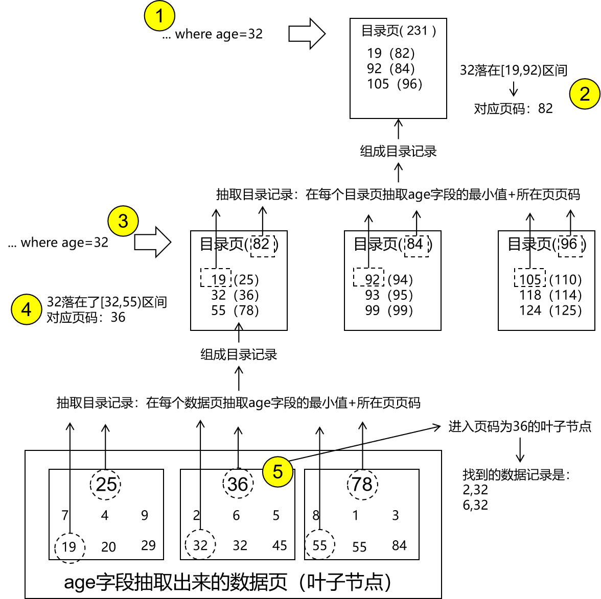
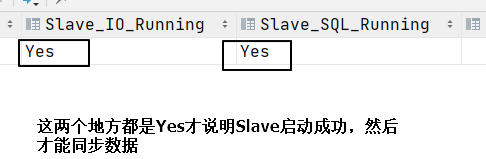

# 一、索引的原理
## 1、主键索引的构成
### ①数据页


### ②抽取第一层目录
<p>为了能够快速查询原始数据，需要抽取目录记录。目录记录的组成：</p>
- 数据页中最小的主键值
- 最小主键值来源数据页的页码


### ③基于第一层目录查询

根据查询条件，先到目录节点中查找。看查询条件中指定的值，落在了哪一个区间；<br/>
然后根据区间找到对应的子节点页码；<br/>
根据子节点页码找到对应的子节点；<br/>
进入对应子节点（数据页）根据查询条件中指定的值进行二分法查找，返回查询结果记录。<br/>


### ④抽取第二层目录
在每个目录页中选择最小的主键值，加上来源页的页码，组成一条目录记录。<br/>


### ⑤基于第二层目录查询
- 先根据查询条件中的值到第二层目录中去看它落在哪个区间
- 根据这个区间找到对应的页码
- 再根据这个页码进入子节点
- 到子节点中查找查询条件值落在哪个区间
- ……


### ⑥汇聚成树形结构
由于每个目录页都能够容纳很多子节点，所以越向上抽取，目录节点越少，最终必然汇聚到一个唯一的根节点。这样一来整体就形成了一个树形结构。<br/>
从树形结构角度：
- 根节点：最上层的唯一节点，没有父节点。
- 分支节点：在根节点和叶子节点之间。
- 叶子节点：最下层，没有子节点的节点。

从“页”的角度：
- 数据页：存放原始数据记录
- 目录页：存放目录记录

现在我们搭建起来的这个树形结构就是B+Tree，B+Tree最大的特点就是：仅在叶子节点保存原始记录。

## 2、B+Tree容量的估算
### ①初始设定
- 每一个页：默认大小16KB
- 每一条原始数据记录：1KB
- 每一条目录记录：设定主键值和页码值都是bigint类型，各占8字节，所以一共16字节。

### ②初步推算
- 存放原始数据的叶子节点容量：16KB÷1KB=16
- 存放目录记录的节点容量：16KB÷16B=1024

### ③不同层数计算
#### [1]B+Tree整体只有一层
那么整个树形结构就只剩一个根节点了。那么这唯一的一个根节点也就只能用来存放原始数据了。所以此时这个唯一的节点作为唯一的数据节点，它的容量就是前面已经算出来的16。

#### [2]B+Tree整体有两层


- 目录节点只能有一个：可以容纳1024个子节点
- 唯一的目录节点下是叶子节点，保存原始数据。
	- 每一个叶子节点保存原始数据的容量：16
	- 1024个叶子节点总共能保存的原始数据容量：16×1024=16,384

#### [3]B+Tree整体有三层


- 第一层：根节点，目录页，可以容纳1024个子节点
- 第二层：分支节点，目录页，其中每一个目录页节点又可以容纳1024个子节点
- 第三层：叶子节点，数据页，每一个数据页叶子节点可以容纳16条原始数据记录
- 计算总数：1×1024×1024×16=16,777,216

#### [4]规律
- 一层：1×16
- 两层：1×1024×16
- 三层：1×1024×1024×16
规律就是：每多一层，就多乘以1024。<br/>
所以如果有四层，那么容量：1×1024×1024×1024×16=17,179,869,184<br/>

回到MySQL数据库表的实际情况，一张表的容量：
- 一千万条记录是极限。
- 500万条记录开始性能下降。
- 300万条记录时，如果还是上升趋势就需要考虑做一些优化。

所以这么看来，一个B+Tree有两~三层就基本够用了。

## 3、BTree和B+Tree的区别
### ①主要区别
|比较维度|BTree|B+Tree|
|---|---|---|
|形态|尖锐、高瘦|扁平、矮胖|
|层次深度|深|浅|
|I/O次数|多|少|
|性能|差|好|
|原始数据记录|无论根节点、分支节点还是叶子节点都保存原始记录|仅在叶子节点保存原始记录|

### ②原理
- MySQL默认会加载根节点到内存。
- 需要用到根节点下的子节点数据时会从硬盘加载。
- 每从硬盘加载一层子节点，就会发生一次硬盘的I/O操作。
- 而硬盘I/O操作就是整个计算机体系的性能的瓶颈。
- 为什么BTree形态上尖锐、高瘦并且层次深度更深呢？
	- 是因为：无论根节点、分支节点还是叶子节点都保存原始记录
	- 这样一来，每一个节点中能够容纳的记录数量就会变少
	- 进而导致每个节点能够容纳的子节点相应也变少


## 4、非主键索引的构成
### ①说明
- 此前我们说的都是主键索引，主键索引不需要我们额外手动创建。创建数据库表的时候就有了。
- 非主键索引是基于非主键字段创建出来的索引，如果想要使用非主键索引，则需要额外手动创建。

### ②创建非主键索引语法
```sql
create [unique] index [索引名称] on [创建索引的数据库表名称]([索引字段列表])
```

### ③底层构成
假设我们根据age字段创建索引：<br/>


抽取目录节点：<br/>


**注意**：通过上面的介绍，大家能看到，非主键索引仍然是一个**B+Tree**。

### ④基于目录在非主键索引树中查询



## 5、回表操作
### ①什么情况回表
```sql
select id,name,age,subject from t_emp where age=32;
```

执行上面的SQL语句时，发现我们根据where age=32这个查询条件，在age索引中能够找到的记录只是：
```text
2,32
6,32
```

说明我们select子句所需要的数据并不能全部从age的索引中获取。所以此时需要根据主键值，再回到主键索引中查询其它字段。
```sql
select id,name,age,subject from t_emp where id in (2,6);
```

这个操作就称之为回表：在非主键索引中执行查询之后，并不能获取到select子句所需全部字段值，所以再根据主键值回到主键索引查询全部所需字段。

### ②什么情况不回表
假设创建了一个索引：
```sql
create index idx_age_name_subject on t_emp(age,name,subject);
```

执行SQL语句：
```sql
select id,name,age,subject from t_emp where age=32;
```

从idx_name_age_subject非主键索引中就能够获取到select子句所需的全部字段，所以这种情况就不回表了。

## 6、多列索引的底层结构
### ①抽取叶子节点


### ②索引字段排序
#### [1]多字段排序
```sql
... order by s1,s2,s3
```
先根据s1排序，如果s1有重复，那么就在重复范围内根据s2排序；如果s2有重复，就在重复范围内根据s3排序。

#### [2]字符串排序
字符串底层其实都是Unicode码，十六进制表示的。十六进制也是整数，所以字符串按照Unicode码排序，相当于就是整数排序。<br/>
从这个角度来说，任何类型的数据底层都是二进制数，所以都可以排序。

### ③构造树形结构
- 抽取目录的方式和之前我们说的都一样
- 同样可以给目录再抽取目录，直到汇集成一个树形结构，还是B+Tree


## 7、索引值
- 概念：根据哪个字段创建的索引，哪个字段的值就是索引值
- 统一目录记录的结构：
	- 索引值
		- 根据主键字段创建索引，那么索引值就是主键字段值
		- 根据非主键字段创建索引，那么索引值就是创建索引的字段的值
		- 如果创建索引的字段是多个，那么索引值就是由多个值组成的
	- 子节点地址：子节点所在页的页码值

## 8、各种类型的索引
### ①常用索引划分
- 从是否根据主键创建划分：
	- 主键索引
	- 非主键索引（二级索引）
- 从是否是根据单个字段创建索引划分：
	- 单列索引（单值索引）
	- 多列索引（多值索引、组合索引、联合索引）
- 从索引是否和原始数据在一起划分：
	- 在一起：聚簇索引，主键索引就是聚簇索引
	- 不在一起：非聚簇索引，非主键索引就是非聚簇索引
- 创建索引时附加了unique关键词：创建的就是唯一索引

### ②相关小问题
- 问：非主键索引是否一定是单列索引？
- 答：不一定。
<br/>
- 问：主键索引是否一定是单列索引？
- 答：不一定。因为联合主键就是包含多个字段。
<br/>
- 问：主键索引、数据库表本身、聚簇索引三者的关系是什么？
- 答：它们三个是一码事，指的是同一个东西，只是说的时候站的角度不同。
	- 主键索引：侧重于强调这个索引是基于主键字段创建的
	- 聚簇索引：侧重于强调索引和原始数据在一起
	- 数据库表本身：侧重于从应用、开发的角度来看
<br/>
- 问：什么叫『覆盖索引』？
- 答：首先明确『覆盖索引』并不是索引的某一个种类。它是指：执行select查询语句时，所需要查询的字段全部都能在二级索引中得到，不需要回表。这个**效果叫覆盖索引**。

# 二、SQL优化：准备数据
> 所谓SQL优化，很大程度上就是让索引在SQL执行过程中能够发挥更大作用。所以优化SQL语句很大程度上就是让SQL能够和索引配合的更好。

## 1、MySQL配置
```bash
cd /home/mysql/single/conf
vim my.cnf
```

增加配置项如下：
```text
[mysqld]
log_bin_trust_function_creators=1
```

重启docker容器。
```bash
docker restart MySQL_single
```

## 2、执行SQL语句
```sql
# 创建数据库
create database db_hr;

# 使用数据库
use db_hr;

# 创建数据库表：部门表
CREATE TABLE `dept` (
 `id` INT(11) NOT NULL AUTO_INCREMENT,
 `deptName` VARCHAR(30) DEFAULT NULL,
 `address` VARCHAR(40) DEFAULT NULL,
 `ceo` INT NULL ,
 PRIMARY KEY (`id`)
) ENGINE=INNODB AUTO_INCREMENT=1 DEFAULT CHARSET=utf8;

# 创建数据库表：员工表
CREATE TABLE `emp` (
 `id` INT(11) NOT NULL AUTO_INCREMENT,
 `empno` INT NOT NULL ,
 `name` VARCHAR(20) DEFAULT NULL,
 `age` INT(3) DEFAULT NULL,
 `deptId` INT(11) NOT NULL,
 PRIMARY KEY (`id`)
 #CONSTRAINT `fk_dept_id` FOREIGN KEY (`deptId`) REFERENCES `t_dept` (`id`)
) ENGINE=INNODB AUTO_INCREMENT=1 DEFAULT CHARSET=utf8;

# 声明函数：生成随机字符串
DELIMITER $$
CREATE FUNCTION rand_string(n INT) RETURNS VARCHAR(255)
BEGIN    
DECLARE chars_str VARCHAR(100) DEFAULT 'abcdefghijklmnopqrstuvwxyzABCDEFJHIJKLMNOPQRSTUVWXYZ';
DECLARE return_str VARCHAR(255) DEFAULT '';
DECLARE i INT DEFAULT 0;
WHILE i < n DO  
SET return_str =CONCAT(return_str,SUBSTRING(chars_str,FLOOR(1+RAND()*52),1));  
SET i = i + 1;
END WHILE;
RETURN return_str;
END $$

# 声明函数：生成随机数字
DELIMITER $$
CREATE FUNCTION  rand_num (from_num INT ,to_num INT) RETURNS INT(11)
BEGIN   
DECLARE i INT DEFAULT 0;  
SET i = FLOOR(from_num +RAND()*(to_num - from_num+1))   ;
RETURN i;  
END$$

# 创建存储过程：插入员工数据
DELIMITER $$
CREATE PROCEDURE  insert_emp(  START INT ,  max_num INT )
BEGIN  
DECLARE i INT DEFAULT 0;   
 SET autocommit = 0;    #设置手动提交事务
 REPEAT  #循环
 SET i = i + 1;  #赋值
 INSERT INTO emp (empno, NAME ,age ,deptid ) VALUES ((START+i),rand_string(6),rand_num(30,50),rand_num(1,10000));  
 UNTIL i = max_num  
 END REPEAT;  
 COMMIT;  #提交事务
END$$

# 创建存储过程：插入部门数据
DELIMITER $$
CREATE PROCEDURE `insert_dept`(  max_num INT )
BEGIN  
DECLARE i INT DEFAULT 0;   
 SET autocommit = 0;    
 REPEAT  
 SET i = i + 1;  
 INSERT INTO dept ( deptname,address,ceo ) VALUES (rand_string(8),rand_string(10),rand_num(1,500000));  
 UNTIL i = max_num  
 END REPEAT;  
 COMMIT; 
END$$

# 调用存储过程，向部门表插入1万条数据
CALL insert_dept(10000);

# 调用存储过程，向员工表插入50万条数据
CALL insert_emp(100000,500000);
```

# 三、SQL优化：慢查询日志
> 一个项目中的SQL语句很多，没必要逐一检查、优化。而是应该针对执行时间长、不正常的SQL语句进行有针对性的优化。<br/>
> 所以需要通过慢查询日志，让MySQL帮助我们把超过指定时间的SQL语句保存下来。

## 1、MySQL配置
在my.cnf文件中增加如下内容：
```properties
# 开启慢查询日志功能
slow_query_log=1

# 指定慢查询日志保存的位置
slow_query_log_file=/var/lib/mysql/atguigu-slow.log

# 衡量慢查询的时间标准，时间单位是秒
long_query_time=3

# 日志输出形式：FILE表示保存到文件中
log_output=FILE
```
重启docker容器

## 2、执行一条慢SQL
```sql
select DISTINCT * from emp 
UNION 
(SELECT * from emp) 
UNION 
(SELECT * from emp);
```

## 3、查看慢查询日志
### ①在MySQL中查看
```sql
SHOW GLOBAL STATUS LIKE '%Slow_queries%';
```

### ②在Linux中查看
```bash
cat /var/lib/mysql/atguigu-slow.log
```

# 四、SQL优化：Explain分析
## 1、id字段★
反映了SQL语句执行过程中需要执行几个大步骤、几个小步骤。
- id值有多少个不重复的数字，就是有多少个大步骤
- id值同一个数字重复出现几次，就说明这个大步骤中包含多少个小步骤

```sql
# id 值一样的情况
explain select emp.id,dept.id from emp,dept;

# id 值不一样的情况
explain select id,name from emp where id = (select ceo from dept where deptName = "bDPmRwIb");  
  
# id 值相同和不同的都有  
explain select emp.id, emp.name, (select deptId from dept), deptName from emp,dept where emp.id=10;  
  
# 有子查询但是 id 值相同（子查询被 MySQL 优化器转换成了关联查询）  
explain select emp.id,emp.name  
from emp where emp.deptId in (select deptId from dept where deptName="bDPmRwIb");
```

大小步骤执行的顺序：
- 大步骤按照id值从大到小的顺序执行
- 小步骤从上到下执行
```text
1 a
1 b
1 c
2 d
2 e
3 f
3 g
3 h
```
上例执行的顺序应该是：f、g、h、d、e、a、b、c

<br/><br/>

评价标准：大步骤越少越好，最好是只有一个大步骤

## 2、select_type字段★
各取值含义：
|取值|含义|
|---|---|
|SIMPLE|当前步骤的查询不包含任何子结构|
|PRIMARY|当前步骤包含子结构|
|SUBQUERY|当前步骤是一个子查询操作|
|DEPENDENT SUBQUERY|和外部查询结果要做笛卡尔积的子查询。<br/>这是一种需要严防死守、坚决杜绝的情况。<br/>因为这种操作一方面会造成大量的CPU运算，同时数据量暴增，给内存带来很大压力。|
|UNION|当前步骤是UNION查询的其中一步|
|UNION RESULT|当前步骤是UNION查询的一个中间结果|

```sql
# SIMPLE  
explain select emp.id,dept.id from emp,dept;
  
# PRIMARY 和 SUBQUERY
explain select id,name from emp where id = (select ceo from dept where deptName = "bDPmRwIb");
  
# DEPENDENT SUBQUERY  
explain select emp.id, emp.name, (select deptId from dept), deptName from emp,dept where emp.id=10;
  
# UNION 和 UNION RESULT
explain select emp.id, emp.name from emp union select dept.id, dept.deptName from dept;
```

## 3、type字段★
type字段反映了本次查询对索引利用的程度。我们希望对索引利用的效率越高越好，让索引尽可能发挥作用。
|取值|含义|评价|
|---|---|---|
|ALL|全表扫描。完全没有用到索引。|这是最差的情况。|
|index|对索引的全表扫描，因为虽然用到了索引但是没有指定查询条件，所以遍历了整个索引树。|仍然是较差情况。|
|**range**|针对索引字段进行范围查询。|较好的情况，不难达到，建议开发中能够优化到这个级别。|
|**ref**|在查询条件中，普通索引列和常量进行等值匹配。|较好的情况，条件也不算很苛刻，建议开发中能够优化到这个级别。|
|eq_ref|在关联查询中，被关联的表在连接条件中的字段带有唯一索引或主键索引|条件开始苛刻了，但是我们平时正常的关联查询能够达到。|
|const|唯一索引列（主键索引）和常量进行等值匹配|效果极好，但是条件非常苛刻，不容易达到。|

```sql
# ALL  
explain select emp.name from db_hr.emp;  
  
# INDEX：需要给 name 字段创建索引  
create index idx_emp_name on emp(name);|

explain select emp.name from emp;

# RANGE  
create index idx_emp_age on emp(age);  
  
explain select age from emp where age>20;  
  
# REF
explain select id, name, age from emp where name='XvnbsM';
  
# EQ_REF  
explain select emp.id, emp.name, emp.age, dept.id, dept.deptName  
from emp left join dept on emp.deptId=dept.id;
  
# const  
explain select id, name, age from emp where id=5;
```

## 4、key_len字段★
### ①解释key_len字段的作用
```sql
drop index idx_emp_name on emp;  
drop index idx_emp_age on emp;  
  
create index idx_name_age_empno on emp(name, age, empno);
# SQL 执行时并不是索引中的每个字段都起作用  
# 要想知道具体哪个或哪些字段生效了，那就看 key_len 的值  
# 索引生效的字段的 key_len 值会累加到 key_len 的最终结果中  
# key_len 字段：63  
# name 字段对应的 key_len 是：63  
# 说明在 idx_name_age_empno 索引中，name 三个字段生效了  
explain select id,name,age,empno from emp  
where name='ttt';  
  
# key_len 字段：68  
# age 字段对应的 key_len 是：5  
# 说明在 idx_name_age_empno 索引中，name 和 age 两个字段生效了  
explain select id,name,age,empno from emp  
        where name='ttt' and age=50;  
  
# key_len 字段：72  
# empno 字段对应的 key_len 是：4  
# 说明在 idx_name_age_empno 索引中，name、age 和 empno 三个字段生效了  
explain select id,name,age,empno from emp  
        where name='ttt' and age=50 and empno=34;
```

### ②计算方式
- 首先考虑字段本身占多少个字节
	- int类型：4个字节
	- bigint类型：8个字节
	- float类型：4个字节
	- double类型：8个字节
- 如果是字符串类型（char、varchar）需要用字段宽度×字符集下每个字符所占字节
	- GBK：每个字符占两个字节
	- UTF-8：每个字符占三个字节
- 如果当前字段可以为空：key_len值+1
- 如果当前字段是varchar这样变长的字段：key_len值+2

```sql
# name 字段：20×3+1+2=63  
explain select id,name,age from emp where name="XvnbsM";  
  
# age 字段：4+1=5  
explain select id,name,age from emp where age=35;  
  
# deptId 字段：4  
create index idx_dept_id on emp(deptId);  
explain select id,name,age from emp where deptId=118;
```

## 5、ref字段
反映的是查询条件中的字段和什么进行的匹配：
- 如果是和常量匹配的，那么取值就是：const
- 如果是和另一个字段匹配的，那么取值就是：另一个字段的名称

```sql
# const  
explain  
select id, name  
from emp  
where name = 'XvnbsM';  
  
# db_hr.emp.deptId  
explain  
select emp.id, emp.name, dept.id, dept.deptName  
from emp  
         left join dept on emp.deptId = dept.id;
```

## 6、extra字段
本次查询的一些额外信息。
- Using index：select子句所需的数据在二级索引中能够全部获取到，不需要回表（覆盖索引的效果）
- Using filesort：排序时无法使用索引，只能在“文件”中排序。

```sql
# Using index
explain select name,age from emp where name="XvnbsM" and age="42" and empno='100004';

# Using index; Using filesort
explain select id,name from emp order by empno;
```

# 五、SQL优化：索引失效
## 1、违背最左原则
> 带头大哥不能死，中间兄弟不能断

```sql
# key_len 等于 63explain select id,name,age from emp where name='XvnbsM';  
  
# key_len 等于 68explain select id,name,age from emp where name='XvnbsM' and age=42;  
  
# key_len 等于 72explain select id,name,age from emp where name='XvnbsM' and age=42 and empno=100004;  
  
# 带头大哥不能死  
explain select id,name,age,deptId from emp where age=42 and empno=100004;  
  
# 中间兄弟不能断  
explain select id,name,age,deptId from emp where name='XvnbsM' and empno=100004;  
  
# 带头大哥被优化  
explain select id,name,age from emp where age=42 and empno=100004 and name='XvnbsM';
```

## 2、范围查询自己成功但祸害后面
```sql
# key_len：68=63+5  
# 说明只有 name、age 索引生效  
explain select id,name,age,empno,deptId from emp where name="werw" and age>35 and empno=666;  
  
# 即使后面的查询条件也是范围查询也不行  
explain select id,name,age,empno,deptId from emp where name="werw" and age>35 and empno>666;  
  
# 除非把范围查询放行最后  
explain select id,name,age,empno,deptId from emp where name="werw" and age=35 and empno>666;
```

## 3、where子句中字段使用函数
```sql
# left(field, length)函数的意思是从field值中截取左边的length长度的字符串
explain select id,name,age,deptId from emp where left(name, 3)='XvnbsM';
```

## 4、不等于
```sql
# 对照组：原本是索引生效的 SQL 语句  
explain select id,name,age,deptId from emp where name='XvnbsM';

explain select id,name,age,deptId from emp where name!='XvnbsM';  
explain select id,name,age,deptId from emp where name<>'XvnbsM';  
explain select id,name,age,deptId from emp where name is not null;
```

## 5、like左边不确定
```sql
# 对照组：原本是索引生效的 SQL 语句  
explain select id,name,age,deptId from emp where name='XvnbsM';  
explain select id,name,age,deptId from emp where name like 'Xvn%bsM';  
explain select id,name,age,deptId from emp where name like 'XvnbsM%';

explain select id,name,age,deptId from emp where name like '%XvnbsM';  
explain select id,name,age,deptId from emp where name like '%XvnbsM%';  
explain select id,name,age,deptId from emp where name like '%Xvn%bsM%';
```

## 6、涉及类型转换
```sql
# 对照组：原本是索引生效的 SQL 语句  
explain select id,name,age,deptId from emp where name='XvnbsM';  
  
# 涉及类型转换：索引不生效  
explain select id,name,age,deptId from emp where name=123;  
  
# 不涉及类型转换：索引生效  
explain select id,name,age,deptId from emp where name='123';
  
create index idx_emp_age on emp(age);  
# 不涉及类型转换：索引生效  
explain select id,name,age,deptId from emp where age='456';
```
> SQL语句中的常量都带上引号就没事了。

# 六、SQL优化：关联查询优化
> 结论：小表驱动大表<br/>
> 概念：小表就是数据量较小的表。大表就是数据量较大的表。<br/>
> 原因：<br/>
> ●以左外连接来说，左表是驱动表，驱动表不受连接条件筛选，加载全部数据。既然如此加载小表负担更轻一些。<br/>
> ●MySQL给被驱动表更大的索引福利：被驱动表参与连接条件的字段加索引之后提升效果比驱动表更明显，所以应该把更重的任务（大表）交给被驱动这一边。

## 1、左外连接
```sql
# dept 表未加索引时，对 dept 表的查询方式是 ALL
explain  
select emp.id, emp.name, emp.age, emp.empno, dept.id, dept.deptName  
from emp  
left join dept  
on emp.id = dept.ceo;  
  
# dept 表创建普通索引后，对 dept 表的查询方式是 ref，连升三级  
create index idx_dept_ceo on dept(ceo);
explain  
select emp.id, emp.name, emp.age, emp.empno, dept.id, dept.deptName  
from emp  
left join dept  
on emp.id = dept.ceo;  

# dept 表使用主键索引（带有唯一性）作为连接条件后，查询方式提升到 eq_ref
explain  
select emp.id, emp.name, emp.age, emp.empno, dept.id, dept.deptName  
from emp  
left join dept  
on emp.id = dept.id;  
```

## 2、内连接
```sql
# MySQL 自动把大表放在了右边，享受连升四级的效率提升效果  
explain  
select emp.id, emp.name, emp.age, emp.empno, dept.id, dept.deptName  
from emp  
inner join dept  
on emp.id = dept.id;
```

# 七、SQL优化：子查询
> 结论：从SQL优化的角度来看，子查询能不用就尽量不用。

```sql
# 查询不是CEO的员工  
explain SELECT *  
        FROM emp a  
        WHERE a.id NOT IN  
              (SELECT b.ceo FROM dept b WHERE b.ceo IS NOT NULL);  
  
# 从执行顺序来说：关联查询的 id(1,1) 比 子查询的 id(1,2) 要好  
# 从索引利用的程度来说：ref 比 index 要好两个级别
# 从select_type角度来说：simple比subquery或dependent subquery要好
explain SELECT a.*  
        FROM emp a  
                 LEFT JOIN dept b  
                           ON a.id = b.ceo;
```

# 八、SQL优化：排序
> 结论：order by子句，必须配合limit子句才能让索引生效。如果排序时涉及多个字段，那么这些字段排序的方向必须一致。

```sql
# 索引不生效  
explain select id,name,age,empno,deptId from emp order by name;  
  
# 索引生效  
explain select id,name,age,empno,deptId from emp order by name limit 5;  
  
# 索引不生效  
explain select id,name,age,empno,deptId from emp order by name asc,age desc limit 5;  
  
# 索引生效  
explain select id,name,age,empno,deptId from emp order by name asc,age asc limit 5;
```

# 九、SQL优化：分组
> 结论：<br/>
> ●分组的字段需要在索引中出现，否则索引不生效<br/>
> ●执行分组操作时，如果需要使用having子句，那么尽量把having过滤条件改成where过滤条件：因为where过滤条件会在分组前执行可以减少分组操作的数据量，而having是在分组后执行——也就是尽早过滤数据。

```sql
# deptId 字段没有出现在索引中，索引不生效  
explain select avg(age) from emp group by deptId;  
  
# 下列分组的字段出现在了索引中，索引生效  
explain select avg(age) from emp group by empno;  
explain select avg(age) from emp group by age;  
explain select avg(age) from emp group by name;
```

# 十、SQL优化：创建索引的建议
- 单列索引和多列索引
	- 首先参考常见的业务场景，根据常见的业务场景设计索引
		- A场景需要使用的字段：W、X、Y，那么根据这三个字段创建一个多列索引适合该场景
		- B场景需要使用的字段：X、Y、Z，那么根据这三个字段创建一个多列索引适合该场景
		- C场景需要使用字段W，那就使用index(W,X,Y)这个索引，无需额外创建单列索引了
		- D场景需要使用字段Z，现有索引用不上，而当前场景又确实有需要，那么就给Z字段单独创建硬索引
	- 关键机制：即使一个数据库表创建了多个索引，但是SQL语句真正执行的时候，也只能用到一个索引。
- 创建索引的数据库表：
	- 如果数据量小于300万条，那么是否创建索引区别不是很大
	- 经常查询的表、表中经常被查询的字段（where子句、select子句）适合创建索引
	- 经常修改的表或经常修改的字段不适合创建索引（索引对查询友好，对增删改不友好）
- 索引效果：
	- 有唯一性要求的字段创建索引效果更好
	- 过滤性好的字段创建索引效果更好（所谓过滤性好就是使用查询条件之后，能够把该字段中的值过滤掉很多，比如：手机号、银行卡号、身份证号……）
	- 字段宽度小，建索引效果更好
-   关联查询
    -   不要涉及 3 张以上的表
    -   小表驱动大表，给大表的关联字段创建索引
    -   尽量先用 where 条件过滤数据
    -   关联字段在各个表中类型要一致
- 不适合创建索引的情况：
	- 增删改多的字段
	- 过滤性不好的字段
	- 无法排序的字段

# 十一、视图
- 通过视图可以把一条SQL语句执行的结果固定为一个逻辑上的“表”
- 基于这个逻辑上的“表”可以做其它数据操作

```sql
# 一条普通的 SQL 语句  
select id,name,age,empno,deptId from emp where id=5;
  
# 根据 SQL 语句创建视图  
create view view_emp as select id,name,age,empno,deptId from emp where id=5;
  
# 把视图看做一个表，执行查询  
select id,name,age,empno,deptId from view_emp;  
  
# 把视图看做一个表，执行插入  
# 通过视图可以把数据插入到原始数据库表  
insert into view_emp(name, age, empno, deptId) values("tom", 25, 6688, 9944);  
  
# 把视图看做一个表，执行删除  
# 针对视图中不存在的数据操作：并没有作用到原始的数据库表  
delete from view_emp where id=499999;  
  
# 针对视图中存在的数据操作：视图和原始数据库表都会受影响  
delete from view_emp where id=5;  
  
# 删除视图  
drop view view_emp;  
  
# 重新创建一个视图  
create view view_emp as select id,name,age,empno,deptId from emp where id<10;  
  
# 把视图看做一个表，执行更新  
update view_emp set name="aaaaa" where id=4;  
  
# 原始数据库表更新也会体现到视图上  
update emp set name="bbbbbbb" where id=6;
```

# 十二、复制架构
## 1、MySQL的集群
- 单点的MySQL实例存在单点故障的风险：一旦宕机，对外无法提供服务。
- 配置集群还能够提供数据的冗余，相当于数据有了副本的备份
- 所以希望MySQL也能够以集群方式运行：
	- 主从：数据写入主服务器（master）上，然后同步到从服务器（slave）上
		- 一主多从：master服务器实例只有一个，仍然存在单点隐患
	- 主主：互为主从
		- 平时数据写入其中一个服务器实例，另一个相当于备份机的角色
		- 如果负责写操作的服务器实例宕机，则可以写入到另一个服务器
	- 级联复制：从服务器可以再搭配下一级的从服务器
	- 双主与级联复制：
		- 应用层先写入第一个主服务器，主服务器执行完成立即提交事务，不等待第二个主服务器返回ACK消息，侧重于快速响应
		- 第一个主服务器再同步数据到第二个主服务器
		- 第二个主服务器负责同步数据到从服务器，等待从服务器返回ACK消息之后再提交事务，侧重于数据的一致性

## 2、主从架构搭建
### ①创建Docker容器
#### [1]拉取镜像
```bash
docker pull mysql:5.7
```

#### [2]创建master容器
```bash
docker run --name mysql_master \
-p 10000:3306 \
--privileged=true \
-it \
-e MYSQL_ROOT_PASSWORD=123456 \
-v /home/mysql/cluster/master/conf:/etc/mysql/conf.d \
-v /home/mysql/cluster/master/data/:/var/lib/mysql \
-v /home/mysql/cluster/master/logs/:/var/log/mysql \
-d mysql:5.7
```

#### [3]创建slave容器
```bash
docker run --name mysql_slave \
-p 20000:3306 \
--privileged=true \
-it \
-e MYSQL_ROOT_PASSWORD=123456 \
-v /home/mysql/cluster/slave/conf:/etc/mysql/conf.d \
-v /home/mysql/cluster/slave/data/:/var/lib/mysql \
-v /home/mysql/cluster/slave/logs/:/var/log/mysql \
-d mysql:5.7
```

### ②创建MySQL配置文件
#### [1]master配置文件
配置文件路径：/home/mysql/cluster/master/conf/my.cnf<br/>
你需要用vim编辑这个文件，而不是直接执行。

```text
[mysqld]
character_set_server=utf8
init_connect='SET NAMES utf8'
symbolic-links=0
lower_case_table_names=1

# 指定主机号，不允许出现重复
server-id=100

# 开启binlog
log-bin=mysql-bin
```

```bash
docker restart mysql_master
```

#### [2]slave配置文件
配置文件路径：/home/mysql/cluster/slave/conf/my.cnf<br/>
你需要用vim编辑这个文件，而不是直接执行。

```text
[mysqld]
character_set_server=utf8
init_connect='SET NAMES utf8'
symbolic-links=0
lower_case_table_names=1

# 指定主机号，不允许出现重复
server-id=200

# 开启binlog
log-bin=mysql-bin
```

```bash
docker restart mysql_slave
```

### ③配置主从关系
**注意**：以下操作都是登录到MySQL之后，执行SQL语句。

#### [1]配置master
```sql
# 在master的docker容器中添加MySQL权限，开启备份机复制，并且设置备份用户信息 # repluser是执行主从复制时使用的用户名（从服务器登录主服务器时使用） 
# 123456是执行主从复制时使用的密码（从服务器登录主服务器时使用） 
GRANT REPLICATION SLAVE,FILE,REPLICATION CLIENT ON *.* TO 'repluser'@'%' IDENTIFIED BY '123456'; 

# 刷新权限 
FLUSH PRIVILEGES;

# 查看主服务器的状态
# 每次运行不保证一样，所以一定要实时运行一下，查看具体值  
# File：mysql-bin.000001  
# Position：656  
show master status ;
```

#### [2]配置slave
```slave
# 语法  
# change master to master_host='通过宿主机访问master的ip',master_port=docker对外暴露的宿主机master的端口号,master_user='repluser',master_password='123456',master_log_file='master中的binlob文件',master_log_pos=master中的position位置信息;  
# 命令  
change master to  
    master_host ='192.168.200.100',  
    master_port =10000,  
    master_user ='repluser',  
    master_password ='123456',  
    master_log_file ='mysql-bin.000001',  
    master_log_pos =656;  
  
# 启动 Slave 这一端的两个进程  
# slave_io和slave_sql  
start slave;  
  
# 查看 Slave 状态  
show slave status ;
```



### ④测试
#### [1]常规测试
- 在master这一端建库、建表、插入数据
- 到slave这一端查看数据是否同步过来了

#### [2]故障测试
- 在slave中执行insert操作，操作本身能够成功
- 但是此后在master中执行insert，就无法同步到slave了
```text
Could not execute Write_rows event on table db_hello.t_hello; Duplicate entry '2' for key 'PRIMARY', Error_code: 1062; handler error HA_ERR_FOUND_DUPP_KEY; the event's master log mysql-bin.000001, end_log_pos 1691
```
- 所以不要在slave中执行写操作
- 当前的故障如何解决？
	- 删除slave这边的数据库
	- 然后关闭slave这边的slave_io，slave_sql
	- 重新执行change master to
	- SQL语句参考下面代码：
```sql
drop database db_hello;  
  
stop slave ;  
  
change master to  
    master_host ='192.168.200.100',  
    master_port =10000,  
    master_user ='repluser',  
    master_password ='123456',  
    master_log_file ='mysql-bin.000001',  
    master_log_pos =656;  
  
start slave;  
  
show slave status ;
```

## 3、主从之间的工作模式
### ①异步模式
这是主从之间默认的工作模式。在异步模式下，master中写入数据立即提交事务，不会等待slave返回ACK确认消息。

### ②半同步模式
#### [1]工作机制
- master写入数据不立即提交事务
- 等待slave返回ACK消息
- slave返回ACK消息之后再提交事务
- master等待slave返回ACK消息是有超时时间
- 超过这个超时时间则不再继续等待，半同步模式就会回到异步模式
- 等slave恢复正常，master就再回到半同步模式

#### [2]设置方式
```sql
# 这两条 install 命令需要在 master 中都执行一遍，然后在 slave 中也都执行一遍 
install plugin rpl_semi_sync_master soname 'semisync_master.so'; 
install plugin rpl_semi_sync_slave soname 'semisync_slave.so'; 

#查看插件信息 
show plugins;
```

在slave这边执行：
```sql
set global rpl_semi_sync_slave_enabled= 1;
```

在master这边设置：
```sql
set global rpl_semi_sync_master_enabled= 1;   # 1：启用，0：禁止
set global rpl_semi_sync_master_timeout=10000;   # 单位为ms
```

从库重启IO Thread
```sql
stop slave io_thread; 
start slave io_thread;
```

在master确认：
```sql
# 查询状态信息 
# 看到Rpl_semi_sync_master_status的值是ON说明正确
show global status like "%sync%";

# 查询参数信息 
# 看到rpl_semi_sync_master_enabled的值是ON说明功能开启
# 看到rpl_semi_sync_master_timeout的值是10000说明超时时间设置成功
show global variables like '%sync%';
```

#### [3]测试
```sql
# slave执行
stop slave io_thread;

# master执行：会看到master等待10秒钟
insert into t_hello(hello_name) values ("go away");

# master会进入异步模式：立即完成，不会等待
insert into t_hello(hello_name) values ("go away222");

# slave执行：master回到半同步模式
start slave io_thread;

```

## 4、主主架构搭建
> 本质：互为主从。

### ①创建容器
#### [1]创建master_a容器
```bash
docker run --name mysql_master_a \
-p 30000:3306 \
--privileged=true \
-it \
-e MYSQL_ROOT_PASSWORD=123456 \
-v /home/mysql/cluster/master_a/conf:/etc/mysql/conf.d \
-v /home/mysql/cluster/master_a/data/:/var/lib/mysql \
-v /home/mysql/cluster/master_a/logs/:/var/log/mysql \
-d mysql:5.7
```

#### [2]创建master_b容器
```bash
docker run --name mysql_master_b \
-p 40000:3306 \
--privileged=true \
-it \
-e MYSQL_ROOT_PASSWORD=123456 \
-v /home/mysql/cluster/master_b/conf:/etc/mysql/conf.d \
-v /home/mysql/cluster/master_b/data/:/var/lib/mysql \
-v /home/mysql/cluster/master_b/logs/:/var/log/mysql \
-d mysql:5.7
```

### ②创建配置文件
#### [1]master_a配置文件
文件的完整路径：/home/mysql/cluster/master_a/conf/my.cnf<br/>
使用vim编辑器编辑这个文件。

```text
[mysqld]
character_set_server=utf8
init_connect='SET NAMES utf8'
symbolic-links=0
lower_case_table_names=1

# 指定主机号，不允许出现重复
server-id=300

# 开启binlog
log-bin=mysql-bin
```

#### [2]master_b配置文件
文件的完整路径：/home/mysql/cluster/master_b/conf/my.cnf<br/>
使用vim编辑器编辑这个文件。

```text
[mysqld]
character_set_server=utf8
init_connect='SET NAMES utf8'
symbolic-links=0
lower_case_table_names=1

# 指定主机号，不允许出现重复
server-id=400

# 开启binlog
log-bin=mysql-bin
```

### ③建立主从关系
#### [1]master_a执行授权
```sql
# 在master_a的docker容器中添加MySQL权限，开启备份机复制，并且设置备份用户信息 
# repluser是执行主从复制时使用的用户名（master_b服务器登录master_a服务器时使用） 
# 123456是执行主从复制时使用的密码（master_b服务器登录master_a服务器时使用） 
GRANT REPLICATION SLAVE,FILE,REPLICATION CLIENT ON *.* TO 'repluser'@'%' IDENTIFIED BY '123456'; 

# 刷新权限 
FLUSH PRIVILEGES;

# 查看master_a服务器的状态
# 每次运行不保证一样，所以一定要实时运行一下，查看具体值  
# File：mysql-bin.000001
# Position：656
show master status ;
```

#### [2]master_b执行授权
```sql
# 在master_b的docker容器中添加MySQL权限，开启备份机复制，并且设置备份用户信息 
# repluser是执行主从复制时使用的用户名（master_a服务器登录master_b服务器时使用） 
# 123456是执行主从复制时使用的密码（master_a服务器登录master_b服务器时使用） 
GRANT REPLICATION SLAVE,FILE,REPLICATION CLIENT ON *.* TO 'repluser'@'%' IDENTIFIED BY '123456'; 

# 刷新权限 
FLUSH PRIVILEGES;

# 查看master_b服务器的状态
# 每次运行不保证一样，所以一定要实时运行一下，查看具体值  
# File：mysql-bin.000001
# Position：656
show master status ;
```

#### [3]把master_a的主指向master_b
```sql
# 语法  
# change master to master_host='通过宿主机访问master的ip',master_port=docker对外暴露的宿主机master的端口号,master_user='repluser',master_password='123456',master_log_file='master中的binlob文件',master_log_pos=master中的position位置信息;  
# 命令  
change master to  
    master_host ='192.168.200.100',  
    master_port =40000,  
    master_user ='repluser',  
    master_password ='123456',  
    master_log_file ='mysql-bin.000001',  
    master_log_pos =656;  

# 启动slave
start slave;

# 查看slave状态
show slave status;
```

#### [4]把master_b的主执行master_a
```sql
# 语法  
# change master to master_host='通过宿主机访问master的ip',master_port=docker对外暴露的宿主机master的端口号,master_user='repluser',master_password='123456',master_log_file='master中的binlob文件',master_log_pos=master中的position位置信息;  
# 命令  
change master to  
    master_host ='192.168.200.100',  
    master_port =30000,  
    master_user ='repluser',  
    master_password ='123456',  
    master_log_file ='mysql-bin.000001',  
    master_log_pos =656;  

# 启动slave
start slave;

# 查看slave状态
show slave status;
```